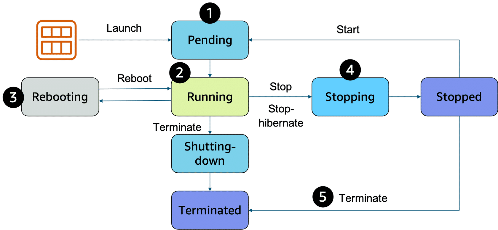
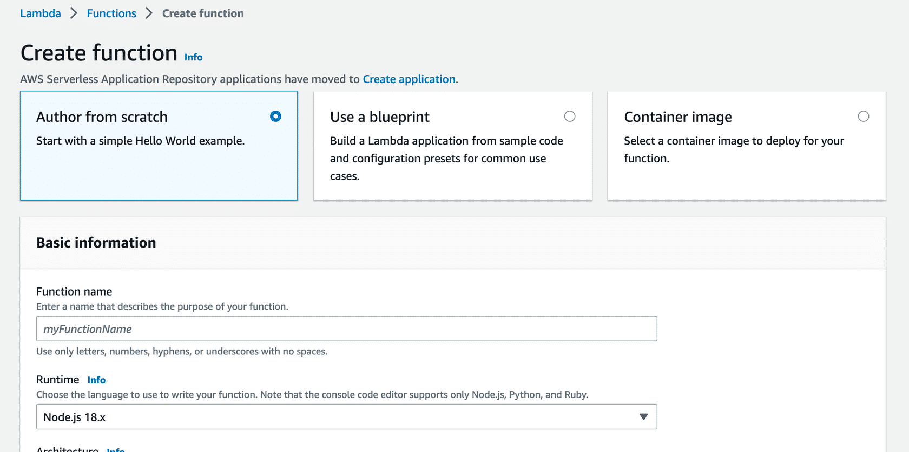

# Module 2: AWS Compute:

### Compute as a Service:
* **Servers:**
  * The **first building block** that you **need to host an application** is a **server**
  * Servers can usually **handle HTTP requests** and **send responses to clients** following the **client-server model**
  * Although **any API-based communication** also **falls under this model**
  * A **client** is a **person or computer** that **sends a request**
  * A **server handling the requests** is a **computer**, or **collection of computers**, **connected to the internet 
    serving websites** to **internet users**
  * Servers **power your application** by providing **CPU**, **memory**, and **networking capacity** to **process users’ 
    requests** and **transform them into responses**
  * For context, **common HTTP servers** include the following:
    * **Windows options**, such as **Internet Information Services (IIS)**
    * **Linux options**, such as **Apache HTTP Server**, **Nginx**, and **Apache Tomcat**
  * To **run an HTTP server** on AWS, you must **find a service that provides compute power** in the **AWS Management 
    Console**
  * You can view the **complete list** of **AWS compute services** when you log in to the console
* **Choosing the Right Compute Option:**
  * If **you’re responsible** for **setting up servers** on AWS to **run your infrastructure**, you have **many compute 
    options**
  * First, you need to know **which compute service to use** for **each use case**
  * At a fundamental level, three types of compute options are available: **virtual machines (VMs)**, **container 
    services**, and **serverless**
  * If you have **prior infrastructure knowledge**, a **virtual machine** will often be the **easiest compute option to 
    understand**
  * This is because a **virtual machine emulates a physical server** and allows you to **install an HTTP server** to 
    **run your applications**, for example
  * To **run virtual machines**, you **install a hypervisor** on a **host machine**
  * In its simplest form, a **hypervisor** is **software or firmware** that makes it possible to **share physical 
    hardware resources across one or more virtual machines**
  * The **hypervisor provisions the resources** to **create and run your VMs**
  * In AWS, **Amazon Elastic Compute Cloud (Amazon EC2)** is a **web service** that provides **secure** and **resizable 
    compute capacity** in the cloud
  * You can **provision virtual servers** called **EC2 instances**
  * **Behind the scenes**, **AWS operates** and **manages the host machines and the hypervisor layer**
  * AWS also **installs** the **virtual machine operating system**, called the **guest operating system**
  * Beneath the surface, **some AWS compute services use Amazon EC2** or use **virtualization concepts**
  * You **should understand this service** before advancing to **container services** and **serverless compute**
* **Getting Started with Amazon EC2:**
  * **Amazon EC2:**
    * **Amazon EC2** is a **web service** that provides **secure, resizable compute capacity in the cloud**
    * With this service, you can **provision virtual servers** called **EC2 instances**
    * With Amazon EC2, you can do the following:
      * **Provision** and **launch one or more EC2 instances** in minutes
      * **Stop** or **shut down EC2 instances** when you **finish running a workload**
      * **Pay** by the **hour** or **second** for **each instance type** (minimum of 60 seconds)
    * You can **create** and **manage EC2 instances** through the **AWS Management Console**, **AWS CLI**, **AWS SDKs**, 
      **automation tools**, and **infrastructure orchestration services**
    * To **create an EC2 instance**, you **must define the following**:
      * **Hardware Specifications:**
        * **CPU**, **memory**, **network**, and **storage**
      * **Logical Configurations:**
        * **Networking location**, **firewall rules**, **authentication**, and the **operating system** of your choice
  * **Amazon Machine Image:**
    * When launching an EC2 instance, the **first setting you configure** is **which operating system** you want by 
      selecting an **Amazon Machine Image (AMI)**
    * In the **traditional infrastructure world**, spinning up a server consists of **installing an operating system** 
      from **installation disks**, **drives**, or **wizards over the network**
    * In the **AWS Cloud**, the **operating system installation** is **not your responsibility**
    * Instead, it's **built into the AMI** that you choose
    * An **AMI includes** the **operating system**, **storage mapping**, **architecture type**, **launch permissions**, 
      and any additional **preinstalled software applications**
  * **Relationship Between AMIs and EC2 Instances:**
    * **EC2 instances** are **live instantiations** (or **versions**) of **what is defined in an AMI**, as **a cake** is 
      a **live instantiation** of a **cake recipe**
    * If you are familiar with software development, you can also see **this kind of relationship** between a **class** 
      and an **object**
    * In this case, the AMI is how you **model** and **define** your **instance**
    * The **EC2 instance** is the **entity you interact with**, where you can **install your web server** and **serve 
      your content** to users
    * When you **launch a new instance**, **AWS allocates** a **virtual machine** that **runs on a hypervisor**
    * Then the **AMI that you selected** is **copied to the root device volume**, which **contains the image** that is 
      used to **boot the volume**
    * In the end, you get **a server** that you can **connect to** and **install packages** and **additional software** 
      on
    * In the **example**, you **install a web server** along with the **properly configured source code** of your 
      **employee directory application**
    * One **advantage** of using AMIs is that they are **reusable**
    * You might choose a **Linux-based AMI** and **configure** the **HTTP server**, **application packages**, and 
      **additional software** that you need to **run your application**
    * If you want to **create another EC2 instance** with the **same configurations**, you could **create** and 
      **configure** a **new EC2 instance** to **match the first instance**
    * Or you could **create an AMI from your running instance** and **use the AMI** to **start a new instance**
    * That way, your **new instance** would have the **same configurations** as your **current instance** because the 
      **configurations set in the AMIs are the same**
  * **Finding/Selecting AMIs:**
    * **Quick Start AMIs:**
      * **Quick Start AMIs** are **commonly used AMIs created by AWS** that you can select to **get started quickly**
    * **AWS Marketplace AMIs:**
      * AWS Marketplace AMIs provide **popular open-source and commercial software** from **third-party vendors**
    * **My AMIs:**
      * **My AMIs** are **created from your EC2 instances**
    * **Community AMIs:**
      * **Community AMIs** are provided by the **AWS user community**
    * **Custom AMIs:**
      * Build **your own custom image** with **EC2 Image Builder**
  * Each AMI in the AWS Management Console has an **AMI ID**, which is **prefixed by ami-**, followed by a **random 
    hash of numbers and letters**
  * The **IDs are unique** to **each AWS Region**
  * An AMI includes the **operating system**, **storage mapping**, **architecture type**, **launch permissions**, and 
    **any additional preinstalled software applications**
  * **Configuring EC2:**
    * Now that you know how to select an operating system for your EC2 instance, you are ready to **choose other 
      configurations** to create your EC2 instance, such as the **instance type**, **network**, and **storage**
    * For an application like the employee directory application, you need instances with **enough capacity** to 
      **process customer requests**
    * Your **instance sizing** will depend on both the **demands of your application** and the **anticipated size of 
      your user base**
    * **Forecasting server capacity** for an **on-premises application requires difficult decisions** involving 
      **significant upfront capital spending**
    * In contrast, **changes to the allocation** of your **cloud-based services** can be made with a **simple API call**
    * Because of the AWS **pay-as-you-go model**, you can **match your infrastructure capacity** to your **application’s 
      demand**, instead of the other way around
  * **Amazon EC2 Instance Types:**
    * **EC2 instances** are a **combination** of **virtual processors (vCPUs)**, **memory**, **network**, and, in some 
      cases, **instance storage** and **graphics processing units (GPUs)**
    * When you create an EC2 instance, you need to choose **how much you need** of **each of these components**
  * AWS offers a **variety of instances** that **differ based on performance**
  * Some instances provide more capacity than others
  * To get an **overview of the capacity details** for a **particular instance**, you should look at the **instance 
    type**
  * Instance types consist of a **prefix identifying** the **type of workloads they’re optimized for**, **followed by a 
    size**
  * For example, the instance type `c5n.xlarge` can be broken down as follows:
    * **First Position:**
      * The first position, **c**, indicates the **instance family**
      * This indicates that this instance belongs to the **compute optimized family**
    * **Second Position:**
      * The second position, **5**, indicates the **generation of the instance**
      * This instance belongs to the **fifth generation of instances**
    * **Remaining Letters Before the Period:**
      * In this case, **n** indicates **additional attributes**, such as **local NVMe storage**
    * **After the Period:**
      * After the period, **xlarge** indicates the **instance size**
      * In this example, it's **xlarge**
  * **Instance Families:**
    * Each instance family is **optimized** to **fit different use cases**:
    * **General Purpose:**
      * **General purpose instances** provide a **balance** of **compute**, **memory**, and **networking resources**, 
        and can be used for a **variety of workloads**
      * **Use Cases:**
        * Ideal for applications that **use these resources in equal proportions**, such as **web servers** and **code 
          repositories**
    * **Compute Optimized:**
      * Compute optimized instances are ideal for **compute-bound applications** that benefit from **high-performance 
        processors**
      * **Use Cases:**
        * Well-suited for **batch processing workloads**, **media transcoding**, **high performance web servers**, 
          **high performance computing (HPC)**, **scientific modeling**, **dedicated gaming servers** and **ad server 
          engines**, **machine learning inference**, and other compute intensive applications
    * **Memory Optimized:**
      * Memory optimized instances are designed to deliver **fast performance** for workloads that **process large 
        datasets in memory**
      * **Use Cases:**
        * Memory-intensive applications, such as **high-performance databases**, **distributed web-scale in-memory 
          caches**, **mid-size in-memory databases**, **real-time big-data analytics**, and other enterprise 
          applications
    * **Accelerated Computing:**
      * Accelerated computing instances use **hardware accelerators** or **co-processors** to perform functions such as 
        **floating-point number calculations**, **graphics processing**, or **data pattern matching more efficiently 
        than is possible** in **software running on CPUs**
      * **Use Cases:**
        * **Machine learning**, **HPC**, **computational fluid dynamics**, **computational finance**, **seismic 
          analysis**, **speech recognition**, **autonomous vehicles**, and **drug discovery**
    * **Storage Optimized:**
      * Storage optimized instances are designed for workloads that require **high sequential read and write access** to 
        **large datasets** on **local storage**
      * They are optimized to deliver **tens of thousands** of **low-latency random I/O operations per second (IOPS)** 
        to applications that **replicate their data across different instances**
      * **Use Cases:**
        * **NoSQL databases** (**Cassandra**, **MongoDB** and **Redis**), **in-memory databases**, **scale-out 
          transactional databases**, **data warehousing**, **Elasticsearch**, and **analytics**
    * **HPC Optimized:**
      * High performance computing (HPC) instances are purpose built to offer the **best price performance** for 
        **running HPC workloads at scale on AWS**
      * **Use Cases:**
        * Ideal for applications that benefit from **high-performance processors**, such as **large**, **complex 
          simulations** and **deep learning workloads**
  * **EC2 Instance Locations:**
    * Unless otherwise specified, when you launch EC2 instances, they are placed in a **default virtual private cloud 
      (VPC)**
    * The **default VPC** is suitable for **getting started quickly** and **launching public EC2 instances without 
      having to create and configure your own VPC**
    * Any resource that you put **inside the default VPC** will be **public** and **accessible by the internet**, so you 
      **shouldn’t place any customer data or private information in it**
    * When you get more comfortable with networking on AWS, you should **change this default setting** to **choose your 
      own custom VPCs** and **restrict access** with **additional routing and connectivity mechanisms**
  * **Architecting for High Availability:**
    * In the network, your **instance resides** in an **Availability Zone of your choice**
    * As you learned previously, **AWS services** that are **scoped at the Availability Zone level** must be 
      **architected with high availability in mind**
    * Although EC2 instances are **typically reliable**, **two are better than one**, and **three are better than two**
    * **Specifying the instance size gives you an advantage** when **designing your architecture** because you can 
      **use more smaller instances rather than a few larger ones**
    * If your **frontend only has a single instance** and the **instance fails**, your **application goes down**
    * Alternatively, if your workload is d**istributed across 10 instances** and **one fails**, you **lose only 10 
      percent of your fleet**, and your **application availability is hardly affected**
    * When architecting any application for **high availability**, consider using **at least two EC2 instances** in 
      **two separate Availability Zones**
* **EC2 Instance Lifecycle:**
  * 
  * An EC2 instance **transitions between different states** from the **moment you create it** until its **termination**
  * 1 When you **launch an instance**, it enters the **pending state**
    * When an instance is pending, **billing has not started**
    * At this stage, the instance is **preparing to enter the running state**
    * Pending is where AWS performs all actions needed to **set up an instance**, such as **copying the AMI content to 
      the root device** and **allocating the necessary networking components**
  * 2 When your instance is **running**, it's **ready to use**
    * This is also the stage where **billing begins**
    * As soon as an instance is running, you can **take other actions on the instance**, such as **reboot**, 
      **terminate**, **stop**, and **stop-hibernate**
  * 3 When you **reboot an instance**, it’s **different than performing a stop action and then a start action**
    * Rebooting an instance is **equivalent to rebooting an operating system**
    * The instance **keeps its public DNS name (IPv4)** and **private and public IPv4 addresses**
    * An **IPv6 address** (if applicable) **remains on the same host computer** and **maintains its public and private 
      IP address**, in addition to **any data on its instance store volume**
  * 4 When you **stop your instance**, it enters the **stopping** and then **stopped state**
    * This is similar to when you **shut down your laptop**
    * You can **stop and start an instance** if it has an **Amazon Elastic Block Store (Amazon EBS) volume** as its 
      **root device**
    * When you stop and start an instance, your **instance can be placed** on a **new underlying physical server**
    * Your instance **retains its private IPv4 addresses** and if your instance has an **IPv6 address**, it **retains 
      its IPv6 address**
    * When you put the instance into **stop-hibernate**, the instance enters the **stopped state**, but **saves the last 
      information or content into memory**, so that the **start process is faster**
  * 5 When you **terminate an instance**, the **instance stores are erased**, and you **lose both the public IP address 
    and private IP address of the machine**
    * Termination of an instance means that you can **no longer access the machine**
    * As soon as the status of an instance changes to **shutting down** or **terminated**, you **stop incurring 
      charges** for that instance
  * **Difference Between Stop and Stop-Hibernate:**
    * When you **stop an instance**, it **enters the stopping state** until it **reaches the stopped state**
    * AWS **does not charge usage or data transfer fees** for your instance **after you stop it**
    * But **storage for any Amazon EBS volumes** is **still charged**
      * **Elastic Block Store (EBS)** is a **block-level storage service** provided by Amazon Web Services (AWS) for use 
        with **EC2 instances**
      * It provides **persistent block storage volumes** that can be **attached to EC2 instance**s, allowing you to 
        **store data separately from the instance's local storage**
    * While your instance is in the **stopped state**, you can **modify some attributes**, like the **instance type**
    * When you **stop your instance**, the **data from the instance memory (RAM) is lost**
    * When you **stop-hibernate an instance**, Amazon EC2 **signals the operating system to perform hibernation 
      (suspend-to-disk)**, which **saves the contents from the instance memory (RAM) to the EBS root volume**
    * You can hibernate an instance **only if hibernation is turned on** and the **instance meets the hibernation 
      prerequisites**
  * **Pricing:**
    * One of the ways to **reduce costs** with Amazon EC2 is to **choose the right pricing option** for the **way that 
      your applications run**
    * AWS offers a **variety of pricing options** to address **different workload scenarios**
    * **On-Demand Instances:**
      * With **On-Demand Instances**, you **pay for compute capacity per hour or per second**, depending on which 
        instances that you run
      * There are **no long-term commitments or upfront payments required**
      * **Billing begins whenever the instance is running**, and **billing stops** when the instance is in a **stopped** 
        or **terminated state**
      * You can **increase or decrease** your **compute capacity** to **meet the demands of your application** and 
        **only pay the specified hourly rates** for the **instance that you use**
      * On-Demand Instances are **recommended** for the following **use cases**:
        * Users who prefer the **low cost** and **flexibility** of Amazon EC2 **without upfront payment** or **long-term 
          commitments**
        * Applications with **short-term**, **spiky**, or **unpredictable workloads** that **cannot be interrupted**
        * Applications being **developed or tested** on Amazon EC2 for the **first time**
    * **Spot Instances:**
      * For applications that have **flexible start and end times**, Amazon EC2 offers the **Spot Instances option**
      * With Amazon EC2 Spot Instances, you can request **spare Amazon EC2 computing capacity** for up to **90 percent 
        off the On-Demand price**
      * **Amazon EC2 Spot Instances** allow you to **bid** for **unused EC2 capacity** in the **AWS cloud** at a 
        **significantly lower price compared to On-Demand instances**
      * Spot Instances are recommended for the following use cases:
        * Applications that have **flexible start and end times**
        * Applications that are **only feasible at very low compute prices**
        * Users with **fault-tolerant or stateless workloads**
      * With Spot Instances, you **set a limit** on **how much you want to pay for the instance hour**
      * This is compared against the **current Spot price** that **AWS determines**
      * **Spot Instance prices adjust gradually** based on **long-term trends in supply and demand** for **Spot Instance 
        capacity**
      * If the **amount that you pay** is **more than the current Spot price** and **there is capacity**, you will **receive an 
        instance**
    * **Savings Plans:**
      * **Savings Plans** are a **flexible pricing model** that offers **low usage prices** for a **1-year or 3-year 
        term commitment to a consistent amount of usage**
      * Savings Plans apply to **Amazon EC2**, **AWS Lambda**, and **AWS Fargate usage** and provide up to **72 percent 
        savings** on **AWS compute usage**
      * For workloads that have **predictable and consistent usage**, Savings Plans can provide **significant savings 
        compared to On-Demand Instances**
      * Savings Plans are **recommended** for the **following use cases**:
        * Workloads with a **consistent** and **steady-state usage**
        * Customers who want to use **different instance types** and **compute solutions** across **different 
          locations**
        * Customers who can make **monetary commitment** to **use Amazon EC2 over a 1-year or 3-year term**
    * **Reserved Instances:**
      * For applications with **steady state usage** that might require **reserved capacity**, Amazon EC2 offers the 
        **Reserved Instances option**
      * With this option, you **save up to 75 percent compared to On-Demand Instance pricing**
      * You can choose between three payment options: **All Upfront**, **Partial Upfront**, or **No Upfront**
      * You can select either a **1-year** or **3-year term** for **each of these options**
      * With Reserved Instances, you can **choose the type** that **best fits your applications needs**
        * **Standard Reserved Instances:**
          * These provide the **most significant discount** (up to **72 percent off On-Demand pricing**) and are **best 
            suited for steady-state usage**
        * **Convertible Reserved Instances:**
          * These provide a discount (up to **54 percent off On-Demand pricing**) and the capability to **change the 
            attributes of the Reserved Instance** if the **exchange results** in the **creation of Reserved Instances** 
            of **equal or greater value**
          * Like Standard Reserved Instances, Convertible Reserved Instances are **best suited** for **steady-state 
            usage**
        * **Scheduled Reserved Instances:**
          * These are **available to launch within the time windows that you reserve**
          * With this option, you can **match your capacity reservation** to a **predictable recurring schedule** that 
            **only requires a fraction of a day, a week, or a month**
    * **Dedicated Hosts:**
      * A **Dedicated Host** is a **physical Amazon EC2 server** that is **dedicated for your use**
      * Dedicated Hosts can help you **reduce costs** because you can use your **existing server-bound software 
        licenses**, such as **Windows Server**, **SQL Server**, and **Oracle licenses**
      * And they can also help you **meet compliance requirements**
      * Amazon EC2 Dedicated Host is also integrated with **AWS License Manager**, a service that helps you **manage 
        your software licenses**, including **Microsoft Windows Server** and **Microsoft SQL Server licenses**
        * Dedicated Hosts can be **purchased on demand (hourly)**
        * Dedicated Hosts can be **purchased as a Reservation** for **up to 70 percent off the On-Demand price**
* **Container Services:**
  * AWS offers a **broad spectrum** of **compute offerings** that give you the **flexibility** to choose the **right 
    tool for the job**
  * As mentioned earlier, the **three main categories of compute** are **virtual machines (VMs)**, **containers**, and 
    **serverless**
  * **No one-size-fits-all compute service exists** because it **depends on your needs**
  * The key is to **understand what each option offers**
  * Then you can build an **appropriate cloud architecture** for **your use case**
  * In this section, you will learn about **containers** and **how to run them**
  * Containers can **host a variety of different workloads**, including **web applications**, **lift and shift 
    migrations**, **distributed applications**, and **streamlining of development**, **test**, and **production 
    environments**
  * **Containers:**
    * Although containers are **often referred to** as a **new technology**, the idea started in the **1970s** with 
      **certain UNIX kernels** (the **central core of the operating system**) having the ability to **separate their 
      processes through isolation**
    * At the time, this was **configured manually**, making **operations complex**
    * With the **evolution** of the **open-source software community**, **containers evolved**
    * Today, containers are used as **a solution** to **problems of traditional compute**, including **the issue of 
      getting software to run reliably when it moves from one compute environment to another**
    * A container is a **standardized unit** that **packages your code and its dependencies**
    * This package is designed to **run reliably** on **any platform**, because the **container creates** its **own 
      independent environment**
    * With containers, **workloads** can be **carried from one place to another**, such as **from development to 
      production** or **from on-premises environments to the cloud**
    * An **example** of a **containerization platform** is **Docker**
    * **Docker** is a **popular container runtime** that **simplifies the management** of the **entire operating system 
      stack required for container isolation**, including **networking** and **storage**
    * Docker **helps customers create**, **package**, **deploy**, and **run containers**
  * **Difference Between VMs and Containers:**
    * **Containers share** the **same operating system and kernel as the host that they exist on**
    * But **virtual machines contain their own operating system**
    * **Each virtual machine must maintain a copy of an operating system**, which results in a **degree of wasted 
      resources**
    * A **container** is **more lightweight**
    * **Containers spin up quicker**, **almost instantly**
    * This **difference in startup time** becomes **instrumental** when designing applications that **must scale quickly 
      during I/O bursts**
    * **Containers** can provide **speed**, but **virtual machines offer** the **full strength of an operating system** 
      and **more resources**, like **package installation**, **dedicated kernel**, and more
  * **Orchestrating Containers:**
    * In AWS, **containers can run on EC2 instances**
    * For example, you might have a **large instance** and **run a few containers on that instance**
    * Although **running one instance** is **uncomplicated to manage**, it **lacks high availability** and 
      **scalability**
    * **Most companies and organizations** run **many containers** on **many EC2 instances** across **several 
      Availability Zones**
    * If you’re trying to **manage your compute** at a **large scale**, you should **consider the following**:
      * **How to place** your **containers** on your **instances**
      * What happens if your **container fails**
      * What happens if your **instance fails**
      * How to **monitor deployments** of your **containers**
    * This coordination is handled by a **container orchestration service**
    * **AWS offers two container orchestration services**: **Amazon Elastic Container Service (Amazon ECS)** and 
      **Amazon Elastic Kubernetes Service (Amazon EKS)**
  * **Managing Containers with Amazon ECS:**
    * **Amazon ECS** is an **end-to-end container orchestration service** that helps you **spin up new containers**
    * With Amazon ECS, your **containers are defined** in a **task definition** that you use to **run an individual 
      task** or a **task within a service**
    * You have the option to **run your tasks and services** on a **serverless infrastructure** that's **managed by 
      another AWS service** called **AWS Fargate**
    * Alternatively, for **more control over your infrastructure**, you can **run your tasks and services** on a 
      **cluster of EC2 instances that you manage**
    * If you choose to have **more control** by **running and managing your containers** on a **cluster of Amazon EC2 
      instances**, you will **also need to install** the **Amazon ECS container agent** on your EC2 instances
    * Note that **an EC2 instance** with the **container agent installed** is often called a **container instance**
    * This **container agent** is **open source** and **responsible for communicating to the Amazon ECS service** about 
      **cluster management details**
    * You can **run the agent** on both **Linux** and **Windows AMIs**
    * When the **Amazon ECS container instances** are **up and running**, you can **perform actions** that include, but 
      are not limited to, the following:
      * **Launching** and **stopping containers**
      * Getting **cluster state**
      * **Scaling in and out**
      * **Scheduling** the **placement of containers across your cluster**
      * Assigning **permissions**
      * Meeting **availability requirements**
    * To **prepare your application** to **run on Amazon ECS**, you create a **task definition**
    * The **task definition** is a **text file**, in **JSON format**, that **describes one or more containers**
    * A **task definition** is **similar to a blueprint** that **describes the resources that you need** to **run a 
      container**, such as **CPU**, **memory**, **ports**, **images**, **storage**, and **networking information**
    * Here is a **simple task definition** that you can use for your **corporate directory application**
    * In this example, this runs on the **Nginx web server**
```json
{
  "family": "webserver",
  "containerDefinitions": [
    {
      "name": "web",
      "image": "nginx",
      "memory": "100",
      "cpu": "99"
    }
  ],
  "requiresCompatibilities": [
    "FARGATE"
  ],
  "networkMode": "awsvpc",
  "memory": "512",
  "cpu": "256"
}
```
* **Using Kubernetes with Amazon EKS:**
  * **Kubernetes** is a **portable**, **extensible**, **open-source platform** for **managing containerized workloads 
    and services**
  * By **bringing software development and operations together by design**, Kubernetes created a **rapidly growing 
    ecosystem** that is **very popular** and **well established** in the market
  * If you **already use Kubernetes**, you can use **Amazon EKS** to **orchestrate the workloads** in the **AWS Cloud**
  * **Amazon EKS** is a **managed service** that you can use to **run Kubernetes on AWS without needing to install, 
    operate, and maintain your own Kubernetes control plane or nodes**
  * Amazon EKS is **conceptually similar to Amazon ECS**, but with the **following differences**:
    * In **Amazon ECS**, the **machine that runs the containers** is an **EC2 instance** that has an **ECS agent 
      installed and configured** to **run and manage your containers**
    * This instance is called a **container instance**
    * In **Amazon EKS**, the **machine that runs the containers** is called a **worker node** or **Kubernetes node**
    * An **ECS container** is called a **task**, while An **EKS container** is called a **pod**
    * **Amazon ECS runs on AWS native technology**, while **Amazon EKS runs on Kubernetes**
  * If you have **containers running on Kubernetes** and want an **advanced orchestration solution** that can provide 
    **simplicity**, **high availability**, and **fine-grained control over your infrastructure**, **Amazon EKS** could 
    be **the tool for you**
* **Introduction to Serverless:**
  * Removing the Undifferentiated Heavy Lifting:
    * If you **run your code** on **Amazon EC2**, **AWS is responsible** for the **physical hardware**
    * **You** are **still responsible** for the **logical controls**, such as the **guest operating system**, **security 
      and patching**, **networking**, **security**, and **scaling**
    * As covered in the previous Container Services lesson, **you choose to have more control** by **running** and 
      **managing your containers** on **Amazon ECS** and **Amazon EKS**
    * By doing so, **AWS** is **still responsible** for more of the **container management**, such as **deploying 
      containers across EC2 instances** and **managing the container cluster**
    * However, **when running Amazon ECS** and **Amazon EKS on Amazon EC2**, you are **still responsible for maintaining 
      the underlying EC2 instances**
    * Is there **a way to remove** some of this **undifferentiated heavy lifting**?
    * Yes! If you want to deploy your workloads and applications **without having to manage any EC2 instances**, you can 
      do that on AWS with **serverless compute**
  * **Go Serverless:**
    * With **serverless compute**, you can spend time on the things that **differentiate your application**, rather than 
      spending time on **ensuring availability, scaling, and managing servers**
    * **Every definition of serverless** mentions the **following four aspects**:
      * There are **no servers to provision or manage**
      * It **scales with usage**
      * You **never pay for idle resources**
      * **Availability** and **fault tolerance** are **built in**
    * AWS has developed **serverless services** for **all three layers of the application stack**
    * We will cover two services, **AWS Fargate** and **AWS Lambda**, in the following lessons
* **Exploring Serverless Containers with AWS Fargate:**
  * **Fargate abstracts the EC2 instance** so that you’re **not required to manage** the **underlying compute 
    infrastructure**
  * However, **with Fargate**, you can **use all the same Amazon ECS concepts**, **APIs**, and **AWS integrations**
  * It **natively integrates with IAM** and **Amazon Virtual Private Cloud (Amazon VPC)**
  * With **native integration** with **Amazon VPC**, you can **launch Fargate containers inside your network** and 
    **control connectivity to your applications**
  * AWS Fargate is a **purpose-built serverless compute engine for containers**
  * AWS Fargate **scales** and **manages the infrastructure**, so developers can work on what they do best, 
    **application development**
  * It achieves this by **allocating the right amount of compute**
  * This **eliminates the need** to **choose and manage EC2 instances**, **cluster capacity**, and **scaling**
  * Fargate **supports both Amazon ECS** and **Amazon EKS architecture** and provides **workload isolation** and 
    **improved security** by design
  * 
* **Serverless with AWS Lambda:**
  * **Running code on AWS Lambda:**
    * If you want to **deploy your workloads and applications without having to manage any EC2 instances or containers**, 
      you can use **Lambda**
    * With Lambda, you can **run code without provisioning or managing servers**
    * You can **run code** for **virtually any type of application** or **backend service**
    * This includes **data processing**, **real-time stream processing**, **machine learning**, **WebSockets**, **IoT 
      backends**, **mobile backends**, and **web applications** like your **employee directory application**
    * Lambda **runs your code** on a **high availability compute infrastructure** and **requires no administration from 
      the user**
    * You **upload your source code** in **one of the languages that Lambda supports**, and Lambda **takes care of everything 
      required** to **run** and **scale your code** with **high availability**
    * There are **no servers to manage**
    * You get **continuous scaling** with **subsecond metering** and **consistent performance**
  * **How Lambda Works:**
    * The **Lambda function** is the **foundational principle of AWS Lambda**
    * You have the option of **configuring your Lambda functions** using the **Lambda console**, **Lambda API**, **AWS 
      CloudFormation**, or **AWS Serverless Application Model (AWS SAM)**
    * You can **invoke your function directly** by using the **Lambda API**, or you can **configure an AWS service or 
      resource** to **invoke your function in response to an event**
  * **Lambda Concepts:**
    * **Function:**
      * A **function** is a **resource** that **you can invoke** to **run your code in Lambda**
      * Lambda **runs instances of your function** to **process events**
      * When you **create the Lambda function**, it can be **authored in several ways**:
        * You can **create the function from scratch**
        * You can use a **blueprint that AWS provides**
        * You can **select a container image** to **deploy for your function**
        * You can **browse the AWS Serverless Application Repository**
      * 
    * **Trigger:**
      * **Triggers** describe **when a Lambda function should run**
      * A trigger **integrates your Lambda function** with **other AWS services** and **event source mappings**
      * So you can **run your Lambda function in response** to **certain API calls** or by **reading items from a stream 
        or queue**
      * This **increases your ability** to **respond to events in your console without having to perform manual 
        actions**
    * **Event:**
      * An **event** is a **JSON-formatted document** that **contains data for a Lambda function to process**
      * The **runtime converts the event to an object** and **passes it to your function code**
      * When you **invoke a function**, you determine the **structure** and **contents of the event**
    * **Application Environment:**
      * An **application environment** provides a **secure** and **isolated runtime environment** for your Lambda 
        function
      * An application environment **manages the processes and resources** that are **required to run the function**
    * **Deployment Package:**
      * You **deploy** your Lambda function code using a **deployment package**
      * Lambda supports **two types of deployment packages**:
        * **A .zip File Archive:**
          * This contains your **function code** and **its dependencies**
          * Lambda **provides the operating system** and **runtime for your function**
        * **A Container Image:**
          * This is **compatible** with the **Open Container Initiative (OCI) specification**
          * You **add your function code** and **dependencies** to the **image**
          * You **must also include** the **operating system** and a **Lambda runtime**
    * **Runtime:**
      * The runtime provides a **language-specific environment** that **runs in an application environment**
      * When you create your Lambda function, you **specify the runtime** that you **want your code to run in**
      * You can use **built-in runtimes**, such as **Python**, **Node.js**, **Ruby**, **Go**, **Java**, or **.NET Core**
      * Or you can **implement your Lambda functions** to run on a **custom runtime**
    * **Lambda Function Handler:**
      * The **AWS Lambda function handler** is the **method in your function code** that **processes events**
      * When your **function is invoked**, **Lambda runs** the **handler method**
      * When the **handler exits** or **returns a response**, it **becomes available to handle another event**
      * You can use the following **general syntax** when **creating a function handler** in **Python**:
```
def handler_name (event, context):
...
return some_value
```
* **Serverless with AWS Lambda (cont.):**
  * **Billing Granularity:**
    * With Lambda, you can **run code without provisioning or managing servers**, and you **pay only for what you use**
    * You are **charged** for the **number of times that your code is invoked** (**requests**) and for the **time that 
      your code runs**, r**ounded up to the nearest 1 millisecond (ms) of duration**
    * AWS **rounds up duration** to the **nearest ms** with **no minimum run time**
    * With this pricing, it can be **cost effective** to **run functions whose execution time is very low**, such as 
      **functions with durations under 100 ms or low latency APIs**
  * **"No server is easier to manage than no server."**
    * This **quote** from **Werner Vogels**, Amazon CTO summarizes the **convenience** that you can have when **running 
      serverless solutions** like **AWS Fargate** and **AWS Lambda**
    * Later, you will **apply all the information** that you have acquired about **Amazon EC2**, **Amazon ECS**, 
      **Amazon EKS**, and **AWS Fargate** to some **use cases for each service**
* **Choosing the Right Compute Service:**
  * **Scenario 1: Infrequent Updates:**
    * **Description:**
      * Consider a scenario where you are a **developer** who is tasked with creating a **new feature** for an **online 
        store web application** being **hosted on EC2**
      * Right now, all the items being sold in the store are **loaded into a database manually** behind the scenes
      * By manually, I mean there is a **person** who adds a **new row to a database** for **each new item to be sold** 
        in the store
      * This process takes a **long time**, **isn't scalable**, and is **prone to error**
      * You are tasked with **automating the process** of getting the **new item information loaded into the inventory 
        database**
      * The goal is to have a **person upload an inventory spreadsheet into Amazon S3**, the **object storage service**, 
        then have a **process automatically load the data into the inventory database**
      * New inventory gets **updated once a quarter**
      * **What compute would you use** to **host the processing logic** to **load the items from the file into the 
        database**?
    * **Deciding on a Compute Solution:**
      * You could have decided to use **Amazon EC2** here
      * You could **spin up a new instance specifically for this process** and write some code that **polls the location 
        of the spreadsheet** for a **new upload every so often**
      * **Updating the database** when it **finds a new file**, that would work, but we should look at **how often** a 
        **new inventory** gets **added to the database**
      * **Amazon EC2 charges per second** or **per hour**
      * So if I have an **instance running all the time** to **serve requests that happens once per quarter**, that 
        seems like a **lost opportunity** to **optimize for cost**
      * I would be **spending money on a resource** I **rarely use**
      * It certainly **would work**, but it **may not be the best fit** for **this use case**
      * I **could automate the process** of **starting and stopping the instance when needed,** but instead, what about 
        using **AWS Lambda**?
      * **AWS Lambda** is the **correct answer** for a few reasons
      * First of all, to address your **concern on cost**, **AWS Lambda only charges for the compute you consume** when 
        the code is **actually running**
      * And code is **only run in response** to **triggers** or a **direct invitation**
      * So here's my suggestion
      * You know that the goal is to **have someone upload an inventory document to S3**, which **should kick off the 
        process of updating the database**
      * You also learned that **AWS Lambda has triggers** that **run your Lambda functions code**
      * AWS Lambda **integrates** with **many AWS services** to **act as triggers**, and **Amazon S3 is one of them**
      * So my suggestion would be to:
        * **Create an AWS Lambda function**
        * Configure a **`PutEvent` as the trigger** from **Amazon S3**
        * Then **when the inventory is uploaded**, **Amazon S3 will trigger the Lambda function to run** and the **code 
          in the function** will **parse the inventory document** and **add each item to the database**
  * **Scenario 2: Migrating an Application from On-Premises**
    * **Description:**
      * Let's say you have an **application currently hosted** in your **on-premises data center**, which **needs to be 
        migrated to AWS**
      * It's **currently running on Linux servers in the data center**, and you want to **minimize the amount of 
        refactoring needed** to **migrate to AWS**
      * It's important that this **workload is elastic** and **can support varying demand**
      * What **AWS compute option** would you choose?
    * **Deciding on a Compute Solution:**
      * Considering the fact that **minimizing refactoring** is an **important aspect of this workload**, I would 
        **architect a solution** using **Amazon EC2 as the compute service**
      * **EC2 instances** can be **launched from Linux-based AMIs**, and the **application could be hosted on the EC2 
        instance the same way it would be hosted on a Linux server on premises**
      * **Amazon EC2** also has the ability to **scale in or out based on demand**
      * Considering other options, **AWS Lambda could work**, but you **can't just upload** the **same code you would 
        run on Amazon EC2 into a Lambda function**
      * There would have to be a **decent amount of refactoring** in order to **take advantage of that service**
      * Same idea with any of the **AWS container services**, like **ECS** or **EKS**
      * Again, you'd have some amount of **rework required** to **migrate to containers**
      * Therefore, **Amazon EC2** is the **best option** for this **migration**
  * **Scenario 3: New Microservice Application**
    * **Description:**
      * Imagine you are planning to write a **brand-new application** using a **microservices** or **service-oriented 
        design**
      * And you want to **architect the application** where it can **scale up or down quickly**, and you want to **lower 
        the risk** of **deploying new changes to production**
      * **Which AWS compute service** would you use?
    * **Deciding on a Compute Solution:**
      * One of the **AWS container services** like **Amazon ECS** or **Amazon EKS**
      * Using **containers** makes it **easier to support microservice or service-oriented designs**
      * **Containers boot up quickly**, so **scaling is quicker than EC2 instances**, and the use of containers helps 
        with **code portability**
      * Meaning, if I **write the code on my laptop** and **run it in a container**, **test it in QA in a container**, I 
        can then **expect the same container** to **behave the same way once deployed to production**, thus **reducing 
        the risk of deployments causing errors** because of **environmental issues**


