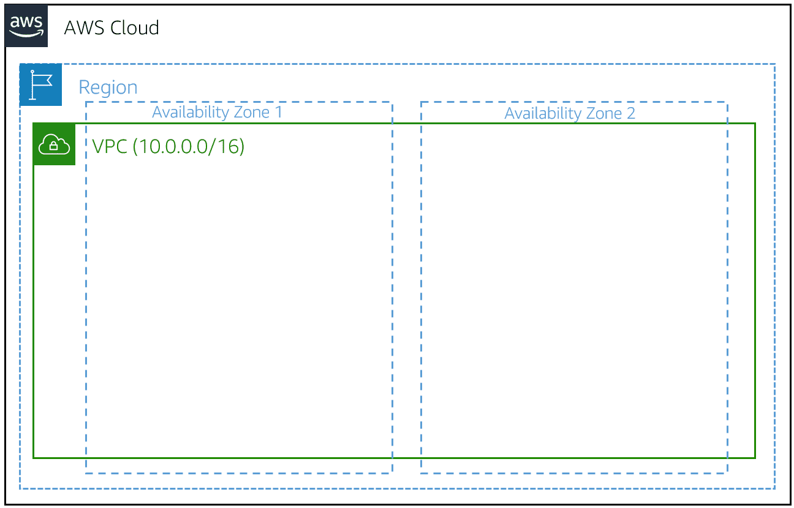

# Module 3: AWS Networking:

### Introduction to Networking:
* **Networking Defined:**
  * **Networking** is **how you connect computers around the world** and allow them to **communicate with one another**
  * In this course, you’ve already seen a few **examples of networking**
  * One is the **AWS Global Infrastructure**
  * AWS has built a **network of resources** using **data centers**, **Availability Zones**, and **Regions**
* **Networking Basics:**
  * One way to think about networking is to think about **sending a letter**
  * When you send a letter, you provide the following three elements:
    * The **letter**, inside the envelope
    * The **address of the sender** in the **from section**
    * The **address of the recipient** in the **to section**
  * Each address must contain **specific information**:
    * Name of sender or recipient, Street, City, State or province, Zip, area, or postal code, Country
  * You **need all parts of an address** to ensure that your letter **gets to its destination**
  * **Without the correct address**, postal workers **cannot properly deliver the letter**
  * In the **digital world**, computers handle the delivery of messages in a **similar way**
  * This is called **routing**
* **IP Addresses:**
  * To **properly route your messages to a location**, you need an **address**
  * Just like **each home has a mailing address**, **each computer has an IP address**
  * However, instead of using the combination of street, city, state, zip code, and country, the **IP address** uses a 
    **combination of bits, 0s and 1s**
  * Here is an **example** of a **32-bit address** in **binary format**:
  * 
  * It’s called **32 bit** because you have **32 digits**
* **IPv4 notation:**
  * Typically, you **don’t see an IP address** in its **binary format**
  * Instead, it’s **converted** into **decimal format** and noted as an **IPv4 address**
  * In the following diagram, the **32 bits are grouped** into **groups of 8 bits**, also called **octets**
  * Each of these groups is **converted into decimal format separated by a period**
  * For example, **192.168.1.30** is converted from **four groups** of **eight bits**:
  * 
  * In the end, this is what is called an **IPv4 address**
  * This is important to know when trying to **communicate** to a **single computer**
  * But remember, **you’re working with a network**
  * This is where **Classless Inter-Domain Routing (CIDR)** comes in
* **CIDR notation:**
  * **192.168.1.30** is a **single IP address**
  * If you want to **express IP addresses between the range of 192.168.1.0 and 192.168.1.255**, how can you do that?
  * One way is to use **CIDR notation**
  * CIDR notation is a **compressed way** of **representing** a **range of IP addresses**
  * **Specifying a range** determines **how many IP addresses are available** to you
  * **CIDR Notation:** `192.168.1.0/24`
  * It **begins** with a **starting IP address** and is **separated by a forward slash** (the `/` character) **followed 
    by a number**
  * The **number at the end** specifies **how many of the bits of the IP address are fixed**
  * In this example, the **first 24 bits of the IP address are fixed**
  * The **rest (the last 8 bits) are flexible**
  * 
  * **32 total bits subtracted by 24 fixed bits leaves 8 flexible bits**
  * **Each of these flexible bits can be either 0 or 1**, because they are **binary**
  * That means that you have **two choices** for **each of the 8 bits**, providing **256 IP addresses in that IP range**
  * The **higher the number after the `/`**, the **smaller the number of IP addresses in your network**
  * For example, a **range of `192.168.1.0/24`** is **smaller than `192.168.1.0/16`**
  * When working with networks in the AWS Cloud, you **choose your network size** by using **CIDR notation**
  * In AWS, the **smallest IP range you can have is `/28`**, which provides **16 IP addresses**
  * The **largest IP range** you can have is a **`/16`**, which provides **65,536 IP addresses**

### Amazon VPC:
* **Amazon VPC:**
  * A **virtual private cloud (VPC)** is an **isolated network** that you create in the AWS Cloud, similar to a 
    **traditional network in a data center**
  * When you create an Amazon VPC, you must choose three main factors:
    * **Name** of the VPC
    * **Region** where the VPC will live
      * A VPC **spans all the Availability Zones within the selected Region**
    * **IP range** for the VPC in **CIDR notation**
      * This **determines the size of your network**
      * Each VPC can have **up to five CIDRs**: **one primary** and **four secondaries for IPv4**
      * Each of these ranges can be **between `/28`** (in CIDR notation) **and `/16` in size**
  * Using this information, AWS will **provision a network and IP addresses for that network**
* 
* **Creating a Subnet:**
  * After you create your VPC, you must create **subnets** inside the network
  * Think of subnets as **smaller networks inside your base network**, or **virtual local area networks (VLANs)** in a 
    **traditional, on-premises network**
  * In an **on-premises network**, the **typical use case for subnets** is to **isolate or optimize network traffic**
  * In **AWS**, **subnets** are used to **provide high availability and connectivity options** for your resources
  * Use a **public subnet** for resources that **must be connected to the internet** and a **private subnet** for 
    resources that **won't be connected to the internet**
  * 
  * When you create a subnet, you **must specify the following**:
    * **VPC** that you want your subnet to live in
      * In this case: **VPC (`10.0.0.0/16`)**
    * **Availability Zone** that you want your subnet to live in
      * In this case: **Availability Zone 1**
    * **IPv4 CIDR block for your subnet**, which **must be a subset of the VPC CIDR block**
      * In this case: **`10.0.0.0/24`**
    * When you **launch an EC2 instance**, you **launch it inside a subnet**, which will be **located inside the 
      Availability Zone that you choose**
* **High Availability with a VPC:**
  * When you create your subnets, **keep high availability in mind**
  * To **maintain redundancy** and **fault tolerance**, **create at least two subnets** configured in **two Availability 
    Zones**
  * As you learned earlier, remember that “**everything fails all of the time.**”
  * With the example network, **if one of the Availability Zones fails**, you will **still have your resources 
    available** in **another Availability Zone** as backup
  * 
* **Reserved IPs:**
  * For **AWS** to **configure your VPC appropriately**, AWS **reserves five IP addresses** in **each subnet**
  * These IP addresses are used for **routing**, **Domain Name System (DNS)**, and **network management**
  * For **example**, consider a **VPC** with the **IP range `10.0.0.0/22`**
  * The VPC includes **1,024 total IP addresses**
  * This is then **divided** into **four equal-sized subnets**, each with a **`/24` IP range** with **256 IP addresses**
  * Out of each of those IP ranges, there are only **251 IP addresses** that **can be used** because **AWS reserves 
    five**
  * 
  * The **five reserved IP addresses** can **impact how you design your network**
  * A **common starting place** for those who are **new to the cloud** is to create a VPC with an **IP range** of 
    **`/16`** and create **subnets** with an **IP range of `/24`**
  * This provides a **large amount of IP addresses to work with** at **both the VPC** and **subnet levels**
* **Gateways:**
  * **Internet Gateway:**
    * To **activate internet connectivity for your VPC**, you must create an **internet gateway**
    * Think of the gateway as **similar to a modem**
    * Just as a **modem connects your computer to the internet**, the internet gateway **connects your VPC to the 
      internet**
    * Unlike your modem at home, which sometimes goes down or offline, an internet gateway is **highly available** and 
      **scalable**
    * After you create an internet gateway, you **attach it to your VPC**
    * 
  * **Virtual Private Gateway:**
    * A **virtual private gateway connects your VPC to another private network**
    * When you **create and attach** a **virtual private gateway to a VPC**, the **gateway acts as anchor on the AWS 
      side of the connection**
    * On the **other side of the connection**, you **will need to connect a customer gateway** to the **other private 
      network**
    * A **customer gateway device** is a **physical device** or **software application on your side of the connection**
    * When you **have both gateways**, you can then **establish an encrypted virtual private network (VPN) connection 
      between the two sides**
* **AWS Direct Connect:**
  * To establish a **secure physical connection between your on-premises data center** and your **Amazon VPC**, you can 
    use **AWS Direct Connect**
  * With AWS Direct Connect, your **internal network** is **linked** to an **AWS Direct Connect location** over a 
    **standard Ethernet fiber-optic cable**
  * This connection allows you to **create virtual interfaces directly** to **public AWS services** or **to your VPC**
  * 
  
### Amazon VPC Routing:
* **Main Route Table:**
  * When you **create a VPC**, **AWS creates a route table** called the **main route table**
  * A **route table** contains a **set of rules**, called **routes**, that are used to **determine where network 
    traffic is directed**
  * AWS assumes that **when you create a new VPC with subnets**, you **want traffic to flow between them**
  * Therefore, the **default configuration** of the **main route table** is to **allow traffic between all subnets in 
    the local network**
  * The **following rules** apply to the **main route table**:
    * You **cannot delete** the main route table
    * You **cannot set a gateway route table as the main route table**
    * You **can replace the main route table** with a **custom subnet route table**
    * You can **add**, **remove**, and **modify routes** in the main route table
    * You **can explicitly associate a subnet** with the main route table, even if it's **already implicitly 
      associated**
* **Custom Route Tables:**
  * The **main route table** is **used implicitly by subnets** that **do not have an explicit route table association**
  * However, you **might want to provide different routes** on a **per-subnet basis for traffic to access resources 
    outside of the VPC**
  * For **example**, your **application might consist** of a **frontend** and a **database**
  * You can create **separate subnets for the resources** and **provide different routes for each of them**
  * If you **associate a subnet with a custom route table**, the **subnet will use it instead of the main route table**
  * **Each custom route table that you create** will have the **local route already inside it**, **allowing 
    communication to flow between all resources and subnets inside the VPC**
  * You can **protect your VPC** by **explicitly associating each new subnet** with a **custom route table** and 
    **leaving the main route table** in its **original default state**
* 

### Amazon VPC Security:
* **Secure Subnets with Network Access Control Lists:**
  * Think of a **network access control list** (**network ACL**) as a **virtual firewall** at the **subnet level**
  * A network ACL lets you **control what kind of traffic** is **allowed to enter or leave your subnet**
  * You can **configure this** by **setting up rules** that **define what you want to filter**
  * Here is an example of a **default ACL** for a **VPC that supports IPv4**:
  * 
  * The **default network ACL** shown in the preceding table, **allows all traffic in and out of the subnet**
  * To **allow data to flow freely to the subnet**, this is a **good starting place**
  * However, you **might want to restrict data at the subnet level**
  * For **example**, if you have a **web application**, you **might restrict your network** to **allow HTTPS traffic** 
    and **Remote Desktop Protocol (RDP) traffic** to your web servers
  * Here's an example of a **custom network ACL**:
  * 
  * 
  * Notice that in the custom network ACL in the preceding example, you **allow inbound 443** and **outbound range 
    1025–65535**
  * That’s because **HTTPS uses port 443** to **initiate a connection** and **will respond to an ephemeral port**
  * **Network ACLs are considered stateless**, so you **need to include both the inbound and outbound ports used for the 
    protocol**
  * If you **don’t include the outbound range**, your **server would respond** but the **traffic would never leave the 
    subnet**
  * Because network ACLs are **configured by default** to **allow incoming and outgoing traffic,** you **don’t need to 
    change their initial settings** unless you need **additional security layers**
* **Secure EC2 Instances with Security Groups:**
  * The **next layer of security** is for your **EC2 instances**
  * Here, you can create a **virtual firewall** called a **security group**
  * The **default configuration** of a security group **blocks all inbound traffic** and **allows all outbound traffic**
  * 
  * By **default**, a security group **only allows outbound traffic**
  * To **allow inbound traffic**, you must **create inbound rules**
  * You might be wondering, “Wouldn’t this **block all EC2 instances from receiving the response of any customer 
    requests?**"
  * Well, **security groups are stateful (maintains a memory of past interactions or events)**
  * That means that they **will remember if a connection** is **originally initiated** by the **EC2 instance** or **from 
    the outside**, and **temporarily allow traffic to respond without modifying the inbound rules**
  * If you want your **EC2 instance** to **accept traffic from the internet**, you **must open up inbound ports**
  * If you have a **web server**, you might need to **accept HTTP and HTTPS requests to allow that type of traffic into 
    your security group**
  * You can create an **inbound rule** that will **allow port 80 (HTTP)** and **port 443 (HTTPS)**, as shown
  * **Security Group Inbound Rules:**
  * 
  * You learned earlier that **subnets** can be used to **segregate traffic between computers in your 
    network**
  * **Security groups** can be **used in the same way**
  * A **common design pattern** is to **organize resources into different groups** and **create security groups 
    for each to control network communication between them**
  * 
  * This example defines **three tiers** and **isolates each tier** with **defined security group rules**
  * In this case, **internet traffic to the web tier** is **allowed over HTTPS**
  * **Web tier to application tier traffic is allowed over HTTP**, and **application tier to database tier traffic is 
    allowed over MySQL**
  * This is **different from traditional on-premises environments**, in which you **isolate groups of resources** with 
    a **VLAN configuration**
  * In AWS, **security groups** allow you to achieve the **same isolation without tying the security groups to your 
    network**

### Setting Up an Example VPC in the AWS Console:
* **Create the VPC:**
  * Open the "VPC Dashboard"
  * Click "Create VPC"
  * Select the "VPC only" option
  * **Name Tag:** `app-vpc`
  * **Ipv4 CIDR:** `10.1.0.0/16`
  * Click "Create VPC"
* **Create the Public Subnet:**
  * Select Subnets in Left Hand Navigation
  * Click "Create Subnet"
  * Select `app-vpc`
  * **Subnet Name:** Public Subnet 1
  * **Availablity Zone:** `us-east-1a`
  * **IPv4 CIDR Block:** `10.1.1.0/24`
* **Create the Private Subnet:**
  * Click "Add New Subnet"
  * **Subnet Name:** Private Subnet 1
  * **Availablity Zone:** `us-east-1a` (Same as public subset)
  * **IPv4 CIDR Block:** `10.1.2.0/24`
* **Creating Subnets in Other Availability Zone:**
  * Click "Add New Subnet"
  * **Subnet Name:** Public Subnet 2
  * **Availablity Zone:** `us-east-1b`
  * **IPv4 CIDR Block:** `10.1.3.0/24`
  * Click "Add New Subnet"
  * **Subnet Name:** Private Subnet 2
  * **Availablity Zone:** `us-east-1b`
  * **IPv4 CIDR Block:** `10.1.4.0/24`
* **Creating an Internet Gateway:**
  * Select Internet Gateways in the VPC Drop Down in Left Hand Navigation
  * Click "Create Internet Gateway"
  * Name: `app-igw`
  * Click "Create Internet Gateway"
  * Go back to the Internet Gateways page where we can view all of the available Internet Gateways
  * Select the `app-igw` Internet Gateway
  * Click Actions -> Attach to VPC
  * Select the `app-vpc` VPC
  * Click "Attach Internet Gateway"
  * Note that one Internet Gateway can only be attached to one VPC
* **Configure Your Route Tables:**
  * **Create the Route Table:**
    * Click "Route tables" in the VPC Drop Down in Left Hand Navigation
    * Click "Create Route Table"
    * Name: public-route-table
    * Select `app-vpc`
    * Click "Create Route Table"
  * **Add a Route that allows traffic from the internet to the internet gateway:**
    * Click "Edit Routes" within the new route
    * Click "Add route"
    * **Destination:** `0.0.0.0/0` (the internet)
    * **Target:** Select Internet Gateway -> `app-igw`
    * Click Save Changes
  * **Associate Subnets with the Route Table:**
    * In the `public-route-table`, select the "Subnet associations" tab
    * Click "Edit Subnet Associations"
    * Select the first two public subnets (Public Subnet 1 & 2)
    * Click Sava Associations
* **Relaunch the EC2 and Application:**
  * Go to the EC2 Console
  * Click Instances (running)
  * Select the "Employee Directory App"
  * Select "Actions" -> "Image and templates" -> "Launch more like this"
  * Name: Employee Directory App 2
  * **Configure the Network Settings:**
    * VPC: `app-vpc`
    * Subnet: "Public Subnet 1"
    * Auto-assign public IP: "Enable"
    * **Inbound Security Group Rule 1:**
      * Firewall: "Create security group"
      * Security group name: `launch-wizard-3` (default)
      * Type: ssh (default)
      * Source type: "Anywhere" (default)
    * **Inbound Security Group Rule 2:**
      * Click "Add security group rule"
      * Type: "HTTP"
      * Source Type: "Anywhere"
    * **Inbound Security Group Rule 3:**
      * Click "Add security group rule"
      * Type: "HTTPS"
      * Source Type: "Anywhere"
  * Configure Advanced Details:
    * User data:
* **Amazon Linux 2023 user data script:**
```bash
#!/bin/bash -ex
wget https://aws-tc-largeobjects.s3-us-west-2.amazonaws.com/DEV-AWS-MO-GCNv2/FlaskApp.zip
unzip FlaskApp.zip 
cd FlaskApp/
yum -y install python3-pip
pip install -r requirements.txt
yum -y install stress
export PHOTOS_BUCKET=${SUB_PHOTOS_BUCKET}
export AWS_DEFAULT_REGION=<INSERT REGION HERE>
export DYNAMO_MODE=on
FLASK_APP=application.py /usr/local/bin/flask run --host=0.0.0.0 --port=80 
```
* Once the EC2 Instance is created, copy the "Public IP Address" into a Browser

* **Terraform:**
```
provider "aws" {
  region = "us-east-1" # Set your desired region here
}

resource "aws_vpc" "app_vpc" {
  cidr_block       = "10.1.0.0/16"
  enable_dns_hostnames = true

  tags = {
    Name = "app-vpc"
  }
}

resource "aws_subnet" "public_subnet_1" {
  vpc_id                  = aws_vpc.app_vpc.id
  cidr_block              = "10.1.1.0/24"
  availability_zone       = "us-east-1a"
  map_public_ip_on_launch = true

  tags = {
    Name = "Public Subnet 1"
  }
}

resource "aws_subnet" "private_subnet_1" {
  vpc_id            = aws_vpc.app_vpc.id
  cidr_block        = "10.1.2.0/24"
  availability_zone = "us-east-1a"

  tags = {
    Name = "Private Subnet 1"
  }
}

resource "aws_subnet" "public_subnet_2" {
  vpc_id            = aws_vpc.app_vpc.id
  cidr_block        = "10.1.3.0/24"
  availability_zone = "us-east-1b"
  
  tags = {
    Name = "Public Subnet 2"
  }
}

resource "aws_subnet" "private_subnet_2" {
  vpc_id            = aws_vpc.app_vpc.id
  cidr_block        = "10.1.4.0/24"
  availability_zone = "us-east-1b"
  
  tags = {
    Name = "Private Subnet 2"
  }
}

resource "aws_internet_gateway" "app_igw" {
  vpc_id = aws_vpc.app_vpc.id

  tags = {
    Name = "app-igw"
  }
}

resource "aws_route_table" "public_route_table" {
  vpc_id = aws_vpc.app_vpc.id

  route {
    cidr_block = "0.0.0.0/0"
    gateway_id = aws_internet_gateway.app_igw.id
  }

  tags = {
    Name = "public-route-table"
  }
}

resource "aws_route_table_association" "public_route_table_association" {
  subnet_id      = aws_subnet.public_subnet_1.id
  route_table_id = aws_route_table.public_route_table.id
}

resource "aws_route_table_association" "public_route_table_association_2" {
  subnet_id      = aws_subnet.public_subnet_2.id
  route_table_id = aws_route_table.public_route_table.id
}

resource "aws_instance" "employee_directory_app" {
  ami           = "ami-0c55b159cbfafe1f0" # Replace with your desired AMI ID
  instance_type = "t2.micro"
  subnet_id     = aws_subnet.public_subnet_1.id
  key_name      = "your_key_name" # Replace with your key pair name
  
  user_data = <<-EOF
              #!/bin/bash -ex
              wget https://aws-tc-largeobjects.s3-us-west-2.amazonaws.com/DEV-AWS-MO-GCNv2/FlaskApp.zip
              unzip FlaskApp.zip 
              cd FlaskApp/
              yum -y install python3-pip
              pip install -r requirements.txt
              yum -y install stress
              export PHOTOS_BUCKET=${SUB_PHOTOS_BUCKET}
              export AWS_DEFAULT_REGION=<INSERT REGION HERE>
              export DYNAMO_MODE=on
              FLASK_APP=application.py /usr/local/bin/flask run --host=0.0.0.0 --port=80 
              EOF

  security_groups = ["${aws_security_group.default.id}"]
}

resource "aws_security_group" "default" {
  name        = "launch-wizard-3" # Use your desired security group name
  description = "Default security group for the instance"

  ingress {
    from_port   = 22
    to_port     = 22
    protocol    = "tcp"
    cidr_blocks = ["0.0.0.0/0"]
  }

  ingress {
    from_port   = 80
    to_port     = 80
    protocol    = "tcp"
    cidr_blocks = ["0.0.0.0/0"]
  }

  ingress {
    from_port   = 443
    to_port     = 443
    protocol    = "tcp"
    cidr_blocks = ["0.0.0.0/0"]
  }

  egress {
    from_port   = 0
    to_port     = 0
    protocol    = "-1"
    cidr_blocks = ["0.0.0.0/0"]
  }
}
```
  