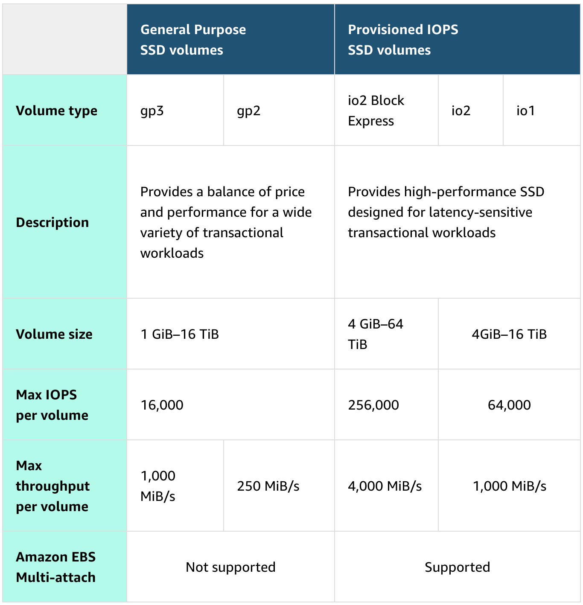
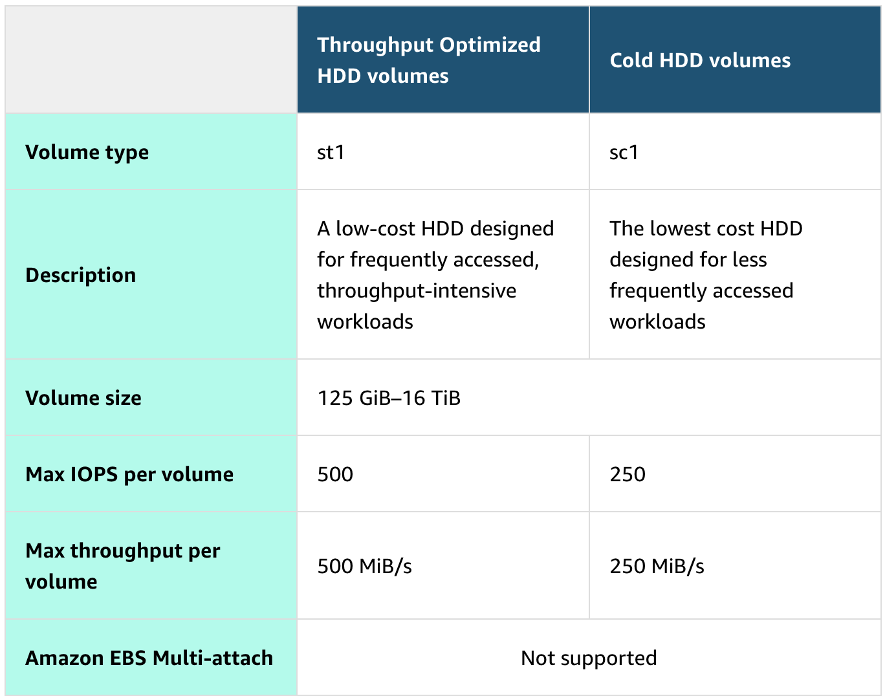
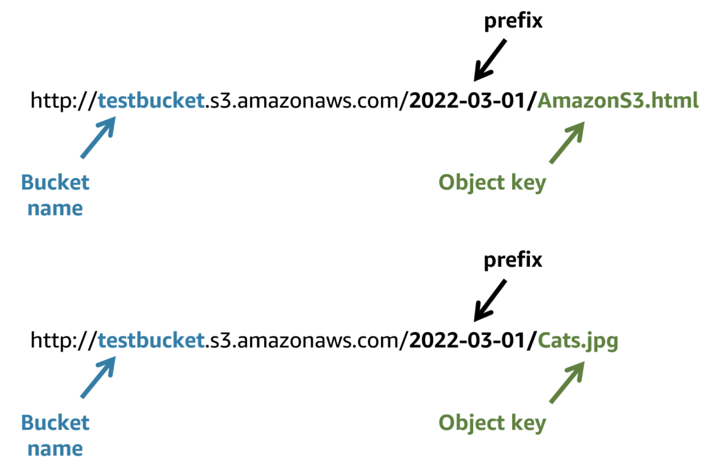
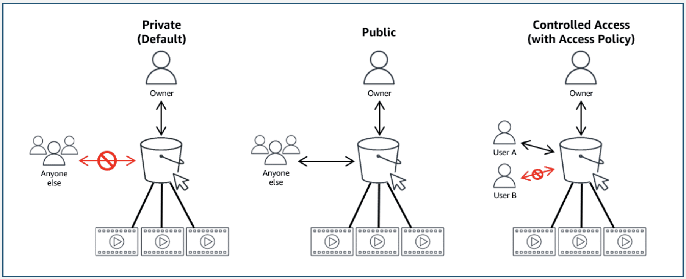

# Module 4: AWS Storage

### Storage Types:
* **Introduction:**
  * AWS storage services are grouped into three categories: **file storage**, **block storage**, and **object storage**
  * In **file storage**, data is **stored as files** in a **hierarchy**
  * In **block storage**, data is stored in **fixed-size blocks**
  * And in **object storage**, data is stored as **objects in buckets**
* **File Storage:**
  * You might be familiar with file storage if you have interacted with **file storage systems** like **Windows File 
    Explorer** or **Finder on macOS**
  * Files are **organized** in a **tree-like hierarchy** that consist of **folders and subfolders**
  * For **example**, if you have **hundreds of cat photos** on your laptop, you might want to **create a folder** called 
    **Cat photos**, and **place the images inside that folder to organize them**
  * Because you **know that these images** will be **used in an application**, you might want to **place the Cat photos 
    folder inside another folder** called **Application files**
  * Each file has **metadata** such as **file name**, **file size**, and the **date the file was created**
  * The file also has a **path**, for example, **`computer/Application_files/Cat_photos/cats-03.png`**
  * When you need to **retrieve a file**, your system can use the **path** to **find it in the file hierarchy**
  * File storage is **ideal** when you require **centralized access to files** that must be **easily shared and 
    managed** by **multiple host computers**
  * Typically, this storage is **mounted** onto **multiple hosts**, and **requires file locking** and **integration with 
    existing file system communication protocols**
  * **Use cases for File Storage:**
    * **Web Serving:**
      * **Cloud file storage solutions** follow **common file-level protocols**, **file naming conventions**, and 
        **permissions** that **developers are familiar with**
      * Therefore, **file storage can be integrated into web applications**
    * **Analytics:**
      * Many **analytics workloads interact with data through a file interface** and rely on features such as **file 
        lock** or **writing to portions of a file**
      * **Cloud-based file storage** supports **common file-level protocols** and has the ability to **scale capacity 
        and performance**
      * Therefore, file storage can be **conveniently integrated** into **analytics workflows**
    * **Media and Entertainment:**
      * Many businesses use a **hybrid cloud deployment** and need **standardized access using file system protocols 
        (NFS or SMB)** or **concurrent protocol access**
      * **Cloud file storage** follows **existing file system semantics**
      * Therefore, **storage of rich media content** for **processing and collaboration** can be integrated for 
        **content production**, **digital supply chains**, **media streaming**, **broadcast playout**, **analytics**, 
        and **archive**
    * **Home Directories:**
      * Businesses wanting to **take advantage** of the **scalability** and **cost benefits of the cloud** are 
        **extending access to home directories** for **many of their users**
      * **Cloud file storage systems** adhere to **common file-level protocols** and **standard permissions models**
      * Therefore, customers can **lift and shift applications** that **need this capability to the cloud**
* **Block Storage:**
  * **File storage treats files** as a **singular unit**, but **block storage splits files** into **fixed-size chunks of 
    data** called **blocks** that **have their own addresses**
  * **Each block** is an **individual piece of data storage**
  * Because **each block is addressable**, **blocks can be retrieved efficiently**
  * Think of block storage as a **more direct route to access the data**
  * When **data is requested**, the **addresses are used by the storage system** to **organize the blocks in the correct 
    order to form a complete file to present back to the requestor**
  * **Besides the address**, **no additional metadata is associated with each block**
  * If you want to **change one character in a file**, you **just change the block**, or the **piece of the file, that 
    contains the character**
  * This **ease of access** is why block storage solutions are **fast** and **use less bandwidth**
  * **Use Cases for Block Storage:**
    * Because block storage is **optimized** for **low-latency operations**, it is a **preferred storage choice** for 
      **high-performance enterprise workloads** and **transactional**, **mission-critical**, and **I/O-intensive 
      applications**
    * **Transactional Workloads:**
      * Organizations that process **time-sensitive** and **mission-critical transactions** store such workloads into a 
        **low-latency**, **high-capacity**, and **fault-tolerant database**
      * Block storage allows developers to set up a **robust**, **scalable**, and **highly efficient transactional 
        database**
      * Because **each block** is a **self-contained unit**, the **database performs optimally**, even when the **stored 
        data grows**
    * **Containers:**
      * Developers use block storage to **store containerized applications on the cloud**
      * **Containers** are **software packages** that **contain the application and its resource files for deployment** 
        in **any computing environment**
      * **Like containers**, **block storage** is **equally flexible**, **scalable**, and **efficient**
      * With block storage, developers can **migrate the containers seamlessly between servers**, **locations**, and 
        **operating environments**
    * **Virtual Machines:**
      * Block storage **supports popular virtual machine (VM) hypervisors**
      * Users can **install the operating system**, **file system**, and **other computing resources** on a **block 
        storage volume**
      * They do so by **formatting the block storage volume** and **turning it into a VM file system**
      * So they can **readily increase or decrease** the **virtual drive size** and **transfer the virtualized storage 
        from one host to another**
* **Object Storage:**
  * In object storage, **files** are **stored as objects**
  * **Objects**, **much like files**, are treated as a **single**, **distinct unit of data when stored**
  * However, **unlike file storage**, these objects are **stored in a bucket** using a **flat structure**, meaning there 
    are **no folders**, **directories**, or **complex hierarchies**
  * **Each object** contains a **unique identifier**
  * This **identifier**, along with **any additional metadata**, is **bundled with the data and stored**
  * **Changing just one character in an object** is **more difficult than with block storage**
  * When you want to **change one character in an object**, the **entire object must be updated**
  * **Use Cases for Object Storage:**
    * With **object storage**, you **can store almost any type of data**, and there is **no limit to the number of 
      objects stored**, which makes it **readily scalable**
    * Object storage is **generally useful when storing large or unstructured data sets**
    * **Data Archiving:**
      * **Cloud object storage** is **excellent** for **long-term data retention**
      * You can **cost-effectively archive large amounts** of **rich media content** and **retain mandated regulatory 
        data** for **extended periods of time**
      * You can also use **cloud object storage** to **replace on-premises tape and disk archive infrastructure**
      * This **storage solution** provides **enhanced data durability**, **immediate retrieval times**, **better 
        security and compliance**, and **greater data accessibility**
    * **Backup and Recovery:**
      * You can **configure object storage systems** to **replicate content** so that if a **physical device fails**, 
        **duplicate object storage devices become available**
      * This ensures that your **systems** and **applications continue to run without interruption**
      * You can also **replicate data across multiple data centers** and **geographical regions**
    * **Rich Media:**
      * With object storage, you can **accelerate applications** and **reduce the cost of storing rich media files** 
        such as **videos**, **digital images**, and **music**
      * By using **storage classes** and **replication features**, you can create **cost-effective**, **globally 
        replicated architecture** to **deliver media to distributed users**
* **Relating Back to Traditional Storage Systems:**
  * If you have worked with **on-premises storage**, you might already be familiar with **block**, **file**, and 
    **object storage**
  * Consider the **following technologies** and **how they relate** to **systems that you might have seen before**:
    * **Block storage** in the cloud is **analogous to direct-attached storage (DAS)** or a **storage area network 
      (SAN)**
    * **File storage systems** are **often supported** with a **network-attached storage (NAS) server**
  * **Adding storage** in a **traditional data center** is a **rigid process**
  * The **storage solutions** must be **purchased**, **installed**, and **configured**
  * With **cloud computing**, the process is **more flexible**
  * You can **create**, **delete**, and **modify storage solutions within a matter of minutes**

### File Storage with Amazon EFS and Amazon FSx:
* **Amazon Elastic File System (Amazon EFS):**
  * **Amazon Elastic File System (Amazon EFS)** is a **set-and-forget file system** that **automatically grows and 
    shrinks** as you **add and remove files**
  * There is **no need for provisioning or managing storage capacity and performance**
  * Amazon EFS **can be used** with **AWS compute service**s and **on-premises resources**
  * You can **connect tens, hundreds, and even thousands of compute instances to an Amazon EFS file system at the same 
    time**, and Amazon EFS can provide **consistent performance to each compute instance**
  * With the **Amazon EFS simple web interface**, you can **create and configure file systems quickly without any 
    minimum fee or setup cost**
  * You **pay only for the storage used** and you can **choose from a range of storage classes** designed to **fit your 
    use case**
  * **Standard Storage Class:**
    * **EFS Standard** and **EFS Standard-Infrequent Access (Standard-IA)** offer **Multi-AZ resilience** and the 
      **highest levels of durability and availability**
  * **One Zone Storage Classes:**
    * **EFS One Zone** and **EFS One Zone-Infrequent Access (EFS One Zone-IA)** provide **additional savings** by 
      **saving your data** in a **single availability zone**
* **Amazon FSx:**
  * **Amazon FSx** is a **fully managed service** that offers **reliability**, **security**, **scalability**, and a 
    **broad set of capabilities** that make it **convenient** and **cost-effective** to **launch**, **run**, and **scale 
    high-performance file systems in the cloud**
  * With Amazon FSx, you can **choose between four widely used file systems**: **Lustre**, **NetApp** **ONTAP**, 
    **OpenZFS**, and **Windows File Server**
  * You can choose based on your **familiarity with a file system** or based on your **workload requirements** for 
    **feature sets**, **performance profiles**, and **data management capabilities**
  * **Amazon FSx for NetApp ONTAP:**
    * **Amazon FSx for NetApp ONTAP** is a **fully managed service**
    * It combines the **familiar features**, **performance**, **capabilities**, and **API operations** of **on-premises 
      NetApp file systems** with the **agility**, **scalability**, and **simplicity** of a **fully managed AWS service**
    * FSx for ONTAP can serve as a **drop-in replacement** for **existing ONTAP deployments**, giving customers the 
      ability to **launch** and **run ONTAP file systems in the cloud**
    * FSx for ONTAP provides **rich data management features** and **flexible shared file storage** that are **broadly 
      accessible from Linux, Windows, and macOS compute instances running in AWS or on premises**
  * **Amazon FSx for OpenZFS:**
    * **Amazon FSx for OpenZFS** is a **fully managed file storage service** that helps you to **move data residing in 
      on-premises ZFS** or **other Linux-based file servers to AWS without changing your application code** or **how you 
      manage data**
    * With FSx for OpenZFS, you **no longer have to worry** about **setting up and provisioning files servers and 
      storage volumes**
    * You also **don't have to deal** with **replicating data**, **installing and patching file server software**, 
      **detecting and addressing hardware failures**, or **manually performing backups**
    * FSx for OpenZFS delivers **leading performance** for **latency-sensitive** and **small-file workloads** with 
      **popular NAS data management capabilities** (**snapshots**, and **cloning**), at a **lower price** than 
      **commercially licensed alternatives**
  * **Amazon FSx for Windows File Server:**
    * **Amazon FSx for Windows File Server** provides **fully managed**, **highly reliable** and **scalable Microsoft 
      Windows file servers**, backed by a **fully native Windows file system**
    * FSx for Windows File Server provides **file storage** that is **accessible over the Service Message Block (SMB) 
      protocol** and has the ability to serve as a **drop-in replacement** for **existing Windows file server 
      deployments**
    * As a **fully managed service**, FSx for Windows File Server **removes the administrative tasks** of **setting up** 
      and **provisioning file servers and storage volumes** and provides **ease of use** for **customers building and 
      running Windows applications**
  * **Amazon FSx for Lustre:**
    * The **open-source Lustre file system** is designed for applications that require **fast storage**, where you want 
    * your **storage to keep up with your compute**
    * Amazon FSx for Lustre makes it **convenient** and **cost effective** to **launch, run, and scale** the **popular 
      high-performance file system**
    * You can **link FSx for Lustre file systems to data repositories** on **Amazon Simple Storage Service (Amazon S3)** 
      or **to on-premises data stores**
    * FSx for Lustre delivers the **highest levels of throughput** (up to 1+ TB/s) and **IOPS** (millions)
    * Customers can **seamlessly integrate, access, and process** their **Amazon S3 datasets** using the **Lustre 
      high-performance file system**

### Block Storage with Amazon EC2 Instance Store and Amazon EBS:
* **Amazon EC2 Instance Store:**
  * **Amazon Elastic Compute Cloud (Amazon EC2) instance store** provides **temporary block-level storage for an 
    instance**
  * This storage is **located on disks** that are **physically attached to the host computer**
  * This **ties the lifecycle of the data** to the **lifecycle of the EC2 instance**
  * If you **delete the instance**, the **instance store is also deleted**
  * Because of this, instance store is considered **ephemeral storage**
  * **Instance store** is **ideal** if you **host applications** that **replicate data to other EC2 instances**, such as 
    **Hadoop clusters**
  * For these **cluster-based workloads**, having the **speed** of **locally attached volumes** and the **resiliency of 
    replicated data** helps you achieve **data distribution at high performance**
  * It’s also ideal for **temporary storage of information** that **changes frequently**, such as **buffers**, 
    **caches**, **scratch data**, and other **temporary content**
  * 
* **Amazon Elastic Block Store (Amazon EBS):**
  * As the name implies, **Amazon Elastic Block Store (Amazon EBS)** is **block-level storage** that you **can attach to 
    an Amazon EC2 instance**
  * You can **compare this** to **attaching an external drive to your laptop**
  * This **attachable storage** is called an **EBS volume**
  * EBS volumes **act similarly to external drives** in **more than one way**:
    * **Detachable:**
      * You **can detach an EBS volume from one EC2 instance** and **attach it to another EC2 instance** in the **same 
        Availability Zone** to **access the data on it**
    * **Distinct:**
      * The **external drive** is **separate from the computer**
      * That means that if an **accident occurs** and the **computer goes down**, you **still have your data on your 
        external drive**
      * The **same is true** for **EBS volumes**
    * **Size-limited:**
      * You’re **limited to the size of the external drive**, because it has a **fixed limit** to **how scalable it can 
        be**
      * For example, you might have a **2 TB external drive**, which means you can **only have 2 TB of content on it**
      * This also relates to Amazon EBS, because a **volume also has a max limitation** of **how much content you can 
        store on it**
    * **1-to-1 connection:**
      * **Most EBS volumes** can **only be connected with one computer at a time**
      * Most EBS volumes have a **one-to-one relationship with EC2 instances**, so they **cannot be shared by or 
        attached to multiple instances at one time**
  * AWS announced the **Amazon EBS multi-attach feature** that **permits Provisioned IOPS SSD (io1 or io2) volumes** to 
    be attached to **multiple EC2 instances at one time**
  * This feature is **not available for all instance types**, and **all instances must be in the same Availability 
    Zone**
* **Scaling Amazon EBS Volumes:**
  * You can **scale EBS volumes** in **two ways**:
  * **Increasing Volume Size:**
    * **Increase the volume size only if it doesn’t increase above the maximum size limit**
    * Depending on the **volume selected**, Amazon EBS currently supports a **maximum volume size** of **64 tebibytes 
      (TiB)**
    * For **example**, if you provision a **5-TiB io2 Block Express volume**, you can choose to **increase the size** of 
      your volume until you get to **64 TiB**
  * **Attach Multiple Volumes to a Single EC2 Instance:**
    * **Amazon EC2** has a **one-to-many relationship** with **EBS volumes**
    * You can **add these additional volumes during or after EC2 instance creation** to provide **more storage capacity 
      for your hosts**
* **Amazon EBS Use Cases:**
  * Amazon EBS is **useful** when you must **retrieve data quickly** and have **data persist long term**
  * Volumes are **commonly used** in the **following scenarios:**
  * **Operating Systems:**
    * **Boot** and **root volumes** can be used to **store an operating system**
    * The **root device** for an **instance launched from an Amazon Machine Image (AMI)** is **typically an EBS volume**
    * These are commonly referred to as **EBS-backed AMIs**
  * **Databases:**
    * As a **storage layer for databases running on Amazon EC2** that will **scale with your performance needs** and 
      provide **consistent** and **low-latency performance**
  * **Enterprise Applications:**
    * Amazon EBS provides **high availability** and **high durability block storage** to **run business-critical 
      applications**
  * **Big Data Analytics Engines:**
    * Amazon EBS offers **data persistence**, **dynamic performance adjustments**, and the ability to **detach and 
      reattach volumes**, so you can **resize clusters for big data analytics**
* **EBS Volume Types:**
  * EBS volumes are organized into **two main categories**: **solid-state drives (SSDs)** and **hard-disk drives 
    (HDDs)**
  * **SSDs** are used for **transactional workloads** with **frequent read/write operations** with **small I/O size**
  * **HDDs** are used for **large streaming workloads** that **need high throughput performance**
  * AWS offers **two types of each**
  * The **following two tables** can help you decide **which EBS volume** is the **right option for your workload**
  * **SSD Volumes:**
    * 
  * **HDD Volumes:**
    * 
* **Amazon EBS Benefits:**
  * **High Availability:**
    * When you create an EBS volume, it is **automatically replicated in its Availability Zone** to **prevent data loss 
      from single points of failure**
  * **Data persistence:**
    * **Storage persists** even when your **instance doesn’t**
  * **Data Encryption:**
    * When activated by the user, **all EBS volumes support encryption**
  * **Flexibility:**
    * EBS volumes support **on-the-fly changes**
    * **Modify volume type**, **volume size**, and **input/output operations per second (IOPS) capacity without stopping 
      your instance**
  * **Backups:**
    * Amazon EBS provides the ability to **create backups of any EBS volume**
* **Amazon EBS Snapshots:**
  * **Errors happen**
  * One error is **not backing up data** and then **inevitably losing it**
  * To prevent this from happening to you, **always back up your data, even in AWS**
  * Because your **EBS volumes consist** of the **data from your EC2 instance**, you should **make backups of these 
    volumes**, called **snapshots**
  * EBS snapshots are **incremental backups** that **only save the blocks on the volume that have changed** after your 
    **most recent snapshot**
  * For example, if you have **10 GB of data** on a volume and **only 2 GB of data have been modified since your last 
    snapshot**, **only the 2 GB that have been changed** are **written to Amazon S3**
  * When you take a snapshot of any of your EBS volumes, the **backups are stored redundantly** in **multiple 
    Availability Zones using Amazon S3**
  * This aspect of **storing the backup in Amazon S3** is **handled by AWS**, so you **won’t need to interact with 
    Amazon S3 to work with your EBS snapshots**
  * You **manage them** in the **Amazon EBS console**, which is **part of the Amazon EC2 console**
  * EBS snapshots can be used to **create multiple new volumes**, whether they’re in the **same Availability Zone or a 
    different one**
  * When you **create a new volume from a snapshot**, it’s an **exact copy of the original volume at the time the 
    snapshot was taken**

### Object Storage with Amazon S3:
* **Amazon S3:**
  * Unlike Amazon EBS, **Amazon Simple Storage Service (Amazon S3)** is a **standalone storage solution** that **isn’t 
    tied to compute**
  * With Amazon S3, you **can retrieve your data from anywhere on the web**
  * If you have used an **online storage service** to **back up the data from your local machine**, you most likely have 
    used a **service similar to Amazon S3**
  * The **big difference** between those **online storage services** and **Amazon S3** is the **storage type**
  * Amazon S3 is an **object storage service**
  * **Object storage stores data** in a **flat structure**
  * An **object** is a **file combined with metadata**
  * You **can store as many of these objects as you want**
  * **All the characteristics** of **object storage** are **also characteristics of Amazon S3**
* **Amazon S3 Concepts:**
  * In Amazon S3, you **store your objects in containers called buckets**
  * You **can’t upload an object**, not even a single photo, **to Amazon S3 without creating a bucket first**
  * When you **store an object in a bucket**, the **combination** of a **bucket name**, **key**, and **version ID 
    uniquely identifies the object**
  * When you **create a bucket**, you **specify**, at the **very minimum**, **two details**: the **bucket name** and the 
    **AWS Region** that you want the bucket to reside in:
    * **Bucket Name:**
      * When you choose a **bucket name**, it **must be unique across all AWS accounts**
      * **AWS stops you** from **choosing a bucket name** that has **already been chosen by someone else in another AWS 
        account**
      * **After you choose a name**, that **name is yours** and **cannot be claimed by anyone else unless you delete the 
        bucket**, which then **releases the name for others to use**
    * **AWS Region:**
      * **Select a region** that you **have used for other resources**, such as your **compute**
      * When you choose a Region for your bucket, **all objects** that you **put insude the bucket** will be 
        **redundantly stored** across **multiple devices**, across **multiple Availability Zones**
      * This **level of redundancy** is designed to provide Amazon S3 customers with **99.999999999% durability** and 
        **99.99% availability for objects over a given year**
  * **Amazon S3 Bucket Names:**
    * Amazon S3 supports **global buckets**
    * Therefore, **each bucket name must be unique across all AWS accounts in all AWS Regions within a partition**
    * A **partition** is a **grouping of Regions**, of which **AWS currently has three**: **Standard Regions**, **China 
      Regions**, and **AWS GovCloud (US)**
    * When naming a bucket, **choose a name** that is **relevant to you or your business**
    * For example, you should **avoid using AWS or Amazon** in your bucket name
    * The following are some **examples of the rules** that apply for **naming buckets in Amazon S3**
      * Bucket names must be **between 3 (min)** and **63 (max) characters long**
      * Bucket names can consist only of **lowercase letters**, **numbers**, **dots (.)**, and **hyphens (-)**
      * Bucket names **must begin and end with a letter or number**
      * Buckets **must not be formatted as an IP address**
      * A bucket name **cannot be used by another AWS account in the same partition until the bucket is deleted**
    * If your application **automatically creates buckets**, choose a **bucket naming scheme** that is **unlikely to 
      cause naming conflicts** and will **choose a different bucket name, should one not be available**
  * **Object Key Names:**
    * The **object key (key name) uniquely identifies the object in an Amazon S3 bucket**
    * When you **create an object**, you **specify the key name**
    * As described earlier, the Amazon S3 model is a **flat structure**, meaning there is **no hierarchy** of 
      **subbuckets** or **subfolders**
    * However, the Amazon S3 console **does support the concept of folders**
    * By using **key name prefixes** and **delimiters**, you can **imply a logical hierarchy**
    * For example, suppose your bucket called `testbucket` has **two objects** with the following **object keys**: 
      `2022-03-01/AmazonS3.html` and `2022-03-01/Cats.jpg`
    * The console uses the **key name prefix**, **`2022-03-01`**, and **delimiter (`/`)** to present a **folder 
      structure**
    * 
    * Amazon S3 supports **buckets** and **objects**, and there is **no hierarchy**
    * However, by using **prefixes** and **delimiters** in an **object key name**, the **Amazon S3 console** and the 
      **AWS SDKs** are able to **infer hierarchy** and introduce the **concept of folders**
* **Amazon S3 Use Cases:**
  * **Backup and Storage:**
    * Amazon S3 is a natural place to **back up files** because it is **highly redundant**
    * As mentioned in the last lesson, AWS **stores your EBS snapshots in Amazon S3** to take advantage of its **high 
      availability**
  * **Media Hosting:**
    * Because you **can store unlimited objects**, and **each individual object can be up to 5 TB**, Amazon S3 is an 
      ideal location to **host video**, **photo**, and **music uploads**
  * **Software Delivery:**
    * You can use Amazon S3 to **host your software applications** that **customers can download**
  * **Data Lakes:**
    * Amazon S3 is an **optimal foundation** for a **data lake** because of its **virtually unlimited scalability**
    * You can **increase storage** from **gigabytes to petabytes of content**, **paying only for what you use**
  * **Static Websites:**
    * You can **configure your S3 bucket** to **host a static website of HTML**, **CSS**, and **client-side scripts**
  * **Static Content:**
    * Because of the **limitless scaling**, the support for **large files**, and the fact that you can **access any 
      object over the web at any time**, Amazon S3 is the perfect place to **store static content**
* **Security in Amazon S3:**
  * **Everything** in Amazon S3 is **private by default**
  * This means that **all Amazon S3 resources**, such as **buckets** and **objects**, can **only be viewed** by the 
    **user** or **AWS account** that **created that resource**
  * **Amazon S3 resources** are all **private and protected to begin with**
  * If you decide that you want **everyone on the internet to see your photos**, you can choose to make your **buckets 
    and objects public**
  * A **public resource** means that **everyone on the internet can see it**
  * Most of the time, you **don’t want your permissions** to be **all or nothing**
  * Typically, you want to be **more granular** about the way that you **provide access** to your resources
  * 
  * To be **more specific** about **who can do what** with your Amazon S3 resources, Amazon S3 provides several 
    **security management features**: **IAM policies**, **S3 bucket policies**, and **encryption** to **develop and 
    implement your own security policies**
  * **Amazon S3 and IAM policies:**
    * Previously, you learned about creating and using **AWS Identity and Access Management (IAM) policies**
    * Now you can **apply that knowledge to Amazon S3**
    * When **IAM policies** are **attached to your resources** (buckets and objects) or **IAM users**, **groups**, and 
      **roles**, the **policies define which actions they can perform**
    * Access policies that you attach to your resources are referred to as **resource-based policies** and **access 
      policies attached to users in your account** are called **user policies**
    * You **should use IAM policies** for **private buckets** in the **following two scenarios**:
      * You have **many buckets** with **different permission requirements**
        * Instead of defining **many different S3 bucket policies**, you can use **IAM policies**
      * You want **all policies** to be in a **centralized location**
        * By using IAM policies, you can **manage all policy information** in **one location**
  * **Amazon S3 Bucket Policies:**
    * Like IAM policies, **S3 bucket policies** are **defined** in a **JSON format**
    * Unlike **IAM policies**, which are attached to **resources** and **users**, **S3 bucket policies** can **only be 
      attached to S3 buckets**
    * The **policy** that is **placed on the bucket applies** to **every object in that bucket**
    * **S3 bucket policies specify what actions** are **allowed or denied on the bucket**
  * You **should use S3 bucket policies** in the **following scenarios**:
    * You need a **simple way** to do **cross-account access to Amazon S3**, **without using IAM roles**
    * Your **IAM policies bump up against** the **defined size limit**
      * **S3 bucket policies** have a **larger size limit**
  * **Amazon S3 Encryption:**
    * Amazon S3 **reinforces encryption in transit** (**as it travels to and from Amazon S3**) and **at rest**
    * To **protect data**, Amazon S3 **automatically encrypts all objects on upload** and **applies server-side 
      encryption** with **S3-managed keys** as the **base level of encryption** for **every bucket in Amazon S3** at 
      **no additional cost**
* **Amazon S3 Storage Classes:**
  * When you **upload an object to Amazon S3** and you **don’t specify the storage class**, you upload it to the 
    **default storage class**, often referred to as **standard storage**
  * In previous lessons, you learned about the **default Amazon S3 standard storage class**
  * Amazon S3 storage classes let you **change your storage tier** when your **data characteristics change**
  * For **example**, if you are accessing your **old photos infrequently**, you might want to **change the storage 
    class** for the photos to **save costs**
  * **Storage Classes:**
    * **S3 Standard:**
      * This is considered **general-purpose storage** for **cloud applications**, **dynamic websites**, **content 
        distribution**, **mobile and gaming applications**, and **big data analytics**
    * **S3 Intelligent-Tiering:**
      * This tier is useful if your data has **unknown** or **changing access patterns**
      * S3 Intelligent-Tiering stores objects in **three tiers**: a **frequent access tier**, an **infrequent access 
        tier**, and an **archive instance access tier**
      * Amazon S3 **monitors access patterns of your data** and **automatically moves your data** to the **most 
        cost-effective storage tier** based on **frequency of access**
    * **S3 Standard-Infrequent Access (S3 Standard-IA):**
      * This tier is for data that is **accessed less frequently** but **requires rapid access when needed**
      * S3 Standard-IA offers the **high durability**, **high throughput**, and **low latency of S3 Standard**, with a 
        **low per-GB storage price** and **per-GB retrieval fee**
      * This storage tier is ideal if you want to **store long-term backups**, **disaster recovery files**, and so on
    * **S3 One Zone-Infrequent Access (S3 One Zone-IA):**
      * Unlike other S3 storage classes that store data in a minimum of three Availability Zones, S3 One Zone-IA 
        **stores data** in a **single Availability Zone**, which makes it **less expensive than S3 Standard-IA**
      * S3 One Zone-IA is ideal for customers who want a **lower-cost option** for **infrequently accessed data**, but 
        **do not require** the **availability** and **resilience** of **S3 Standard** or **S3 Standard-IA**
      * It's a good choice for **storing secondary backup copies of on-premises data** or **easily recreatable data**
    * **S3 Glacier Instant Retrieval:**
      * Use S3 Glacier Instant Retrieval for **archiving data** that is **rarely accessed** and **requires millisecond 
        retrieval**
      * Data stored in this storage class offers a **cost savings** of up to **68 percent** **compared to the S3 
        Standard-IA storage class**, with the **same latency and throughput performance**
    * **S3 Glacier Flexible Retrieval:**
      * S3 Glacier Flexible Retrieval offers **low-cost storage** for **archived data** that is **accessed 1–2 times per 
        year**
      * With S3 Glacier Flexible Retrieval, your data can be accessed in as little as **1–5 minutes** using an 
        **expedited retrieval**
      * You can also request **free bulk retrievals** in **up to 5–12 hours**
      * It is an ideal solution for **backup**, **disaster recovery**, **offsite data storage needs**, and for when 
        **some data occasionally must be retrieved in minutes**
    * **S3 Glacier Deep Archive:**
      * S3 Glacier Deep Archive is the **lowest-cost** Amazon S3 storage class
      * It supports **long-term retention** and **digital preservation** for data that **might be accessed once or twice 
        a year**
      * Data stored in the S3 Glacier Deep Archive storage class has a **default retrieval time** of **12 hours**
      * It is designed for customers that **retain data sets** for **7–10 years or longer**, to **meet regulatory 
        compliance requirements**
      * Examples include those in **highly regulated industries**, such as the **financial services**, **healthcare**, 
        and **public sectors**
    * **S3 on Outposts:**
      * Amazon S3 on Outposts **delivers object storage** to your **on-premises AWS Outposts environment** using **S3 
        API's and features**
      * For workloads that require **satisfying local data residency requirements** or need to **keep data close to on 
        premises applications** for **performance reasons**, the S3 Outposts storage class is the ideal option
* **Amazon S3 Versioning:**
  * As described earlier, Amazon S3 **identifies objects in part** by using the **object name**
  * For **example**, when you **upload an employee photo** to Amazon S3, you might **name the object `employee.jpg`** 
    and store it in a **bucket** called **`employees`**
  * **Without Amazon S3 versioning**, **every time** you **upload an object called `employee.jpg`** to the **`employees` 
    bucket**, it will **overwrite the original object**
  * This **can be an issue** for **several reasons**, including the following:
    * **Common Names:**
      * The **`employee.jpg` object name** is a **common name** for an **employee photo object**
      * **You** or **someone else who has access to the bucket might not have intended to overwrite it**; but **once 
        it's overwritten**, the **original object can't be accessed**
    * **Version Preservation:**
      * You **might want to preserve different versions** of `employee.jpg`
      * **Without versioning**, if you wanted to **create a new version of `employee.jpg`**, you would need to **upload 
        the object** and **choose a different name for it**
      * Having **several objects** all with **slight differences in naming variations** can cause **confusion** and 
        **clutter** in **S3 buckets**
  * To **counteract these issues**, you can use **Amazon S3 versioning**
  * **Versioning keeps multiple versions** of a **single object** in the **same bucket**
  * This **preserves old versions of an object without using different names**, which **helps with object recovery** 
    from **accidental deletions**, **accidental overwrites**, or **application failures**
  * If you **enable versioning for a bucket**, Amazon S3 **automatically generates a unique version ID for the object**
  * In **one bucket**, for **example**, you can have **two objects** with the **same key but different version IDs**, 
    such as **`employeephoto.jpg` (version `111111`)** and **`employeephoto.jpg` (version `121212`)**
  * By using **versioning-enabled buckets**, you can **recover objects from accidental deletion or overwrite**
  * The following are **examples**:
    * **Deleting an object does not remove the object permanently**
      * Instead, **Amazon S3 puts a marker on the object** that shows that you **tried to delete it**
      * If you want to restore the object, you can remove the marker and the object is reinstated
    * If you **overwrite an object**, it results in a **new object version in the bucket**
      * You **still have access** to **previous versions of the object**
  * **Versioning States:**
    * **Buckets** can be in **one of three states**
    * The **versioning state applies to all objects in the bucket**
    * **Storage costs are incurred** for **all objects in your bucket**, **including all versions**
    * To **reduce your Amazon S3 bill**, you might want to **delete previous versions** of your objects when they are 
      **no longer needed**
    * **Unversioned (Default):**
      * **No new and existing objects in the bucket have a version**
    * **Versioning Enabled:**
      * **Versioning is enabled** for **all objects in the bucket**
      * After you **version-enable a bucket**, it can **never return to an unversioned state**
      * However, **you can suspend versioning on that bucket**
    * **Versioning-Suspended:**
      * **Versioning is suspended** for **new objects**
      * **All new objects in the bucket** will **not have a version**
      * However, **all existing objects keep their object versions**
* **Managing Your Storage Lifecycle:**
  * If you **keep manually changing your objects**, such as your **employee photos**, from **storage tier to storage 
    tier**, you might want to **automate the process** by **configuring their Amazon S3 lifecycle**
  * When you **define a lifecycle configuration** for an **object** or **group of objects**, **you can choose to 
    automate between two types of actions**: **transition** and **expiration**
    * **Transition actions define when objects should transition to another storage class**
    * **Expiration actions define when objects expire and should be permanently deleted**
  * For **example**:
    * You might **transition objects** to **S3 Standard-IA storage class 30 days after you create them**
    * Or you **might archive objects** to the **S3 Glacier Deep Archive storage class 1 year after creating them**
  * The **following use cases** are **good candidates** for the use of l**ifecycle configuration rules**:
    * **Periodic Logs:**
      * If you **upload periodic logs** to a bucket, your **application might need them** for a **week** or a **month**
      * After that, you **might want to delete them**
    * **Data That Changes in Access Frequency:**
      * **Some documents** are **frequently accessed** for a **limited period of time**
      * After that, they are **infrequently accessed**
      * At some point, you **might not need real-time access to them**
      * But your **organization** or **regulations** might **require you to archive them** for a **specific period**
      * **After that**, you can **delete them**

