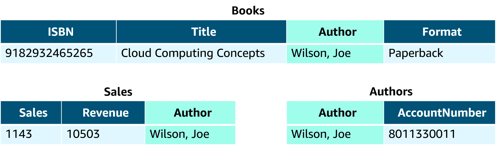
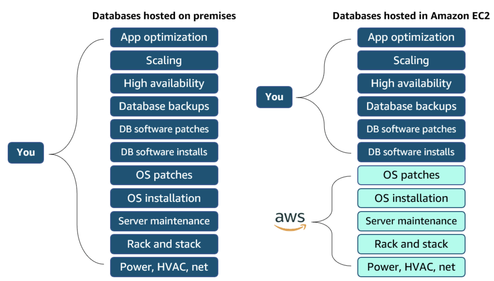
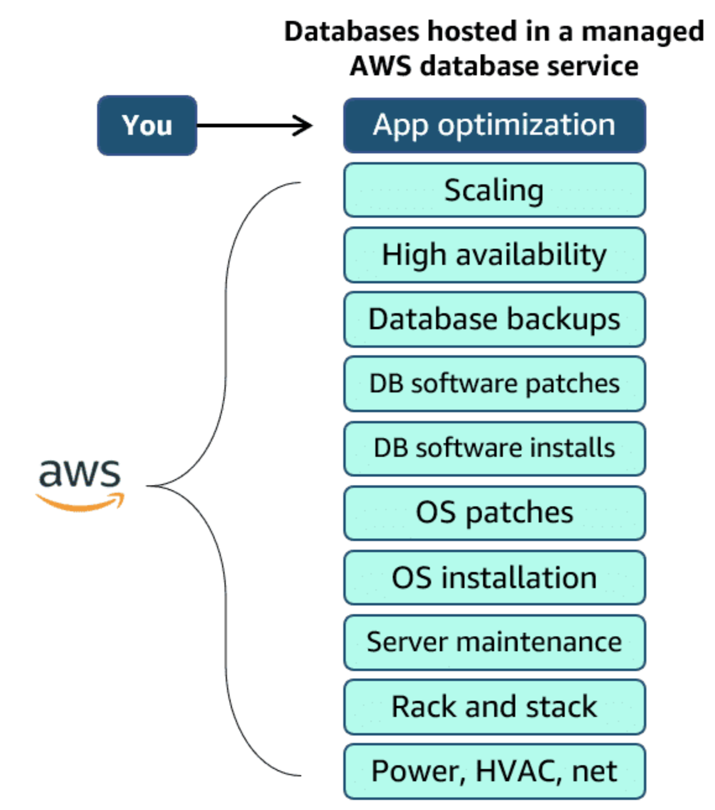
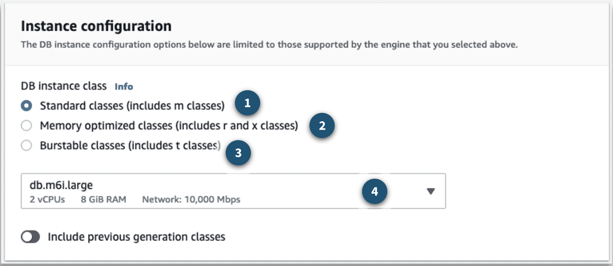
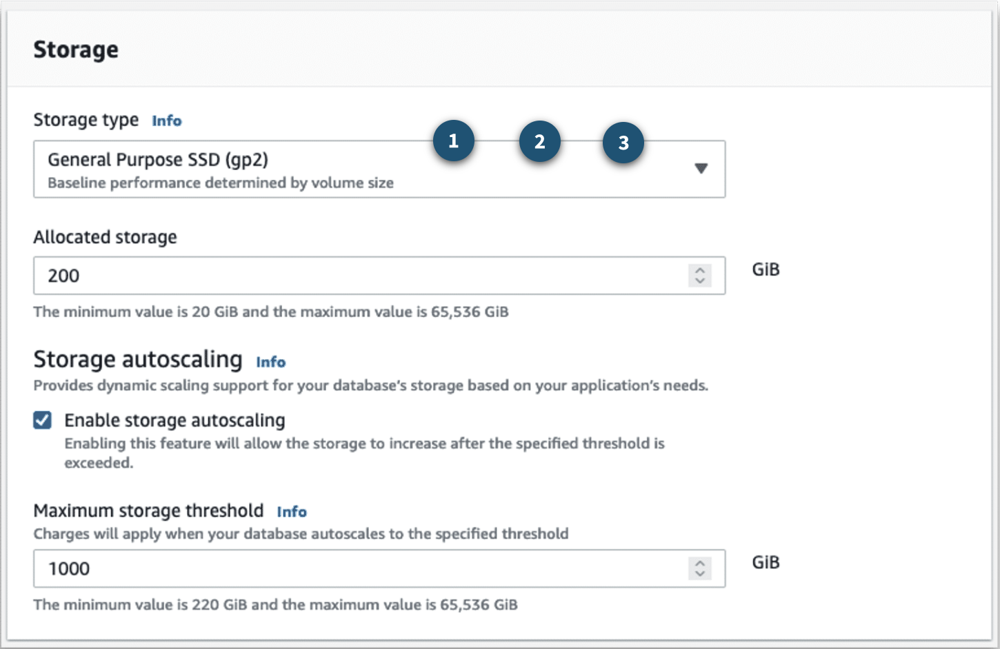

# Databases on AWS:

### Introduction to Databases on AWS:
* **History Behind Enterprise Databases:**
  * **Choosing a database** **used to be a straightforward decision**
  * Customers had **only a few options to choose from**
  * Typically, they would **consider a few vendors** and then, inevitably, **choose one** for **all their applications**
  * Businesses **often selected** a **database technology before they fully understood their use case**
  * Since the 1970s, the database type **most commonly selected** by businesses was a **relational database**
* **Relational Databases:**
  * A **relational database organizes data into tables**
  * **Data in one table** can **link to data in other tables** to **create relationships**
  * Hence, the **relational part of the name**
  * A **table stores data** in **rows** and **columns**
  * A **row**, often called a **record**, **contains all information** about a **specific entry**
  * **Columns describe attributes of an entry**
  * The following image is an **example** of **three tables** in a **relational database**
  * 
  * It shows a **table for books**, a **table for sales**, and a **table for authors**
  * In the **books table**, **each row includes** the **International Standard Book Number (ISBN)**, **title**, 
    **author**, and **format**
  * **Each of these attributes** is **stored in its own column**
  * The **books table** has the **author attribute in common** with the **other two tables**
  * That **common column** creates a **relationship between the tables**
  * The **tables**, **rows**, **columns**, and **relationships between them** is called a **logical schema**
  * With **relational databases**, a **schema is fixed**
  * **After the database is operational**, it **becomes difficult to change the schema**
  * Because of this, **most of the data modeling** is **done up front before the database is active**
* **Relational Database Management System:**
  * With a **relational database management system (RDBMS)**, you can **create**, **update**, and **administer** a 
    **relational database**
  * Some **common examples** of **RDBMSs** include the following:
    * **MySQL**
    * **PostgresQL**
    * **Oracle**
    * **Microsoft SQL Server**
    * **Amazon Aurora**
  * You **communicate with an RDBMS** by using **structured query language (SQL) queries**, similar to the following 
    **example**:
    * **`SELECT * FROM table_name`**
  * This **query selects all the data** from a **particular table**
  * However, the **power of SQL queries** is in **creating more complex queries** that **pull data from several tables** 
    to **identify patterns and answers** to **business problems**
  * For example, **querying the sales table** and the **books table together** to see **sales in relation to an author’s 
    books**
  * **Querying tables together** to **better understand their relationships** is made possible by a **"join"**
* **Relational Database Benefits:**
  * **Complex SQL:**
    * With SQL, you can **join multiple tables** so you can **better understand relationships between your data**
  * **Reduced Redundency:**
    * You can **store data in one table** and **reference it from other tables** instead of **saving the same data in 
      different places**
  * **Familiarity:**
    * Because relational databases have been a **popular choice since the 1970s**, **technical professionals** often 
      have **familiarity** and **experience** with them
  * **Acuracy:**
    * Relational databases ensure that your data has **high integrity** and adheres to the **atomicity**, 
      **consistency**, **isolation**, and **durability (ACID) principle**
* **Relational Database Use Cases:**
  * **Much of the world** runs on relational databases
  * In fact, they’re **at the core** of **many mission-critical applications**, some of which you might use in your 
    day-to-day life
  * **Applications That Have a Fixed Schema:**
    * These are applications that have a **fixed schema** and **don't change often**
    * An example is a **lift-and-shift application** that **lifts an app from on-premises** and **shifts it to the 
      cloud**, with **little or no modifications**
  * **Applications That Need Persistent Storage:**
    * These are applications that **need persistent storage** and follow the **ACID principle**, such as:
      * **Enterprise resource planning (ERP) applications**
      * **Customer relationship management (CRM) applications**
      * **Commerce and financial applications**
* **Choose Between Unmanaged and Managed Databases:**
  * If you want to **trade your on-premises database** for a **relational database on AWS**, you first need to select 
    **how you want to run it**; **managed** or **unmanaged**
  * Managed services and unmanaged services are **handled similar** to the **shared responsibility model**
  * The shared responsibility model **distinguishes between AWS security responsibilities** and the **customer’s 
    security responsibilities**
  * Likewise, managed compared to unmanaged can be understood as a **trade-off between convenience and control**
  * **Unmanaged Databases:**
    * If you operate a relational database **on premises**, you are **responsible for all aspects of operation**
      * This includes **data center security and electricity**, **host machines management**, **database management**, 
        **query optimization**, and **customer data management**
      * You are **responsible for absolutely everything**, which means you have **control over absolutely everything**
    * Now, suppose you want to **shift some of the work to AWS** by running your relational database on **Amazon Elastic 
      Compute Cloud (Amazon EC2)**
      * If you **host a database on Amazon EC2**, **AWS implements and maintains the physical infrastructure and 
        hardware** and **installs the EC2 instance operating system (OS)**
      * However, **you are still responsible** for **managing the EC2 instance**, **managing the database on that host**, 
        **optimizing queries**, and **managing customer data**
      * This is called an **unmanaged database option**
      * In this option, **AWS is responsible for** and **has control** over the **hardware** and **underlying 
        infrastructure**
      * **You are responsible** for and **have control over management of the host and database**
    *   
    * **You are responsible** for **everything in a database hosted on-premises**
    * **AWS** takes on **more of that responsibility** in **databases hosted in Amazon EC2**
  * **Managed Databases:**
    * To **shift more of the work to AWS**, you can use a **managed database service**
    * These services provide the **setup** of **both the EC2 instance and the database**, and they p**rovide systems** 
      for **high availability**, **scalability**, **patching**, and **backups**
    * However, in this model, **you’re still responsible** for **database tuning**, **query optimization**, and ensuring 
      that your **customer data is secure**
    * This option provides the **ultimate convenience** but the **least amount of control** compared to the two previous 
      options
    * 
  
### Amazon RDS:
* **Amazon RDS Overview:**
  * **Amazon RDS** is a **managed database service** customers can use to **create and manage relational databases in 
    the cloud without the operational burden** of **traditional database management**
  * **For example**, imagine you **sell healthcare equipment**, and your goal is to be the **number-one seller on the 
    West Coast** of the United States
  * **Building a database doesn’t directly help you** achieve that goal
  * However, **having a database** is a **necessary component to achieving that goal**
  * With Amazon RDS, you can **offload some of the unrelated work** of **creating and managing a database**
  * You can **focus on the tasks** that **differentiate your application**, instead of focusing on 
    **infrastructure-related tasks**, like **provisioning**, **patching**, **scaling**, and **restoring**
  * Amazon RDS **supports most of the popular RDBMSs**, ranging from **commercial options** to **open-source options** 
    and even a **specific AWS option**
  * **Supported Amazon RDS engines** include the following:
    * **Commercial:** **Oracle**, **SQL Server**
    * **Open Source:** **MySQL**, **PostgreSQL**, **MariaDB**
    * **Cloud Native:** **Aurora**
* **Database Instances:**
  * Just like the **databases you build and manage yourself**, Amazon RDS is **built from compute and storage**
  * The **compute portion** is called the **database (DB) instance**, which **runs the DB engine**
  * Depending on the **engine selected**, the instance will have **different supported features and configurations**
  * A DB instance **can contain multiple databases** with the **same engine**, and **each DB can contain multiple 
    tables**
  * **Underneath the DB instance** is an **EC2 instance**
  * However, this **instance is managed through the Amazon RDS console instead of the Amazon EC2 console**
  * When you **create your DB instance**, you choose the **instance type** and **size**
  * The DB instance class you choose affects **how much processing power and memory it has**
  * 
  * **1. Standard Classes:**
    * **Standard instances** provide a **balance** of **compute**, **memory**, and **network resources**
    * They are a **good choice** for **many database workloads**
  * **2. Memory Optimized Classes:**
    * **Memory optimized instances accelerate performance** for workloads that **process large datasets in memory**
  * **3. Burstable Classes:**
    * Burstable performance instances provide **baseline level of CPU performance** with the **ability to burst above 
      the baseline**
  * **4. Amazon RDS Instance Configuration Dropdown Menu:**
    * By choosing the **dropdown menu**, you can select from a **range of instance configurations** with **different 
     computational, networking, and memory capacity**
* **Storage on Amazon RDS:**
  * The **storage portion** of **DB instances for Amazon RDS** use **Amazon Elastic Block Store (Amazon EBS) volumes** 
    for **database and log storage**
  * This includes **MySQL**, **MariaDB**, **PostgreSQL**, **Oracle**, and **SQL Server**
  * When using **Aurora**, data is stored in **cluster volumes**, which are **single, virtual volumes** that use 
    **solid-state drives (SSDs)**
  * A **cluster volume** contains **copies of your data across three Availability Zones** in a **single AWS Region**
  * For **nonpersistent, temporary files**, **Aurora uses local storage**
  * Amazon RDS provides **three storage types**: **General Purpose SSD (also called gp2 and gp3)**, **Provisioned IOPS 
    SSD (also called io1)**, and **Magnetic (also called standard)**
  * They **differ in performance characteristics and price**, which means you can **tailor your storage performance and 
    cost** to the **needs of your database workload**
  * 
  * **1. General Purpose SSD:**
    * These volumes offer **cost-effective storage**
    * This is ideal for a **broad range of workloads** running on **medium-sized DB instances**
    * General Purpose storage is **best suited** for **development and testing environments**
  * **2. Provisioned IOPS SSD:**
    * This type of storage is designed to **meet the needs** of **I/O intensive workloads**
    * For example, database workloads requiring **low I/O latency** and **consistent I/O throughput**
    * **Provisioned IOPS storage** is **best suited for production environments**
  * **3. Magnetic:**
    * Amazon RDS also supports **magnetic storage** for **backwards compatibility**
    * We **recommend** that you use General **Purpose SSD or Provisioned IOPS SSD** for **any new storage needs**
    * The **maximum amount of storage** for DB instances on magnetic storage is **less than that of the other storage 
      types**
* **Amazon RDS in an Amazon Virtual Private Cloud:**
  * When you **create a DB instance**, you **select the Amazon Virtual Private Cloud (Amazon VPC)** your databases 
    **will live in**
  * Then, you **select the subnets** that will be **designated for your DB**
  * This is called a **DB subnet group**, and it has **at least two Availability Zones in its Region**
  * The **subnets in a DB subnet group should be private**, so they **don’t have a route to the internet gateway**
  * This **ensures** that your **DB instance**, and the **data inside it**, **can be reached only by the application 
    backend**
  * **Access to the DB instance** can be **restricted further** by using **network access control lists (network ACLs)** 
    and **security groups**
  * With these **firewalls**, you can **control**, at a **granular level**, the **type of traffic you want to provide 
    access into your database**
  * **Using these controls** provides **layers of security for your infrastructure**
  * It **reinforces** that **only the backend instances have access to the database**
* **Backup Data:**
  * You **don’t want to lose your data**
  * To take **regular backups** of your Amazon RDS instance, you can use **automated backups** or **manual snapshots**
  * **Automated Backups:**
    * Automated backups are **turned on by default**
    * This **backs up your entire DB instance (not just individual databases on the instance)** and your **transaction 
      logs**
    * When you **create your DB instance**, you **set a backup window** that is the **period of time that automatic 
      backups occur**
    * Typically, you want to **set the window during a time** when your database experiences **little activity** because 
      it can cause **increased latency and downtime**
    * **Retaining Backups:**
      * Automated backups are **retained between 0 and 35 days**
      * You might ask yourself, “**Why set automated backups for 0 days?**”
      * The **0 days setting stops automated backups from happening**
      * If you **set it to 0**, it will also **delete all existing automated backups**
      * This is **not ideal**
      * The **benefit of automated backups** that you can do **point-in-time recovery**
    * **Point-In-Time Recovery:**
      * This **creates a new DB instance** using **data restored from a specific point in time**
      * This **restoration method** provides **more granularity** by **restoring the full backup** and **rolling back 
        transactions up to the specified time range**
  * **Manual Snapshots:**
    * If you want to **keep your automated backups longer than 35 days**, use **manual snapshots**
    * Manual snapshots are **similar to taking Amazon EBS snapshots**, except you **manage them** in the **Amazon RDS 
      console**
    * These are **backups that you can initiate at any time**
    * They **exist until you delete them**
    * For example, to meet a **compliance requirement** that **mandates you to keep database backups for a year**, you 
      **need to use manual snapshots**
    * If you **restore data from a manual snapshot**, it **creates a new DB instance using the data from the snapshot**
  * **Choosing a Backup Option:**
    * It is **advisable to deploy both backup options**
    * **Automated backups** are **beneficial** for **point-in-time recovery**
    * With **manual snapshots**, you can **retain backups for longer than 35 days**
  * **Redundancy with Amazon RDS Multi-AZ:**
    * In an **Amazon RDS Multi-AZ deployment**, **Amazon RDS creates a redundant copy of your database in another 
      Availability Zone**
    * You end up with **two copies of your database**:
      * A **primary copy** in a **subnet in one Availability Zone**
      * A **standby copy** in a **subnet in a second Availability Zone**
    * The **primary copy** of your database provides **access to your data** so that **applications can query and 
      display the information**
    * The **data in the primary copy** is **synchronously replicated to the standby copy**
    * The **standby copy** is **not considered an active database**, and it **does not get queried by applications**
    * To **improve availability**, **Amazon RDS Multi-AZ ensures** that you have **two copies of your database running** 
      and that **one of them is in the primary role**
    * If an **availability issue arises**, such as the **primary database loses connectivity**, **Amazon RDS initiates 
      an automatic fail-over**
    * When you **create a DB instance**, a **Domain Name System (DNS) name is provided**
    * **AWS uses that DNS name** to **fail over to the standby database**
    * In an **automatic fail-over**, the **standby database is promoted to the primary role**, and **queries are 
      redirected to the new primary database**
    * To help **ensure** that you **don't lose Multi-AZ configuration**, there are **two ways** you can **create a new 
      standby database**
    * They are as follows:
      * **Demote the previous primary to standby** if it's **still up and running**
      * **Stand up a new standby DB instance**
    * The reason you can **select multiple subnets** for an Amazon RDS database is because of the **Multi-AZ 
      configuration**
    * You will want to ensure that you have **subnets in different Availability Zone**s for your **primary and standby 
      copies**
  * **Amazon RDS Security:**
    * When it comes to **security in Amazon RDS**, you have **control over managing access** to your **Amazon RDS 
      resources**, such as **your databases on a DB instance**
    * **How you manage access** will **depend on the tasks you or other users need to perform** in Amazon RDS
    * **Network ACLs** and **security groups help users dictate the flow of traffic**
    * If you want to **restrict the actions and resources others can access**, you can use **AWS Identity and Access 
      Management (IAM) policies**
    * **IAM:**
      * Use **IAM policies** to **assign permissions** that **determine who can manage Amazon RDS resources**
      * For example, you can use **IAM** to determine **who can create, describe, modify, and delete DB instances**, 
        **tag resources**, or **modify security groups**
    * **Security Groups:**
      * Use **security groups** to **control which IP addresses or Amazon EC2 instances can connect to your databases** 
        on a DB instance
      * When you **first create a DB instance**, **all database access is prevented except through rules specified by an 
        associated security group**
    * **Amazon RDS Encryption:**
      * Use **Amazon RDS encryption** to **secure your DB instances and snapshots at rest**
    * **SSL or TLS:**
      * Use **Secure Sockets Layer (SSL)** or **Transport Layer Security (TSL)** connections with DB instances running 
        the **MySQL**, **MariaDB**, **PostgreSQL**, **Oracle**, or **SQL Server database engines**

### Purpose-Built Databases:
* **Purpose-Built Databases for All Application Needs:**
  * We covered Amazon RDS and relational databases in the previous lesson, and for a **long time**, **relational 
    databases** were the **default option**
  * They were **widely used** in **nearly all applications**
  * A **relational database** is like a **multi-tool**
  * It **can do many things**, but it is **not perfectly suited to any one particular task**
  * It **might not always be the best choice** for your **business needs**
  * The **one-size-fits-all approach** of using a **relational database for everything no longer works**
  * Over the **past few decades**, there has been a **shift in the database landscape**, and this shift has led to the 
    **rise of purpose-built databases**
  * **Developers** can **consider the needs of their application** and **choose a database** that will **fit those needs**
  * AWS offers a **broad** and **deep portfolio** of **purpose-built databases** that **support diverse data models**
  * Customers can use them to build **data-driven**, **highly scalable**, **distributed applications**
  * You can pick the **best database** to **solve a specific problem** and **break away from restrictive commercial 
    databases**
  * You can **focus on building applications** that **meet the needs of your organization**
* **Amazon DynamoDB:**
  * **DynamoDB** is a **fully managed NoSQL database** that provides **fast, consistent performance at any scale**
  * It has a **flexible billing model**, **tight integration with infrastructure as code (IaC)**, and a **hands-off 
    operational model**
  * DynamoDB has become the **database of choice** for **two categories of applications**: **high-scale applications** 
    and **serverless applications**
  * Although DynamoDB is the **database of choice** for **high-scale and serverless applications**, it **can work for 
    nearly all online transaction processing (OLTP) application workloads**
* **Amazon ElastiCache:**
  * **ElastiCache** is a **fully managed, in-memory caching solution**
  * It **provides support** for **two open-source, in-memory cache engines**: **Redis** and **Memcached**
  * You **aren’t responsible** for **instance fail-overs**, **backups and restores**, or **software upgrades**
* **Amazon MemoryDB for Redis:**
  * **MemoryDB** is a **Redis-compatible**, **durable**, **in-memory database service** that delivers **ultra-fast 
    performance**
  * With MemoryDB, you can achieve **microsecond read latency**, **single-digit millisecond write latency**, **high 
    throughput**, and **Multi-AZ durability** for **modern applications**, like those built with **microservices 
    architectures**
  * You can use MemoryDB as a **fully managed**, **primary database** to build **high-performance applications**
  * You **do not need to separately manage a cache**, **durable database**, or the **required underlying 
    infrastructure**
* **Amazon DocumentDB (with MongoDB compatibility):**
  * **Amazon DocumentDB** is a **fully managed document database** from AWS
  * A **document database** is a type of **NoSQL database** you can use to **store and query rich documents** in your 
    application
  * These types of databases work well for the **following use cases**: **content management systems**, **profile 
    management**, and **web and mobile applications**
  * Amazon DocumentDB has **API compatibility with MongoDB**
  * This means you can use **popular open-source libraries** to **interact with Amazon DocumentDB**, or you can 
    **migrate existing databases to Amazon DocumentDB** with **minimal hassle**
* **Amazon Keyspaces (for Apache Cassandra):**
  * **Amazon Keyspaces** is a **scalable**, **highly available**, and **managed Apache Cassandra compatible database 
    service**
  * **Apache Cassandra** is a **popular option** for **high-scale applications** that **need top-tier performance**
  * Amazon Keyspaces is a **good option** for **high-volume applications** with **straightforward access patterns**
  * With Amazon Keyspaces, you can **run your Cassandra workloads on AWS using the same Cassandra Query Language (CQL) 
    code**, **Apache 2.0 licensed drivers**, and **tools** that you use today
* **Amazon Neptune:**
  * **Neptune** is a **fully managed graph database** offered by AWS
  * A **graph database** is a **good choice** for **highly connected data** with a **rich variety of relationships**
  * **Companies often use graph databases** for **recommendation engines**, **fraud detection**, and **knowledge 
    graphs**
* **Amazon Timestream:**
  * **Timestream** is a **fast**, **scalable**, and **serverless time series database service** for **Internet of Things 
    (IoT) and operational applications**
  * It makes it **easy to store and analyze trillions of events per day** up to **1,000 times faster** and for as little 
    as **one-tenth of the cost of relational databases**
  * **Time series data** is a **sequence of data points recorded over a time interval**
  * It is used for **measuring events that change over time**, such as **stock prices over time** or **temperature 
    measurements over time**
* **Amazon Quantum Ledger Database (Amazon QLDB):**
  * With **traditional databases**, you can **overwrite or delete data**, so developers use techniques, such as **audit 
    tables** and **audit trails** to **help track data lineage**
  * These approaches can be **difficult to scale** and **put the burden of ensuring that all data is recorded on the 
    application developer**
  * Amazon QLDB is a purpose-built **ledger database** that **provides a complete and cryptographically verifiable 
    history** of **all changes made to your application data**
    
  