# Monitoring, Load Balancing, and Scaling:

### Monitoring:
* **Purpose of Monitoring:**
  * When **operating a website** like the **employee directory application** on AWS, you might have questions like the 
    following:
    * **How many people** are **visiting my site day to day**?
    * How can I **track the number of visitors over time**?
    * How will I know if the website is having **performance or availability issues**?
    * What happens if my **Amazon Elastic Compute Cloud (Amazon EC2) instance runs out of capacity**?
    * **Will I be alerted** if my **website goes down**?
  * You need a way to **collect and analyze data** about the **operational health and usage of your resources**
    * The **act** of **collecting**, **analyzing**, and **using data** to **make decisions** or **answer questions about 
      your IT resources and systems** is called **monitoring**
  * Monitoring provides a **near real-time pulse on your system** and **helps answer the previous questions**
  * You can **use the data you collect** to **watch for operational issues caused by events** like **overuse of 
    resources**, **application flaws**, **resource misconfiguration**, or **security-related events**
  * Think of the **data collected through monitoring** as **outputs of the system**, or **metrics**
* **Use Metrics to Solve Problems:**
  * The **AWS resources** that **host your solutions create various forms of data**** that you **might be interested in 
    collecting**
  * **Each individual data point** that a **resource creates** is a **metric**
  * **Metrics** that are **collected and analyzed over time** become **statistics**, such as **average CPU utilization 
    over time showing a spike**
  * One way to **evaluate the health of an EC2 instance** is through **CPU utilization**
    * Generally speaking, if an **EC2 instance** has a **high CPU utilization**, it can mean a **flood of requests**
    * Or it can reflect a **process that has encountered an error** and is **consuming too much of the CPU**
    * When **analyzing CPU utilization**, take a **process** that **exceeds a specific threshold** for an **unusual length 
      of time**
    * Use that **abnormal event** as a **cue** to **either manually or automatically resolve the issue** through **actions 
      like scaling the instance**
  * **CPU utilization** is **one example of a metric**
  * **Other examples of metrics** that **EC2 instances** have are **network utilization**, **disk performance**, 
    **memory utilization**, and the **logs** created by the applications running on top of Amazon EC2
* **Types of Metrics:**
  * **Different resources** in AWS create **different types of metrics**
  * To see examples of metrics associated with different resources, flip each of the following flashcards by choosing 
    them
    * **Amazon Simple Storage Service (Amazon S3) Metrics:**
      * **Size of objects** stored in a bucket
      * **Number of objects** stored in a bucket
      * **Number of HTTP request made** to a bucket
    * **Amazon Relational Database Service (Amazon RDS) Metrics:**
      * **Database connections**
      * **CPU utilization** of an instance
      * **Disk space consumption**
    * **Amazon EC2 Metrics:**
      * **CPU utilization**
      * **Network utilization**
      * **Disk performance**
      * **Status checks**
  * This is **not a complete list** of metrics for any of the services mentioned, but you can see how **different 
    resources create different metrics**
  * You might be interested in a **wide variety of metrics** depending on your **resources**, **goals**, and 
    **questions**
* **Monitoring Benefits:**
  * Monitoring gives you **visibility into your resources**, but the question now is, "**Why is that important?**"
  * This section describes some of the **benefits of monitoring**
    * **Respond Proactively:**
      * **Respond to operational issues proactively before your end users are aware of them**
      * **Waiting for end users** to **let you know** when your **application is experiencing an outage** is a **bad 
        practice**
      * Through monitoring, you can **keep tabs on metrics** like **error response rate** and **request latency**
      * Over time, the metrics help **signal** when an **outage is going to occur**
      * You can **automatically or manually perform actions** to **prevent the outage** from happening and **fix the 
        problem before your end users are aware of it**
    * **Improve Performance and Reliability:**
      * Monitoring can **improve the performance and reliability** of your resources
      * Monitoring the various resources that comprise your application provides you with a **full picture** of **how 
        your solution behaves as a system**
      * Monitoring, if done well, can **illuminate bottlenecks** and **inefficient architectures**
      * This helps you **drive performance** and **improve reliability**
    * **Recognize Security Threats and Events:**
      * By monitoring, you can recognize **security threats and events**
      * When you **monitor resources, events, and systems over time**, you create what is called a **baseline**
      * A **baseline defines normal activity**
      * Using a baseline, you can **spot anomalies** like **unusual traffic spikes** or **unusual IP addresses accessing 
        your resources**
      * When an **anomaly occurs**, an **alert can be sent out** or an **action can be taken** to **investigate the 
        event**
    * **Make Data Driven Decisions:**
      * Monitoring helps you make **data-driven decisions** for your business
      * Monitoring keeps an eye on **IT operational health** and **drives business decisions**
      * For example, suppose you launched a **new feature** for your **cat photo app** and now you **want to know if 
        it’s being used**
        * You can collect **application-level metrics** and view the **number of users who use the new feature**
      * With your findings, you can decide **whether to invest more time into improving the new feature**
    * **Create Cost-Effective Solutions:**
      * Through monitoring, you can create **more cost-effective solutions**
      * You can view **resources that are underused** and **rightsize your resources to your usage**
      * This helps you **optimize cost** and make sure you **aren’t spending more money than necessary**

### Amazon CloudWatch:
* **Visibility Using CloudWatch:**
  * **AWS resources create data** that you can **monitor through metrics**, **logs**, **network traffic**, **events**, 
    and more
  * This data comes from **components that are distributed in nature**
  * This can lead to **difficulty** in **collecting the data you need** if you **don’t have a centralized place to 
    review it all**
  * AWS has taken care of **centralizing the data collection** for you with a service called **CloudWatch**
  * CloudWatch is a **monitoring and observability service** that **collects your resource data** and **provides 
    actionable insights into your applications**
  * With CloudWatch, you can **respond to system-wide performance changes**, **optimize resource usage**, and get a 
    **unified view of operational health**
  * You can use CloudWatch to do the following:
    * **Detect anomalous behavior in your environments**
    * Set **alarms** to **alert you when something is not right**
    * **Visualize logs and metrics** with the **AWS Management Console**
    * Take **automated actions** like **scaling**
    * **Troubleshoot issues**
    * Discover **insights** to **keep your applications healthy**
* **How CloudWatch Works:**
  * With CloudWatch, **all you need to get started** is an **AWS account**
  * It is a **managed service** that you can use for **monitoring without managing the underlying infrastructure**
  * 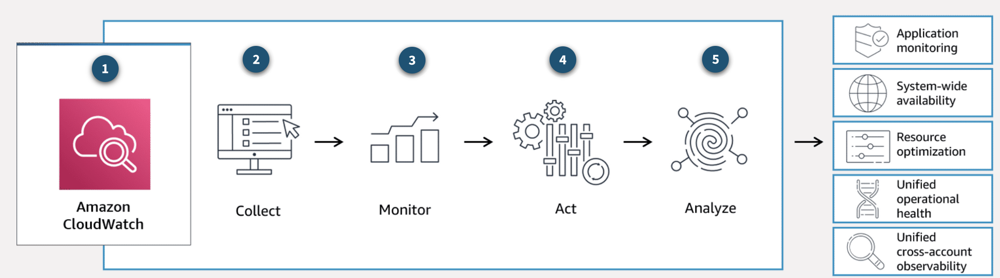
  * **1. Amazon CloudWatch:**
      * **Complete visibility into your cloud resources and applications**
  * **2. Collect:**
      * Collect **metrics** and **logs** from your **resources**, **applications**, and **services** that **run on AWS** 
        or **on-premises servers**
  * **3. Monitor:**
      * **Visualize applications and infrastructure** with **dashboards**
      * **Troubleshoot** with **correlated logs and metrics**, and **set alerts**
  * **4. Act:**
      * **Automate responses** to **operational changes** with **CloudWatch events and auto-scaling**
  * The **employee directory application** is built with **various AWS services working together as building blocks**
  * **Monitoring the individual services independently** can be **challenging**
  * Fortunately, CloudWatch acts as a **centralized place** where **metrics are gathered and analyzed**
  * Many AWS services **automatically send metrics to CloudWatch for free** at a rate of **1 data point per metric per 
    5-minute interval**
  * This is called **basic monitoring**, and it gives you **visibility into your systems without any extra cost**
  * For many applications, **basic monitoring is adequate**
  * For **applications** running on **EC2 instances**, you can get **more granularity** by **posting metrics every 
    minute instead of every 5-minutes** using a feature like **detailed monitoring**
  * **Detailed monitoring incurs a fee**
* **CloudWatch Concepts:**
  * **Metrics** are the **fundamental concept in CloudWatch**
  * A **metric** represents a **time-ordered set of data points** that are **published to CloudWatch**
  * Think of a **metric** as a **variable to monitor** and the **data points** as representing the **values of that 
    variable over time**
  * **Every metric data point must be associated with a timestamp**
  * 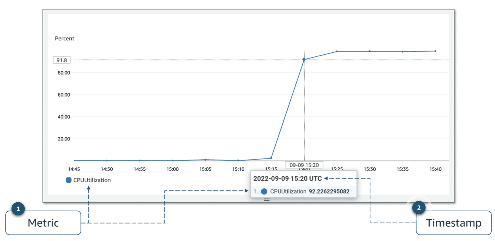
  * **1. Metric:**
    * **Metrics** are **data** about the **performance of your system**
    * For **example**, the **CPU usage** of a **particular EC2 instance** is **one metric provided by Amazon EC2**
  * **2. Timestamp:**
    * **Each metric data point must be associated with a timestamp**
    * If you **do not provide a timestamp**, **CloudWatch creates one for you** based on **the time the data point was 
      received**
  * **AWS services** that **send data to CloudWatch attach dimensions** to **each metric**
  * A **dimension** is a **name and value pair** that is part of the **metric’s identity**
  * You can use dimensions to **filter the results that CloudWatch returns**
  * For example, **many Amazon EC2 metrics publish `InstanceId`** as a **dimension name** and the **actual instance ID** 
    as the **value for that dimension**
  * By **default**, **many AWS services provide metrics** at **no charge** for resources such as **EC2 instances**, 
    **Amazon Elastic Block Store (Amazon EBS) volumes**, and **Amazon RDS database (DB) instances**
  * For a **charge**, you can **activate features** such as **detailed monitoring** or **publishing your own application 
    metrics on resources such as your EC2 instances**
* **Custom Metrics:**
  * Suppose you have an **application**, and you want to **record the number of page views** your website gets
  * How would you **record this metric with CloudWatch?**
  * First, it's an **application-level metric**
  * That means it’s **not something the EC2 instance would post to CloudWatch by default**
  * This is where **custom metrics** come in
  * With custom metrics, you can **publish your own metrics to CloudWatch**
  * If you want to gain **more granular visibility**, you can use **high-resolution custom metrics**, which make it 
    possible for you to collect custom metrics down to a **1-second resolution**
  * This means you can send **1 data point per second per custom metric**
  * Some examples of custom metrics include the following:
    * **Webpage load times**
    * **Request error rates**
    * **Number of processes or threads on your instance**
    * **Amount of work performed by your application**
* **CloudWatch Dashboards:**
  * Once you **provision your AWS resources** and they are **sending metrics to CloudWatch**, you can **visualize and 
    review that data** using **CloudWatch dashboards**
  * Dashboards are **customizable home pages** you can **configure for data visualization** for **one or more metrics** 
    through **widgets**, such as a **graph** or **text**
  * You can build **many custom dashboards**, each one focusing on a **distinct view of your environment**
  * You can even **pull data** from **different AWS Regions** into a **single dashboard** to create a **global view of 
    your architecture**
  * The following screenshot an **example of a dashboard** with **metrics** from **Amazon EC2** and **Amazon EBS**
  * 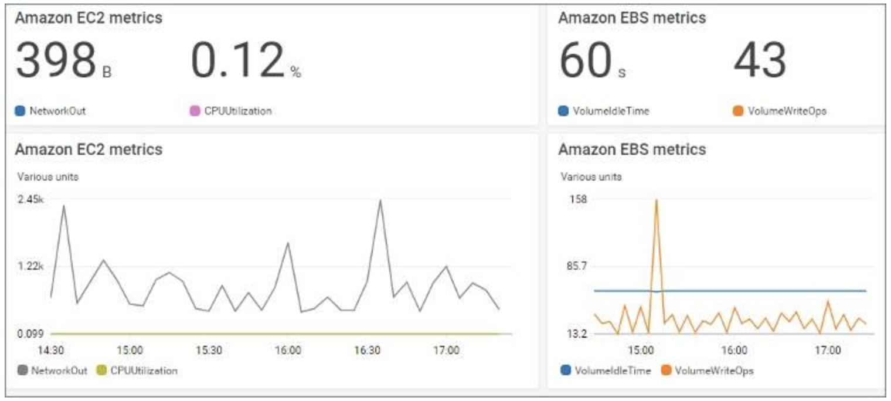
  * CloudWatch **aggregates statistics** according to the **period of time that you specify** when **creating your graph 
    or requesting your metrics**
  * You can also **choose whether your metric widgets displaylive data**
  * **Live data** is data **published within the last minute** that **has not been fully aggregated**
  * You are **not bound to using CloudWatch exclusively** for **all your visualization needs**
  * You can use **external or custom tools** to **ingest and analyze CloudWatch metrics** using the **GetMetricData 
    API**
  * As far as **security** is concerned, with **AWS Identity and Access Management (IAM) policies**, **you control who 
    has access to view or manage your CloudWatch dashboards**
* **Amazon CloudWatch Logs:**
  * **CloudWatch Logs** is a **centralized place** for **logs** to be **stored** and **analyzed**
  * With this service, you can **monitor**, **store**, and **access your log files** from **applications running on EC2 
    instances, AWS Lambda functions, and other sources**
  * With CloudWatch Logs, you can **query and filter your log data**
  * For example, suppose you’re looking into an **application logic error** for your application
  * You know that **when this error occurs**, it will **log the stack trace**
  * Because **you know it logs the error**, you **query your logs in CloudWatch Logs** to **find the stack trace**
  * You also set up **metric filters** on logs, which **turn log data into numerical CloudWatch metrics** that you can 
    **graph and use on your dashboards**
  * **Some services**, like **Lambda**, are **set up to send log data to CloudWatch Logs with minimal effort**
  * With **Lambda**, all you need to do is **give the Lambda function** the **correct IAM permissions to post logs to 
    CloudWatch Logs**
  * **Other services require more configuration**
  * For example, to **send your application logs from an EC2 instance** into CloudWatch Logs, you **need to install and 
    configure** the **CloudWatch Logs agent on the EC2 instance**
  * With the **CloudWatch Logs agent**, **EC2 instances can automatically send log data to CloudWatch Logs**
* **CloudWatch Logs Terminology:**
  * Log data sent to CloudWatch Logs can **come from different sources**, so it’s important you **understand how they’re 
    organized**
  * 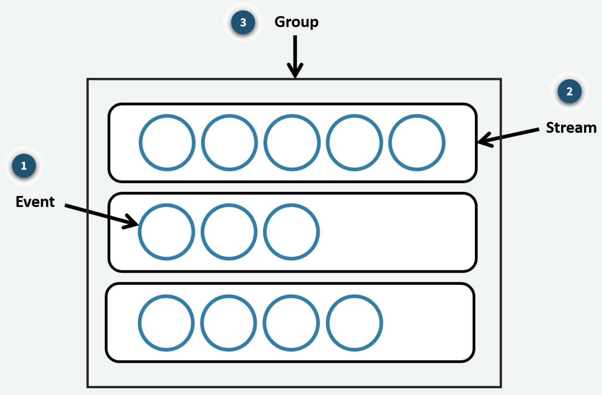
  * **1. Log Event:**
    * A **log event** is a **record of activity recorded by the application or resource being monitored**
    * It has a **timestamp** and an **event message**
  * **2. Log Stream:**
    * **Log events** are **grouped into log streams**, which are **sequences of log events** that **all belong to the 
      same resource being monitored**
    * For example, **logs for an EC2 instance** are **grouped together into a log stream** that you can **filter or 
      query for insights**
  * **3. Log Group:**
    * A **log group** is composed of **log streams** that **all share the same retention and permissions settings**
    * For example, suppose you have **multiple EC2 instances hosting your application**, and **you send application log 
      data to CloudWatch Logs**
    * You can **group the log streams** from **each instance** into **one log group**
* **CloudWatch Alarms:**
  * You can create **CloudWatch alarms** to **automatically initiate actions** based on **sustained state changes of 
    your metrics**
  * You **configure when alarms are invoked** and the **action that is performed**
  * First, you must decide **which metric you want to set up an alarm for**, and then you **define the threshold that 
    will invoke the alarm**
  * Next, you **define the threshold's time period**
  * For example, suppose you want to **set up an alarm for an EC2 instance** to invoke when the **CPU utilization goes 
    over a threshold of 80 percent**
  * You also must **specify the time period** the **CPU utilization is over the threshold**
  * You **don’t want to invoke an alarm based on short, temporary spikes in the CPU**
  * You **only want to invoke an alarm** if the **CPU is elevated** for a **sustained amount of time**
  * For example, if **CPU utilization exceeds 80 percent** for **5 minutes or longer**, there **might be a resource 
    issue**
  * To **set up an alarm** you need to choose the **metric**, **threshold**, and **time period**
  * An **alarm can be invoked** when it **transitions from one state to another**
  * After an alarm is invoked, it can **initiate an action**
  * Actions can be an **Amazon EC2 action**, an **automatic scaling action**, or a **notification sent to Amazon Simple 
    Notification Service (Amazon SNS)**
  * **Possible Alarm States:**
    * **OK**
      * The **metric** is **within the defined threshold**
      * Everything appears to be **operating like normal**
    * **ALARM:**
      * The metric is **outside the defined threshold**
      * This **might be an operational issue**
    * **INSUFFICIENT_DATA:**
      * The **alarm has just started**, the **metric is not available**, or **not enough data is available for the 
        metric to determine the alarm state**
  * **Prevent and Troubleshoot Issues with CloudWatch Alarms:**
    * **CloudWatch Logs** uses **metric filters** to **turn the log data into metrics** that **you can graph or set an 
      alarm on**
    * The following timeline indicates the **order of the steps** to complete when **setting up an alarm**
    * It also provides an **example** using our **employee directory application**
      * **Set up a Metric Filter:**
        * For the **employee directory application**, suppose you set up a **metric filter** for **HTTP 500 error 
          response codes**
      * **Define an Alarm:**
        * Then, you **define which metric alarm state should be invoked based on the threshold**
        * With this example, the **alarm state is invoked if HTTP 500 error responses are sustained for a specified 
          period of time**
      * **Define an Action:**
        * Next, you **define an action** that you want to **take place when the alarm is invoked**
        * Here, it makes sense to **send an email or text alert** to you so **you can start troubleshooting the 
          website**
        * Hopefully, you can **fix it before it becomes a bigger issue**
        * **After the alarm is set up**, you know that **if the error happens again**, you will be **notified promptly**
    * You can set up **different alarms for different reasons** to help you **prevent or troubleshoot operational 
      issues**
    * In the scenario just described, the **alarm invokes an Amazon SNS notification** that **goes to a person who looks 
      into the issue manually**
    * Another option is to **have alarms invoke actions that automatically remediate technical issues**
    * For example, you can **set up an alarm** to **invoke an EC2 instance** to **reboot or scale services up or down**
    * You can even **set up an alarm** to **invoke an Amazon SNS notification** that **invokes a Lambda function**
    * The **Lambda function** then **calls any AWS API** to **manage your resources and troubleshoot operational 
      issues**
    * By **using AWS services together** like this, you can **respond to events more quickly**

### Solution Optimization:
* **Availability:**
  * The **availability of a system** is **typically expressed** as a **percentage of uptime** in a **given year** or as 
    a **number of nines**
  * In the following table is a list of **availability percentages based on the downtime per year** and its **notation 
    in nines**:
  * 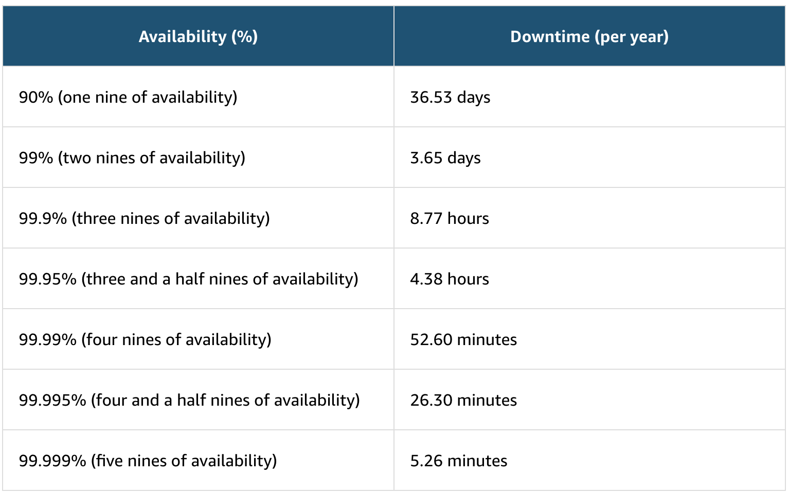
  * To **increase availability**, you **need redundancy**
  * This typically means **more infrastructure**, **more data centers**, **more servers**, **more databases**, and 
    **more replication of data**
  * You can imagine that **adding more of this infrastructure** means a **higher cost**
  * **Customers** want the application to **always be available**, but you **need to draw a line** where **adding 
    redundancy is no longer viable in terms of revenue**
* **Why Improve Application Availability?**
  * In the **current application**, **one EC2 instance hosts the application**
  * The **photos are served from Amazon S3**, and the **structured data is stored in Amazon DynamoDB**
  * That **single EC2 instance** is a **single point of failure for the application**
  * Even if the **database** and **Amazon S3** are **highly available**, customers have **no way to connect** if the 
    **single instance becomes unavailable**
  * One way to solve this **single point of failure issue** is to **add one more server** in a **second Availability 
    Zone**
  * **Adding a Second Availability Zone:**
    * The **physical location of a server is important**
    * In addition to **potential software issues** at the **operating system (OS) or application level**, you must also 
      consider **hardware issues**
    * They might be in the **physical server**, the **rack**, the **data center**, or even the **Availability Zone 
      hosting the virtual machine**
    * To **remedy the physical location issue**, you can **deploy a second EC2 instance** in a **second Availability 
      Zone**
    * This **second instance might also solve issues with the OS and the application**
    * 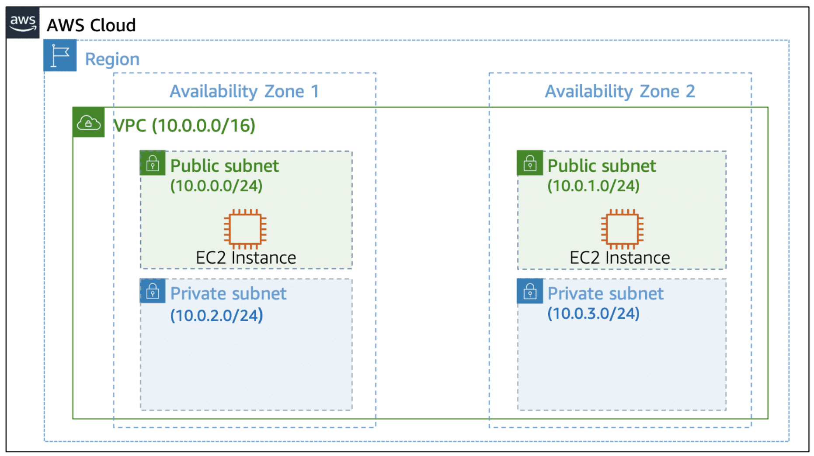
    * However, when there is **more than one instance**, it **brings new challenges**, such as the following:
      * **Replication Process:**
        * The first challenge with **multiple EC2 instances** is that **you need to create a process to replicate 
          the configuration files, software patches, and application across instances**
        * The best method is to **automate where you can**
      * **Customer Redirection:**
        * The second challenge is **how to notify the clients** (the **computers sending requests to your server**) 
          about the **different servers**
        * You can use **various tools** here
        * The **most common** is using a **Domain Name System (DNS)** where the **client uses one record that points to 
          the IP address of all available servers**
        * However, **this method isn't always used** because of **propagation**, or the **time frame it takes for DNS 
          changes to be updated across the Internet**
        * Another option is to use a **load balancer**, which **takes care of health checks** and **distributing the 
          load across each server**
        * **Situated between the client and the server**, a **load balancer avoids propagation time issues**
        * You will learn **more about load balancers** in the **next section**
      * **Types of High Availability:**
        * The last challenge to address when there is more than one server is the **type of availability you need**: 
          **active-passive** or **active-active**
    * **Active-Passive Systems:**
      * With an **active-passive system**, **only one of the two instances is available at a time**
      * One **advantage of this method** is that for **stateful applications** (where **data about the client’s 
        session** is **stored on the server**), there **won’t be any issues**
      * This is because the **customers are always sent to the server where their session is stored**
    * **Active-Active Systems:**
      * A **disadvantage** of an **active-passive system** is **scalability**
      * This is **where an active-active system shines**
      * With **both servers available**, the **second server can take some load for the application**, and the **entire 
        system can take more load**
      * However, **if the application is stateful**, there would be an issue if the **customer’s session isn’t available 
        on both servers**
      * **Stateless applications** work better for **active-active systems**

### Traffic Routing with Elastic Load Balancing:
* **Load Balancers:**
  * **Load balancing** refers to the process of **distributing tasks across a set of resources**
  * In the case of the **Employee Directory application**, the **resources are EC2 instances that host the 
    application**, and the **tasks are the requests being sent**
  * You can use a load balancer to **distribute the requests across all the servers hosting the application**
  * To do this, the load balancer needs to **take all the traffic and redirect it to the backend servers based on an 
    algorithm**
  * The **most popular algorithm** is **round-robin**, which **sends the traffic to each server one after the other**
  * A **typical request for an application starts from a client's browser**
  * The **request is sent to a load balancer**
  * **Then, it’s sent to one of the EC2 instances that hosts the application**
  * The **return traffic goes back through the load balancer** and **back to the client's browser**
  * Although it is possible to **install your own software load balancing solution on EC2 instances**, **AWS provides 
    the ELB service for you**
  * 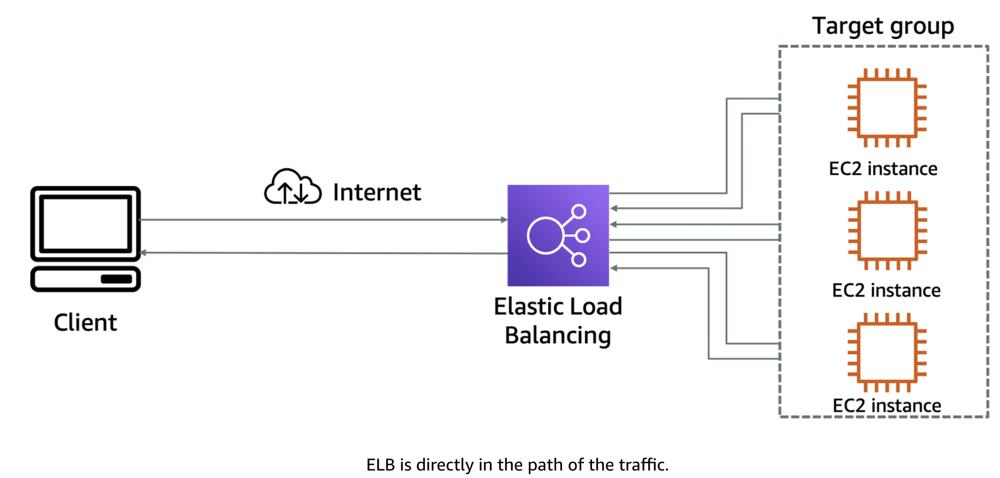
* **ELB Features:**
  * The **ELB service** provides a **major advantage over using your own solution** to do load balancing
  * Mainly, you **don’t need to manage or operate ELB**
  * It can **distribute incoming application traffic across EC2 instances**, **containers**, **IP addresses**, and 
    **Lambda functions**
  * Other **key features** include the following:
    * **Hybrid Mode:**
      * Because ELB can **load balance to IP addresses**, it can work in a **hybrid mode**, which means it **also load 
        balances to on-premises servers**
    * **High Availability:**
      * ELB is **highly available**
      * The only option you **must ensure** is that the **load balancer's targets** are **deployed across multiple 
        Availability Zones**
    * **Scalability:**
      * In terms of scalability, ELB **automatically scales** to **meet the demand of the incoming traffic**
      * It **handles the incoming traffic** and **sends it to your backend application**
* **Health Checks:**
  * **Monitoring** is an **important part of load balancers** because they **should route traffic to only healthy EC2 
    instances**
  * That’s why ELB supports **two types of health checks** as follows:
    * **Establishing a connection to a backend EC2 instance using TCP** and **marking the instance as available if the 
      connection is successful**
    * **Making an HTTP or HTTPS request to a webpage that you specify** and **validating that an HTTP response code is 
      returned**
  * Taking time to **define an appropriate health check** is **critical**
  * **Only verifying that the port of an application is open doesn’t mean that the application is working**
  * It also **doesn’t mean that making a call to the home page of an application is the right way either**
  * For example, the **Employee Directory application depends** on a **database** and **Amazon S3**
  * The **health check should validate all the elements**
  * One way to do that is to create a **monitoring webpage**, such as **`/monitor`**
  * It will **make a call to the database** to **ensure** that it can **connect**, **get data**, and **make a call to 
    Amazon S3**
  * Then, you **point the health check on the load balancer to the `/monitor` page**
  * 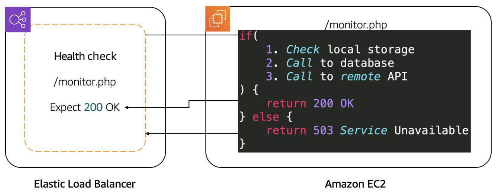
  * After **determining the availability** of a **new EC2 instance**, the **load balancer starts sending traffic to it**
  * If ELB determines that an **EC2 instance** is **no longer working**, it **stops sending traffic to it** and 
    **informs Amazon EC2 Auto Scaling**
  * It is the **responsibility of Amazon EC2 Auto Scaling** to **remove that instance from the group and replace it with 
    a new EC2 instance**
  * **Traffic is only sent** to the new instance if it **passes the health check**
  * If **Amazon EC2 Auto Scaling** has a **scaling policy** that **calls for a scale down action**, it **informs ELB 
    that the EC2 instance will be terminated**
  * **ELB can prevent Amazon EC2 Auto Scaling from terminating an EC2 instance until all connections to the instance 
    end**
  * It **also prevents any new connections**
  * This feature is called **connection draining**
  * We will learn **more about Amazon EC2 Auto Scaling** in the **next lesson**
* **ELB Components:**
  * The ELB service is made up of **three main components**: **rules**, **listeners**, and **target groups**
  * 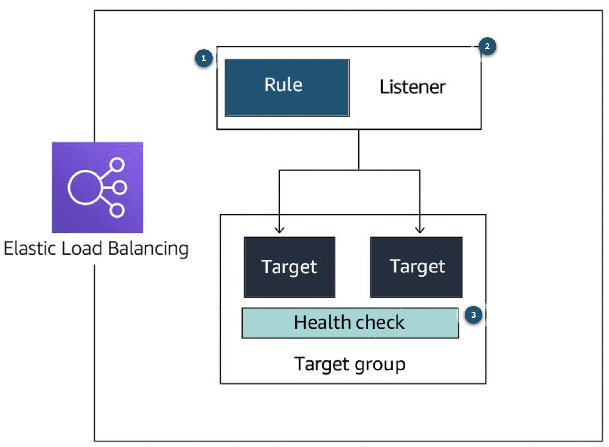
  * **1. Rule:**
    * To **associate a target group to a listener**, you **must use a rule**
    * Rules are made up of **two conditions**:
      * The first condition is the **source IP address of the client**
      * The second condition **decides which target group to send the traffic to**
  * **2. Listener:**
    * The **client connects to the listener**
    * This is **often called client side**
    * To **define a listener**, a **port must be provided in addition to the protocol**, depending on the **load 
      balancer type**
    * There can be **many listeners** for a **single load balancer**
  * **3. Target Group:**
    * The **backend servers**, or **server side**, are **defined in one or more target groups**
    * This is where you **define the type of backend you want to direct traffic to**, such as **EC2 instances**, 
      **Lambda** **functions**, or **IP addresses**
    * Also, a **health check must be defined** for **each target group**
* **Types of Load Balancers:**
  * We will cover three types of load balancers: **Application Load Balancer (ALB)**, **Network Load Balancer (NLB)**, 
    and **Gateway Load Balancer (GLB)**
    * **Application Load Balancer:**
      * **User authorization**
      * **Rich metrics** and **logging**
      * **Redirects**
      * **Fixed response**
    * **Network Load Balancer:**
      * **TCP** and **User Datagram Protocol (UDP) connection based**
      * **Source IP preservation**
      * **Low latency**
    * **Gateway Load Balancer:**
      * **Health checks**
      * **Gateway Load Balancer Endpoints**
      * **Higher availability** for **third-party virtual appliances**
  * **Application Load Balancer:**
    * For our **Employee Directory application**, we are using an **Application Load Balancer**
    * An Application Load Balancer **functions at Layer 7** of the **Open Systems Interconnection (OSI) model**
    * It is **ideal for load balancing HTTP and HTTPS traffic**
    * **After the load balancer receives a request**, it **evaluates the listener rules in priority order** to determine 
      **which rule to apply**
    * It then **routes traffic to targets based on the request content**
    * Some **primary features** of an Application Load Balancer:
      * **Routes Traffic Based on Request Data:**
        * An Application Load Balancer **makes routing decisions based on the HTTP and HTTPS protocol**
        * For **example**, the ALB could use the **URL path (`/upload`) and host**, **HTTP headers and method**, or the 
          **source IP address of the client**
        * This **facilitates granular routing to target groups**
      * **Sends Responses Directly to the Client:**
        * An Application Load Balancer **can reply directly to the client** with a **fixed response**, such as a 
          **custom HTML page**
        * It can also **send a redirect to the client**
        * This is **useful** when you **must redirect to a specific website** or **redirect a request from HTTP to 
          HTTPS**
        * It **removes that work from your backend servers**
      * **Uses TLS Offloading:**
        * An Application Load Balancer **understands HTTPS traffic**
        * To **pass HTTPS traffic through an Application Load Balancer**, an **SSL certificate** is provided in **one of 
          the following ways**:
          * **Importing a certificate** by way of **IAM or ACM services**
          * **Creating a certificate for free using ACM**
          * This **ensures** that the **traffic between the client and Application Load Balancer is encrypted**
      * **Authenticates Users:**
        * An Application Load Balancer **can authenticate users before they can pass through the load balancer**
        * The Application Load Balancer uses the **OpenID Connect (OIDC) protocol** and **integrates with other AWS 
          services** \to **support protocols**, such as the following:
          * **SAML**
          * **Lightweight Directory Access Protocol (LDAP)**
          * **Microsoft Active Directory**
          * Others
      * **Secures Traffic:**
        * To **prevent traffic from reaching the load balancer**, you **configure a security group** to **specify the 
          supported IP address ranges**
      * **Supports Sticky Sessions:**
        * If **requests must be sent** to the **same backend server because the application is stateful**, use the 
          **sticky session feature**
        * This feature uses an **HTTP cookie** to **remember which server to send the traffic to across connections**
  * **Network Load Balancer:**
    * A **Network Load Balancer** is **ideal** for **load balancing TCP and UDP traffic**
    * It functions at **Layer 4** of the **OSI model**, **routing connections from a target in the target group** based 
      on **IP protocol data**
    * **Some Primary Features of Network Load Balancers:**
      * **Sticky Sessions:**
        * **Routes requests from the same client to the same target**
      * **Low Latency:**
        * Offers **low latency** for **latency-sensitive applications**
      * **Source IP Address:**
        * **Preserves the client-side source IP address**
      * **Static IP Support:**
        * **Automatically provides** a **static IP address per Availability Zone (subnet)**
      * **Elastic IP Address Support:**
        * **Lets users assign a custom, fixed IP address per Availability Zone (subnet)**
      * **DNS Fail-Over:**
        * Uses **Amazon Route 53** to **direct traffic to load balancer nodes in other zones**
  * **Gateway Load Balancer:**
    * A **Gateway Load Balancer** helps you to **deploy**, **scale**, and **manage** your **third-party appliances**, 
      such as **firewalls**, **intrusion detection and prevention systems**, and **deep packet inspection systems**
    * It **provides a gateway** for **distributing traffic across multiple virtual appliances** while **scaling them up 
      and down based on demand**
    * **Some Primary Features of Gateway Load Balancers:**
      * **High Availability:**
        * Ensures **high availability** and **reliability** by **routing traffic through healthy virtual appliances**
      * **Monitoring:**
        * Can be **monitored using CloudWatch metrics**
      * **Streamlined Deployments:**
        * Can **deploy a new virtual appliance** by **selecting it in the AWS Marketplace**
      * **Private Connectivity:**
        * **Connects internet gateways**, **virtual private clouds (VPCs)**, and **other network resources over a 
          private network**
* **Selecting Between ELB Types:**
  * You can select between the ELB service types by **determining which feature** is **required for your application**
  * The **following table** presents a list of some of the **major features** of load balancers
  * 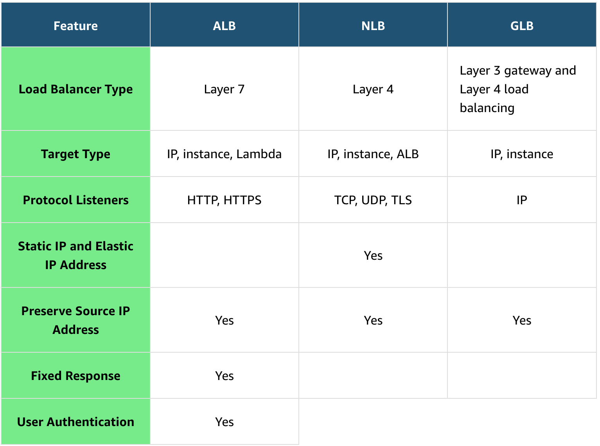
  * For a complete list, see "[Elastic Load Balancing features](https://aws.amazon.com/elasticloadbalancing/features/#Product_comparisons)"

### Amazon EC2 Auto Scaling:
* **Capacity Issues:**
  * You can **improve availability and reachability** by **adding one more server**
  * However, the **entire system can again become unavailable** if there is a **capacity issue**
  * This section looks at **load issues** for both **active-passive systems** and **active-active systems**
  * These issues are **addressed through scaling**
* **Vertical Scaling:**
  * **Increase the instance size**
  * If **too many requests** are sent to a **single active-passive system**, the **active server will become 
    unavailable** and, **hopefully, fail over to the passive server**
  * But this **doesn’t solve anything**
  * With **active-passive systems**, you **need vertical scaling**
  * This means **increasing the size of the server**
  * With **EC2 instances**, you **select either a larger type** or a **different instance type**
  * This can be done **only while the instance is in a stopped state**
  * In this scenario, the following steps occur:
    * **Stop the passive instance**
      * This **doesn’t impact the application** because it’s **not taking any traffic**
    * **Change the instance size or type**, and then **start the instance again**
    * **Shift the traffic to the passive instance**, turning it **active**
    * **Stop, change the size, and start the previous active instance** because **both instances should match**
  * When the **number of requests reduces**, you **must do the same operation**
  * Even though there aren’t that many steps involved, it’s actually **a lot of manual work**
  * Another **disadvantage** is that a **server can only scale vertically up to a certain limit**
  * When that **limit is reached**, the only option is to **create another active-passive system** and **split the 
    requests and functionalities across them**
  * This can require **massive application rewriting**
  * This is where the **active-active system can help**
  * When there are **too many requests**, you can **scale this system horizontally** by **adding more servers**
* **Horizontal Scaling:**
  * **Add additional instances**
  * As mentioned, for the application to work in an **active-active system**, it’s **already created as stateless**, 
    **not storing any client sessions on the server**
  * This means that **having two or four servers wouldn’t require any application changes**
  * It would only be a matter of **creating more instances when required** and **shutting them down when traffic 
    decreases**
  * The **Amazon EC2 Auto Scaling service** can take care of that task by **automatically creating and removing EC2 
    instances based on metrics from Amazon CloudWatch**
  * You can see that there are **many more advantages to using an active-active system in comparison with an 
    active-passive system**
  * **Modifying your application to become stateless provides scalability**
* **Traditional Scaling Compared to Auto Scaling:**
  * With a **traditional approach to scaling**, you **buy and provision enough servers** to **handle traffic at its 
    peak**
  * However, this means at **nighttime**, **for example**, you **might have more capacity than traffic**, which means 
    you’re **wasting money**
  * **Turning off your servers at night** or at **times when the traffic is lower only saves on electricity**
  * The **cloud works differently** with a **pay-as-you-go model**
  * You **must turn off the unused services**, **especially EC2 instances you pay for on-demand**
  * You can **manually add and remove servers** at a **predicted time**
  * But with **unusual spikes in traffic**, this solution leads to a **waste of resources** with **over-provisioning** 
    or a **loss of customers because of under-provisioning**
  * The need here is for a **tool** that **automatically adds and removes EC2 instances according to conditions you 
    define**
  * That’s **exactly what the Amazon EC2 Auto Scaling service does**
* **Amazon EC2 Auto Scaling Features:**
  * The **Amazon EC2 Auto Scaling service adds and removes capacity** to keep a **steady and predictable performance** 
    at the **lowest possible cost**
  * By **adjusting the capacity** to **exactly what your application uses**, you **only pay for what your application 
    needs**
  * This means Amazon EC2 Auto Scaling **helps scale your infrastructure** and **ensure high availability**
  * **Automatic Scaling:**
    * **Automatically scales in and out based on demand**
  * **Scheduled Scaling:**
    * Scales based on **user-defined schedules**
  * **Fleet Management:**
    * **Automatically replaces unhealthy EC2 instances**
  * **Predictive Scaling:**
    * Uses **machine learning (ML)** to help **schedule** the **optimum number of EC2 instances**
  * **Purchase Options:**
    * Includes **multiple purchase models**, **instance types**, and **Availability Zones**
  * **Amazon EC2 Availability:**
    * **Comes with the Amazon EC2 service**
* **ELB with Amazon EC2 Auto Scaling:**
  * Additionally, the **ELB service integrates seamlessly with Amazon EC2 Auto Scaling**
  * **As soon as a new EC2 instance is added to or removed** from the **Amazon EC2 Auto Scaling group**, **ELB is 
    notified**
  * However, **before ELB can send traffic to a new EC2 instance**, it **needs to validate that the application running 
    on the EC2 instance is available**
  * This validation is done by way of the **ELB health checks feature** you learned about in the previous lesson
* **Configure Amazon EC2 Auto Scaling Components:**
  * There are **three main components** of **Amazon EC2 Auto Scaling**
  * Each of these components **addresses one main question** as follows:
    * **Launch Template or Configuration**:
      * **Which resources should be automatically scaled?**
    * **Amazon EC2 Auto Scaling Groups:**
      * **Where should the resources be deployed?**
    * **Scaling Policies:**
      * **When should the resources be added or removed?**
  * **Launch Templates and Configurations:**
    * **Multiple parameters are required** to **create EC2 instances** including **Amazon Machine Image (AMI) ID**, 
      **instance type**, **security group**, **additional Amazon EBS volumes**, and more
    * All this information is **also required by Amazon EC2 Auto Scaling** to **create the EC2 instance on your behalf** 
      when there is a **need to scale**
    * This **information** is **stored in a launch template**
    * You can use a launch template to **manually launch an EC2 instance** or for use with **Amazon EC2 Auto Scaling**
    * It **also supports versioning**, which can be used for **quickly rolling back** if there's an **issue** or a 
      **need to specify a default version of the template**
    * This way, while **iterating on a new version**, **other users can continue launching EC2 instances** using the 
      **default version** until you make the **necessary changes**
    * 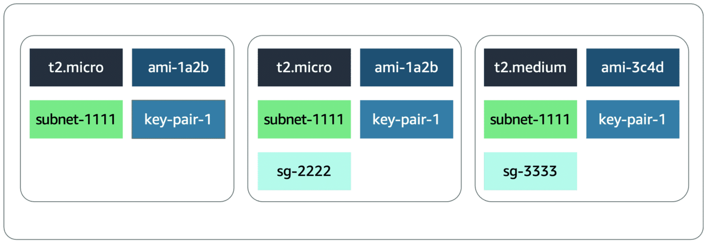
    * A launch template **specifies instance configuration information**, such as the **ID of the AMI**, **instance 
      type**, and **security groups**
    * You can have **multiple versions of a launch template** with a **subset of the full parameters**
    * You can **create a launch template** in **one of three ways** as follows:
      * Use an **existing EC2 instance**
        * **All the settings** are **already defined**
      * Create one from an **already existing template** or a **previous version** of a launch template
      * Create a template **from scratch**
        * These **parameters** will **need to be defined**: **AMI ID**, **instance type**, **key pair**, **security 
          group**, **storage**, and **resource tags**
    * **Another way** to **define what Amazon EC2 Auto Scaling needs to scale** is by using a **launch configuration**
    * It’s **similar to the launch template**, but you **cannot use a previously created launch configuration as a 
      template**
    * You also **cannot create a template from an already existing EC2 instance**
    * For these reasons, and to ensure that you get the **latest features** from Amazon EC2, **AWS recommends you use a 
      launch template instead of a launch configuration**
  * **Amazon EC2 Auto Scaling Groups:**
    * The **next component Amazon EC2 Auto Scaling needs** is an **Amazon EC2 Auto Scaling group**
    * An Auto Scaling group **helps you define where** Amazon EC2 Auto Scaling **deploys your resources**
    * This is where you **specify** the **Amazon Virtual Private Cloud (Amazon VPC)** and **subnets** the **EC2 instance 
      should be launched in**
    * Amazon EC2 Auto Scaling **takes care of creating the EC2 instances across the subnets**, so **select at least two 
      subnets** that are **across different Availability Zones**
    * With **Auto Scaling groups**, you can **specify the type of purchase for the EC2 instances**
    * You can use **On-Demand Instances** or **Spot Instances**
    * You can also use a **combination of the two**, which means you can **take advantage of Spot Instances** with 
      **minimal administrative overhead**
    * To **specify how many instances** Amazon EC2 Auto Scaling **should launch**, you have **three capacity settings** 
      to **configure for the group size**
    * 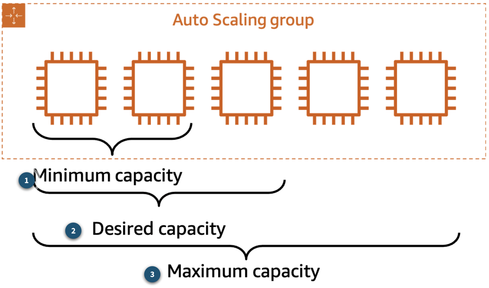
    * **1. Minimum Capacity:**
      * This is the **minimum number of instances running** in your **Auto Scaling group**, **even if the threshold for 
        lowering the number of instances is reached**
      * When Amazon EC2 Auto Scaling **removes EC2 instances** because the **traffic is minimal**, it **keeps removing 
        EC2 instances until it reaches a minimum capacity**
      * **When reaching that limit**, **even if Amazon EC2 Auto Scaling is instructed to remove an instance**, it **does 
        not**
        * This **ensures that the minimum is kept**
      * **Note:** Depending on your application, using a **minimum of two** is **recommended** to **ensure high 
        availability**
        * However, **you ultimately know how many EC2 instances** at a **bare minimum your application requires** at 
          **all times**
    * **2. Desired Capacity:**
      * The **desired capacity** is the **number of EC2 instances** that Amazon EC2 Auto Scaling creates **at the time 
        the group is created**
      * This number **can only be within or equal to the minimum or maximum**
      * If that **number decreases**, Amazon EC2 Auto Scaling **removes the oldest instance by default**
      * If that **number increases**, Amazon EC2 Auto Scaling **creates new instances using the launch template**
    * **3. Maximum Capacity:**
      * This is the **maximum number of instances** running in your Auto Scaling group, **even if the threshold for 
        adding new instances is reached**
      * **When traffic keeps growing**, Amazon EC2 auto Scaling **keeps adding EC2 instances**
        This means the **cost for your application will also keep growing**
      * That's why you **must set a maximum amount** to **ensure it doesn’t go above your budget**
  * **Scaling Policies:**
    * By **default**, an **Auto Scaling group will be kept** to its **initial desired capacity**
    * While it’s **possible** to **manually change the desired capacity**, you can also use **scaling policies**
    * In the **Monitoring lesson**, you learned about **CloudWatch metrics and alarms**
    * You use **metrics** to **keep information** about **different attributes of your EC2 instance**, such as the **CPU 
      percentage**
    * You use **alarms** to **specify an action when a threshold is reached**
    * **Metrics and alarms** are **what scaling policies use to know when to act**
    * For **example**, you can set up an **alarm** that states when the **CPU utilization is above 70 percent** across 
      the **entire fleet of EC2 instances**
    * It will then **invoke a scaling policy** to **add an EC2 instance**
    * Three types of scaling policies are available: **simple**, **step**, and **target tracking scaling**:
    * **Simple Scaling Policy:**
      * With a **simple scaling policy**, you can do **exactly what’s described in this module**
      * You use a **CloudWatch alarm** and **specify what to do when it is invoked**
      * This can include **adding or removing a number of EC2 instances** or **specifying** a **number of instances** to 
        **set the desired capacity to**
      * You can **specify a percentage of the group instead of using a number of EC2 instances**, which makes the group 
        **grow or shrink more quickly**
      * **After the scaling policy is invoked**, it **enters a cooldown period before taking any other action**
      * This is important because it **takes time for the EC2 instances to start**, and the **CloudWatch alarm might 
        still be invoked while the EC2 instance is booting**
      * For **example**, you might decide to **add an EC2 instanc**e if the **CPU utilization across all instances** is 
        **above 65 percent**
      * You **don’t want to add more instances until that new EC2 instance is accepting traffic**
      * However, **what if the CPU utilization** is now **above 85 percent across the Auto Scaling group?**
      * **Adding one instance might not be the right move**
      * Instead, you **might want to add another step** in your **scaling policy**
      * Unfortunately, a **simple scaling policy can’t help with that**
      * This is where a **step scaling policy** helps
    * **Step Scaling Policy:**
      * **Step scaling policies respond to additional alarms even when a scaling activity or health check replacement is 
        in progress**
      * Similar to the previous example, you **might decide to add two more instances** when **CPU utilization is at 85 
        percent** and **four more instances when it’s at 95 percent**
      * **Deciding when to add and remove instances based on CloudWatch alarms** might **seem like a difficult task**
      * This is **why the third type of scaling policy exists**, **target tracking**
    * **Target Tracking Scaling Policy:**
      * If your **application scales based on average CPU utilization**, **average network utilization (in or out)**, or 
        **request count**, then **this scaling policy type is the one to use**
      * **All you need to provide** is the **target value to track**, and it **automatically creates the required 
        CloudWatch alarms**

