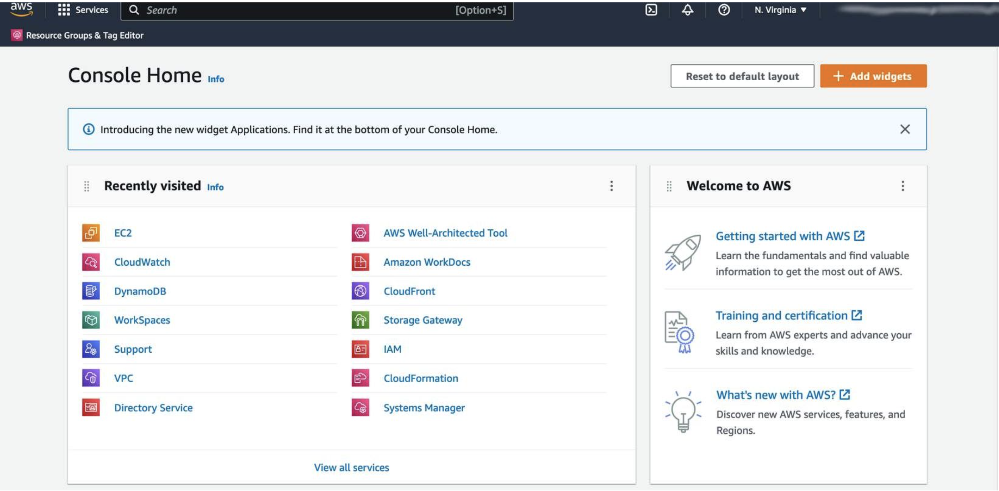
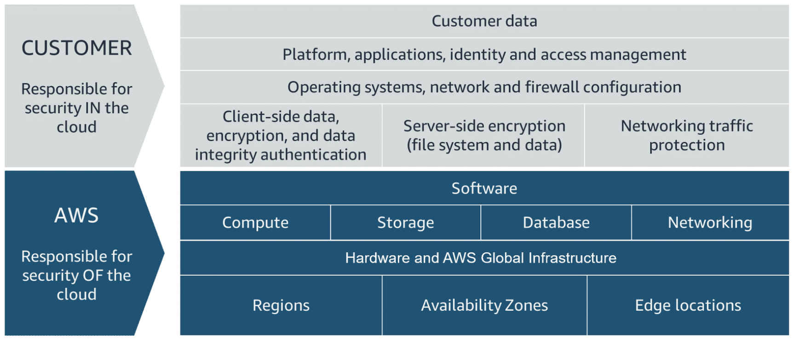
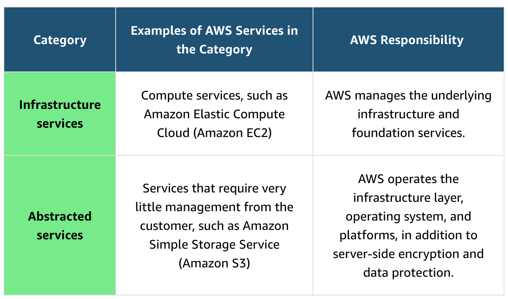
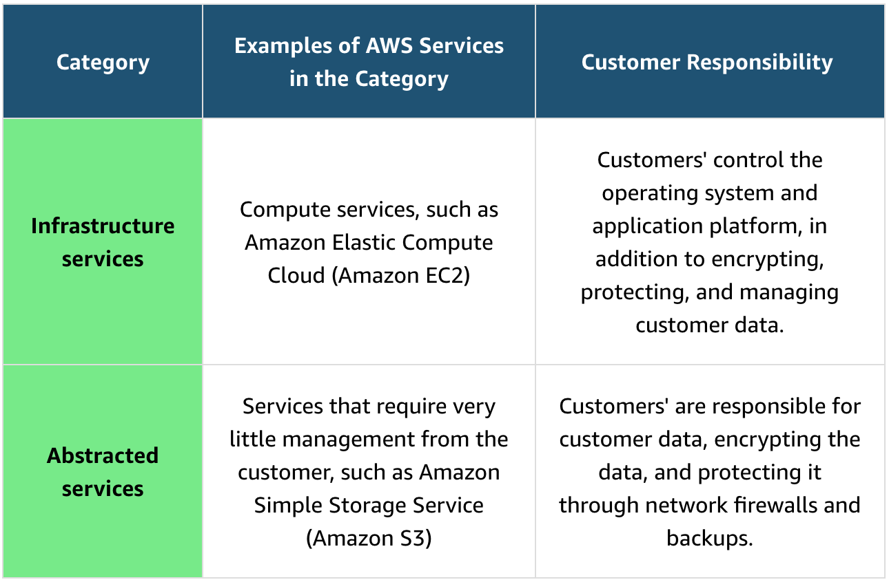
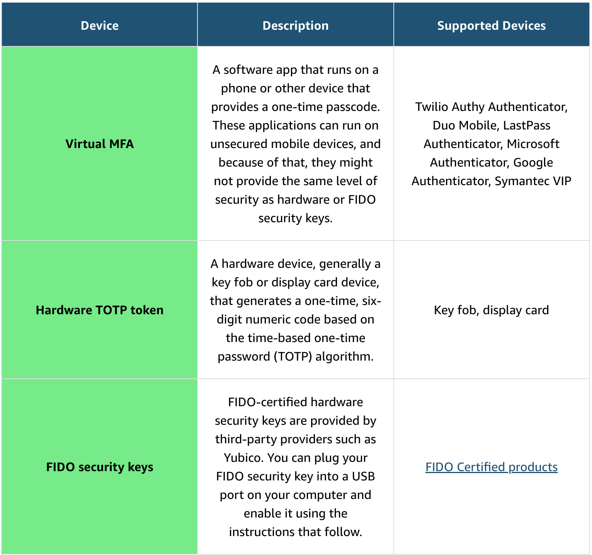

# Module 1: Introduction to AWS:

### Cloud Computing Deployment Models:
* **Cloud computing** provides **developers** and **IT departments** with the ability to **focus on what matters most** 
  by **avoiding work like procurement**, **maintenance**, and **capacity planning**
* As cloud computing has **grown in popularity**, several **deployment strategies** have emerged to help meet **specific 
  needs** of **different users**
* **Each type** of **deployment method** provides you with **different levels of control**, **flexibility**, and 
  **management**
* **Understanding the differences between these deployment strategies** can help you decide **what set of services** is 
  **right for your needs**
* **On-Premises:**
  * **Before the cloud**, **companies** and **organizations hosted and maintained hardware** such as **compute**, 
    **storage**, and **networking equipment** in their **own data centers**
  * They often **allocated entire infrastructure departments** to **take care of their data centers**, which resulted in 
    **costly operations** that made **some workloads and experimentation impossible**
  * As **internet use** became **more widespread**, the **demand for compute, storage, and networking equipment 
    increased**
  * For some companies and organizations, the **cost** of **maintaining a large physical presence** was 
    **unsustainable**
  * To solve this problem, **cloud computing emerged**
* **Cloud:**
  * **Cloud computing** is the **on-demand delivery** of **IT resources over the internet** with **primarily 
    pay-as-you-go pricing**
  * With cloud computing, companies **do not have to manage and maintain** their own **hardware** and **data centers**
  * Instead, companies like **Amazon Web Services (AWS)** **own and maintain data centers** and **provide virtual data 
    center technologies and services** to companies and users over the internet
* **Hybrid:**
  * A third option is a **hybrid deployment**
  * This type of deployment is a way to **connect infrastructure and applications between cloud-based resources** and 
    **existing resources** that are **not located in the cloud**
  * The **most common method** of **hybrid deployment** between the **cloud and existing on-premises infrastructure 
    connects cloud resources** to **internal systems** to **extend** and **grow** an **organization's infrastructure 
    into the cloud**
* **On-Premises vs. Cloud:**
  * To help **differentiate** between **running workloads on-premises** and **in the cloud**, consider a scenario in 
    which **developers must deploy** a **new application feature**
  * **Before they deploy**, the **team** wants to **test the feature** in a **separate quality assurance (QA) 
    environment** that has the **same configurations as production**
  * In an **on-premises solution**, an **additional environment** requires you to **buy and install hardware**, 
    **connect** the **necessary cabling**, **provision power**, **install operating systems**, and **more**
  * These tasks can be **time consuming** and **expensive**
  * Meanwhile, the **new feature’s time-to-market increases** while the **developers wait for the QA environment**
  * In **contrast**, by **running your application in the cloud**, you can **replicate an entire production environment 
    in a matter of minutes or even seconds**
  * Instead of **physically installing hardware** and **connecting cabling**, the **solution** is **managed over the 
    internet**
* **Conclusion:**
  * Using **cloud computing saves time during setup** and **removes redundant** and **unnecessary tasks**
  * If you look at **any application**, you will see that **some of its aspects** are **very important to your 
    business**, like **the code**
  * However, **other aspects** are **no different than any other application** that you might make—for example, the 
    **compute that the code runs on**
  * Some **repetitive common tasks don’t differentiate your business**, like **installing virtual machines** (**VMs**) 
    or **storing backups**
  * By **removing these tasks**, you can **focus** on what is **strategically unique to your business** and **let AWS 
    handle the time-consuming tasks** that **don’t separate you from your competitors**, we refer to this as **removing 
    "undifferentiated heavy lifting"**
  * That's where **AWS** fits into all of this
  * **AWS provides cloud computing services**
  * The **IT resources** mentioned in the **cloud computing definition** are **AWS services**
  * For this course's **corporate directory application**, you will use **AWS services** to **architect** a 
    **scalable**, **highly available**, and **cost-effective infrastructure** to **host the corporate directory 
    application**
  * That way, you can **get the application out into the world quickly**, **without managing heavy-duty physical 
    hardware**
* **Six Advantages of Cloud Computing:**
  * **Pay-as-you-go:**
    * The **cloud computing model** is based on **paying only** for the **resources that you use**
    * This is **in contrast** to **on-premises models** of **investing in data centers and hardware** that might **not 
      be fully used**
  * **Benefit from Massive Economies of Scale:**
    * By **using cloud computing**, you can achieve a **lower cost** than you **can get on your own**
    * Because **usage from hundreds of thousands of customers** is **aggregated in the cloud**, AWS can achieve **higher 
      economies of scale**, which translates into **lower pay-as-you-go prices**
  * **Stop Guessing Capacity:**
    * **Stop guessing** on your **infrastructure capacity needs**
    * When you make a **capacity decision before deploying an application**, you often end up either sitting on 
      **expensive idle resources** or dealing with **limited capacity**
    * With cloud computing, these **problems go away**
    * You can **access as much** or **as little capacity as you need**, and **scale up and down as required** with only 
      a **few minutes notice**
  * **Increase Speed and Agility:**
    * **IT resources** are **only a click away**, which means that you **reduce the time to make resources available to 
      developers** from **weeks to minutes**
    * This results in a **dramatic increase** in **agility for the organization**, because the **cost and time it 
      takes** to **experiment and develop** is **significantly lower**
  * **Realize Cost Savings:**
    * Companies can focus on **projects** that **differentiate their business** and **remove the "undifferentiated heavy 
      lifting"**, instead of **maintaining data centers**
    * With cloud computing, you can **focus on your customers**, rather than **racking**, **stacking**, and **powering 
      physical infrastructure**
  * **Go Global in Minutes:**
    * **Applications** can be **deployed** in **multiple Regions around the world** with **a few clicks**
    * This means that you can provide **lower latency** and a **better experience** for your customers at a **minimal 
      cost**

### AWS Global Infrastructure:
* **Introduction:**
  * **Infrastructure**, like **data centers** and **networking connectivity**, still exists as the **foundation of 
    every cloud application**
  * In AWS, this **physical infrastructure** makes up the **AWS Global Infrastructure**, in the form of **Regions** and 
    **Availability Zones**
* **Regions:**
  * **Regions** are **geographic locations worldwide** where **AWS hosts its data centers**
  * AWS Regions are **named after** the **location where they reside**
  * For example, in the **United States**, the **Region** in **Northern Virginia** is called the **Northern Virginia 
    Region**, and the **Region** in **Oregon** is called the **Oregon Region**
  * AWS has Regions in **Asia Pacific**, **China**, **Europe**, the **Middle East**, **North America**, and **South 
    America**
  * And we **continue to expand** to **meet our customers' needs**
  * Each AWS Region is associated with a **geographical name** and a **Region code**
  * Here are **examples** of **Region codes**:
    * **us-east-1** is the **first Region** created in the **eastern US area**
      * The **geographical name** for this Region is **N. Virginia**
    * **ap-northeast-1** is the first Region created in the northeast Asia Pacific area
      * The **geographical name** for this Region is **Tokyo**
  * Within the **AWS Console**, you can select an **available region** from the **dropdown menu**
* **Choosing the Right AWS Region:**
  * AWS Regions are **independent from one another**
  * **Without explicit customer consent and authorization**, **data is not replicated from one Region to another**
  * When you decide which AWS Region to host your applications and workloads, consider **four main aspects**: 
    **latency**, **price**, **service availability**, and **compliance**
  * **Latency:**
    * If your **application** is **sensitive to latency** (the **delay between a request for data and the response**), 
      **choose a Region** that is **close to your user base**
    * This **helps prevent long wait times** for your customers
    * **Synchronous applications** such as **gaming**, **telephony**, **WebSockets**, and **Internet of Things (IoT)** 
      are **significantly affected by high latency**
    * **Asynchronous workloads**, such as **ecommerce applications**, can also suffer from **user connectivity delays**
  * **Pricing:**
    * Due to the **local economy** and the **physical nature** of **operating data centers**, **prices vary from one 
      Region to another**
    * **Internet connectivity**, **imported equipment costs**, **customs**, **real estate**, and other factors **impact 
      a Region's pricing**
    * Instead of charging a **flat rate worldwide**, **AWS charges** based on the **financial factors specific to each 
      Region**
  * **Service Availability:**
    * **Some services might not be available** in **some Regions**
    * The **AWS documentation** provides a **table** that shows the **services available** in **each Region**
  * **Data Compliance:**
    * **Enterprise companies** often must **comply with regulations** that **require customer data** to be **stored in 
      a specific geographic territory**
    * If applicable, **choose a Region** that **meets your compliance requirements**
* **Availability Zones:**
  * **Inside every Region** is a **cluster of Availability Zones**
  * An **Availability Zone** consists of **one or more data centers** with **redundant power**, **networking**, and 
    **connectivity**
  * These data centers operate in **discrete facilities** in **undisclosed locations**
  * They are **connected** using **redundant high-speed** and **low-latency links**
  * Availability Zones also have **code names**
  * Because they are **located inside Regions**, they can be **addressed** by **appending a letter to the end** of the 
    **Region code name**
  * Here are examples of Availability Zone codes:
    * **us-east-1a** is an **Availability Zone** in **us-east-1** (**N. Virginia Region**)
    * **sa-east-1b** is an **Availability Zone** in **sa-east-1** (**São Paulo Region**)
  * Therefore, if you see that a resource exists in **us-east-1c**, you can **infer** that the **resource is located in 
    Availability Zone c** of the **us-east-1 Region**
* **Scope of AWS Services:**
  * Depending on the **AWS service** that you use, your **resources** are either **deployed at the Availability Zone**, 
    **Region**, or **Global level**
  * **Each service is different**, so you **must understand how the scope of a service might affect your application 
    architecture**
  * When you operate a **Region-scoped service**, you **only need to select** the **Region** that **you want to use**
    * If you are **not asked** to **specify an individual Availability Zone** to **deploy the service in**, this is an 
      **indicator** that the **service operates** on a **Region-scope level**
    * For **Region-scoped services**, **AWS automatically performs actions** to **increase data durability and 
      availability**
  * On the other hand, **some services** ask you to **specify an Availability Zone**
    * With these services, you are **often responsible** for **increasing the data durability** and **high availability 
      of these resources**
* **Maintaining Resiliency:**
  * To **keep your application available**, you **must maintain high availability** and **resiliency**
  * A **well-known best practice** for **cloud architecture** is to use **Region-scoped**, **managed services**
  * These services **come with availability and resiliency built in**
  * When that is **not possible**, make sure your **workload** is **replicated across multiple Availability Zones**
  * At a **minimum**, you should use **two Availability Zones**
  * That way, **if an Availability Zone fails**, your **application** will have **infrastructure up and running** in a 
    **second Availability Zone** to **take over the traffic**
* **Edge Locations:**
  * **Edge locations** are **global locations** where **content is cached**
  * For example, if your **media content is in London** and you want to **share video files with your customers in 
    Sydney**, you could have the **videos cached** in an **edge location closest to Sydney**
    * This would make it possible for your **customers** to **access the cached videos more quickly than accessing them 
      from London**
  * Currently, there are **over 400+ edge locations globally**
  * **Amazon CloudFront delivers your content** through a **worldwide network** of **edge locations**
    * When a **user requests content** that is **being served with CloudFront**, the **request** is **routed to the 
      location that provides the lowest latency** so that **content is delivered** with the **best possible 
      performance**
    * **CloudFront speeds up** the **distribution of your content** by **routing each user request** through the **AWS 
      backbone network** to the **edge location** that can **best serve your content**

### Interacting with AWS:
* **Introduction:**
  * Every action that you make in AWS is an API call that is authenticated and authorized
  * In AWS, you can make API calls to services and resources through the AWS Management Console, AWS Command Line 
    Interface (AWS CLI), or AWS SDKs
* **AWS Management Console:**
  * One way to manage cloud resources is through the **web-based console**, where you **log in** and **choose the 
    desired service**
  * This can be the **easiest way** to **create and manage resources** when you **first begin working with the cloud**
  * The following is a **screenshot** that shows the **landing page** when you **first log in to the console**
  * 
  * In the **upper-left corner**, you can choose **Services** to **view AWS services grouped by categories**, such as 
    **Compute**, **Storage**, **Database**, and **Analytics**
  * In the **upper-right corner** is the **Region selector**
    * If you choose it and **change the Region**, you will **make requests to the services** in the **chosen Region**
  * The **URL changes, too**
  * **Changing the Region setting directs your browser** to **make requests** to a **different AWS Region**, represented 
    by a **different subdomain**
* **AWS CLI:**
  * Consider the scenario where you run many servers on AWS for your application’s frontend
  * You want to run a report to collect data from all the servers
  * You need to do this programmatically every day because the server details might change
  * Instead of manually logging in to the console and then copying and pasting information, you can schedule an AWS 
    CLI script with an API call to pull this data for you
  * The AWS CLI is a unified tool that you can use to manage AWS services
  * You can download and configure one tool that you can use to control multiple AWS services from the command line, 
    and automate them with scripts
  * The AWS CLI is open source, and installers are available for Windows, Linux, and macOS
  * For example, you run the following API call against a service, using the AWS CLI:
    * `aws s3api list-buckets`
  * You will get a response similar to the following one, listing the buckets in your AWS accounts:
```json
{
    "Owner": {
        "DisplayName": "tech-essentials", 
        "ID": "d9881f40b83adh2896eb276f44ffch53677faec805422c83dfk60cc335a7da92"
    }, 
    "Buckets": [
        {
            "CreationDate": "2023-01-10T15:50:20.000Z", 
            "Name": "aws-tech-essentials"
        }, 
        {
            "CreationDate": "2023-01-10T16:04:15.000Z", 
            "Name": "aws-tech-essentials-employee-directory-app"
        } 
    ]
}
```
* **AWS SDKs:**
  * **API calls to AWS** can also be performed by **running code** with **programming languages**
  * You can do this by using **AWS SDKs**
  * SDKs are **open source** and **maintained by AWS** for the **most popular programming languages**, such as **C++**, 
    **Go**, **Java**, **JavaScript**, **.NET**, **Node.js**, **PHP**, **Python**, **Ruby**, **Rust**, and **Swift**
  * Developers **commonly use AWS SDKs** to **integrate their application source code** with **AWS services**
  * For example, consider an **application** with a **frontend** that **runs in Python**
    * Every time the application **receives a photo**, it **uploads the file to a storage service**
    * This action can be achieved **in the source code** by using the **AWS SDK for Python** (**Boto3**)
    * Here is an example of code that you can implement to work with AWS resources using the SDK for Python:
```python
import boto3
ec2 = boto3.client('ec2')
response = ec2.describe_instances()
print(response)
```

### Security and the AWS Shared Responsibility Model:
* When you work with the AWS Cloud, **managing security and compliance** is a **shared responsibility between AWS and 
  you**
* To depict this shared responsibility, AWS created the **shared responsibility model**
* The **distinction of responsibility** is commonly referred to as **security of the cloud** as compared to **security 
  in the cloud**
* 
* **AWS Responsibility:**
  * AWS is responsible for **security of the cloud**
    * This means that **AWS protects and secures** the **infrastructure** that **runs the services offered in the AWS 
      Cloud**
  * AWS is responsible for the following:
    * **Protecting and securing AWS Regions**, **Availability Zones**, and **data centers**, down to the **physical 
      security of the buildings**
    * Managing the **hardware**, **software**, and **networking components** that **run AWS services**, such as the 
      **physical servers**, **host operating systems**, **virtualization layers**, and **AWS networking components**
  * The **level of responsibility** that **AWS has depends on the service**
  * AWS **classifies services** into **two categories**
  * The following table provides information about each, including the AWS responsibility
  * 
* **Customer Responsibility:**
  * **Customers are responsible** for **security in the cloud**
  * When using any AWS service, the **custome is responsibler** for **properly configuring the service and their 
    applications**, in addition to **ensuring that their data is secure**
  * The **customers' level of responsibility depends on the AWS service**
  * **Some services require** the **customer** to perform **all the necessary security configuration** and **management 
    tasks**
  * Other **more abstracted services** require **customers** to **only manage the data** and **control access to their 
    resources**
  * Using the **two categories of AWS services**, customers can determine **their level of responsibility** for **each 
    AWS service** that they use
  * 
* **Conclusion:**
  * Due to the **varying levels of effort**, customers must **consider which AWS services they use** and review the 
    **level of responsibility required** to **secure each service**
  * They must also review how the **AWS shared responsibility model** aligns with the **security standards** in **their 
    IT environment** in addition to **any applicable laws and regulations**
  * A key concept is that **customers maintain complete control of their data** and are **responsible for managing the 
    security** related to **their content**
  * For example, you are responsible for the following
    * **Choosing a Region** for **AWS resources** in accordance with **data sovereignty regulations**
    * Implementing **data-protection mechanisms**, such as **encryption** and **scheduled backups**
    * Using **access control** to **limit who can access your data and AWS resources**

### Protecting the AWS Root User:
* **AWS Root User:**
  * When you **first create an AWS account**, you begin with a **single sign-in identity** that has **complete access** 
    to **all AWS services and resources in the account**
  * This identity is called the **AWS root user** and is accessed by signing in with the **email address** and 
    **password** that were **used to create the account**
* **AWS Root User Credentials:**
  * The AWS root user has **two sets of credentials associated with it**
  * One set of credentials is the **email address** and **password** that were **used to create the account**
    * This allows you to **access the AWS Management Console**
  * The second set of credentials is called **access keys**, which allow you to make **programmatic requests** from the 
    **AWS Command Line Interface (AWS CLI)** or **AWS API**
    * **Access keys** consist of **two parts**:
      * **Access Key ID:** for example, **A2lAl5EXAMPLE**
      * **Secret Access Key:** for example, **wJalrFE/KbEKxE**
    * **Similar** to a **user name and password combination**, you **need both** the **access key ID** and **secret 
      access key** to **authenticate your requests** through the **AWS CLI** or **AWS API**
    * **Access keys should be managed** with the **same security** as an **email address and password**
    * **Delete your access keys to stay safe!**
      * If you **don't have an access key** for your **AWS account root user**, **don't create one unless you absolutely 
        need to**
      * If you **have an access key** for your **AWS account root user** and **want to delete the key**, follow these 
        steps:
        * In the **AWS Management Console**, navigate to your **username** in the **upper right section** of the 
          **navigation bar**
        * From the **dropdown menu**, go to the **"My Security Credentials" page**, and **sign in** with the **root 
          user’s email address and password**
        * Open the **Access keys section**
        * Under **Actions**, choose **Delete**
        * Choose **Yes**
* **AWS Root User Best Practices:**
  * The **root user** has **complete access** to **all AWS services and resources in your account**, **including your 
    billing and personal information**
  * Therefore, you **should securely lock away the credentials associated with the root user** and **not use the root 
    user for everyday tasks**
  * Visit the links at the end of this lesson to learn more about **when to use the AWS root user**
  * To **ensure the safety** of the **root user**, follow these **best practices**:
    * Choose a **strong password** for the root user
    * **Enable multi-factor authentication (MFA)** for the root user
    * **Never share your root user password or access keys with anyone**
    * **Disable or delete** the **access keys associated with the root user**
    * Create an **Identity and Access Management** (**IAM**) user for **administrative tasks** or **everyday tasks**
* **Multi-Factor Authentication:**
  * When you **create an AWS account** and **first log in to the account**, you use **single-factor authentication**
    * **Single-factor authentication** is the **simplest** and **most common form of authentication**
    * It **only requires one authentication method**
    * In this case, you use a **user name and password** to **authenticate as the AWS root user**
    * Other forms of single-factor authentication include a **security pin** or a **security token**
    * However, sometimes a **user’s password** is **easy to guess**
      * For example, your **coworker Bob’s password**, IloveCats222, might be **easy** for someone who **knows Bob 
        personally** to **guess**, because it’s a **combination of information** that is **easy to remember** and 
        **includes certain facts about Bob** (Bob loves cats, and his birthday is February 22)
      * If a bad actor **guessed** or **cracked Bob’s password** through **social engineering**, **bots**, or 
        **scripts**, Bob might **lose control of his account**
      * Unfortunately, this is a **common scenario** that **users of any website often face**
    * This is why using **multi-factor authentication** (**MFA**) is **important** in **preventing unwanted account 
      access**
  * MFA **requires two or more authentication methods** to verify an identity:
    * **Something you know**, such as a **user name** and **password** or **pin number**
    * **Something you have**, such as a **one-time passcode** from a **hardware device** or **mobile app**
    * **Something you are**, such as a **fingerprint** or **face scanning technology**
  * With a **combination** of this information, systems can provide a **layered approach** to **account access**
  * So even if the **first method of authentication**, like Bob’s **password**, is **cracked by a malicious actor**, the 
    **second method of authentication**, such as a **fingerprint**, provides **another level of security**
  * This **extra layer of security** can **help protect** your **most important accounts**, which is why you **should 
    activate MFA** on your **AWS root user**
* **MFA on AWS:**
  * If you **activate MFA** on your **root user**, you **must present a piece of identifying information** from **both 
    the something you know category** and the **something you have category**
    * The **first piece** of **identifying information** the user enters is an **email** and **password combination**
    * The **second piece** of information is a **temporary numeric code** provided by an **MFA device**
  * Using MFA adds an **additional layer of security** because it **requires users** to use a **supported MFA 
    mechanism** in addition to their **regular sign-in credentials**
  * **Activating MFA** on the **AWS root user account** is an **AWS best practice**
* **Supported MFA devices:**
  * **AWS supports** a **variety of MFA mechanisms**, such as **virtual MFA devices**, **hardware time-based one-time 
    password (TOTP) tokens**, and **FIDO security keys**
  * To learn more, take a look at the table below:
  * 
**Resources:**
  * **AWS User Guide:** [Enabling a Hardware TOTP token](https://docs.aws.amazon.com/IAM/latest/UserGuide/id_credentials_mfa_enable_physical.html)
  * **AWS User Guide:** [Enabling a FIDO Security Key](https://docs.aws.amazon.com/IAM/latest/UserGuide/id_credentials_mfa_enable_fido.html)
  * **AWS User Guide:** [Enabling a Virtual Multi-Factor Authentication (MFA) Device](https://docs.aws.amazon.com/IAM/latest/UserGuide/id_credentials_mfa_enable_virtual.html)
  * **AWS Website:** [Multi-Factor Authentication for IAM](https://aws.amazon.com/iam/features/mfa/)
  * **AWS Reference Guide:** [Tasks That Require Root User Credentials](https://docs.aws.amazon.com/accounts/latest/reference/root-user-tasks.html)

### AWS Identity and Access Management:
* **Authentication and Authorization:**
  * When you **configure access** to **any account**, two terms come up frequently: **authentication** and 
    **authorization**
  * Although these terms might seem basic, you must fully understand them to **properly configure access management** on 
    AWS
* **Authentication:**
  * When you **create your AWS account**, you use the **combination** of an **email address** and a **password** to 
    **verify your identity**
    * If a **user** types in the **correct email address and password**, the system assumes the user is **allowed to enter** and 
      **grants them access**
    * This is the process of **authentication**
  * Authentication **ensures** that the **user is who they say they are**
  * **User names** and **passwords** are the **most common types of authentication**
    * But you might also work with other forms, such as **token-based authentication** or **biometric data**, like a 
      **fingerprint**
  * Authentication simply answers the question, **“Are you who you say you are?”**
* **Authorization:**
  * **After you’re authenticated** and **in your AWS account**, you might be curious about **what actions you can take**
    * This is where authorization comes in
  * **Authorization** is the process of **giving users permission** to **access AWS resources and services**
  * Authorization determines **whether a user can perform certain actions**, such as **read**, **edit**, **delete**, or 
    **create resources**
  * Authorization answers the question, “**What actions can you perform?**”
* **What is IAM?**
  * **AWS Identity and Access Management (IAM)** is an **AWS service** that helps you **manage access to your AWS 
    account and resources**
  * It also provides a **centralized view** of **who** and **what are allowed inside your AWS account** 
    (**authentication**), and **who** and **what have permissions** to **use** and **work** with your **AWS resources 
    (authorization)**
  * With IAM, you can **share access to an AWS account and resources without sharing your set of access keys or 
    password**
  * You can also provide **granular access** to **those working in your account**, so **people** and **services only 
    have permissions to the resources that they need**
  * For example, to provide a user of your AWS account with **read-only access** to a **particular AWS service**, you 
    can **granularly select which actions** and **which resources in that service that they can access**
* **IAM Features:**
  * **Global:**
    * IAM is **global** and **not specific to any one region**
    * You can **see** and **use** your **IAM configurations from any region** in the **AWS Management Console**
  * **Integrated with AWS Services:**
    * IAM is **integrated with many AWS services by default**
  * **Shared Access:**
    * You can **grant other identities permission** to **administer and use resources in your AWS account without 
      having to share your password and key**
  * **Multi-Factor Authentication:**
    * IAM **supports MFA**
    * You can **add MFA to your account** and to **individual users** for **extra security**
  * **Identity Federation:**
    * IAM **supports identity federation**, which allows users with **passwords elsewhere**, like your **corporate 
      network** or **internet identity provider**, to get **temporary access to your AWS account**
  * **Free to Use:**
    * **Any AWS customer can use IAM**; the service is offered at **no additional charge**
* **IAM User:**
  * An **IAM user represents** a **person** or **service** that **interacts with AWS**
  * You **define the user** in your **AWS account**
  * **Any activity done by that user** is **billed to your account**
  * When you **create a user**, that user can **sign in to gain access to the AWS resources inside your account**
  * You can also **add more users to your account as needed**
  * For example, for your **cat photo application**, you could **create individual users** in your AWS account that 
    **correspond to the people who are working on your application**
  * **Each person** should have their **own login credentials** to **prevent sharing credentials between users**
* **IAM User Credentials:**
  * An **IAM user** **consists of a name** and a **set of credentials**
  * When you **create a user**, you can provide them with the **following types of access**:
    * Access to the **AWS Management Console**
    * **Programmatic access** to the **AWS CLI** and **AWS API**
  * To **access the console**, provide the user with a **user name** and **password**
  * For **programmatic access**, **AWS generates** a **set of access keys** that **can be used with the AWS CLI and 
    AWS API**
  * I**AM user credentials** are considered **permanent**, which means that they **stay with the user until there’s a 
    forced rotation by admins**
  * When you **create an IAM user**, you **can grant permissions directly** at the **user level**
    * This can **seem like a good idea** if you have **only one or a few users**
    * However, **as the number of users increases**, **keeping up with permissions can become more complicated**
    * For example, if you have **3,000 users** in your AWS account, **administering access** and getting a **top-level 
      view** of **who can perform what actions on which resources can be challenging**
    * Fortunately, **you can group IAM users** and **attach permissions at the group level**
* **IAM Groups:**
  * An **IAM group** is a **collection of users**
  * **All users in the group inherit the permissions assigned to the group**
  * This makes it possible to **give permissions to multiple users at once**
  * It’s a more **convenient** and **scalable** way of **managing permissions** for users in your AWS account
  * This is why **using IAM groups** is a **best practice**
  * If you have an application that you’re trying to build and you have multiple users in one account working on the 
    application, you might organize the users by job function
  * For example, you might organize your IAM groups by developers, security, and admins
  * You could then place all your IAM users into their respective groups
  * This provides a way to see who has what permissions in your organization
  * It also helps you scale when new people join, leave, and change roles in your organization

