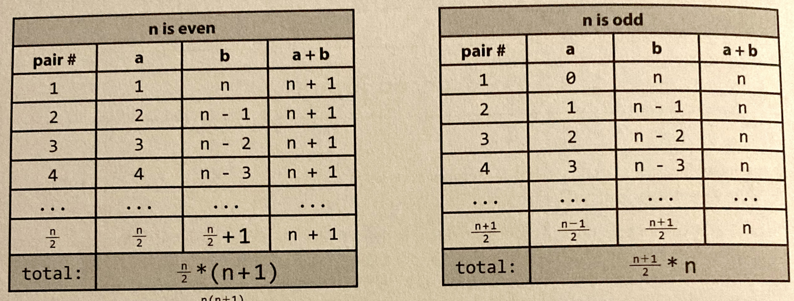

* **Sum of integers 1 through N:**
  * What is `1 + 2 + ... + n`? Let's figure it out by pairing up low values with high values
  * If `n` is even, we pair `1` with `n`, `2` with `n - 1`, and so on
  * We will have `n / 2` pairs each with sum `n + 1`
  * If `n` is odd, we pair 0 with n, 1 with `n - 1`, and so on
  * We will have `n + 1 / 2` pairs with sum `n`
    * 
  * In either case, the sum is `n(n + 1) / 2`
  * This reasoning comes up a lot in nested loops
  * For example, consider the following code:
```
for(int i = 0; i < array.length; i++) {
    for(int j = i + 1; j < array.length; j++) {
        System.out.println(i + j);
    }
}
```
  * On the first iteration of the outer for loop, the inner for loop iterates `n - 1` times 
  * On the second iteration of the other for loop, the inner for loop iterates `n - 2` times 
  * Next, `n - 3`, then `n - 4`, and so on 
  * There are `n(n + 1) / 2` total iterations of the inner loop 
  * Therefore, this code takes `O(n^2) time`
* **References:**
* "[Big_O_Examples_and_Exercises.md](../Big_O/Big_O_Examples.md)")