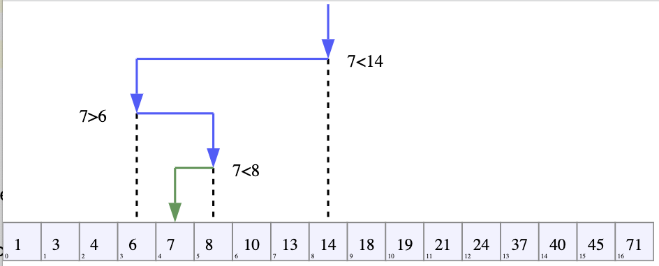

# Binary Search Overview:

### Overview:
* **Binary Search** is a **highly efficient search algorithm** used to **find a specific element** in a **sorted array 
  or list**
* It works by **repeatedly dividing the search interval in half** and **eliminating half of the elements from 
  consideration** until the **desired element is found**, or it's **determined** that the element is **not present in 
  the array**
* Here's a step-by-step description of the Binary Search algorithm:
  * **Step 1:** **Start** with the **entire sorted array**
  * **Step 2:** **Compare** the **target value** to the **middle element** of the array
  * **Step 3:** If the **middle element is equal to the target value**, the **search is successful**, and the **index 
    of the element is returned**
  * **Step 4:** If the **middle element is greater than the target value**, **discard the right half of the array 
    (including the middle element)** and **repeat the search** in the **left half**
  * **Step 5:** If the **middle element** is **less than the target value**, **discard the left half of the array 
    (including the middle element)** and **repeat the search** in the **right half**
  * **Step 6:** **Repeat steps 2 to 5** until the **target value is found** or the **search interval becomes empty**
* Binary Search is a **divide-and-conquer algorithm** that **reduces the search space by half** with each **comparison**
* This makes it **significantly faster than linear search algorithms**, which **check elements one by one**
* Binary Search is **especially useful** when dealing with **large sorted datasets**
* The **time complexity** of Binary Search is **O(log n)**, where "**n**" is the **number of elements** in the array
* This implies that it has a **logarithmic time complexity**, making it **efficient** even for **very large datasets**
* 

### Java Implementation:
```java
public class BinarySearch {
    public static int binarySearch(int[] arr, int target) {
        int left = 0;
        int right = arr.length - 1;

        while (left <= right) {
            int mid = left + (right - left) / 2;

            if (arr[mid] == target) {
                return mid; // Element found
            } else if (arr[mid] < target) {
                left = mid + 1; // Search the right half
            } else {
                right = mid - 1; // Search the left half
            }
        }

        return -1; // Element not found
    }

    public static void main(String[] args) {
        int[] sortedArray = {1, 3, 5, 7, 9, 11, 13, 15};
        int target = 7;

        int result = binarySearch(sortedArray, target);

        if (result != -1) {
            System.out.println("Element " + target + " found at index " + result);
        } else {
            System.out.println("Element " + target + " not found in the array.");
        }
    }
}
```
* In this Java code, the `binarySearch` method takes a **sorted array** `arr` and a **target value** `target` as 
  parameters
* It then performs the binary search to **find the index of the target value in the array**
* **If the element is found**, it **returns the index**; **otherwise**, it **returns -1** to indicate that the **element 
  is not in the array**
* The binary search algorithm works by **repeatedly dividing the search range in half** until it either **finds the target 
  element** or determines that the element is **not in the array**
* It takes advantage of the **sorted nature** of the array to **efficiently narrow down** the search space