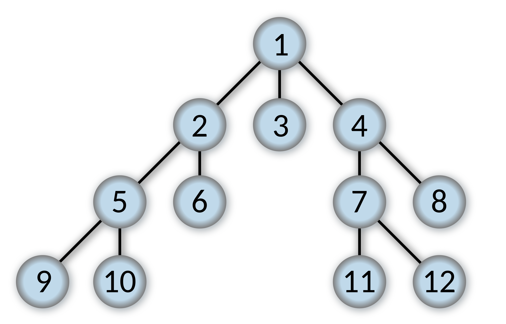

# Breadth First Search Overview:

### Overview:
* **Breadth-First Search (BFS)** is a **graph traversal algorithm** used to **explore and analyze data structures** like 
  **graphs** and **trees**
* It **systematically visits all the vertices (nodes) of a graph** in **breadthward** motion, **starting from a selected 
  source vertex** and **moving to its neighbors before visiting their neighbors**, and so on
* BFS is often used to find the **shortest path between two vertices** in an **unweighted graph** or to **explore a 
  graph layer by layer**
* Here's a step-by-step description of the Breadth-First Search algorithm:
  * **Step 1:** **Start** at the **source vertex**
  * **Step 2:** **Mark** the **source vertex** as **visited**
  * **Step 3:** **Add** the **source vertex** to a **queue**
  * **Step 4:** **While** the **queue** is **not empty**:
    * a. **Dequeue a vertex** from the queue
    * b. **Process the vertex** (e.g., **print it**, **record it**, or perform other actions)
    * c. **Enqueue all unvisited neighbors** of the **dequeued vertex**
    * d. **Mark each visited neighbor** as **visited**
  * **Step 5:** **Repeat steps 4** until the **queue is empty**
* BFS **ensures** that **all vertices at a distance `k` from the source vertex are visited before visiting vertices at 
  distance `k+1`**
* This means it **explores the graph layer by layer**, **starting from the source vertex** and **moving outwards**
* BFS is **often used** to **find the shortest path in an unweighted graph** because it **guarantees** that **when you 
  reach a particular vertex**, you have visited it by the **shortest possible path**
* It's also **commonly employed** in **algorithms** related to **graph problems**, such as **finding connected 
  components**, checking for **bipartiteness**, and solving **puzzles** like the **15-puzzle**
* BFS is implemented using a **queue data structure**, and its **time complexity is typically `O(V + E)`**, where `V` 
  is the **number of vertices**, and `E` is the **number of edge**s in the graph
* 