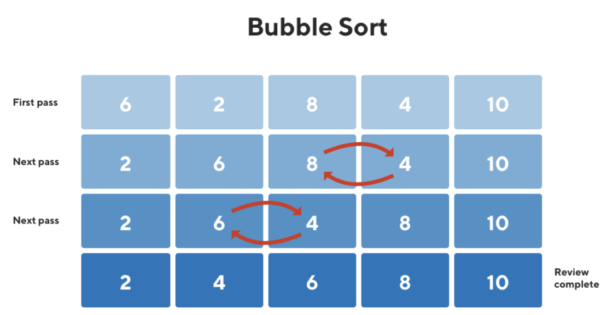

# Bubble Sort Overview:

### Overview:
* **Bubble sort** is a **simple sorting algorithm** that **repeatedly steps** through the **list of elements to be 
  sorted**, **compares adjacent elements**, and **swaps them if they are in the wrong order**
* It's **named "bubble" sort** because **smaller elements "bubble" to the top** of the list with **each pass** through the 
  elements
* Here's how the basic bubble sort algorithm works:
  * **Comparison and Swapping:**
    * **Starting from the beginning** of the list, the algorithm **compares adjacent elements in pairs**
    * It checks if the **element on the left** is **greater** than the **element on the right**
    * If so, it **swaps these elements**, moving the **larger element** towards the **end of the list**
  * **Passes Through the List:**
    * The algorithm **repeats this process multiple times**, **iterating through the list** until **no more swaps are 
      needed**
    * In **each pass**, the **largest unsorted element tends to move** to its **correct position** at the **end of the 
      list**
  * **Termination:**
    * The algorithm **continues making passes** through the list **until no more swaps are required**, indicating that the 
      **entire list is sorted**
* Bubble sort is **straightforward** to **understand and implement**, but it's **not very efficient for sorting large datasets**
* Its time complexity is `O(n^2)` in the **worst-case scenario**, making it **inefficient** for **large or nearly 
  sorted lists**
* However, for **small datasets** or **educational purposes**, it can serve as a **simple introduction to sorting 
  algorithms**

```java
public class BubbleSort {
    public static void bubbleSort(int[] arr) {
        int n = arr.length;
        for (int i = 0; i < n - 1; i++) {
            for (int j = 0; j < n - i - 1; j++) {
                // Compare adjacent elements
                if (arr[j] > arr[j + 1]) {
                    // Swap if the element at j is 
                    // greater than the next element
                    int temp = arr[j];
                    arr[j] = arr[j + 1];
                    arr[j + 1] = temp;
                }
            }
        }
    }

    public static void main(String[] args) {
        int[] arr = {64, 34, 25, 12, 22, 11, 90};

        System.out.println("Array before sorting:");
        for (int value : arr) {
            System.out.print(value + " ");
        }

        bubbleSort(arr);

        System.out.println("\nArray after sorting:");
        for (int value : arr) {
            System.out.print(value + " ");
        }
    }
}
```
* 