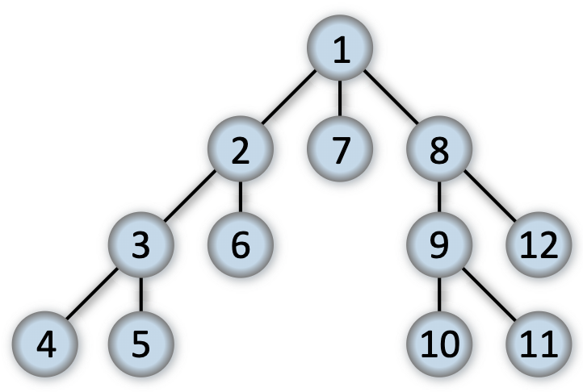

# Depth First Search Overview:

### Overview:
* **Depth-First Search (DFS)** is a **graph traversal algorithm** used to **explore and analyze data structures** like 
  **graphs** and **trees**
* It **systematically visits vertices** by **starting at a source vertex** and **exploring as deeply as possible along 
  each branch before backtracking**
* DFS can be implemented **recursively** or using a **stack** data structure
* Here's a step-by-step description of the Depth-First Search algorithm:
  * **Step 1:** **Start** at the **source vertex**
  * **Step 2:** **Mark** the **source vertex** as **visited**
  * **Step 3:** **Process the vertex** (e.g., **print it**, **record it**, or perform other actions)
  * **Step 4:** **For each unvisited neighbor** of the **current vertex**, **recursively apply DFS to the neighbor**
  * **Step 5:** **Repeat steps 4** until there are **no unvisited neighbors left for the current vertex**
  * **Step 6:** **Backtrack** to the **previous vertex** and **explore any unvisited neighbors from there**
  * **Step 7:** **Repeat steps 3 to 6** until **all vertices have been visited**
* DFS explores a branch of the graph **as deeply as possible before backtracking**
* This means it **follows a single path until it reaches the end before it explores other branches**
* It is often used for tasks like **finding paths or cycles** in a graph, **topological sorting** of a **directed 
  acyclic graph (DAG)**, and **solving maze problems**
* DFS can be implemented using **recursion**, where the **function calls itself for each unvisited neighbor**, or using 
  an **explicit stack** data structure to **manage the traversal**
* The **time complexity** of DFS is **`O(V + E)`**, where **`V`** is the **number of vertices**, and **`E`** is the 
  **number of edges** in the graph
* 