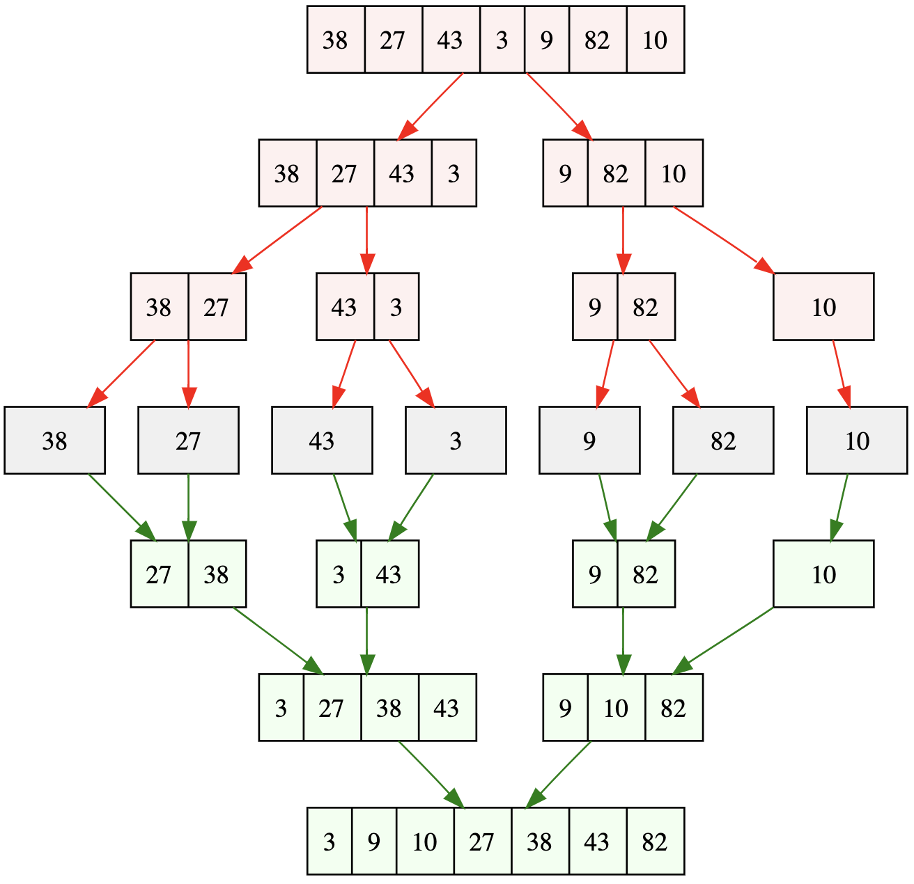

# Merge Sort Overview:

### Overview:
* **Merge Sort** is a popular and efficient **sorting algorithm** that falls under the category of **divide and 
  conquer** algorithms
* It works by **recursively dividing** a **list** into **smaller sublists**, **sorting those sublists**, and then 
  **merging them back** together to produce a fully sorted list
* Here's how the Merge Sort algorithm works:
  * **Step 1: Divide:**
    * The **original unsorted list** is **divided** into **two equal-sized sublists**
    * If the list has an **odd number of elements**, **one sublist will have one more element than the other**
  * **Step 2: Conquer:**
    * **Recursively sort both sublists**
    * This step involves **applying the Merge Sort algorithm to each of the sublists until they are fully sorted**
  * **Step 3: Merge:**
    * **Merge** the **two sorted sublists** into a **single sorted list**
    * This merging process involves **comparing elements from both sublists** and placing them in the **correct order** in a 
      **new auxiliary list**
  * **Step 4: Repeat steps 1-3** **until all sublists are merged**, and you have a **single sorted list**
* Merge Sort is a **stable sorting algorithm**, meaning it **maintains the relative order of equal elements**
* It has a time complexity of **O(n log n)** in the **worst, average, and best cases**, making it **efficient** for 
  **sorting large datasets**
* However, it does **require additional space** for the **auxiliary lists** used **during the merging process**, which 
  can make it **less memory-efficient** in comparison to **in-place sorting algorithms**
* * 