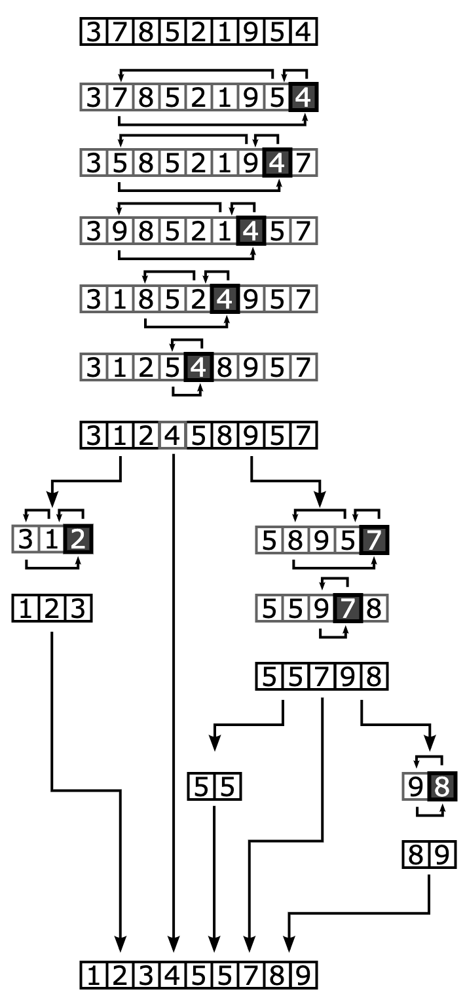

# Quick Sort Overview:

### Overview:
* **Quick Sort** is a **popular** and **efficient** **sorting algorithm** that follows the **divide and conquer** 
  approach
* It works by **selecting a "pivot" element from the array** and **partitioning the other elements into two sub-arrays**, 
  according to whether they are **less than or greater than the pivot**
* The **sub-arrays** are then **recursively sorted**
* Here's how the Quick Sort algorithm works:
  * **Partitioning:**
    * Select a **pivot element** from the array
    * This pivot selection can be done in various ways, but **commonly** it's the **first or last element** of the 
      **array**, or a **randomly chosen element**
  * **Reordering:**
    * **Rearrange the elements** in the array so that all elements **less than the pivot** are on the **left side**, 
      and all elements **greater than the pivot** are on the **right side**
    * The **pivot element** is now in its **sorted position**
    * This process is often referred to as "**partitioning**"
  * **Recursion:**
    * **Recursively apply the Quick Sort algorithm** to the **sub-arrays created on the left and right of the pivot 
      element**
  * **Combine:**
    * Once the **sub-arrays** are **sorted**, they are **combined** to produce a **fully sorted array**
    * The **pivot element**, being in its **correct position**, **doesn't need any further sorting**
* Quick Sort is known for its **efficiency** and is **often faster** than **many other sorting algorithms, including 
  Merge Sort**, in practice
* Its **average** and **best-case time complexity** is **O(n log n)**, which makes it suitable for **sorting large 
  datasets**
* However, in the **worst case** (if a **bad pivot** is **consistently chosen**), it can have a **time complexity of 
  O(n^2)**, but this can be **mitigated** by using **various pivot selection strategies**
* 
* 