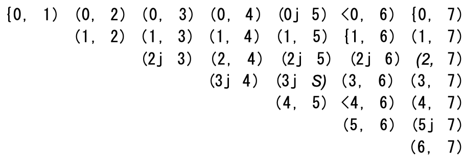

# Big O:

### Overview:

* Big O time is the language and metric we use to describe the efficiency of algorithms

### Time Complexity:

* Time complexity tells you how the execution time of an algorithm grows as the input data (or problem size) gets larger

### Space Complexity:

* Space complexity is how much memory or storage space an algorithm or program uses to solve a problem
* It's a measure of the amount of computer memory required by the program to execute and produce its output

### Tips for Determining Big O:

* **Dropping Constants & Non-Dominant Terms:**
    * It is very possible for `O(N)` code to run faster than `O(1)` code for specific inputs
    * Big O **just describes the rate of increase**
    * For this reason, we drop the constants in runtime
        * i.e. an algorithm that one might describe as `O(2N)` is actually `O(N)`
    * Drop the Non-Dominant Terms:
        * A "term" typically refers to a part or component of a mathematical expression or equation
        * For Example:
            * `O(N^2 + N)` becomes `O(N^2)`
            * `O(N + log N)` becomes `O(N)`
* **Multi-Part Algorithms: Add vs. Multiply:**
    * For algorithms with two steps, you'll need to know whether to multiply or add the runtimes:
        * If your algorithm is in the form "do this, then, **when you're all done**, do that" then you **add** the 
          runtimes
        * If your algorithm is in the form "do this **for each time** you do that" then you **multiply** the runtimes
* **Amortized Time:**
  * An `ArrayList`, or a dynamically resizing array, allows you to have the benefits of an array while offering 
    flexibility in size
  * You won't run out of space in the `ArrayList` since its capacity will grow ass you insert elements
  * An `ArrayList` is implemented with an array
    * When the array hits capacity, the `Arraylist` class will create a new array with double the capacity and copy all 
      the elements over to the new array
  * Thus, determining the runtime of an insertion is difficult
  * **Amortized time** allows us to describe that the worst case happens once in a while, but won't happen soon after
  * Thus, the cost is **amortized**
* **Log N Runtimes:**
  * `O(log N)` is commonly seen in runtimes
  * **Binary Search** is an example of `O(log N)`
    * It is a **divide-and-conquer algorithm** that searches for an element in a **sorted collection** by **repeatedly 
      dividing** the search interval in half and eliminating half of the remaining elements in each step, until the
      target element is found or the search interval is empty
    * When you see a problem where the number of elements in the problem space gets halved each time, that will likely
      be an `O(log N)` runtime
    * This is the same reason why finding an element in a balanced binary search tree is `O(log N)`
      * With each comparison, we go either left or right
      * Half the nodes are on each side, so we cut the problem space in half each time
* **Recursive Runtimes:**
  * When you have a recursive function that makes multiple calls, the runtime will often (but not always) look like
    `O(branches^depth)`, where branches is the number of times each recursive call branches

### Examples & Exercises:

* **Example 1:**
* Q. What is the runtime of the below code?
```
void foo(int[] array) {
    int sum = 0;
    int product = 1;
    
    for(int i = 0; i < array.length; i++) {
        sum += array[i];
    }
    for(int i = 0; i < array.length; i++) {
        product *= array[i];
    }
    System.out.println(sum + ", " + product);
}
```
* A. This will take `O(N)` time
    * One might think the runtime would be `O(2N)`, but **constant factors, such as the number of loops, do not affect
      the Big O notation**
    * The fact that we iterate through the array twice does not matter

* **Example 2:**
* Q. What is the runtime of the below code?
```
void printPairs(int[] array) {
    for(int i = 0; i < array.length; i++) {
        for(int j = 0; j < array.length; j++) {
            System.out.println(array[i] + ", " array[j]);
        }
    }
}
```
* A. The inner for loop has `O(N)` iterations, and it is called `N` times
  * Therefore, the runtime is `O(N^2)`
  * Another way we can see this is by inspecting what the "meaning" of the code is
    * It is printing all pairs (two-element sequences)
    * There are `O(N^2)` pairs; therefore the runtime is `O(N^2)`

* **Example 3:**
* Q. This is very similar code to the above example, but now the **inner for loop** starts at `i + 1`
```
void printUnorderedPairs(int[] array) {
    for(int i = 0; i < array.length; i++) {
        for(int j = i + 1; j < array.length; j++) {
            System.out.println(array[i] + ", " array[j]);
        }
    }
}
```
* A. We can retrieve the runtime several ways:
  * This pattern of for loop is **very common**
    * It's important that you know the runtime and that you deeply understand it
    * You can't just rely on memorizing common runtimes
    * Deep comprehension is important
  * **Counting the Iterations:**
    * The first time through, `j` runs for `N - 1` steps
    * The second time, it's `N - 2` steps
    * Then `N - 3` steps, and so on
    * Therefore, the number of steps total is:
      * `(N - 1) + (N - 2) + (N - 3) + ... 2 + 1`
      * `= 1 + 2 + 3 + ... + N - 1`
      * `= sum of 1 through N - 1`
      * The sum of 1 through N - 1 is `N(N - 1) / 2` (See "Sum of integers 1 through N"), so the runtime will be `O(N^2)`
      * **"Sum of integers 1 through N:"**
        * What is `1 + 2 + ... + n`? Let's figure it out by pairing up low values with high values
        * If `n` is even, we pair `1` with `n`, `2` with `n - 1`, and so on
          * We will have `n / 2` pairs each with sum `n + 1`
        * If `n` is odd, we pair 0 with n, 1 with n - 1, and so on
          * We will have `n + 1 / 2` pairs with sum `n`
          * 
        * In either case, the sum is `n(n + 1) / 2`
        * This reasoning comes up a lot in nested loops
        * For example, consider the following code:
```
for(int i = 0; i < array.length; i++) {
    for(int j = i + 1; j < array.length; j++) {
        System.out.println(i + j);
    }
}
```


  * **What it Means:**
    * Alternatively, we can figure out the runtime by thinking about what the code "means"
    * It iterates through each pair of values for `(i, j)` **where `j` is bigger than `i`**
    * There are `N^2` total pairs
      * Roughly half of those will have `i < j` and the remaining half will have `i > j`
      * This pair goes through roughly <sup>N<sup>2</sup></sup>/<sub>2</sub> pairs so it does `O(N^2)` work
  * **Visualizing What it Does:**
    * The code iterates through the following `(i, j)` pairs when `N = 8`:
    * 
    * This looks like half of an `N X N` matrix, which has size (roughly) <sup>N<sup>2</sup></sup>/<sub>2</sub>
    * Therefore, it takes `O(N^2)` time
  * **Average Work:**
    * We know that the outer loop runs `N` times
    * How much work does the inner loop do?
    * It varies across iterations, but we can think about the average iteration
    * What is the average value of `1, 2, 3, 4, 5, 6, 7, 8, 9, 10`? The average value will be in the middle, so it will be roughly `5`
    * We could give a more precise answer, or course, but we don't need to for big O
    * What about for `1, 2, 3, ..., N`?
      * The average value in the sequence is `N/2`
      * Therefore, since the inner loop does `N/2` work on average, and it is run N times, the total work is 
        <sup>N<sup>2</sup></sup>/<sub>2</sub>, which is `O(N^2)`
  * **Algorithm Explanation:**
    * The algorithm is designed to iterate through an array and print all pairs of elements from the array in an 
      **unordered fashion**
    * In other words, it prints all possible combinations of two elements from the array where the order of the 
      elements in each pair doesn't matter
    * For example, if you have an array [1, 2, 3], it will print the following pairs: `(1, 2)`, `(1, 3)`, `(2, 3)`
    * As you can see, the pairs are unordered, meaning that `(1, 2)` is considered the same as `(2, 1)`, and the method does 
      not print duplicates or the reversed order of pairs