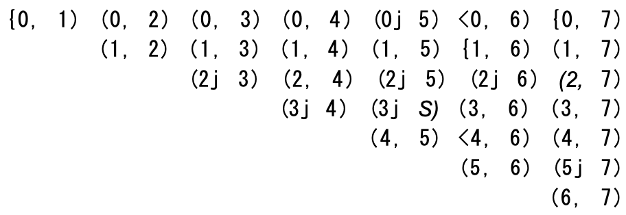

### Big O Examples:

* **Example 1:**
* Q. What is the runtime of the below code?
```
void foo(int[] array) {
    int sum = 0;
    int product = 1;
    
    for(int i = 0; i < array.length; i++) {
        sum += array[i];
    }
    for(int i = 0; i < array.length; i++) {
        product *= array[i];
    }
    System.out.println(sum + ", " + product);
}
```
* A. This will take `O(N)` time
    * One might think the runtime would be `O(2N)`, but **constant factors, such as the number of loops, do not affect
      the Big O notation**
    * The fact that we iterate through the array twice does not matter

* **Example 2:**
* Q. What is the runtime of the below code?
```
void printPairs(int[] array) {
    for(int i = 0; i < array.length; i++) {
        for(int j = 0; j < array.length; j++) {
            System.out.println(array[i] + ", " array[j]);
        }
    }
}
```
* A. The inner for loop has `O(N)` iterations, and it is called `N` times
    * Therefore, the runtime is `O(N^2)`
    * Another way we can see this is by inspecting what the "meaning" of the code is
        * It is printing all pairs (two-element sequences)
        * There are `O(N^2)` pairs; therefore the runtime is `O(N^2)`

* **Example 3:**
* Q. This is very similar code to the above example, but now the **inner for-loop** starts at `i + 1`
```
void printUnorderedPairs(int[] array) {
    for(int i = 0; i < array.length; i++) {
        for(int j = i + 1; j < array.length; j++) {
            System.out.println(array[i] + ", " array[j]);
        }
    }
}
```
* A. We can retrieve the runtime several ways:
    * This pattern of for loop is **very common**
        * It's important that you know the runtime and that you deeply understand it
        * You can't just rely on memorizing common runtimes
        * Deep comprehension is important
    * **Counting the Iterations:**
        * The first time through, `j` runs for `N - 1` steps
        * The second time, it's `N - 2` steps
        * Then `N - 3` steps, and so on
        * Therefore, the number of steps total is:
        * The sum of 1 through `N - 1` is `N(N - 1) / 2` (See [Sum of integers 1 through N](../Advanced_Topics/Sum_of_Integers_1_Through_N.md)), so the runtime will be `O(N^2)`

```
(N - 1) + (N - 2) + (N - 3) + ... 2 + 1
= 1 + 2 + 3 + ... + N - 1
= sum of 1 through N - 1
```
*
    * **What it Means:**
        * Alternatively, we can figure out the runtime by thinking about what the code "means"
        * It iterates through each pair of values for `(i, j)` **where `j` is bigger than `i`**
        * There are `N^2` total pairs
            * Roughly half of those will have `i < j` and the remaining half will have `i > j`
            * This pair goes through roughly <sup>N<sup>2</sup></sup>/<sub>2</sub> pairs so it does `O(N^2)` work
    * **Visualizing What it Does:**
        * The code iterates through the following `(i, j)` pairs when `N = 8`:
        * 
        * This looks like half of an `N X N` matrix, which has size (roughly) <sup>N<sup>2</sup></sup>/<sub>2</sub>
        * Therefore, it takes `O(N^2)` time
    * **Average Work:**
        * We know that the outer loop runs `N` times
        * How much work does the inner loop do?
        * It varies across iterations, but we can think about the average iteration
        * What is the average value of `1, 2, 3, 4, 5, 6, 7, 8, 9, 10`? The average value will be in the middle, so it will be roughly `5`
        * We could give a more precise answer, or course, but we don't need to for big O
        * What about for `1, 2, 3, ..., N`?
            * The average value in the sequence is `N/2`
            * Therefore, since the inner loop does `N/2` work on average, and it is run N times, the total work is
              <sup>N<sup>2</sup></sup>/<sub>2</sub>, which is `O(N^2)`
    * **Algorithm Explanation:**
        * The algorithm is designed to iterate through an array and print all pairs of elements from the array in an
          **unordered fashion**
        * In other words, it prints all possible combinations of two elements from the array where the order of the
          elements in each pair doesn't matter
        * For example, if you have an array `[1, 2, 3]`, it will print the following pairs: `(1, 2)`, `(1, 3)`, `(2, 3)`
        * As you can see, the pairs are unordered, meaning that `(1, 2)` is considered the same as `(2, 1)`, and the method does
          not print duplicates or the reversed order of pairs

* **Example 4:**
  * This is similar to the above, but now we have two different arrays:
```
void printUnorderedPairs(int[] arrayA, int[] arrayB) {
    for (int i = 0; i < arrayA.length; i++) {
        for(int j = 0; j < arrayB.length; j++){
            if (arrayA[i] < arrayB[j]) {
                System.out.println(arrayA[i] + ", " + arrayB[j]);
            }
        }
    }
}
```
* 
  * We can break up this analysis:
    * The if-statement within `j`'s for-loop is `O(1)` time since it's **just a sequence of constant-time statements**:
      * In other words, the if-statement **doesn't depend on the size of the input arrays**; it **only involves simple 
        comparisons and printing**, which take a **constant amount of time regardless of the size of the arrays**
    * We now have this:
```
void printUnorderedPairs(int[] arrayA, int[] arrayB) {
    for (int i = 0; i < arrayA.length; i++) {
        for(int j = 0; j < arrayB.length; j++){
            /* O(1) work */
        }
    }
}
```
* 
  * For each element of `arrayA`, the inner for-loop goes through `b` iterations, where **`b = arrayB.length`**
  * If **`a = arrayA.length`**, then the runtime is `O(ab)`
  * If you said `O(N^2)`, then remember your mistake for the future
    * It's **not `O(N^2)`**, because, there are **two different inputs**
    * Both matter and this is an extremely common mistake

* **Example 5:**
  * What about this strange bit of code?
```
void printUnorderedPairs(int[] arrayA, int[] arrayB) {
    for (int i = 0; i < arrayA.length; i++) {
        for(int j = 0; j < arrayB.length; j++){
            for(int k = 0; k < 100000; k++) {
                System.out.println(array[i] + ", " + arrayB[j]);
            }
        }
    }
}
```
* 
  * Nothing has really changed here
  * 100,000 units of work is still constant, so the runtime is `O(ab)`

* **Example 6:**
  * The following code reverses an array
  * What is its runtime?
```
void reverse(int[] arrayA) {
    for (int i = 0; i < arrayA.length / 2; i++) {
        int other = array.length - i - 1;
        int temp = array[i];
        array[i] = array[other];
        array[other] = temp;
    }
}
```
* .
  * This algorithm runs in `O(N)` time
  * The fact that it only goes through the first half of the array (in terms of iterations) does not impact the big O time
  * Also, the time complexity of the algorithm is `O(N/2)`, which simplifies to `O(N)`

* **Example 7:**
  * Which of the following are equivalent to `O(N)`, and why?
    * `O(N + P)`, where `P < N/2`
    * `O(2N)`
    * `O(N + log N)`
    * `O(N + M)`
  * Let's go through each of these:
    * If `P < N/2`, then we know that **`N` is the dominant term**, so we can drop the `O(P)`
      * Focus on the **dominant term**, which is the one that **grows the fastest** as our **input size (`N`) increases**
      * Since `P` is **much smaller** than `N`, it won't significantly affect the overall growth rate
      * So, we can essentially ignore it, and the complexity becomes `O(N)`
    * `O(2N)` is `O(N)` since we drop the constant
    * `O(N)` dominates `O(log N)`, so we can drop the `O(log N)`
      * `log N` **increases by 1** for **each doubling** of `N`
      * Logarithmic growth means that as the input size (N) increases, the time or resources required increase at a **much 
        slower rate** compared to linear growth
    * There is **no established relationship** between `N` and `M`, so we have to keep both variables in there
      * We cannot simplify this expression further
      * We have to keep both `N` and `M` in the complexity notation, and it remains `O(N + M)`
  * Therefore, all but the last one are equivalent to `O(N)`

* **Example 8:**
  * Q. Suppose we had an algorithm that took in an array of strings, sorted each string, and then sorted the full array
    * What would the runtime be?
  * Many candidates will incorrectly reason the following:
    * Sorting each string is `O(N log N)` and we have to do this for each string, so that's `O(N*N log N)`
    * We also have to sort the array, so that's an additional `O(N^2 log N + N log N)`, which is just `O(N^2 log N)` 
      (`N^2 log N` is a higher order term than `N log N`)
  * The problem is that we used `N` in two different ways
    * In one case, it's the length of the string (which string?)
    * And in another case, it's the length of the array
  * You can prevent this error by either not using the variable `N` at all, or by **only using it** when there is **no
    ambiguities** to what `N` could represent
  * Avoid using `a` and `b` here, or `m` and `n`, as it's too easy to forget which is which and mix them up
  * An `O(a^2)` runtime is completely different from an `O(a*b)` runtime
  * Let's define new terms, and use names that are logical
    * Let `s` be the **length** of the **longest string**
    * Let `a` be the **length** of the **array**
  * Now we can work through this in parts:
    * Sorting each string `O(s log s)`
      * Sorting algorithms typically have a time complexity of **O(N log N)** for N elements
    * We have to do this **for every string** (and there are strings), so that's `O(a * s(log s))`
    * Now we have to sort all the strings
      * There are `a` strings, so you may be inclined to say that this takes `O(s)` time
      * This is what most candidates would say
    * You should also take into account that **you need to compare the strings**
      * Each string comparison takes `O(s)` time
      * There are `O(a log a)` comparisons, therefore this will take `O(a*s log a)` time
    * If you add up these two parts, you get `O(a*s(log a + log s))`
    * This is it, there's no way to reduce it further