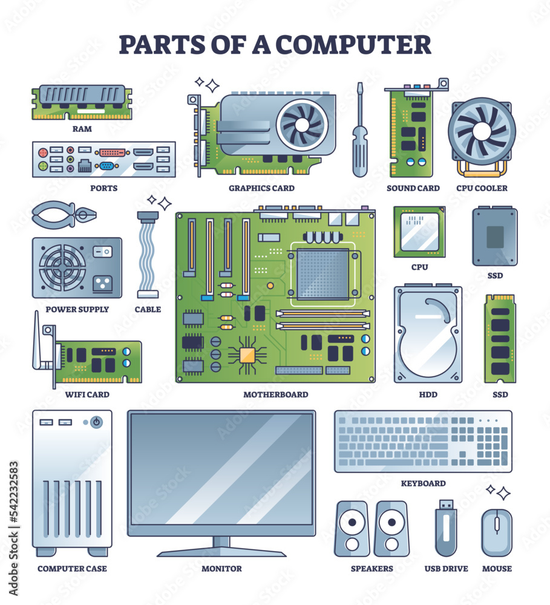

# Computer Hardware Overview:

### Overview:
* **Computer hardware** refers to the **physical components** that make up a computer system and **enable it to 
  function**
* These tangible parts include all the **electrical**, **electronic**, and **mechanical components** necessary for 
  **computing tasks** and **data processing**
* Hardware interacts with **software** (**programs** and **instructions**) to **perform specific operations**
* Key components of computer hardware include:
  * **Central Processing Unit (CPU):**
    * The CPU is the **core component** responsible for **executing instructions** and **performing calculations**
    * It **interprets** and **carries out instructions** from software programs
  * **Memory (RAM):**
    * **Random Access Memory** (**RAM**) **stores data and instructions** that the **CPU needs** in **real-time**
    * It's **volatile memory**, meaning it **loses its contents** when the **computer is powered off**
  * **Storage Devices:**
    * These devices **store data persistently** even when the **computer is turned off**
    * Examples include **hard disk drives** (**HDDs**), **solid-state drives** (**SSDs**), and **optical drives** 
      (**CD/DVD drives**)
  * **Motherboard:**
    * The motherboard is a **printed circuit board** that **connects all the components of the computer**, such as 
      **CPU**, **memory**, **storage**, and **expansion cards**
    * It provides **communication** between **different parts of the computer system**
  * **Graphics Processing Unit (GPU):**
    * The **GPU** specializes in **rendering images**, **graphics**, and **videos**
    * It's particularly important for **gaming**, **graphic design**, and **video editing**
  * **Input/Output Devices:**
    * These devices allow users to **interact with the computer**
    * Examples include **keyboards**, **mice**, **monitors**, **printers**, **scanners**, and **networking devices** 
      (**routers**, **modems**)
  * **Expansion Cards:**
    * These cards add **extra functionality** to the computer, such as **sound cards**, **network interface cards**, 
      and **graphics cards**
  * **Power Supply Unit (PSU):**
    * The PSU **converts electricity** from the power outlet into **usable power** for the computer's components
  * **Cooling Systems:**
    * Components like **fans**, **heat sinks**, and **liquid cooling systems** help **manage the temperature** of the 
      hardware, preventing overheating
* Computer hardware can be classified into two categories: **internal hardware** (components **inside the computer 
  casing**) and **external hardware** (devices **connected externally**, like **peripherals**)
* Understanding hardware components and their interactions is **crucial** for **building**, **maintaining**, and 
  **troubleshooting computer systems**
* 

### Central Processing Unit (CPU):
* The **CPU**, or **Central Processing Unit**, is often referred to as the **brain of a computer**
* It's a **hardware component** responsible for **executing instructions** and **performing calculations** required to 
  **carry out tasks** and **run programs** on a computer
* Key characteristics of a CPU include:
  * **Processing Instructions:**
    * The CPU **processes instructions fetched from memory**
    * These **instructions** are in **machine code** and **represent operations** such as **arithmetic calculations**, 
      **data movement**, **logic operations**, and **control flow instructions**
  * **Arithmetic Logic Unit (ALU):**
    * The **ALU** is a component within the CPU that **performs arithmetic operations** (**addition**, **subtraction**, 
      **multiplication**, **division**) and **logic operations** (**AND**, **OR**, **NOT**) on data
  * **Control Unit:**
    * The **control unit manages** the **execution of instructions** by **coordinating the flow of data within the 
      CPU** and **controlling the operation** of **other hardware components**
    * It **fetches instructions from memory**, **decodes them**, and **executes them accordingly**
  * **Registers:**
    * The CPU contains **internal memory units** called **registers** that **store data**, **addresses**, and 
      **intermediate results during processing**
    * Registers provide **quick access** to **data for the CPU**, **enhancing processing speed**
  * **Clock Speed:**
    * The **clock speed**, measured in **gigahertz** (**GHz**), represents **how many cycles** 
      (**fetch-decode-execute**) the CPU **can perform in a second**
    * Higher clock speeds generally mean **faster processing**
  * **Cache Memory:**
    * CPUs often have **built-in cache memory**, which is **faster than main memory** (**RAM**)
    * Cache memory stores **frequently accessed data and instructions** to **speed up processing**
  * **Multiple Cores:**
    * Modern CPUs often have **multiple processing cores**, allowing them to **execute multiple instructions 
      simultaneously**
    * **Multi-core processors** can **perform tasks in parallel**, **improving overall performance**
  * **Instruction Pipelining:**
    * CPUs use techniques like **instruction pipelining** to **improve efficiency** by **overlapping the execution** of 
      **multiple instructions**, allowing the CPU to **work on several instructions at different stages simultaneously**
  * **Power and Thermal Management:**
    * CPUs can **dynamically adjust their power consumption** and **clock speeds** to **manage heat** and **power 
      consumption**, ensuring **optimal performance** while **minimizing energy usage** and **heat generation**
* The CPU is a **critical component** in **computing devices**, ranging from **personal computers** and **laptops** to 
  **servers** and **smartphones**
* Its **performance significantly influences** the **speed** and **efficiency** of a computer system in **executing 
  tasks** and **running applications**
* 

### Memory (RAM):
* **Random Access Memory** (**RAM**) is a **volatile form** of **computer memory** that **enables the CPU** (Central 
  Processing Unit) to 
  **rapidly access and retrieve data** that is **currently in use** or **required for executing programs**
* It consists of **integrated circuits** that **store data** and **machine code** that the **CPU needs to perform 
  tasks**
* RAM **operates at high speeds** and **provides the CPU** with **quick access to data**, **significantly faster** than 
  **accessing information** from **storage devices** like **hard drives** or **SSDs**
* It's characterized by its **ability to read and write data at nearly the same speed**, enabling **random and swift 
  access** to **any memory location**
* The memory cells in RAM are **organized** in a **matrix of rows and columns**, with **each cell** being **capable of 
  storing a binary digit (bit)**
* These cells are **arranged into bytes** (typically **8 bits per byte**), and the **capacity** of RAM is **measured in 
  megabytes** (**MB**) or **gigabytes** (**GB**) in modern computers
* When a **computer** is **turned on**, the **operating system** and **active programs** are **loaded from permanent 
  storage into RAM**
* This allows the **CPU** to **quickly access** this **data and instructions**, facilitating **efficient multitasking** 
  and **faster program execution**
* However, RAM is **volatile memory**, meaning its **contents are erased** when the **computer** is **shut down** or 
  **loses power**, making it unsuitable for permanent storage of data
