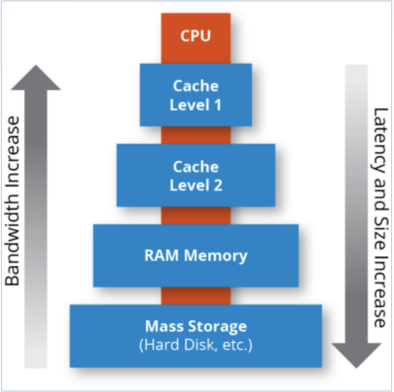

# Cache Overview:

### Overview:
* In **computing**, a **cache** is a **hardware or software component** that **stores frequently accessed** or 
  **recently used** data to **speed up subsequent access** to that data
* It serves as a **temporary storage area** that **holds copies of information** that is **likely to be needed again** 
  in the **near future**
* Caches work on the **principle** of **exploiting** the **locality of reference**, which suggests that **if data** has 
  been **accessed recently**, it is **likely to be accessed again** in the **near future**
* There are various types of caches:
  * **CPU Cache:**
    * This type of cache is built **directly into the processor** (**CPU**) and is used to **store copies** of **frequently 
      accessed instructions** and **data**
    * It **reduces the time taken** to **access memory** by providing **faster access** to this **stored data**
  * **Disk Cache:**
    * **Disk caches** are used in **storage systems** to **temporarily store data** that is **frequently read from or 
      written** to the **disk**
    * This helps in **improving overall system performance** by **reducing the frequency** of **actual disk access**
  * **Web Browser Cache:**
    * **Web browsers** use caches to **store copies of web pages**, **images**, and **other resources locally** on a 
      **user's device**
    * This enables **faster loading times** when **revisiting websites** since the **browser** can **retrieve the 
      content** from the **cache** **instead of downloading it again**
* Caches **operate based on a hierarchy**, with **multiple levels** such as **L1**, **L2**, and **L3 caches** in 
  **CPUs**, each having **different sizes** and **speeds**
* The **closer a cache** is to the **processor**, the **faster it can deliver data**
* **Cache management** involves **various algorithms and techniques** to decide **which data to store in the cache**, 
  **how long to keep it**, and how to **efficiently retrieve and update it**
* **Effective caching strategies** are **crucial** for **optimizing system performance** and **reducing latency** in 
  **accessing data**
* 