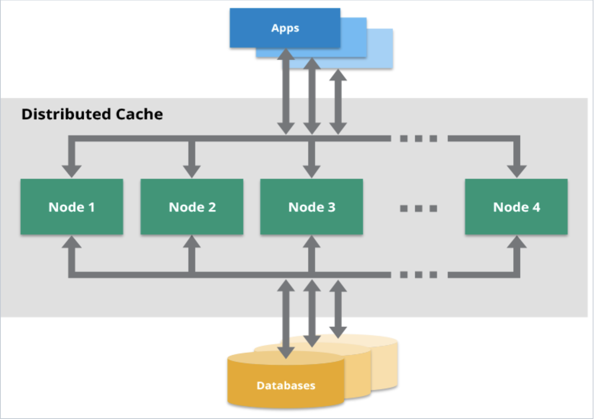

# Distributed Caching Overview:

### Overview:
* **Distributed caching** refers to a technique in which **cache data** is **spread across multiple nodes** or 
  **servers** within a **distributed computing environment**
* It involves **storing cached data** in a **distributed** or **decentralized manner**, allowing **multiple nodes** to 
  **share and access cached information across a network**
* **In distributed caching:**
  * **Data Distribution:**
    * Cached data is **divided** and **distributed** across **multiple nodes in a network**, often based on some 
      **partitioning scheme** or **hashing algorithm**
    * This distribution **ensures** that **data** is **not stored redundantly** and **can be accessed from different 
      nodes**
  * **Improved Scalability and Performance:**
    * By **distributing** the **cached data** across **multiple nodes**, distributed caching systems can **handle 
      larger volumes** of **data** and **accommodate increased user loads**
    * This **enhances performance** by **reducing the load** on **individual servers** and **improving data access 
      times**
  * **Fault Tolerance and Redundancy:**
    * Distributed caching systems often **incorporate mechanisms** for **fault tolerance**, ensuring that **if one node 
      fails**, the **data remains accessible** from **other nodes**
    * **Redundancy** in **data storage across multiple nodes** enhances **reliability**
  * **Consistency and Coherence:**
    * Maintaining **consistency** and **coherence** of cached data **across distributed nodes** is **crucial**
    * Various techniques such as **cache invalidation**, **data synchronization**, and **coherence protocols** are 
      employed to **ensure** that the **data remains consistent** and **up-to-date** across the **distributed cache**
  * **Cache Coordination:**
    * Distributed caching systems may use **coordination mechanisms** to **manage cache operations efficiently**, such 
      as **data eviction policies**, **cache replication strategies**, and **mechanisms to handle cache misses**
* Examples of distributed caching solutions include **Redis Cluster**, **Memcached** with **consistent hashing**, 
  **Apache Ignite**, and others
* These systems allow for the creation of **large-scale distributed caches** that enhance the **performance** and 
  **scalability** of applications by providing fast and **efficient access** to **frequently accessed data** across 
  **multiple nodes** in a **network**
* 