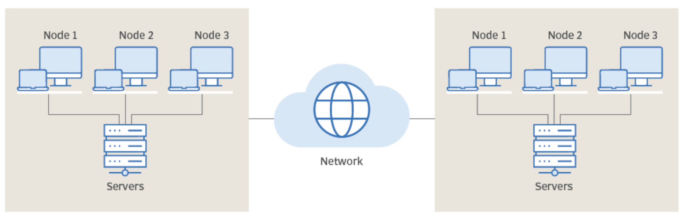

# Distributed Computing Overview:

### Overview:
* **Distributed computing** refers to a **model of computation** in which **multiple computers** or **processing units** 
  **work together** to **solve a problem** or **perform a task**
* Instead of relying on a **single centralized computer**, distributed computing **distributes the workload** across a 
  **network** of **interconnected computers**, also known as **nodes** or **hosts**
* Key characteristics of distributed computing include:
  * **Parallel Processing:**
    * **Tasks** are divided into **smaller sub-tasks** that can be **processed simultaneously** across **multiple 
      nodes**
    * This **parallel processing capability** allows for **faster execution of computations**
  * **Resource Sharing:**
    * Distributed computing enables the **sharing of resources** such as **processing power**, **memory**, and 
      **storage** among the **connected nodes**
    * This **pooling of resources** allows for **more efficient utilization** and **scalability**
  * **Fault Tolerance:**
    * Distributed systems are designed to be **resilient against individual node failures**
    * If **one node fails** or **becomes unavailable**, the **system** can **continue to operate** by **redistributing 
      the workload** to **other available nodes**
  * **Scalability:**
    * Distributed computing systems can **easily scale** by **adding more nodes** to the **network**
    * This scalability allows for **handling larger workloads** and **accommodating increased demand**
  * **Decentralization:**
    * Unlike traditional centralized systems, distributed computing systems often operate in a **decentralized manner**
    * They **don’t rely** on a **single point of control** and can function even **if some nodes or components fail**
  * **Interconnectedness:**
    * **Nodes** in a **distributed system communicate** and **coordinate** with each other through **network 
      connections**
    * **Communication protocols** and **technologies** enable **data sharing** and **coordination** among the nodes
* Distributed computing finds applications in various fields such as **scientific research**, **big data processing**, 
  **cloud computing**, **networking**, and more
* Technologies like **grid computing**, **peer-to-peer networks**, **MapReduce**, and **distributed databases** are 
  examples of **distributed computing paradigms** used to **address complex computational problems** by harnessing the 
  **collective power** of **multiple computing resources**
* 