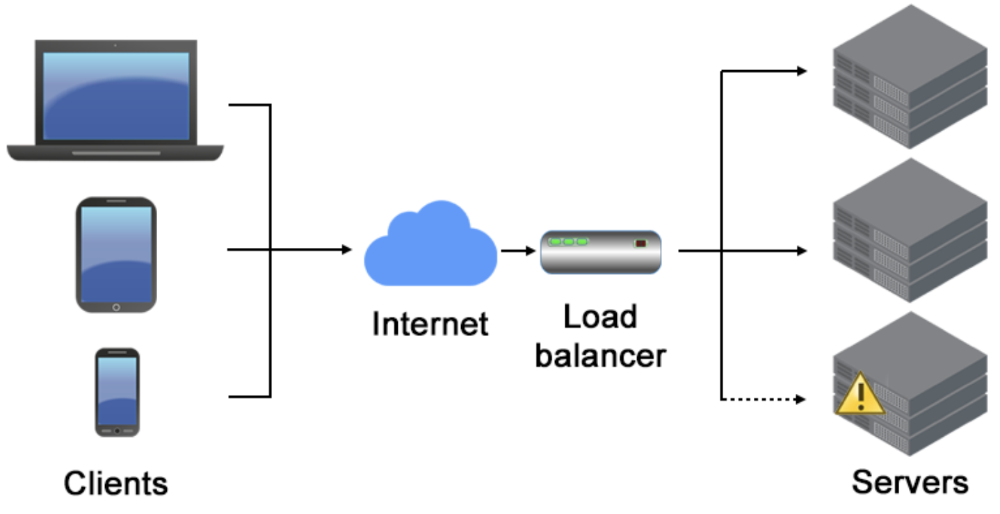

# Load Balancing Overview:

### Overview:
* **Load balancing** is a **technique** used in **computing** and **networking** to **efficiently distribute incoming 
  network traffic** or **computational workload** across **multiple resources**, such as **servers**, **CPUs**, or 
  **network links**
* The **primary goal** of load balancing is to **optimize resource utilization**, **maximize throughput**, **minimize 
  response time**, and **avoid overloading any single resource**
* Key aspects of load balancing include:
  * **Distribution of Workload:**
    * Load balancers **evenly distribute incoming requests or tasks** among **multiple servers or resources**
    * This **distribution** prevents **any single server or resource** from **becoming overwhelmed** with **traffic** 
      or **workload**
  * **High Availability:**
    * Load balancing **enhances** the **reliability** and **availability** of **services** by **ensuring** that if 
      **one server or resource fails**, the **remaining resources** can **continue to handle the workload**
    * **Redundancy** and **failover mechanisms** are often employed to achieve this
  * **Optimizing Performance:**
    * By **distributing the workload**, load balancing helps in **optimizing the performance** of the **entire system**
    * It **prevents bottlenecks**, **reduces response times**, and ensures that **resources** are **used efficiently**
  * **Types of Load Balancing:**
    * Load balancing can be achieved using **various algorithms**, such as **round-robin**, **least connections**, 
      **weighted round-robin**, **least response time**, or more advanced methods that consider factors like **server 
      health**, **geographic location**, or **content-aware routing**
  * **Scalability:**
    * Load balancing facilitates **easy scalability** of **systems** by **allowing additional resources** to be **added 
      to the pool** of **available servers or resources**
    * This scalability ensures that the system can **handle increased demand without a significant impact on 
      performance**
* Load balancing is commonly used in various scenarios such as **web servers**, **application servers**, **database 
  servers**, **content delivery networks** (**CDNs**), and **other distributed systems**
* **Hardware-based** load balancers, **software-based** load balancers, and **cloud-based** load balancing services are 
  utilized to **efficiently manage** and **distribute traffic** across **multiple resources** to **ensure optimal 
  performance** and **reliability** of **applications** and **services**
* 