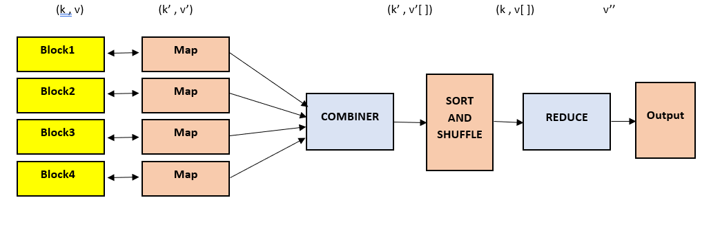

# MapReduce Overview:

### Overview:
* **MapReduce** is a **programming model** and an **associated implementation** for **processing** and **generating 
  large datasets** in a **distributed computing environment**
* It was **popularized by Google** for **large-scale data processing tasks across clusters of computers**
* The MapReduce framework works in two main phases, the **Map phase** and the **Reduce phase**:
  * **Map Phase:**
    * **Map:**
      * In this phase, the **input data** is **divided** into **smaller chunks**, and a function called the **"Map" 
        function** is **applied to each chunk independently**
      * The **Map function** **transforms** the **input data** into a **set** of **intermediate key-value pairs**
      * These **key-value pairs** are **unordered** and **can be processed independently of each other**
    * **Partitioning:**
      * After the Map function operates on the input data, the **intermediate key-value pairs** are **grouped based 
        on their keys** and **partitioned across different nodes** in the **computing cluster**
      * This step **prepares the data** for the next phase
  * **Reduce Phase:**
    * **Shuffle and Sort:**
      * During this phase, the **intermediate key-value pairs** are **shuffled across the nodes in the cluster** so that 
        **all values associated** with a **particular key** are **gathered together**
    * **Reduce:**
      * A **function** known as the **"Reduce" function** is **applied** to **each group of values** that **share the 
        same key**
      * The **Reduce function merges these values** or **performs some computation on them** to **produce** a **smaller 
        set** of **output values**
* The **MapReduce paradigm simplifies** the **process** of **parallelizing** and **distributing computations** across 
  **multiple machines** in a **cluster**, allowing for **efficient processing** of **large datasets**
* It **abstracts** away the **complexities** of **managing distributed tasks**, **fault tolerance**, and **data 
  distribution**, making it **easier for developers** to **write parallelizable programs without worrying** about 
  **low-level details**
* Various distributed computing frameworks like **Apache Hadoop**, **Apache Spark**, and others have implemented the 
  MapReduce model or variations of it to handle **large-scale data processing tasks** in **distributed environments**
* 