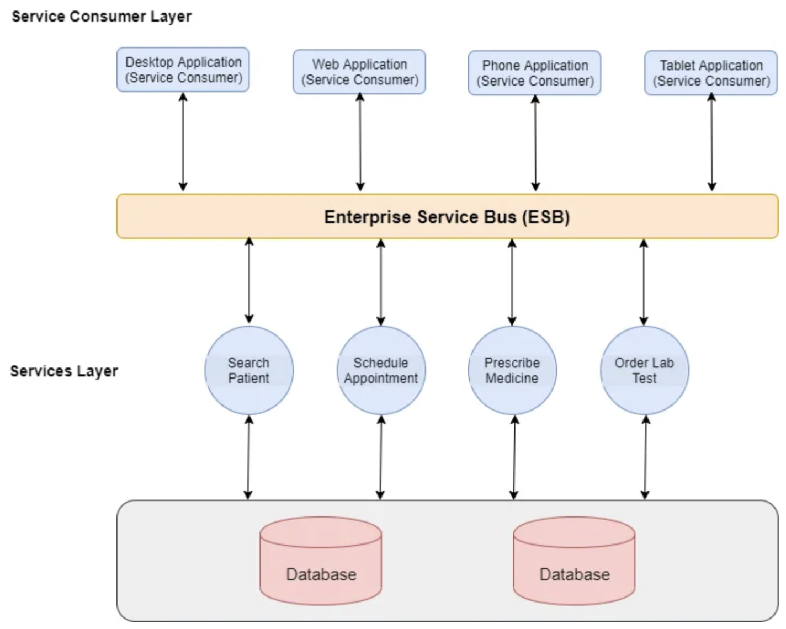

# Service Oriented Architecture Overview:

### Overview:
* A **Service-Oriented Architecture** (**SOA**) is a **software design approach** where **applications** are 
  **composed** of **loosely coupled** and **reusable software components or services**
* These services can be **accessed and utilized independently across different systems** within a **network**
* Key elements of a Service-Oriented Architecture include:
  * **Services:**
    * These are the building blocks of an SOA
    * They are **self-contained units of functionality** that can be **accessed over a network** and can perform 
      **specific tasks**
    * Services are designed to be **modular**, **independent**, and **reusable**
  * **Loose Coupling:**
    * Services in an SOA are **loosely coupled**, meaning they are **independent of each other** and can **operate 
      without knowing** the **internal workings** of **other services**
    * This promotes **flexibility**, **scalability**, and **easier maintenance**
  * **Interoperability:**
    * **Services** in an **SOA** can **communicate** and **work with each other** **regardless of the technology 
      stack** or **programming languages** they are built upon
    * This **interoperability** allows **different systems to interact seamlessly**
  * **Standards-Based:**
    * SOA often relies on standardized protocols and formats for communication between services, such as **SOAP** 
      (**Simple Object Access Protocol**) or **REST** (**Representational State Transfer**)
  * **Reusability:**
    * Services in an SOA are designed to be **reusable** across **various applications and processes**
    * This **promotes efficiency** and **reduces redundancy** in development efforts
  * **Scalability and Flexibility:**
    * SOA allows for **easy scalability** as **new services can be added** or **existing ones modified** **without 
      affecting** the **entire system**
    * It offers **flexibility** in **adapting to changing business requirements**
* SOA has been widely adopted in **enterprise-level applications and systems** due to its **ability to facilitate better 
  integration** between **different systems**, **enhance flexibility**, and **streamline development** by **breaking 
  down complex applications** into **manageable** and **reusable components**
* 