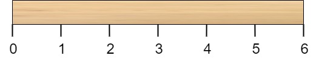
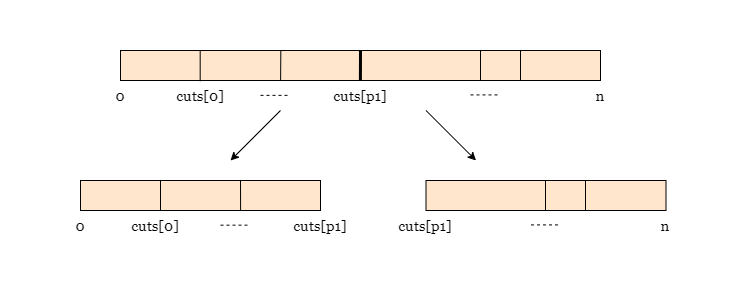
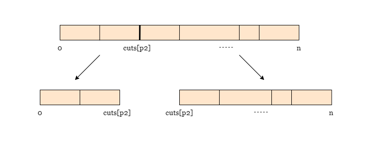
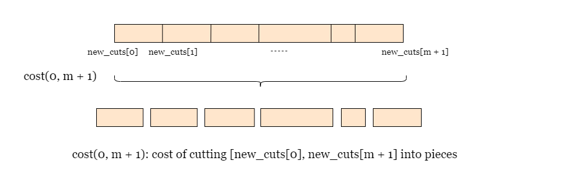
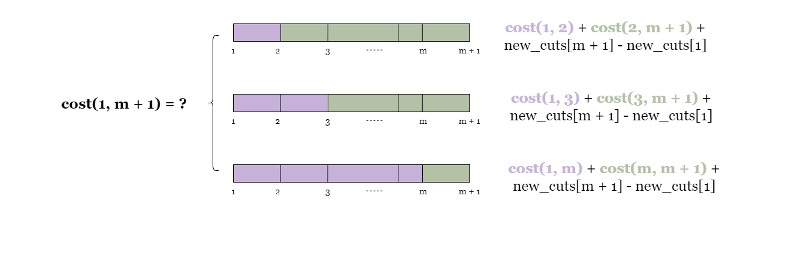

# Dynamic Programming Interview Questions:

### Minimum Cost to Cut a Stick:
* [Leet Code Link](https://leetcode.com/problems/minimum-cost-to-cut-a-stick/editorial/)
* **Question:**
  * Given a **wooden stick** of **length `n` units**
  * The stick is **labelled** from **0 to `n`**
  * For example, a **stick of length 6** is labelled as follows:
    * 
  * Given an integer array `cuts` where `cuts[i]` **denotes a position you should perform a cut at**
  * You should **perform the cuts in order**, **you can change the order of the cuts as you wish**
  * The **cost of one cut** is the **length of the stick to be cut**, the **total cost** is the **sum of costs of all 
    cuts**
  * When you cut a stick, it will be **split** into **two smaller sticks** (i.e. the **sum of their lengths** is the 
    **length of the stick before the cut**)
  * Please refer to the first example for a better explanation
  * Return the **minimum total cost** of the cuts
  * **Example 1:**
    * 
    * **Input:** `n` = 7, `cuts` = `[1,3,4,5]`
    * **Output:** 16
    * **Explanation:** Using **cuts `order` = `[1, 3, 4, 5]`** as in the **input** leads to the **following scenario**:
    * 
    * The **first cut** is done to a **rod of length 7** so the **cost is 7**
    * The **second cut** is done to a **rod of length 6** (i.e. the **second part of the first cut**), the **third** is 
      done to a **rod of length 4** and the **last cut** is to a **rod of length 3**
    * The total cost is `7 + 6 + 4 + 3 = 20`
    * **Rearranging the cuts** to be **`[3, 5, 1, 4]`** for example will lead to a scenario with **total cost = 16** (as 
      shown in the example photo 7 + 4 + 3 + 2 = 16)
  * **Constraints:**
    * 2 <= `n` <= 106
    * 1 <= `cuts.length` <= `min(n - 1, 100)`
    * 1 <= `cuts[i]` <= n - 1
    * **All the integers in `cuts` array** are **distinct**
* **Solutions:**
  * Based on observations, we can conclude that this problem exhibits **optimal substructure** and **overlapping 
    subproblems**, which makes it an **ideal candidate** for **dynamic programming**
  * **Every time** we **perform a cut**, we get **two new sticks**
  * We can use **dynamic programming** to **solve these smaller fragments optimally**, then **combine their costs** to 
    **find the answer to the original problem**
  * **Approach 1: Top-down Dynamic Programming:**
    * **Intuition:**
      * We can **consider various plans** for **cutting the stick into pieces**, but let us begin by **examining the 
        costs and outcomes** of some **potential first cuts**
      * If we select **`cuts[p1]`** as the **first cutting position**, it would result in a **cost of `n`** and split 
        the stick into **two pieces of length `cuts[p1]` and `n - cuts[p1]`, respectively**
      * 
      * Choosing **another first cutting position**, say **`cuts[p2]`** would **also bring a cost of `n`** and **split 
        the stick** into **two pieces of length `cuts[p2]`** and **`n - cuts[p2]`**
      * 
      * We **define a function `cost(left, right)`** that **returns the minimum cost** of **all the cuts on the stick 
        fragment** with **both ends at `cuts[left]` and `cuts[right]`**
      * Since the **two ends** of the **original stick 0 and `n`** are **not included in cuts**, we **create a new 
        array** `new_cuts` that **includes these two ends** and **all `m` cutting positions in cuts**
      * This **allows us** to **represent every stick fragment** using **two indices from `new_cuts`**
      * The **`new_cuts` array** is **defined as `new_cuts = [0, cuts[0], cuts[1], ..., cuts[m - 1], n]`** (Suppose the 
        **length of cuts is `m`**) where `new_cuts[0]` = 0 and `new_cuts[m + 1]` = `n`
      * Finally, **we should sort `new_cuts`** so that **all the cutting positions are ordered**
      * Hence, the **minimum cost** of **all the cuts required** on the **original stick** can be denoted as 
        **`cost(0, m + 1)`**
      * 
      * As a **base case**, **we know `cost(left, left + 1) = 0`, `(left < m + 1)`**, because **we do not need to 
        continue cutting fragments** that **contain no cutting positions** (For example, **`[new_cuts[0], 
        new_cuts[1]]`**)
      * Now let's move on to find `cost(0, m + 1)`
      * **No matter where we cut**, we will **incur a cost equal to the length**, which is **`new_cuts[m + 1] - 
        new_cuts[0]`**
      * Let's see what happens when we **choose cutting positions**:
        * If we choose **`new_cuts[1]`** as the **first cutting position**, we end up with **two stick fragments 
          `[new_cuts[0]`**, **`new_cuts[1]]`** and **`[new_cuts[1]`, `new_cuts[m + 1]]`**
        * This means our **overall cost** will be **`cost(0, 1)` + `cost(1, m + 1)` + `new_cuts[m + 1]` - 
          `new_cuts[0]`** (the **cost of cutting the two new sticks plus the cost of cutting the current stick** as 
          already established)
        * If we choose **`new_cuts[2]`** as the **first cutting position**, we end up with **two stick fragments** 
          **`[new_cuts[0], new_cuts[1]]`** and **`[new_cuts[1], new_cuts[m + 1]]`**
        * This means our **overall cost** will be **`cost(0, 2)` + `cost(2, m + 1)` + `new_cuts[m + 1]` - 
          `new_cuts[0]`**
      * 

