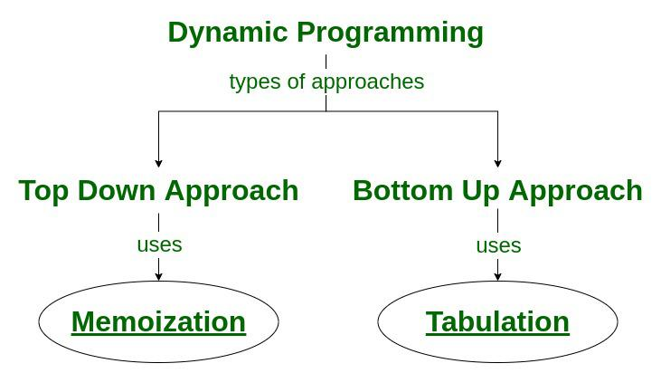

# Dynamic Programming Overview:

### Overview:
  * Dynamic programming is a **problem-solving technique** used to solve complex problems by **breaking them down** 
    into **simpler overlapping subproblems** and **solving each subproblem only once**, **storing the results of each 
    subproblem** to **avoid redundant calculations**
  * The key idea is to solve a problem by **efficiently combining the solutions to its subproblems**
  * Dynamic programming is typically used for **optimization problems**, where the goal is to **find the best solution 
    among a set of possible solutions**
  * It's especially useful in situations where there are **overlapping subproblems** and **optimal substructure**
    * Overlapping subproblems refer to the fact that the **same subproblems** are **solved multiple times**, and 
      **optimal substructure** implies that the **optimal solution** to the problem can be **constructed** from the 
      **optimal solutions of its subproblems**
  * **Memoization:**
    * **Memoization** is a specific technique used in dynamic programming
    * It involves **storing the results** of **expensive function calls** and **returning the cached result** when the 
      **same inputs occur again**
    * In the context of dynamic programming, this is often done by using a **data structure**, like an **array** or a 
      **dictionary**, to store the results of subproblems
    * Here's how memoization works:
      * When a **subproblem** needs to be solved, the **solution is first checked in the memoization data structure**
      * **If** the **solution** for that **particular subproblem** is **found in the data structure**, it's 
        **returned**, and **no additional computation is needed**
      * **If** the solution is **not found**, the subproblem is solved as usual, and the result is **stored in the 
        data structure** for **future reference**
    * Memoization helps **reduce the time complexity** of a **dynamic programming algorithm** by **eliminating 
      redundant calculations**
    * It is **especially useful** in **recursive algorithms** where the **same subproblems** are **solved multiple 
      times**
    * By **storing and reusing solutions**, memoization can **significantly improve** the **efficiency** of dynamic 
      programming algorithms
  * **Tabulation:**
    * **Tabulation** is another common technique in dynamic programming used to solve complex problems by **breaking 
      them down** into **simpler subproblems** and **systematically building up the solutions** to these subproblems in 
      a **tabular form**
    * It is **often contrasted with memoization**, which is another dynamic programming technique that involves storing 
      solutions to subproblems in a cache as they are computed
    * Here's how tabulation works:
      * **Initialization:**
        * The **first step** in tabulation is to **create a table or an array** with **appropriate dimensions to 
          represent the subproblems**
        * The **table is initialized** with the **solutions to the simplest base cases of the problem**
      * **Iterative Solution:**
        * The algorithm then **iterates through the subproblems**, **starting with the simplest ones**, and **uses the 
          solutions** to these simpler subproblems to **compute the solutions to more complex subproblems**
        * It **systematically builds up the table** in a **bottom-up manner**, typically from **left to right** and 
          **top to bottom**
      * **Filling the Table:**
        * At **each iteration**, the algorithm **computes the solution** for the **current subproblem using the 
          solutions of previously solved subproblems**
        * It **fills in the table with the solutions as it progresses**
      * **Final Solution:**
        * The **final solution** to the main problem is **typically found** in the **last cell of the table**
        * It **represents** the **optimal solution** to the problem by **combining the solutions** to the 
          **subproblems**
  * Tabulation is **especially useful** when the **structure of the problem** allows for a **systematic and efficient** 
    way to build up the solutions in a table
  * It is **well-suited** for problems with a **clear order of computation**, where you can **guarantee** that **all 
    the necessary subproblems have been solved before solving the main problem**
  * Tabulation is often **preferred** when you **don't need to store solutions** to the subproblems **separately** and 
    are **concerned about the space complexity**, as it **avoids the overhead of storing intermediate results in a 
    cache**, which is common in memoization
  * 
 