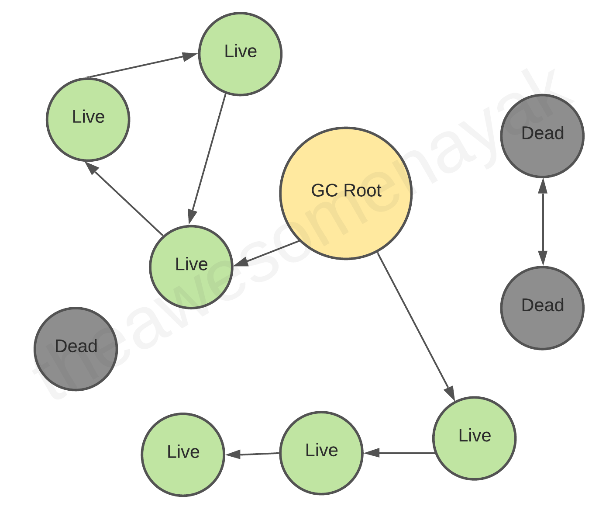

# Garbage Collection Overview:

### Overview:
* **Garbage collection** is a **memory management technique** used to **automatically identify** and **reclaim memory** 
  that is **no longer in use by a program**, **freeing up resources** and **preventing memory leaks**
* In **many programming languages**, especially those with **automatic memory management** (e.g., **Java**, **C#**, 
  **Python**), garbage collection is an **integral part of the runtime system**
* Here's how garbage collection works:
  * **Memory Allocation:**
    * When a program **creates objects or data structures**, **memory is allocated to store them**
    * This **memory allocation** can occur on **the heap or the stack**, depending on the **language** and the 
      **specific needs** of the program
  * **Tracking References:**
    * The **runtime system keeps track of all references to objects in the program**
    * This includes **references** in **variables**, **data structures**, and **objects themselves**
  * **Identifying Unreachable Objects:**
    * **Periodically**, or **when memory becomes scarce**, the **garbage collector** **scans through the heap** (or 
      **other memory areas**) to **identify objects** that are **no longer reachable or accessible** from the 
      **program's root references**
    * **Objects** that are **no longer reachable** are **considered garbage**
  * **Reclaiming Memory:**
    * Once the garbage collector has **identified the unreachable objects**, it **reclaims the memory associated with 
      these objects**
    * This memory is then **made available** for **future memory allocations**
  * **Finalization (Optional):**
    * **Some garbage collectors** also support **finalization**, which **allows objects to perform cleanup operations 
      before they are collected and their memory is released**
    * This can be **useful** for **resource management**, like **closing files or network connections**
* Garbage collection has **several advantages** in software engineering:
  * It **helps prevent memory leaks**, where **memory is allocated but never released**, leading to **excessive memory 
    consumption** and **potential application crashes**
  * It **simplifies memory management for developers**, as they **don't need to manually allocate and deallocate 
    memory**
  * This **reduces the risk** of **memory-related bugs**, like **dangling pointers** or **accessing freed memory**
  * It **improves software reliability** and **robustness** by **minimizing memory-related errors**
* However, garbage collection does have **some trade-offs**, such as the **potential** for **increased runtime 
  overhead** and **less predictable memory behavior**
  * In some **real-time** or **resource-constrained applications**, **manual memory management might be preferred** to
    have **more control over memory usage**
* Different programming languages and runtime environments may **implement garbage collection differently**, using 
  **various algorithms** and **strategies** to **optimize** its performance and **minimize disruption** to the program's 
  execution
* 