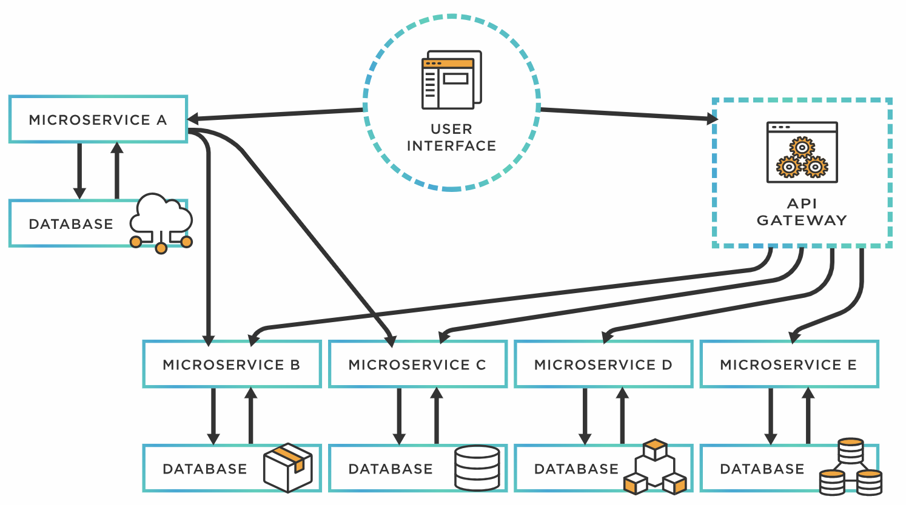

# Microservice Overview:

### Overview:
* A **microservice** is a **software development architectural style** that **structures** an **application** as a 
  **collection** of **small**, **loosely coupled**, and **independently deployable services**
* **Each service** is **focused** on **performing a specific business function** and **communicates with other 
  services** through **well-defined APIs**
* Key characteristics of microservices include:
  * **Decomposition:**
    * **Breaking down** an **application** into **smaller**, **manageable services** based on 
      **specific functionalities or domains**
  * **Independence:**
    * **Each microservice** operates **independently** and can be **developed**, **deployed**, **scaled**, and 
      **maintained separately**
    * This allows teams to **work on different services simultaneously without affecting others**
  * **Loose Coupling:**
    * Services are designed to be **loosely coupled**, meaning they can **function independently** and are **not tightly 
      bound** to the **internal workings** of **other services**
  * **Communication via APIs:**
    * Services **communicate** with each other using **standardized protocols**, often through **RESTful APIs**, 
      **messaging queues**, or other mechanisms, enabling **seamless interaction**
  * **Autonomy:**
    * Microservices can be developed using **different technologies**, **languages**, or **frameworks** based on the 
      **specific requirements** of **each service**
  * **Scalability and Resilience:**
    * Each service can be **scaled independently** based on demand, and **failures in one service** generally **don’t 
      impact** the **entire application** due to their **isolated nature**
  * **DevOps and Continuous Deployment:**
    * Microservices **encourage DevOps practices**, allowing for **continuous integration**, **deployment**, and 
      **testing** of **individual services**
* **Microservices architecture** offers **advantages** such as **flexibility**, **agility**, **scalability**, and 
  **ease of maintenance**
* However, it also **introduces challenges** like **increased complexity** in **managing distributed systems**, 
  **inter-service communication**, and **potential overheads** in **orchestrating multiple services**
* Overall, microservices aim to **improve** the **agility** and **scalability** of applications by **breaking them into 
  smaller, more manageable components** that can be **developed and deployed independently**
* 