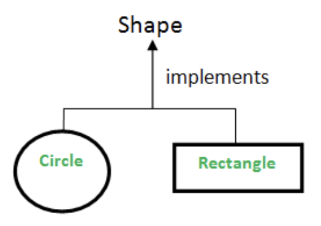

# Interface Overview:

### Overview:
* An **interface** is a fundamental concept that **defines a contract** for **how a class or module should behave**
* It **specifies** a **set of methods or operations** that a **class** that **implements** the interface **must 
  provide**
* An interface **defines what methods** an implementing class **should have** but **doesn't provide the actual 
  implementation** of those methods
* It serves as a **blueprint** or **template** for **defining the structure of classes that adhere to it**
* Here are some key points about interfaces in software engineering:
  * **Method Signatures:**
    * An interface **defines method signatures** (**names, return types, and parameters**) that implementing classes 
      **must include**
    * It specifies **what operations** can be performed but **not how they are performed**
  * **Abstraction:**
    * Interfaces allow for a **high level of abstraction** by defining a **common set of methods** that multiple classes 
      can implement in their own way
    * This enables **polymorphism** and **code reuse**
  * **Multiple Inheritance:**
    * In languages like **Java** and **C#**, interfaces are used to achieve a form of **multiple inheritance**, as **a 
      class can implement multiple interfaces**
    * This **allows a class** to **inherit behavior** from **multiple sources**
  * **Decoupling:**
    * Interfaces help in achieving **loose coupling between components** in a software system
    * **Classes** that interact with each other through interfaces **depend on the contract specified** by the interface 
      **rather** than the **concrete implementation** of the classes
  * **Encapsulation and Separation of Concerns:**
    * By defining interfaces, you can **separate the public contract** from the **internal implementation details**
    * This encourages **good software design practices** and **modularization**
  * **Design by Contract:**
    * Interfaces are a part of the "**Design by Contract**" approach to software development, where the **behavior** of classes 
      is **explicitly defined** through **preconditions, postconditions, and invariants**
* 

### Java Example:
```java
interface Shape {
    double calculateArea();
}
class Circle implements Shape {
    private double radius;

    public Circle(double radius) {
        this.radius = radius;
    }

    @Override
    public double calculateArea() {
        return Math.PI * radius * radius;
    }
}
```

### Differences Between Interface & Abstract Class in Java:
* In Java, both abstract classes and interfaces serve as mechanisms for **achieving abstraction** and **defining a 
  contract** for classes
* However, they have distinct differences in terms of their usage and capabilities:
  * **Instantiation:**
    * **Abstract Class:**
      * **Abstract classes cannot be instantiated directly**
      * You **cannot create objects** of an abstract class
      * They are **meant to be extended** by **concrete (sub)classes**
    * **Interface:**
      * **Interfaces cannot be instantiated either**
      * They provide a **contract** that **classes must adhere to** but **do not contain any implementation** themselves
  * **Inheritance:**
    * **Abstract Class:**
      * **Subclasses** of an **abstract class** **inherit** both the **structure (methods and fields)** and the 
        **implementation (concrete methods)** of the **abstract class**
      * A **class can extend only one abstract class**
    * **Interface:**
      * A class can implement **multiple interfaces**
      * It **only inherits** the **method signatures (abstract methods)** defined in the interfaces
      * Interfaces **do not provide any implementation**
  * **Abstract Methods:**
    * **Abstract Class:**
      * Abstract classes can have **abstract methods (methods without a body)** that **must be implemented** by concrete 
        subclasses
      * They can also have **concrete methods** with **implementations**
    * **Interface:**
      * All methods in an interface are **abstract by default**, and **no implementation is provided** within the interface
      * A class implementing an interface **must provide concrete implementations** for **all the methods defined** in the 
        interface
  * **Fields:**
    * **Abstract Class:**
      * Abstract classes **can have fields (member variables)** with **various access modifiers**, including **private, 
        protected, and public**
    * **Interface:**
      * Fields in interfaces are **implicitly public, static, and final**, making them **constants**
      * They are usually used for **defining constants** and **not for storing object state**
  * **Multiple Inheritance:**
    * **Abstract Class:**
      * **Java** supports **single inheritance only**, meaning a class **can extend only one other class**, including 
        abstract classes
    * **Interface:**
      * A class **can implement multiple interfaces**, allowing for a form of **multiple inheritance of behavior**
      * This is particularly useful when a class **needs to inherit functionality from multiple sources**
  * **Purpose:**
    * **Abstract Class:**
      * Abstract classes are used when you want to provide a **common base class** for a **family of related classes**
      * They can include **shared functionality** and provide a **partial implementation**
    * **Interface:**
      * Interfaces are used to define a **contract** that **multiple classes can adhere to**
      * They allow for achieving **polymorphism** and designing classes that are **not necessarily related by 
        inheritance but share common behaviors**
  * **Extending vs. Implementing:**
    * **Abstract Class:**
      * You extend an abstract class using the `extends` keyword
    * **Interface:**
      * You implement an interface using the `implements` keyword
      * A class can implement **multiple interfaces**
* In summary, the choice between an abstract class and an interface depends on your design goals
* Use an **abstract class** when you have a **common base class** with **some shared implementation**, and use an 
  interface when you want to **define a contract** that **multiple unrelated classes can adhere to** or when you need to 
  implement **multiple interfaces** for a single class to **achieve a certain level of abstraction**
