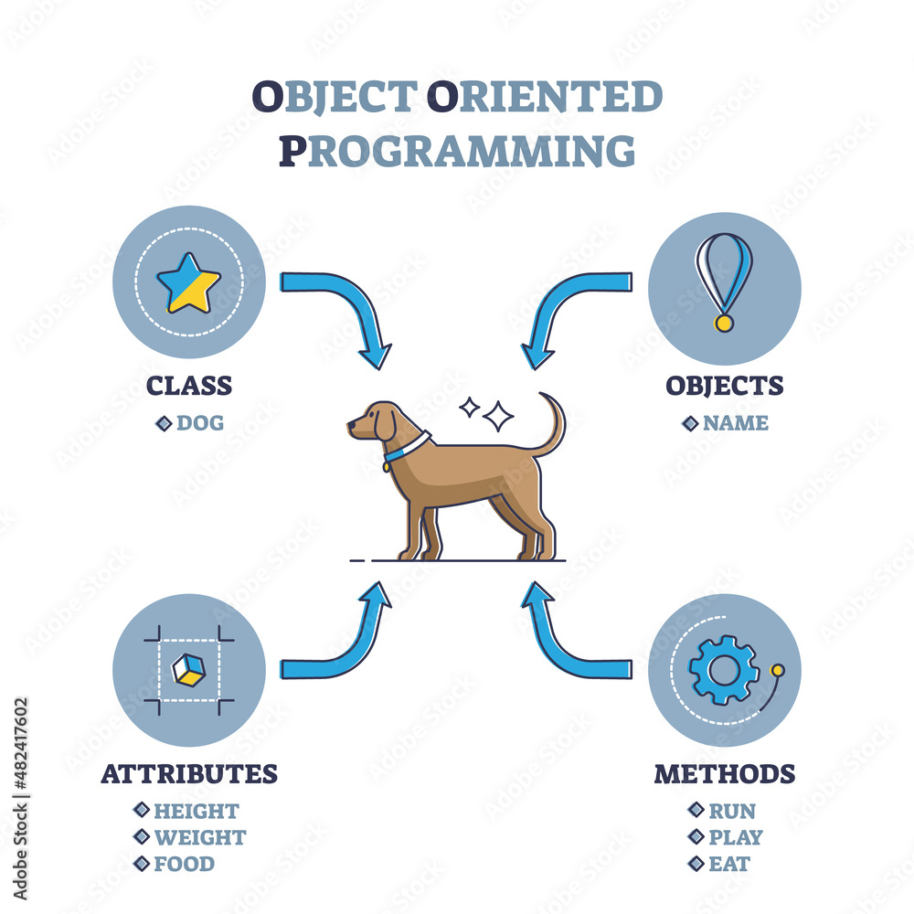

# Object Oriented Programming Overview:

### Overview:
* Object-Oriented Programming (OOP) is a popular and powerful **programming paradigm** based on the concept of 
  "**objects**"
* In OOP, software is designed and structured around objects, which are **instances of classes**
* These objects **encapsulate data** and the **operations** that can be performed on that data
* OOP is characterized by several key principles:
  * **Objects:**
    * Objects are the **fundamental building blocks** of OOP
    * They represent **real-world entities or concepts** and bundle both **data (attributes or properties)** and the 
      **functions (methods or behaviors)** that operate on that data
  * **Classes:**
    * Classes are **blueprint or template definitions** for objects
    * They describe the **structure** and **behavior** of objects
    * You can create **multiple instances (objects)** from a **single class**
  * **Encapsulation:**
    * Encapsulation is the concept of **bundling data** (**attributes**) and the **methods that operate on that data** 
      within a single unit, the class
    * It **hides the internal details** of **how an object works** and **provides an interface** for interacting with 
      the object
    * Access to the object's data is controlled through **access modifiers (public, private, protected, etc.)**
  * **Inheritance:**
    * Inheritance allows you to **create new classes based on existing classes**, **inheriting their attributes and 
      methods**
    * It **promotes code reuse** and the creation of **class hierarchies**
    * **Subclasses** (derived classes) can **add new attributes and methods** or **override** inherited ones
  * **Polymorphism:**
    * Polymorphism enables **objects of different classes** to be treated as **objects of a common superclass**
    * This allows for the **implementation of generic code** that can work with **objects of different types** in a more 
      **generalized way**
    * It includes **compile-time (method overloading)** and **run-time (method overriding)** polymorphism
* OOP is widely used in software development because it offers several benefits:
  * **Modularity:**
    * OOP encourages the development of **modular** and **organized** code
    * Classes act as **self-contained units** that can be **developed, tested, and maintained independently**
  * **Reusability:**
    * **Inheritance** and the ability to **create new classes based on existing ones** promote code reuse, **reducing 
      redundancy** and making it **more efficient** to **create and maintain software**
  * **Abstraction:**
    * OOP allows you to **define abstract data types and interfaces**, which provide a **high-level view** of objects 
      and their behavior while **hiding** the **underlying implementation details**
  * **Simplicity and Understandability:**
    * OOP **models real-world objects and their relationships**, making code **more intuitive** and **easier to 
      understand and maintain**
  * **Extensibility:**
    * OOP makes it **easier** to **add new features** or **modify existing ones** by **extending** or **modifying** 
      classes
* Common OOP languages include **Java**, **C++**, **Python**, **C#**, and many others
* These languages provide the tools and syntax for defining classes and creating object-oriented software
* 

### Polymorphism:
* **Polymorphism** is a fundamental concept in **object-oriented programming (OOP)** that allows **objects of different 
  classes** to be treated as objects of a **common superclass**
* It enables you to write code that can work with objects in a **more generalized way**, making your programs more 
  **flexible** and **extensible**
* Polymorphism is one of the four **fundamental principles** of OOP, known as the "**Four Pillars of OOP**," which also 
  include encapsulation, inheritance, and abstraction
* There are two main types of polymorphism in OOP:
  * **Compile-time (or Static) Polymorphism:**
    * This is also known as **method overloading**
    * It occurs when **multiple methods** in the **same class** have the **same name but different parameters** 
      (different method signatures)
    * The appropriate method to be executed is **determined** by the **method's name** and the **number or type of its 
      parameters at compile time**
    * **Compile-time polymorphism** is **resolved during the compilation phase**
```java
public class MathOperations {
    public int add(int a, int b) {
        return a + b;
    }

    public double add(double a, double b) {
        return a + b;
    }
}
```
* **Run-time (or Dynamic) Polymorphism:**
  * This is also known as **method overriding**
  * It occurs when a **subclass** provides a **specific implementation** of a **method** that is **already defined in 
    its superclass**
  * The choice of **which method to execute** is **determined at runtime based on the actual object type**
  * Run-time polymorphism is **achieved through inheritance** and the **`@Override` annotation** in **Java**
```java
class Animal {
    void makeSound() {
        System.out.println("Some generic animal sound");
    }
}

class Dog extends Animal {
    @Override
    void makeSound() {
        System.out.println("Bark");
    }
}

class Cat extends Animal {
    @Override
    void makeSound() {
        System.out.println("Meow");
    }
}
```
* In this example, the **`makeSound` method** is **overridden** in the **`Dog` and `Cat` subclasses**, providing 
  **specific implementations** for each type of animal
* The method to execute is **determined at runtime based on the actual object type**
* Polymorphism allows you to write code that works with objects at a **higher level of abstraction**, promoting code 
  **reusability**, **flexibility**, and **easier maintenance**
* It is a powerful concept in OOP and is commonly used to achieve dynamic behavior in software systems
