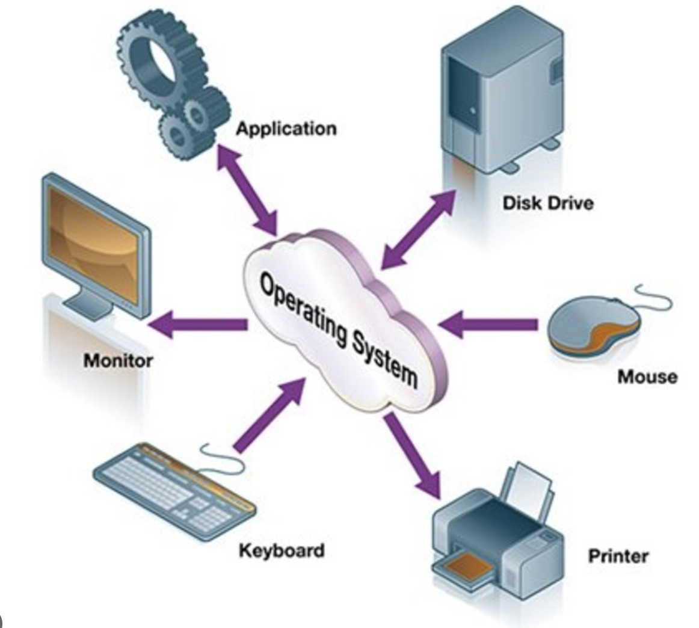

# Operating System Memory Management Overview:

### Overview:
* An **operating system** (**OS**) is a **fundamental software component** that acts as an **intermediary** between 
  **computer hardware** and **user applications**
* It provides a **platform** for **managing** and **coordinating computer hardware resources** and **facilitates 
  interaction** between **users** and the **underlying hardware**
* Key functions and components of an operating system include:
  * **Resource Management:**
    * The OS **manages hardware resources** such as **CPU** (**central processing unit**), **memory**, **storage 
      devices**, **input/output** (**I/O**) **devices** (like **keyboards**, **mice**, **printers**), and 
      **network interfaces**
    * It **allocates resources** to **different processes** and **ensures their efficient utilization**
  * **Process Management:**
    * It handles the **creation**, **scheduling**, and **execution** of **processes or tasks**
    * The OS **manages** the **running** of **multiple processes simultaneously**, allowing **multitasking** and 
      **time-sharing** among **applications**
  * **Memory Management:**
    * Operating systems oversee the **allocation** and **deallocation** of **memory** to **processes**, ensuring that 
      **each process** has **sufficient memory space** and that memory is **efficiently utilized** through techniques 
      like **virtual memory**, **paging**, and **swapping**
  * **File System Management:**
    * It **manages files and directories** on **storage devices**, handling **file creation**, **deletion**, 
      **reading**, and **writing**
    * The file system **organizes** and **maintains data** in a **structured manner** for **easy access and retrieval**
  * **Device Management:**
    * The OS **interacts with** and **manages input/output devices**, **controlling data transfer between devices and 
      the CPU**
    * It handles **device drivers**, ensuring **proper communication between software and hardware components**
  * **Security and Protection:**
    * Operating systems **enforce security measures** by **controlling access to resources**, **maintaining user 
      authentication**, and **implementing data protection mechanisms** to **prevent unauthorized access** and ensure 
      **system integrity**
  * **User Interface:**
    * It provides a **user interface** that **allows users** to **interact** with the **computer system**, either 
      through a **command-line interface** (**CLI**) or a **graphical user interface** (**GUI**), enabling users to 
      **run applications**, **manage files**, and **perform various tasks**
* Operating systems come in different types, such as **Windows**, **macOS**, **Linux**, **Unix**, and various **mobile 
  operating systems** (**Android**, **iOS**)
* Each type may have different features, functionalities, and user interfaces, but they all serve the **fundamental 
  purpose** of **managing and coordinating computer hardware resources** to **enable** the **execution of applications** 
  and provide a **user-friendly computing environment**
* 

### Memory Management in an Operating System:
* **Memory management** in an **operating system** involves the **management** and **organization** of a **computer's 
  memory**, which is crucial for **storing** and **retrieving data** and **instructions** required by **various 
  processes** and **applications running on the system**
* Key components and functions of memory management include:
  * **Memory Allocation:**
    * This involves **allocating portions of the memory** to **different processes or programs**
    * When a **process is initiated**, the **operating system allocates memory space for it**
    * Memory allocation methods include **contiguous allocation**, **non-contiguous allocation** (such as **paging** and 
      **segmentation**), and **virtual memory techniques**
  * **Memory Protection:**
    * The operating system **ensures** that **each process operates within its allocated memory space** and **cannot access 
      memory allocated** to **other processes**
    * This **prevents unauthorized access** and **enhances system stability and security**
  * **Memory Mapping and Address Translation:**
    * It involves **mapping logical addresses** used by a **process** to **physical addresses** in the **computer's 
      memory**
    * **Virtual memory techniques** allow **processes** to use **more memory** than is **physically available** by 
      utilizing **secondary storage** (such as a **hard disk**) as an **extension of physical memory**
  * **Memory Deallocation/Freeing:**
    * When a **process** **completes** or **terminates**, the **memory allocated to it** needs to be **deallocated** and 
      **released back to the system**
    * This **prevents memory leaks** and ensures **efficient utilization of resources**
  * **Memory Fragmentation Management:**
    * Over time, **memory becomes fragmented** with **free memory scattered** in **small chunks**
    * Memory management techniques aim to **minimize fragmentation** and **reclaim fragmented memory** for allocation
  * **Swapping and Paging:**
    * **Swapping** involves **moving entire processes in and out of main memory to and from secondary storage** (like a 
      **hard disk**), while **paging** involves **dividing memory** into **fixed-size blocks (pages)** to **manage 
      memory efficiently**
* **Efficient memory management** is **crucial** for **system performance**, **stability**, and the **overall 
  execution** of **processes** within an **operating system**
* Operating systems utilize **various algorithms and strategies** to **manage memory effectively**, considering factors 
  like **allocation efficiency**, **access speed**, and **resource utilization**

### Paging in an Operating System:
* Paging is a **memory management scheme** used by operating systems to **manage** and **organize** the **allocation of
  physical memory**
* It involves **dividing the physical memory** into **fixed-size blocks** called "**pages**" and the **logical memory**
  (**used by processes**) into **blocks of the same size** called "**page frames**"
* Key aspects of paging include:
  * **Fixed-Size Pages:**
    * **Physical memory** is **divided** into **fixed-size pages**, typically **ranging from 4 KB to 8 KB in size**
    * Each page is a **contiguous block of memory**
  * **Logical Address Space:**
    * The **logical address space** of a **process** is **also divided into pages** of the **same size** as the
      **physical memory pages**
    * These logical pages are referred to as "**page frames**"
  * **Page Table:**
    * The operating system maintains a **data structure** called the "**page table**" for **each process**
    * The page table **maps the logical pages** of the **process** to the **corresponding physical pages in memory**
    * It keeps track of **which logical page resides in which physical page**
  * **Address Translation:**
    * When a **program running in a process references a memory address**, the **CPU generates a logical address**
    * The **page table** is used to **translate this logical address** to the **corresponding physical address in
      memory**, allowing the **process** to **access the required data**
  * **Memory Protection:**
    * Paging enables **memory protection** by **assigning permissions** (**read**, **write**, **execute**) to **each
      page**
    * The page table includes **information about access rights** for **each page**, **preventing unauthorized access
      to memory**
  * **Virtual Memory:**
    * Paging is a **fundamental component** of **virtual memory systems**
    * It allows processes to use **more memory than is physically available** by utilizing **secondary storage** (like
      a **hard disk**) as an **extension of physical memory**
    * Pages **not currently needed** can be **stored in secondary storage** and **brought back into physical memory when
      required** (this process is called "**page swapping**" or "**page fault handling**")
* Paging allows for **efficient memory management** by **breaking down the memory** into **smaller**, **manageable
  units** (**pages**) and providing a **mapping mechanism between logical and physical memory addresses**
* It **enables processes** to **access memory** in a **structured** and **controlled** manner while supporting **memory
  protection** and **virtual memory functionality**
* 

### Processes in an Operating System:
* In an operating system, a **process** is an **instance of a running program**
* It's the **basic unit of execution** that **represents** a **program in execution**
* Each process has its **own memory space**, **resources**, and **state within the operating system**
* Key characteristics of processes include:
  * **Program in Execution:**
    * A process represents a **program** that is **loaded into memory** and **actively running**
    * It includes the **program code**, **data**, **variables**, and **other resources needed for execution**
  * **Memory Space:**
    * Each process has its **own memory space**, which includes the **program's instructions**, **variables**, 
      **stack**, **heap**, and **other data structures**
    * The **memory space** is **segregated** to **prevent processes** from **accessing each other's memory directly**
  * **State:**
    * Processes can **exist in various states**, such as **running**, **ready**, **blocked**, or **terminated**
    * The **operating system scheduler** manages the **state transitions** and decides **which process should execute at a 
      given time**
  * **Resources:**
    * Processes **require resources** like **CPU time**, **memory**, **I/O devices**, and other system resources to 
      execute
    * The operating system manages the **allocation** and **scheduling** of these resources among **multiple processes**
  * **Process Control Block (PCB):**
    * The operating system maintains a data structure called the **Process Control Block (PCB)** for **each process**
    * The PCB contains information about the process, such as its **state**, **program counter**, **register contents**, 
      **priority**, **memory allocation**, and other relevant details required by the operating system to manage the 
      process
  * **Concurrency and Multitasking:**
    * Processes allow for **concurrency** and **multitasking**, enabling **multiple programs to run simultaneously** on 
      a **single processor** through **time-sharing** or on **multiple processors** in a **multi-core system**
* Processes are **fundamental** to the **functioning of an operating system**, enabling the **execution** of **multiple 
  programs concurrently** while providing **isolation** and **protection** to ensure that **one process cannot 
  interfere** with the **memory** or **resources** of **another process**
* Operating systems use various **scheduling algorithms** and **mechanisms** to **manage processes efficiently**, 
  **allocating resources fairly** and **ensuring optimal system performance**
* 

### Threads in an Operating System:
* Threads are the **smallest unit of execution within a process**
* They represent **independent sequences of execution within a program** and **share the same memory space and 
  resources** of the **parent process**
* **Threads within a process** can **execute concurrently**, allowing for **parallel execution of tasks**
* Key characteristics of threads include:
  * **Lightweight Execution Units:**
    * Threads are **lighter than processes**, as they **share resources** with **other threads** within the **same 
      process**
    * **Creating** and **managing threads** is **generally faster** and **requires less overhead** than **creating and 
      managing separate processes**
  * **Shared Memory:**
    * Threads **within a process** share the **same memory space**, which means they can **directly access** the **same variables**, 
      **data structures**, and **code within the process without needing additional communication mechanisms**
  * **Concurrency:**
    * Threads allow for **concurrent execution** within a process
    * **Multiple threads** within the **same process** can **execute different tasks simultaneously**, taking advantage 
      of **multiple CPU cores** or **processor resources**
  * **Thread States:**
    * Similar to processes, threads can **exist in various states**, including **running**, **ready**, **blocked**, or
      **terminated**
    * The operating system **scheduler** manages the **state transitions** and determines **which thread should 
      execute** at a **given time**
  * **Thread Control Block (TCB):**
    * Each thread has its own **Thread Control Block (TCB)** or **thread context**, which contains **information specific to 
      that thread**, such as **program counter**, **register contents**, **stack pointer**, and **other relevant 
      details needed by the operating system** to **manage the thread**
  * **Benefits of Multithreading:**
    * **Multithreading** allows for **improved responsiveness in applications**, **efficient utilization of CPU 
      resources**, **easier parallelism in program design**, and **better performance** in tasks that can be **divided** 
      into **smaller subtasks**
* Threads play a **crucial role** in **modern operating systems and programming**
* They allow for **concurrent execution**, enabling **efficient multitasking**, **parallelism**, and **responsiveness** 
  in applications
* However, **managing threads** requires **proper synchronization and coordination** to avoid issues such as **race 
  conditions**, where **multiple threads access shared data concurrently** and might lead to **unexpected behavior** or 
  **inconsistencies in the program**
* Various synchronization mechanisms like **locks**, **mutexes**, **semaphores**, and **condition variables** are used 
  to **manage thread interactions** and **ensure data integrity**
* 

### Synchronization in an Operating System:
* **Synchronization** in an operating system refers to the **coordination and control** of **multiple threads** or 
  **processes** to ensure **orderly** and **safe access** to **shared resources**, such as **shared memory**, **data**, 
  or **devices**, in a **concurrent computing environment**
* The **primary goals** of synchronization are to **prevent data corruption**, **avoid race conditions**, and **maintain 
  consistency** when **multiple threads or processes** are **accessing shared resources simultaneously**
* Key concepts and mechanisms used in synchronization include:
  * **Mutual Exclusion:**
    * Mutual exclusion **ensures** that **only one thread or process** can **access a shared resource** at **any given 
      time**
    * Techniques like **locks** (such as **mutexes** and **semaphores**) and **atomic operations** are used to **enforce 
      mutual exclusion**, allowing threads to **acquire exclusive access** to **critical sections of code** or **shared 
      resources**
  * **Critical Sections:**
    * **Critical sections** refer to parts of the code that **access shared resources**
    * By utilizing synchronization mechanisms, **critical sections** can be **protected** to ensure that **only one 
      thread can execute them at a time**, **preventing concurrent access** and **potential conflicts**
  * **Semaphore:**
    * **Semaphores** are **synchronization objects** that **control access** to a **shared resource** by **maintaining a 
      count**
    * They allow a **certain number of threads** to **access a resource simultaneously** **based on the semaphore's 
      count**
    * Semaphores can be **binary (mutex)** or **counting**, providing synchronization and coordination among threads
  * **Mutex:**
    * **Mutex** (short for **mutual exclusion**) is a **synchronization mechanism** that **allows only one thread at a 
      time** to **acquire a lock on a resource**
    * It **prevents other threads** from **accessing the resource** until the **owning thread releases the lock**
  * **Condition Variables:**
    * Condition variables are used to **coordinate the execution of threads** based on **certain conditions**
    * They allow threads to **wait for a specific condition to become true before proceeding**, enabling synchronization 
      between threads in scenarios where **certain conditions need to be met** before proceeding
  * **Atomic Operations:**
    * These are operations that are **performed atomically without interruption**, ensuring that they are 
      **indivisible**
    * Atomic operations, **often supported by hardware** or **provided by programming language constructs**, are used to 
      perform **thread-safe operations** on **shared data**
* Synchronization mechanisms and techniques are **essential** in **preventing data inconsistencies**, 
  **race conditions**, **deadlocks**, and **other concurrency-related issues** that can arise in **multi-threaded** or 
  **multi-process environments**
* Properly implemented synchronization ensures that **concurrent programs execute correctly** and **maintain data 
  integrity** while allowing **efficient utilization** of **system resources**

### Multithreading in an Operating System:
* Multithreading in an operating system refers to the ability of a program or process to **create and manage multiple 
  threads within a single process**
* **Each thread** represents an **independent sequence of execution** that can **perform tasks concurrently** within 
  the **same process**
* Key aspects of multithreading include:
  * **Concurrency:**
    * Multithreading allows **multiple threads** within a **single process** to **execute concurrently**
    * Each thread **runs independently** and can perform its **own set of instructions**, allowing for **parallelism** 
      and **efficient utilization of CPU resources**
  * **Shared Resources:**
    * Threads **within the same process share** the **same memory space and resources**, including **variables**, **data 
      structures**, and **code segments**
    * This allows threads to **communicate and interact** by **sharing data directly**, but it also requires **proper 
      synchronization mechanisms** to **prevent data corruption and race conditions**
  * **Lightweight:**
    * Threads are generally **lighter in weight compared to processes**, as they **share resources and memory** with 
      **other threads within the same process**
    * Creating and managing threads is often **faster** and involves **less overhead** than **creating separate 
      processes**
  * **Benefits:**
    * Multithreading offers several advantages, including **improved responsiveness** in applications, **enhanced 
      performance** through **parallelism**, **better utilization of multi-core processors**, and the ability to 
      **perform multiple tasks simultaneously**
  * **Types of Threads:**
    * Operating systems may support different types of threads, such as **user-level threads** (managed by **user-level 
      libraries** or **applications**) and **kernel-level threads** (**managed directly by the operating system 
      kernel**)
    * **Kernel-level threads** typically offer **more efficient management** and **better support** for **parallel 
      execution** on **multiple CPU cores**
  * **Synchronization:**
    * Proper synchronization mechanisms, such as **locks**, **mutexes**, **semaphores**, and **condition variables**,
      are crucial in multithreading to **manage shared resources**, **prevent data corruption**, and **ensure thread 
      safety**
* Multithreading is **widely used** in **modern operating systems** and **programming languages** to develop 
  applications that benefit from **concurrent execution**, **responsiveness**, and **efficient resource utilization**
* However, managing threads and ensuring proper synchronization requires **careful design and programming** to avoid 
  issues like **race conditions**, **deadlocks**, and **thread interference**

