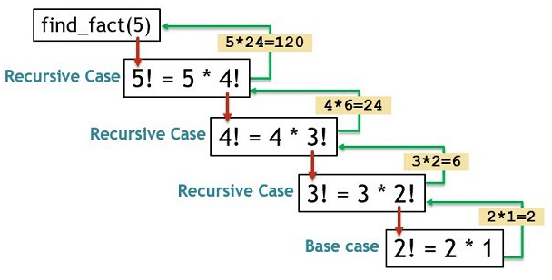

# Recursion Overview:

### Overview:
* Recursion is a programming and mathematical concept that involves a **function** or a **process** **calling itself** 
  in order to **solve a problem** or **perform a task**
* In the context of mathematics and computer science, recursion is a technique where a problem is **divided into smaller, 
  similar sub-problems**, and **each sub-problem** is **solved** by **applying the same algorithm or function**
* This process **continues until a specific condition is met**, at which point the **recursion terminates**
* In a recursive algorithm or function, there are typically two main components:
  * **Base Case:**
    * The **base case** is a condition that **specifies when the recursion should stop**
    * When the base case is met, the **recursion terminates**, and the **function returns a result**
    * Base cases are **essential** to **prevent infinite recursion**
  * **Recursive Case:**
    * The **recursive case** is the part of the algorithm or function where it **calls itself** with **modified input or 
      parameters** to solve a **smaller instance of the same problem**
    * This step helps **break down the problem** into **simpler parts** and **gradually leads to the base case**
* Recursion is commonly used in various programming tasks, such as solving problems involving data structures like 
  **trees and graphs**, **searching and sorting algorithms**, and **mathematical computations** like **factorials** or 
  **Fibonacci sequences**
* Recursive solutions can often lead to elegant and concise code when applied appropriately
* However, it's important to be mindful of the termination conditions (base cases) and the potential for stack overflow 
  if not optimized correctly
* 

### Recursive Factorial Example in Java:
* In this Java code, the **factorial method** calculates the factorial of a given number `n` using recursion
* The **base case** is when `n` is 0 or 1, in which case the factorial is 1
* In the **recursive case**, the **method calls itself** with `n - 1` and **multiplies the result by `n`**, which is 
  the essence of calculating the factorial
* The recursion continues **until the base case is reached**
```
public class FactorialCalculator {
    
    public static int factorial(int n) {
        if (n == 0 || n == 1) {
            return 1;
        } else {
            return n * factorial(n - 1);
        }
    }

    public static void main(String[] args) {
        int number = 5;
        int result = factorial(number);
        System.out.println("Factorial of " + number + " is " + result);
    }
}
```
