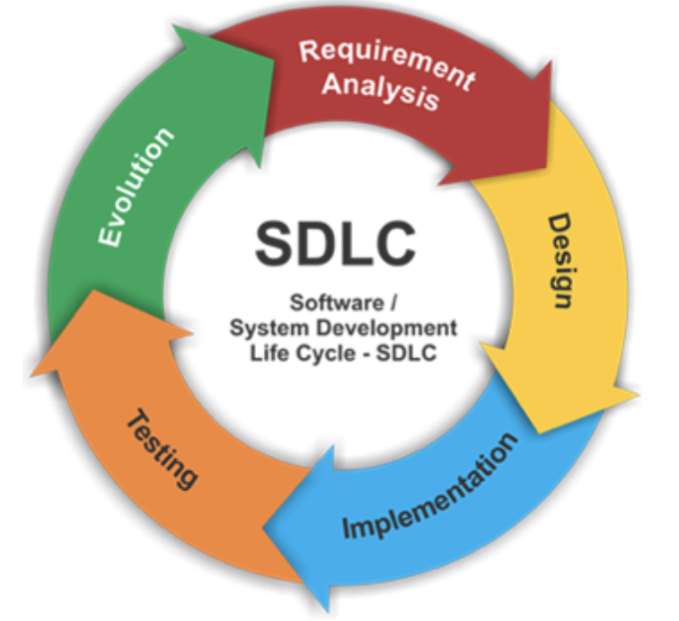

# Software Development Lifecycle Overview:

### Overview:
* The **Software Development Lifecycle** (**SDLC**) is a **structured process** or **methodology** for **planning, 
  creating, testing, deploying, and maintaining software systems**
* The SDLC defines the **stages** and **tasks** that **software development teams follow** to produce **high-quality 
  software** that **meets user requirements** while **managing resources and constraints**
* The specific phases and activities in an SDLC can vary based on the chosen model, methodology, and organizational 
  needs
* However, the most common phases in the software development lifecycle include:
  * **Planning:**
    * In this **initial phase**, the project's **goals, scope, and feasibility are defined**
    * **Project stakeholders**, including **clients**, **developers**, and **managers**, work together to create a 
      **project plan**, set **objectives**, **allocate resources**, and **establish a timeline**
  * **Requirements Gathering and Analysis:**
    * In this phase, the team **collects and analyzes requirements** from **stakeholders** to **understand the problem 
      domain** and **define the features**, **functionality**, and **constraints** of the software
  * **Design:**
    * The **design phase** involves creating **detailed technical specifications** and **architectural plans**
    * This includes **designing** the **system's structure**, **database schema**, **user interfaces**, and **other 
      relevant components**
  * **Implementation (Coding):**
    * In this phase, **developers write code** according to the **design specifications**
    * They **build, test, and refine** the software system
    * This phase also includes **integration testing**, which ensures that **individual components work together**
  * **Testing:**
    * **Software testing** is a **crucial phase** where the system is evaluated to **identify and fix defects**, ensure 
      it **meets requirements**, and **performs as expected**
    * Testing can include **unit testing**, **integration testing**, **system testing**, and **user acceptance testing**
  * **Deployment:**
    * During **deployment**, the software is **rolled out** to a **production environment**, making it **available to 
      end-users**
    * Deployment may involve **installation**, **configuration**, **data migration**, and **ensuring the system is 
      operational and secure**
  * **Maintenance and Support:**
    * The **maintenance** phase involves **ongoing support**, **updates**, **bug fixes**, and **enhancements** to the 
      software
    * This phase **can last for the entire software's lifecycle** and includes **monitoring**, **optimizing**, and 
      **addressing issues that arise**
* Common SDLC Models and Methodologies:
  * **Waterfall Model:**
    * **Sequential, linear approach** where **each phase depends on the deliverables of the previous one**
  * **Agile Model:**
    * **Iterative** approach that **divides** the project into **small increments**, allowing for **flexibility** and 
      **collaboration with stakeholders**
  * **Scrum:**
    * A **specific agile methodology** involving **short, time-boxed development cycles** called **sprints**
  * **Kanban:**
    * An **agile methodology** that emphasizes **visualizing and managing work in progress**
  * **Lean:**
    * Focuses on **minimizing waste** in the development process
  * **DevOps:**
    * **Combines development and operations** to **streamline software delivery** and **improve collaboration**
  * **Spiral Model:**
    * A **risk-driven** approach that **cycles through stages** to **refine the software incrementally**
* The choice of SDLC model or methodology depends on the project's requirements, constraints, and the development 
  team's preferences
* Regardless of the chosen approach, the goal of the SDLC is to ensure software is developed efficiently, meets user 
  needs, and is maintainable over time
* 