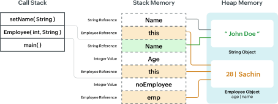

# Stack vs. Heap Memory Overview:

### Overview:
* In software engineering, "**memory**" typically refers to the **computer's main memory (RAM)**, which is used to 
  **store data and program instructions** while a **software application** is **running**
* **Memory management** is the process of **allocating** and **managing** this **memory efficiently**
* When discussing memory in the context of programming, it often refers to the **division of memory** into **two main 
  areas**, the "**stack**" and the "**heap**"
* **Stack Memory:**
  * **Stack memory** refers to a **specific region** of a **computer's memory (RAM)** used for **managing the execution 
    of a program**, including **function calls**, **maintaining local variables**, and **controlling program flow**
  * Here are some key characteristics and definitions of stack memory:
    * **Function Call Management:**
      * The stack is crucial for **keeping track** of the **order in which functions are called** and **returning 
        control to the calling functions**
      * **Each time a function is called**, a **new section of memory** called a "**stack frame**" is **created on the 
        stack** to **store information related to that function call**
    * **Last-In, First-Out (LIFO):**
      * Stack memory operates in a **last-in, first-out** manner
      * This means that the **most recently called function** is the **first to complete its execution** and **return 
        control to the calling function**, much like a stack of items where the **last item added** is the **first to be 
        removed**
    * **Local Variables:**
      * Stack memory is used for **storing local variables** that are **declared within functions**
      * These variables have a **limited scope and lifetime**, tied to the function's execution
    * **Automatic Allocation and Deallocation:**
      * Memory allocated on the stack is **automatically deallocated** when it **goes out of scope**
      * This means that **when a function exits**, the memory associated with its stack frame is **automatically 
        released**
    * **Fixed Size:**
      * Stack memory is typically of a **fixed size**, determined by **system settings** or **program configurations**
      * If the stack becomes full, it can result in a **stack overflow**, causing **program crashes**
    * **Speed:**
      * Accessing data from the stack is **very fast** since it involves **simple pointer manipulation** and is 
        **optimized** for **quick retrieval**
  * Stack memory plays a crucial role in the organization of program execution and memory management
  * It is used for managing the order of function calls, local variables, and program flow, making it an essential 
    component of most software applications
  * **Proper understanding and management** of stack memory are **essential** for **efficient and reliable program 
    execution**
* **Heap Memory:**
  * Heap memory refers to a **region** of a **computer's memory (RAM)** that is used for **dynamic memory allocation**
  * Unlike stack memory, which is used for managing function calls and local variables with a limited scope, heap 
    memory provides a **more flexible and dynamic storage space** for data that **doesn't adhere** to the **strict 
    structure** of **function call stacks**
  * Here are some key characteristics and definitions of heap memory:
    * **Dynamic Memory Allocation:**
      * Heap memory is used for **dynamically allocating** and **managing** memory **during a program's runtime**
      * It allows for the **creation of data structures and objects** with **arbitrary lifetimes**
    * **Manual Allocation and Deallocation:**
      * Unlike stack memory, memory allocated on the heap must be **explicitly allocated** by the programmer using 
        functions like `malloc` (in C/C++) or `new` (in C++) and **explicitly deallocated** when it's no longer needed 
        using functions like `free` or `delete`
    * **Variable Size:**
      * Heap memory is typically **larger** and **more flexible in size** compared to stack memory
      * The **size of the heap** is **constrained** by the **available system memory**, and **data structures** can 
        **grow or shrink as needed**
    * **Suitable for Complex Data Structures:**
      * Heap memory is often used for **managing complex data structures** such as **linked lists**, **trees**, and 
        **objects** with **unknown or long lifetimes**
      * It is also used for creating and managing objects in **object-oriented programming**
    * **Longer Lifetime:**
      * Data allocated on the heap can persist **beyond the scope of the functions that created them**, and they 
        **remain in memory** until **explicitly deallocated** by the programmer
      * This allows for **data** to be **shared and used** across **different parts of a program**
    * **Slower Access Speed:**
      * Accessing data from the heap is **generally slower** than accessing data from the stack because it involves 
        **memory allocation and deallocation functions**
  * Heap memory is essential for managing data that needs to be allocated and deallocated dynamically and that may have 
    variable lifetimes
  * Proper management of heap memory is crucial to **avoid memory leaks** and ensure **efficient use of system 
    resources** in a **software application**
* 
