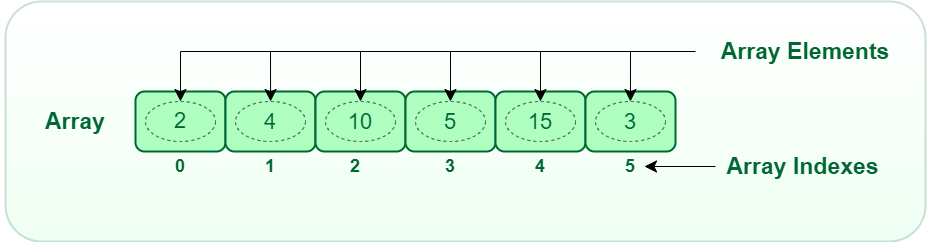

# Array Overview:

### Overview:
* An **array** is a **fundamental** and **widely used data structure** in computer science and programming
* It is a **collection of elements**, **each identified** by an **index** or a **key**
* The elements in an array are stored in **contiguous memory locations**, which means they are **stored one after the 
  other in memory**
* This property allows for **efficient random access,** which means you can **directly access any element** of the array 
  using its **index** or **key**
* Key characteristics of an array data structure:
  * **Fixed Size:**
    * Arrays have a **fixed size**, which is **determined when the array is created**
    * Once the size is set, it **cannot be changed**, unless **a new array is created** with a **different size**, and 
      the **elements are copied over**
  * **Homogeneous Elements:**
    * In most programming languages, arrays store elements of the **same data type**
    * For example, an **integer array** can **only store integers**, and a **string array** can **only store strings**
  * **Contiguous Memory:**
    * The elements of an array are stored in **adjacent memory locations**
    * This property allows for **efficient memory access** but also means that **inserting or removing** elements in the 
      **middle** of an array can be **slow** because it **may require shifting other elements**
  * **Zero-Based Indexing:**
    * In many programming languages, arrays use **zero-based indexing**, which means the **first element** is accessed 
      using the **index 0**, the second with 1, and so on
* Common operations on arrays include:
  * **Accessing Elements by Index:**
    * You can **retrieve** the value of an element at a specific index in **constant time (O(1))**
  * **Updating Elements by Index:**
    * You can **change the value** of an element at a specific index in **constant time (O(1))**
  * **Iterating Through Elements:**
    * You can traverse all elements of an array one by one with **time complexity of O(n)**
  * **Finding the Length:**
    * You can determine the number of elements in an array
    * Finding the length of an array has a constant-time complexity, which is denoted as **O(1)**
  * **Searching for Elements:**
    * You can search for a specific element in an array, but this may require iterating through the array, resulting in 
      a **time complexity of O(n)**
* 
* Arrays are used for a wide range of purposes in programming, including **storing collections of data**, **implementing 
  data structures** like **stacks** and **queues**, and serving as the **foundation** for **more complex data 
  structures** such as **dynamic arrays** (e.g., **ArrayList** in Java) and **matrices**
* While arrays offer **efficient access** to elements, they have **limitations**, such as their **fixed size** and 
  **inefficiency** when elements **need to be inserted or removed frequently** from positions **other than the ends of 
  the array**
* In such cases, **dynamic data structures** like **lists** or **linked lists** may be more appropriate