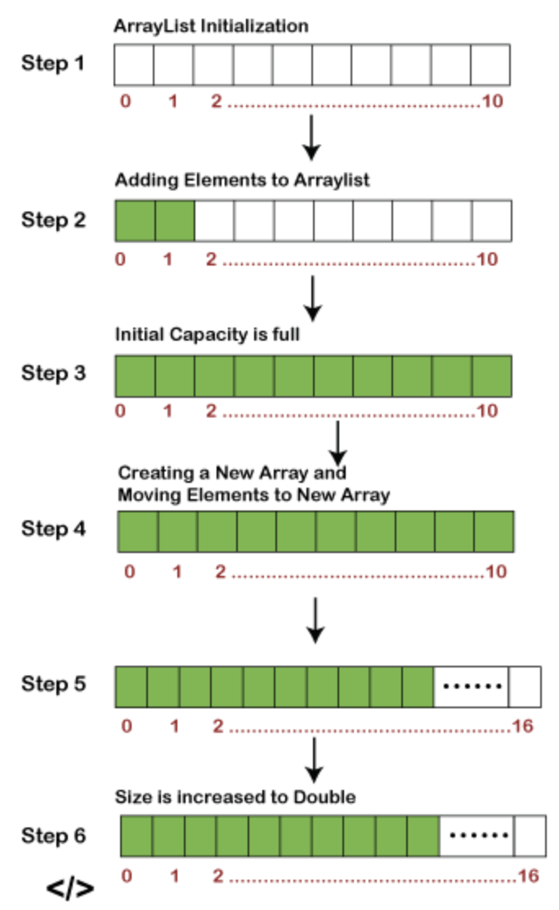

# ArrayList Overview:

### Overview:
* An **ArrayList** is a **data structure** used in **many programming languages**, including **Java**, to store an 
  **ordered collection** of elements
* It **combines the features** of an **array (fixed size)** and a **dynamically resizable list**
* The `ArrayList` class in Java is **roughly equivalent** to the `Vector` class, except that it is **unsynchronized**
  * If **multiple threads** access an `ArrayList` instance **concurrently**, and **at least one of the threads modifies the list 
    structurally**, it **must be synchronized externally**, typically by "**wrapping**" the list with:
    * `List list = Collections.synchronizedList(new ArrayList(...));`
* The key characteristics of an ArrayList include:
  * **Dynamic Resizing:**
    * ArrayLists can **dynamically grow or shrink** in size to **accommodate the number of elements they contain**
    * When an ArrayList **exceeds its current capacity**, it **automatically reallocates and copies its elements** to a 
      **larger block of memory**
  * **Ordered Collection:**
    * Elements in an ArrayList are **ordered by their insertion order**
    * Each element has a **position defined by an index**, **starting from zero for the first element**
  * **Random Access:**
    * Elements in an ArrayList can be **accessed efficiently using their index**
    * This allows for **quick retrieval and modification** of elements
  * **Heterogeneous Data:**
    * In many programming languages, ArrayLists can store elements of **varying data types**, although it's **more 
      common** to store elements of the **same data type** for **type safety**
  * **Dynamic Insertions and Deletions:**
    * You can **easily insert or remove** elements at **any position** within an ArrayList
    * These operations can be performed with **relatively low time complexity**, but **inserting or removing elements 
      at the beginning or middle of a large ArrayList may involve copying elements**, which can be **less efficient**
  * **Amortized Constant-Time Operations:**
    * ArrayLists provide **amortized constant-time (O(1)) access** to elements, which means that, **on average**, 
      **element access is very efficient**, even though **resizing may occasionally lead to a longer operation**
  * **Efficient Iteration:**
    * ArrayLists allow for **efficient iteration** through their elements, making them **suitable for looping 
      operations**
* ArrayLists are a **popular choice** for managing collections of data in languages like **Java and C#**
* They are **widely used** when you need a data structure with **dynamic sizing**, but you **also require efficient 
  random access to elements**
* However, it's important to note that ArrayLists may involve **occasional resizing**, which can have an **impact on 
  performance** in situations where **frequent insertions or deletions** are required, **especially at the beginning or 
  middle of a large list**
* 

### Advantages of Using ArrayLists vs. LinkedLists in Java:
* Using an ArrayList over a LinkedList offers several advantages in certain scenarios
* Here are the main advantages of using an ArrayList:
  * **Efficient Random Access:**
    * `ArrayList` provides **fast** and **efficient** **random access** to **elements by index**
    * This is because elements are stored in a **contiguous block of memory**, allowing **direct access** to any element 
      with a simple index lookup (`O(1)` time complexity)
    * If your application requires **frequent random access**, ArrayList is a better choice
  * **Better Memory Efficiency:**
    * `ArrayList` typically **consumes less memory per element** compared to `LinkedList`
    * It **only** needs to store the **elements themselves** and an **internal array to manage them**, whereas 
      `LinkedList` requires **additional memory** for **node references**
  * **Faster Iteration:**
    * `ArrayList` is generally **more efficient** for **iterating** through the elements compared to `LinkedList`
    * This is because **iterating** over an **array-based structure** is **faster** due to **cache locality** and 
      **fast random access**
  * **Fast Appends:**
    * **Appending elements** to the **end of an `ArrayList`** is **efficient** with **`O(1)` time complexity**
    * If your use case involves **frequent additions** at the **end of the list**, `ArrayList` is a good choice
  * **Lower Overhead:**
    * ArrayList has **lower overhead** in terms of **memory** and **performance** compared to `LinkedList`, as it 
      **doesn't involve maintaining node references**
  * **Simplified Code:**
    * Using `ArrayList` can lead to **simpler** and **more concise code** for certain operations, as it **doesn't 
      require navigating through node references**
  * **Data Serialization:**
    * `ArrayList` may be a better choice when working with **data serialization and deserialization**, as it has a 
      **straightforward linear layout in memory**, making it **easier to serialize and deserialize**
* In summary, you should choose an `ArrayList` over a `LinkedList` when your **primary use cases** involve **efficient 
  random access**, **better memory efficiency**, **fast iteration**, and **frequent append operations**
* However, it's important to note that `ArrayList` may not be the best choice if your use case involves **frequent 
  insertions and removals** in the **middle of the list**, as it can be **less efficient** in such scenarios compared to 
  `LinkedList`
* Your choice should depend on the specific requirements of your application

### ArrayLists vs. Vectors in Java:
* In Java, both ArrayLists and Vectors and  are **dynamic array-like data structures** used to store and manage 
  collections of elements
* They have many similarities, but there are key differences between them:
  * **Synchronization:**
      * Unlike **ArrayLists**, **Vectors** are **synchronized**, which means they are **inherently thread-safe**
      * This ensures that **multiple threads** can **access and modify a Vector concurrently without external 
        synchronization**
      * However, this synchronization can introduce a **performance overhead** in **single-threaded applications**
  * **Performance:**
      * ArrayLists, being un-synchronized, can offer **better performance** in **single-threaded** contexts
      * But in **multithreaded situations**, you need to take extra care to synchronize access or consider using a 
        thread-safe collection or synchronized block (**explicit synchronization**)
  * **Growth and Shrinkage:**
    * **Vector:**
      * Vectors **grow by a fixed amount** when they reach their capacity
      * This can sometimes result in **memory wastage** because you **may allocate more space than necessary**
    * **ArrayList:**
      * ArrayLists **grow dynamically** by **doubling their size** when they **reach their capacity**
      * This **dynamic resizing** strategy is often **more memory-efficient**
  * **Legacy vs. Modern Usage:**
    * **Vector:**
      * Vectors are considered **legacy collections** and are **less commonly used** in **modern Java programming**
    * **ArrayList:**
      * ArrayLists are the **preferred choice** for dynamic arrays in Java, **especially in single-threaded scenarios**
* In summary, the primary difference between a Vector and an ArrayList in Java is that **Vectors** are **synchronized** and 
  provide **built-in thread safety**, while ArrayLists are not synchronized by default and can offer better performance in 
  single-threaded scenarios
* For most modern Java applications, ArrayLists are often preferred due to their flexibility and efficiency
* If you need thread safety, you can use **explicit synchronization** or **consider other thread-safe collection classes** 
  provided by Java