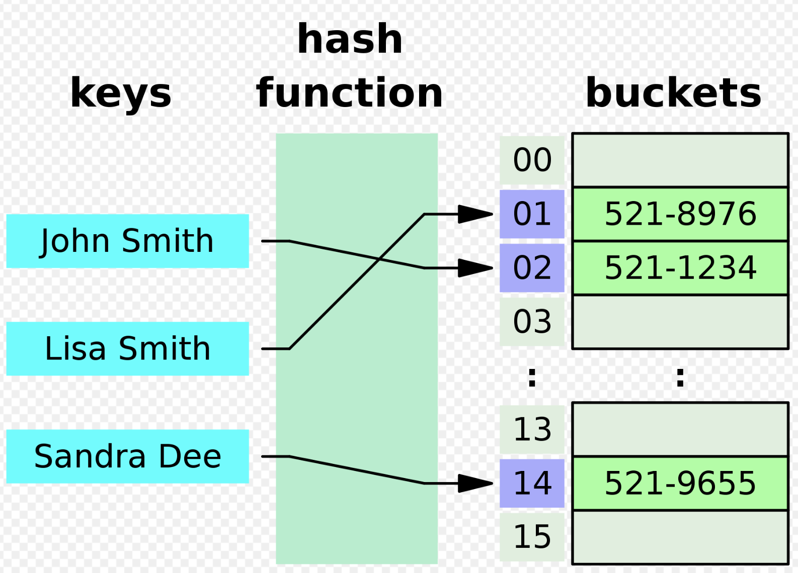

# Hash Table Overview:

### Overview:
* A **hash table**, also known as a **hash map**, is a **data structure** that allows for **efficient data retrieval and 
  storage**
* It is designed to **store and retrieve key-value pairs**, making it ideal for tasks like **searching, indexing, and 
  data organization**
* It uses a **hash function** to **map keys to specific locations (buckets or slots) in an array**
* **Each key** is associated with a **unique index** in the array, which allows for **constant-time (O(1)) average 
  complexity** for **basic operations** such as **insertion, deletion, and retrieval of values associated with a given 
  key**
* 
* Key components of a hash table include:
  * **Hash Function:**
    * This is a **mathematical function** that **takes a key as input** and **generates an index or hash code for that 
      key**
    * The **hash code** is used to determine the **location in the array** where the **key-value pair will be stored**
  * **Array or Bucket Array:**
    * A hash table consists of an **array of buckets**, each capable of storing **one or more key-value pairs**
    * The **size of this array can vary**, and it plays a **crucial role** in the **performance of the hash table**
  * **Collision Handling:**
    * **Collisions** occur when **multiple keys generate the same hash code**, resulting in **multiple keys** attempting 
      to be stored in the **same bucket**
    * Hash tables employ various techniques (e.g., **chaining** or **open addressing**) to handle collisions and store 
      **multiple key-value pairs** in the **same bucket**
  * **Load Factor:**
    * The **load factor** is a measure of **how full the hash table is**
    * It is the **ratio** of the **number of key-value pairs stored** to the **total number of buckets**
    * Maintaining a **balanced load factor** is important for the efficiency of a hash table
* Hash tables are **widely used in computer science** and software development because they provide **fast access** to 
  data **based on their keys**, and they are suitable for a wide range of applications, including **dictionaries**, 
  **caches**, **symbol tables**, and more
