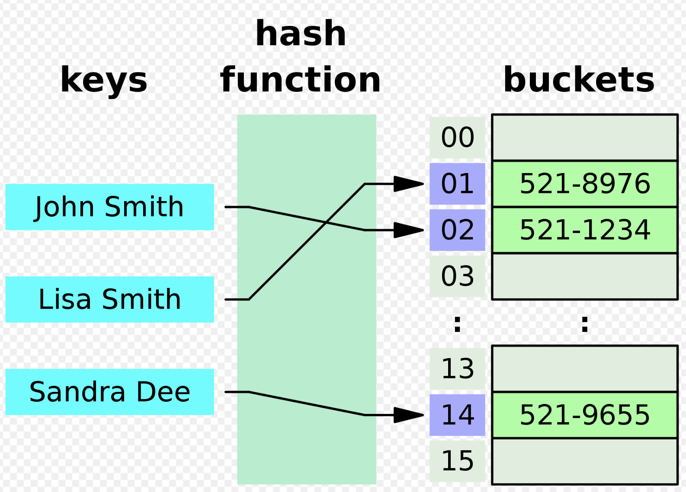

# Hash Table Overview:

### Overview:
* A **hash table**, also known as a **hash map**, is a **data structure** that allows for **efficient data retrieval and 
  storage**
* It is designed to **store and retrieve key-value pairs**, making it ideal for tasks like **searching, indexing, and 
  data organization**
* It uses a **hash function** to **map keys to specific locations (buckets or slots) in an array**
* **Each key** is associated with a **unique index** in the array, which allows for **constant-time (O(1)) average 
  complexity** for **basic operations** such as **insertion, deletion, and retrieval of values associated with a given 
  key**
* 
* Key components of a hash table include:
  * **Hash Function:**
    * This is a **mathematical function** that **takes a key as input** and **generates an index or hash code for that 
      key**
    * The **hash code** is used to determine the **location in the array** where the **key-value pair will be stored**
  * **Array or Bucket Array:**
    * A hash table consists of an **array of buckets**, each capable of storing **one or more key-value pairs**
    * The **size of this array can vary**, and it plays a **crucial role** in the **performance of the hash table**
  * **Collision Handling:**
    * **Collisions** occur when **multiple keys generate the same hash code**, resulting in **multiple keys** attempting 
      to be stored in the **same bucket**
    * Hash tables employ various techniques (e.g., **chaining** or **open addressing**) to handle collisions and store 
      **multiple key-value pairs** in the **same bucket**
  * **Load Factor:**
    * The **load factor** is a measure of **how full the hash table is**
    * It is the **ratio** of the **number of key-value pairs stored** to the **total number of buckets**
    * Maintaining a **balanced load factor** is important for the efficiency of a hash table
* Hash tables are **widely used in computer science** and software development because they provide **fast access** to 
  data **based on their keys**, and they are suitable for a wide range of applications, including **dictionaries**, 
  **caches**, **symbol tables**, and more

### The `HashMap` Class in Java:
* The **`HashMap` class** in Java is part of the **Java Collections Framework** and is used to **store key-value pairs** 
  in a collection
* It is an **implementation of the `Map` interface**, which allows you to **map keys to values**, **ensuring that each 
  key is unique within the map**
* Here's an overview of the `HashMap` class in Java:
  * **Key-Value Pairs:**
    * A `HashMap` **stores elements** as **key-value pairs**
    * **Each key** is **associated** with a **unique value**
    * **Keys** are used to **retrieve values** from the map
  * **Unordered:**
    * `HashMap` **does not guarantee any specific order** of elements
    * The **order of key-value pairs may change over time**, and it's **not based on insertion order** or **any other 
      specific criteria**
  * **Null Keys and Values:**
    * `HashMap` **allows one null key** and **multiple null values**
    * This means that you can have **at most one key with a null value**, but you can have **multiple key-value pairs** 
      with **null values**
  * **Performance:**
    * `HashMap` provides **`O(1)` average-case time complexity** for **basic operations** like **get**, **put**, 
      **remove**, and **containsKey**, **assuming** a **good hash function** and **even distribution of keys**
  * **Synchronization:**
    * `HashMap` is **not synchronized**, which means it is **not thread-safe**
    * If you need to use a `HashMap` in a **multi-threaded environment**, you should use `ConcurrentHashMap` or **externally 
      synchronize the access** to the HashMap
  * **Iterating:**
    * You **can iterate over the key-value pairs** of a HashMap using an **iterator** or **enhanced for loop**
    * The order of iteration is not guaranteed
* Here's an example of how to use a `HashMap` in Java:
```java
public class HashMapExample {
    public static void main(String[] args) {
        // Creating a HashMap
        Map<String, Integer> hashMap = new HashMap<>();

        // Adding key-value pairs
        hashMap.put("Alice", 25);
        hashMap.put("Bob", 30);
        hashMap.put("Charlie", 22);

        // Accessing values by key
        int age = hashMap.get("Alice");
        System.out.println("Alice's age is " + age);

        // Checking if a key exists
        boolean containsKey = hashMap.containsKey("David");
        System.out.println("Does the map contain David? " + containsKey);

        // Iterating over the key-value pairs
        for (Map.Entry<String, Integer> entry : hashMap.entrySet()) {
            System.out.println(entry.getKey() + " is " + entry.getValue() + " years old.");
        }
    }
}
```
* In this example, we create a `HashMap` that maps **names** (**keys**) to **ages** (**values**)
* We **add key-value pairs**, **retrieve values by keys**, **check for the existence of a key**, and **iterate through 
  the map's contents**
* **Iterating Through a HashMap:**
* * **Using an Enhanced For Loop (for-each loop):**
```
for (Map.Entry<String, Integer> entry : hashMap.entrySet()) {
    String key = entry.getKey();
    Integer value = entry.getValue();
    System.out.println(key + " is " + value + " years old.");
}
```
* * **Using an Iterator:**
```
Iterator<Map.Entry<String, Integer>> iterator = hashMap.entrySet().iterator();
while (iterator.hasNext()) {
    Map.Entry<String, Integer> entry = iterator.next();
    String key = entry.getKey();
    Integer value = entry.getValue();
    System.out.println(key + " is " + value + " years old.");
}
```
* * **Using Java Streams (Java 8 and later):**
```
hashMap.forEach((key, value) -> {
    System.out.println(key + " is " + value + " years old.");
});
```
* **The `getOrDefault()` Method:**
  * The `getOrDefault` method is a useful method in the **Map interface** introduced in Java 8
  * It provides a way to **retrieve** the **value** associated with a **specified key** in a **map**
  * If the key is **present**, it **returns the corresponding value**
  * If the key is **not present**, it **returns a default value** that you provide
  * Here's the signature of the `getOrDefault` method:
    * `V getOrDefault(Object key, V defaultValue)`
    * `key`: The **key** whose **associated value** is to be returned
    * `defaultValue`: The value to be returned **if the key is not present** in the map
  * **Example:**
    * Consider a scenario where you have a `Map` representing the **frequency of words in a document**
    * You want to get the **frequency** of a specific word, and **if the word is not present** in the map, you want to 
      **assume** a **default frequency** of **0**
    * In the example below, if "kiwi" is present in the `wordFrequencyMap`, the **actual frequency is returned**
    * If "kiwi" is **not present**, the `getOrDefault` method **returns the default value**, which is 0 in this case
    * This method is **convenient** for **avoiding the need** to **explicitly check whether a key is present in the 
      map before attempting to retrieve its value**
    * It **simplifies code** and makes it more readable
```java
public class GetOrDefaultExample {
    public static void main(String[] args) {
        Map<String, Integer> wordFrequencyMap = new HashMap<>();

        // Suppose the map is populated with word frequencies
        wordFrequencyMap.put("apple", 5);
        wordFrequencyMap.put("banana", 3);
        wordFrequencyMap.put("orange", 7);

        // Get the frequency of a specific word
        String wordToCheck = "kiwi";
        int frequency = wordFrequencyMap.getOrDefault(wordToCheck, 0);

        System.out.println("The frequency of " + wordToCheck + " is: " + frequency);
    }
}
```

### The `HashSet` Class in Java:
* A `HashSet` in Java is a collection class that **implements the `Set` interface**
* It is part of the **Java Collections Framework** and is used to **store a collection of unique elements**
* A `HashSet` **does not allow duplicate values**, and it **does not guarantee any specific order** of elements
* It is particularly useful when you need to **maintain a collection of distinct elements**
* Key characteristics of a HashSet:
  * **Uniqueness:**
    * A `HashSet` **ensures** that **all elements stored in it are unique**
    * Attempting to add a **duplicate element** will **not result in any change** in the set, as it **won't store 
      duplicates**
  * **No Order:**
    * Elements in a `HashSet` are **not stored in any particular order**
    * The **order** of elements **can change over time**, and it **does not follow the insertion order**
  * **Performance:**
    * `HashSet` provides **constant-time average-case performance** for **basic operations** such as **add**, **remove**, 
      **contains**, and **size**
  * **Null Values:**
    * A `HashSet` can store **at most one null value**
    * Attempting to add **multiple null values** will **not result in duplicates**
  * **Implementation:**
    * `HashSet` is implemented using a **hash table**, which is a data structure that provides **efficient lookup and 
      insertion operations**
* Here's an example of how to use a `HashSet` in Java:
```java
public class HashSetExample {
    public static void main(String[] args) {
        // Creating a HashSet
        Set<String> hashSet = new HashSet<>();

        // Adding elements to the HashSet
        hashSet.add("Apple");
        hashSet.add("Banana");
        hashSet.add("Cherry");
        hashSet.add("Apple"); // Adding a duplicate value (ignored)

        // Iterating through the HashSet
        for (String fruit : hashSet) {
            System.out.println(fruit);
        }
    }
}
```
* In this example, we create a `HashSet` of strings and add some fruits to it
  * Since we attempt to add "Apple" twice, only one instance of "Apple" is stored in the set
  * When we iterate through the HashSet, the order of elements is not guaranteed
* `HashSet` is **commonly used** when you need to **store a collection of unique values** and **don't care about the 
  order of elements**
* If you need an **ordered set** or a set that **maintains insertion order**, you can consider using `LinkedHashSet`, 
  which is another class in the Java Collections Framework that extends HashSet
