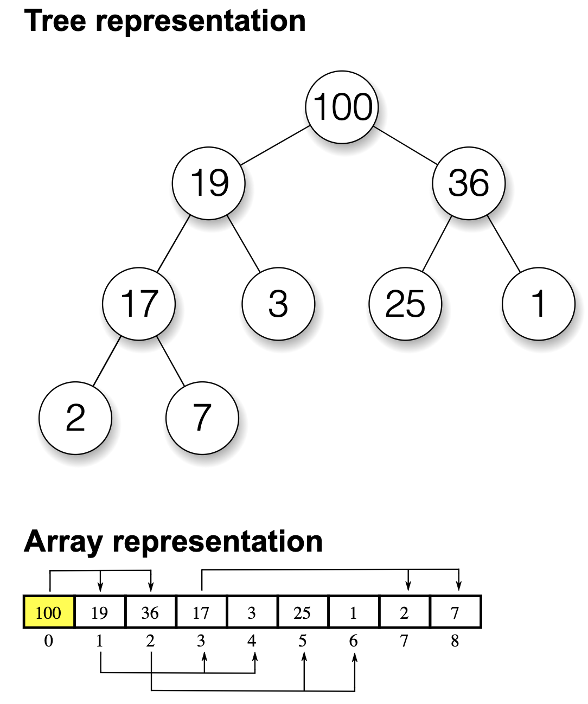

# Heap Overview:

### Overview:
* A heap is a **specialized tree-based data structure** that **satisfies the heap property**
* The **heap property defines the arrangement of elements within the tree**, and it is typically used to **maintain the 
  order of elements** in a specific way
* There are two main types of heaps:
  * **Min-Heap:**
    * In a **min-heap**, for **any given node "N,"** the **value of "N" is less than or equal to the values of its 
      children (if any)**
    * This means that the **minimum element** is **always at the root** of the heap
  * **Max-Heap:**
    * In a **max-heap**, for **any given node "N,"** the **value of "N" is greater than or equal to the values of its 
      children**
    * This implies that the **maximum element** is **always at the root** of the heap
* 
* Key characteristics of a heap data structure:
  * **Complete Binary Tree:**
    * A heap is **usually implemented** as a **complete binary tree**, which means that **all levels of the tree** are
      **completely filled**, **except possibly for the last level**, which is **filled from left to right**
  * **Efficient Insertion and Removal:**
    * The **main advantage** of a heap is its **efficiency in insertion and removal of elements**
    * **Insertion and removal of the root element (minimum or maximum)** are typically performed in **O(log n) time**, where 
      "**n**" is the **number of elements in the heap**
* Heaps are commonly used for various purposes, including:
  * **Priority Queues:**
    * Heaps can be used to implement **priority queues** where **elements with the highest (in the case of a max-heap) or 
      lowest (in the case of a min-heap) priority** can be **efficiently accessed and removed**
  * **Heap Sort:**
    * The heap data structure is used in the **heap sort algorithm**, which is an **in-place sorting algorithm** with a 
      **time complexity of O(n log n)**
  * **Dijkstra's Algorithm:**
    * Heaps are often used in algorithms like **Dijkstra's shortest path algorithm** to **efficiently find the shortest 
      path in a graph**
  * **Memory Management:**
    * Heaps are used in **memory management systems** of programming languages to **allocate and deallocate memory 
      efficiently**
* The implementation of a heap typically involves an **array-based representation** where the elements are stored in such 
  a way that the complete binary tree properties are maintained, and simple arithmetic operations can be used to 
  navigate the tree and maintain the heap property