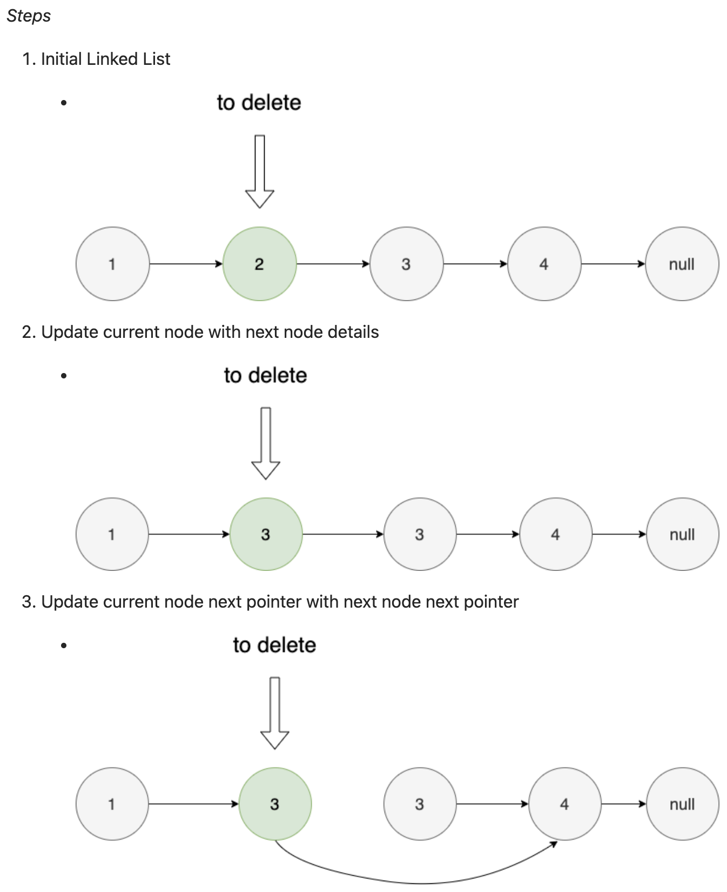

# Linked List Interview Questions:

### Delete a Node in a Linked List:
* There is a **singly-linked list `head`** and we want to **delete a node `node`** in it
* You are **given the node to be deleted `node`**
* You will **not be given access** to the **first node** of **`head`**
* All the values of the linked list are **unique**, and it is **guaranteed** that the **given node `node`** is **not the 
  last node** in the linked list
* **Delete the given node**
* Note that by deleting the node, we do not mean removing it from memory
* We mean:
  * The **value** of the **given node** should **not exist in the linked list**
  * The **number of nodes** in the linked list should **decrease by one**
  * All the **values before `node`** should be in the **same order**
  * All the **values after `node`** should be in the **same order**
* **Custom Testing:**
  * For the **input**, you should provide the **entire linked list `head`** and the **node to be given `node`**
  * **`node`** should **not** be the **last node of the list** and should be an **actual node in the list**
  * **We will build the linked list** and **pass the node to your function**
  * The **output** will be the **entire list after calling your function**
* **Example:**
  * 
```
Input: head = [4,5,1,9], node = 5
Output: [4,1,9]
Explanation: You are given the second node with value 5, 
the linked list should become 4 -> 1 -> 9 after 
calling your function.
```
* **Constraints:**
  * The **number of the nodes** in the given list is in the range `[2, 1000]`
  * `-1000 <= Node.val <= 1000`
  * The **value** of each node in the list is **unique**
  * The **node to be deleted** is **in the list** and is **not a tail node**
* **Approach 1: Delete Next Node Instead of Current One:**
```java
class Solution {
    public void deleteNode(ListNode node) {
        ListNode nextNode = node.next;
        node.val = nextNode.val;
        node.next = nextNode.next;
        nextNode.next = null;
    }
}
```
  * **Intuition:**
    * To solve the problem, let's look at the condition carefully
    * It is guaranteed that the node to be deleted is **not a tail node in the list**
    * There are a few observations here:
      * The **conventional deletion approach** will fail here since we are **not able to get the previous node** by 
        **iterating from the head** of the linked list
      * In fact, we **do not have any method** to **fetch the previous node**
      * **Without the knowledge** of the **previous node**, it's **not possible** to **delete the current node**
      * Notice that we are told the given node is **not a tail node**
      * Therefore, we can **delete the next node instead of the current node given**, and "**pretend**" that the **node 
        we are given** is the **next node**
    * Using this intuition, let's understand how to implement this problem
  * **Algorithm:**
    * By analyzing the above two key observations, we can derive the following algorithm:
    * **Store** the **next node** in a **temporary variable**
    * **Copy data** of the **next node** to the **current node**
    * **Change** the **next pointer** of the **current node** to the **next pointer** of the **next node**
    * Note that the above 3 steps make sure that your **current node** becomes the **same as the next node** and then 
      you can **safely delete the next node** from the Linked List
    * 
  * **Complexity Analysis:**
    * **Time Complexity:**
      * `O(1)` since **only 1 node needs to be updated** and we **only traverse one node behind**
    * **Space Complexity:**
      * `O(1)`, since we use **constant extra space** to **track the next node**

### Remove Nth Node from a Linked List:
* Given the **`head` of a linked list**, **remove the `n`th node** from the **end of the list** and **return its head**
* 
```
Example 1 (Diagram Above):
Input: head = [1,2,3,4,5], n = 2
Output: [1,2,3,5]

Example 2:
Input: head = [1], n = 1
Output: []

Example 3:
Input: head = [1,2], n = 1
Output: [1]
```
* **Constraints:**
  * The number of nodes in the list is `size`
  * 1 <= `L` <= 30
  * 0 <= `Node.val` <= 100
  * 1 <= `n` <= `L`
* Follow up: Could you do this in **one pass**?

**Solution:**
* **Approach 1: Two Pass Algorithm:**
  * **Explanatiion:**
    * Find the **length, `L`** of the list, given `head`
    * Handle the **edge case** where **length, `L`** and **node to be removed, `n`** are **one**
    * Iterate to the **node before the `n`th node** (`L - n - 1`), and **remove it**
  * **Time Complexity:**
    * `O(L)`
    * Specifically, **`O(2L)`**, because we iterate through the list **once to find the length**, then **again to 
      remove the `n`th node**
  * **Space Complexity:**
    * `O(1)` (Constant)
    * We **don't create** a **proportional number of data structures** for **any list of length `n`**
```java
class Solution {
    public ListNode removeNthFromEnd(ListNode head, int n) {

        // Find the length of the list:
        ListNode currNode = head;
        int length = 0;
        
        while(currNode != null){
            currNode = currNode.next;
            length++;
        }

        // Handle edge case where length and n are one:
        if(length == n){
            return head.next;
        }

        // Remove nth node:
        currNode = head;
        int nodeBeforeRemovedIndex = length - n - 1;
        for(int i = 0; i < nodeBeforeRemovedIndex; i++){
            currNode = currNode.next;
        }

        currNode.next = currNode.next.next;

        return head;
    }
}
```
* **Approach 2: One Pass Approach:**
  * **Explanation:**
    * **Maintain references** for the **current node**, and a **trailing node `n` steps behind the current node**
    * Remember to **handle the edge case** where **`n`** and the **size of the list, `L`** are **1**
    * Remember that we only need the current node to **iterate to the last node**, so we **stop at `currNode.next
      != null`**
  * **Time Complexity:**
    * `O(L)`
    * The algorithm makes **one traversal** of the list of **`L` nodes**
  * **Space Complexity:**
    * `O(1)` (Constant)
    * For **any size of list, `L`**, we keep track of the **same number of nodes**
```java
class Solution {
    public ListNode removeNthFromEnd(ListNode head, int n) {
        // Move currNode n steps into the list
        ListNode currNode = head;

        for(int i = 0; i < n; i++){
            currNode = currNode.next;
        }

        // Handle edge case where n and length are 1
        if(currNode == null){
            return head.next;
        }

        // Move both pointers until currNode reaches the 
        // last node
        ListNode nodeBeforeRemoved = head;

        while(currNode.next != null){
            currNode = currNode.next;
            nodeBeforeRemoved = nodeBeforeRemoved.next;
        }

        // Remove nth node:
        nodeBeforeRemoved.next = nodeBeforeRemoved.next.next;

        return head;
    }
}
```

### Reverse Linked List:
* Given the `head` of a singly linked list, reverse the list, and return the reversed list
* **Example 1:**
* 
```
Input: head = [1,2,3,4,5]
Output: [5,4,3,2,1]
```
* **Constraints:**
  * The number of nodes in the list is the range `[0, 5000]`
  * -5000 <= `Node.val` <= 5000
* **Follow up:**
  * A linked list can be reversed either iteratively or recursively
  * Could you implement both?
* **Solutions:**
* **Approach 1: Iterative:**
  * **Explanation:**
    * Iterate through the list, setting the current node's pointer from the next to the previous node
    * We need to maintain a reference to the current node's previous node, as well as it's next node
    * Remember to handle edge cases where list is empty, and `n` = 1
  * **Complexity Analysis:**
    * **Time Complexity:**
      * `O(n)`
      * Where `n` is the list's length
    * **Space Complexity:**
      * `O(1)`
      * We are **not creating a copy of data** that's **proportional in size to the list**
```java
class Solution {
    public ListNode reverseList(ListNode head) {
        // Initialize references for the current
        // and previous nodes:
        ListNode currNode = head;
        ListNode prevNode = null;
        
        // Handle edge cases where list is empty,
        // and n = 1
        if(head == null || head.next == null){
            return head;
        }
        
        // Iterate through the list:
        while(currNode != null){
            // Maintain reference to next node:
            ListNode nextNode = currNode.next;
            
            // Set current node's pointer to 
            // previous node:
            currNode.next = prevNode;
            
            // Reassign previous node to current 
            // node, and current node to next node:
            prevNode = currNode;
            currNode = nextNode;
        }
        
        // Return the previous node (last node and 
        // new head):
        return prevNode;
    }
}
```
* **Approach 2: Recursive:**
```java
class Solution {
    public ListNode reverseList(ListNode head) {
        // * Base case indicating that `head` is the last node
        // * Also the edge case for an empty list (`head == null`)
        if (head == null || head.next == null) {
            return head;
        }

        // * Recursively call `reverseList(ListNode head)` with 
        //   `head.next`
        // * After the base case is reached, the last node 
        //   is returned and assigned to `reversedSublistHead`
        ListNode reversedSublistHead = reverseList(head.next);

        // * Set the `head` / second to last node's `next` node's 
        //   `next `reference (the last node) to point to itself
        head.next.next = head;

        // * Set the `head` node's `next` reference to `null`
        head.next = null;

        // * Return the `reversedSublistHead` node to the 
        //   preceding recursive call
        return reversedSublist;
    }
}
```
  * **Explanation:**
    * **Recursively** call **`reverseList(ListNode head)`** with **`head.next`** until the **base case** is reached 
      where **`head.next == null`**
    * When the **base case is reached (`head.next == null`)**, that indicates that **`head`** is the **last node in the 
      list**
    * The **`head`** / **last node** is **returned to the previous stack frame** and **assigned to `ListNode 
      reversedSublistHead`**
    * In the **previous stack frame**, the **`head` references** the **second to last node**
    * Set the **`head` / second to last node's `next` node's `next `reference** (the **last node**) to **point to 
      itself**
    * Set the **`head` node's `next` reference** to **`null`**
    * **Return** the **`reversedSublistHead` node** to the **preceding recursive call**, and **repeat** with **all 
      preceding recursive calls**
    * Note **`reversedSublistHead`** is **assigned only once**, but **`head` moves backwards through the list** with 
      **each return** to the **previous stack frame**
  * **Complexity Analysis:**
    * **Time Complexity:**
      * `O(n)`
      * We have to traverse over every node in the list
    * **Space Complexity:**
      * `O(n)`
      * Each recursive function call takes place on the stack frame
      * For a list of length `n`, we make `n` recursive calls

### Merge Two Sorted Lists:
* You are given the **heads** of **two sorted linked lists** **`list1`** and **`list2`**
* **Merge the two lists** into **one sorted list**
* The list should be made by **splicing together the nodes of the first two lists**
* **Return** the **head** of the **merged linked list**
* **Example 1:**
  * 
```
Input: list1 = [1,2,4], list2 = [1,3,4]
Output: [1,1,2,3,4,4]
```
* **Example 2:**
```
Input: list1 = [], list2 = []
Output: []
```
* **Example 3:**
```
Input: list1 = [], list2 = [0]
Output: [0]
```
* **Constraints:**
  * The number of nodes in both lists is in the range `[0, 50]`
  * -100 <= `Node.val` <= 100
  * Both `list1` and `list2` are **sorted** in **non-decreasing order**
* **Solutions:**
* **Recursive Approach:**
```java
class Solution {
    /**
     * Merges two sorted linked lists into a single sorted linked list.
     * This method employs a recursive approach to efficiently merge the lists.
     *
     * @param list1 The head of the first sorted linked list.
     * @param list2 The head of the second sorted linked list.
     * @return The head of the merged sorted linked list.
     *
     * <p>
     * The method compares the values of the heads of the input lists and selects
     * the smaller value as the head of the merged list. It then moves the head
     * of the selected list to the next node. This process is repeated recursively
     * until the end of one of the lists is reached. The merged list is built in
     * reverse order, and the head of each recursive call is returned to construct
     * the final merged list.
     * </p>
     *
     * <p>
     * Base Case: If either list1 or list2 is null, the method returns the rest of
     * the other list. The merged list is constructed by comparing and selecting
     * the smaller values from the heads of the input lists.
     * </p>
     */
    public ListNode mergeTwoLists(ListNode list1, 
                                  ListNode list2) {
        /*
         * * Base Case: If list1 or list2 is null,
         *   return the rest of the other list
         */
        if(list1 == null){
            return list2;
        } else if (list2 == null){
            return list1;
        }
        
        /*
         * * Initialize a new head for each recursive
         *   call to hold the next element in the merged
         *   list
         */
        ListNode head;

        /*
         * * Compare the head of each list, and set head 
         *    to the lesser value
         * * Then move the list containing the lesser 
         *    value's head to the next node
         */
        if(list1.val < list2.val){
            head = list1;
            list1 = list1.next;
        } else {
            head = list2;
            list2 = list2.next;
        }

        /*
         * * Recursively call mergeTwoLists until the end 
         *   of one of the lists has been reached 
         * * Once the end of one of the lists has been 
         *   reached, the rest of the other list is 
         *   returned, and set as the head's next node
         */
        head.next = mergeTwoLists(list1, list2);

        /* 
         * * The head from each recursive case is returned, 
         *   building the merged list essentially in reverse
         */
        return head;
    }
}
```
  * * **Complexity Analysis:**
    * **Time Complexity:**
      * `O(m + n)`
      * Where `m` and `n` are the **number of nodes** in **each list**
      * In **worst case**, we need to **iterate over all the nodes** in **each list**, and **add them to the returned 
        list**
    * **Space Complexity:**
      * `O(m + n)`
      * Every **recursive function call takes up space** on the **call stack**
      * We have **at most `m + n` calls**, because **for each call** we are **comparing** the **next node of one list** 
        to **a node from the other list**
* **Iterative Approach:**
  * **Complexity Analysis:**
    * **Time Complexity:**
      * `O(m + n)`
      * We are performing the **same comparison operation** on **every node** from **each list**
    * **Space Complexity:**
      * `O(1)` - Constant
      * All we are doing is **manipulating the pointers** that **already exist** with the **nodes in the list provided**
      * At most, **we use memory** for **our pointer's head and tail**, but the **space used by them does not grow in 
        proportion** to the **number of nodes in the list**