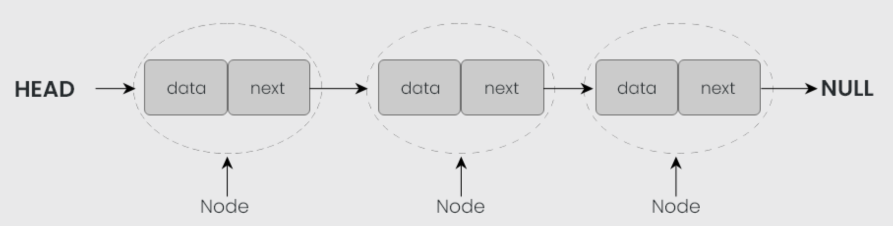
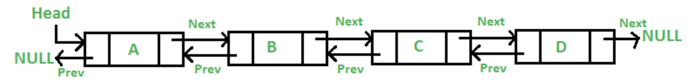

# Linked List Overview:

### Overview:
* **Linked List:**
  * A **linked list** is a **linear data structure** used in computer science and programming
  * It consists of a sequence of elements, called "**nodes**," where each node has **two main components**:
    * **Data:**
      * This component stores the **actual value** or information you want to store, such as an integer, a string, or 
        any other data type
    * **Pointer (or reference):**
      * This component points to the **next node** in the sequence
      * It's essentially an **address** or **reference** to the **memory location** of the next node in the list
  * Linked lists come in various forms, but the two most common types are:
    * **Singly Linked List:**
      * In a singly linked list, each node has data and a **reference to the next node**
      * The **last node** typically has a reference pointing to nothing (often denoted as "**null**" or "None" in 
        programming languages) to **indicate the end of the list**
      * 
    * **Doubly Linked List:** 
      * In a doubly linked list, each node contains data and references to **both the next and the previous nodes**
      * This allows for **easier traversal** in **both directions** but **requires more memory** to store the additional 
        references
      * 
  * **Advantages & Disadvantages of Linked Lists vs. Arrays:**
    * **Advantages:**
      * **Dynamic Size:**
        * Linked lists can **easily grow or shrink** in size **during runtime**, as **memory is allocated and deallocated 
          dynamically**
        * This makes them suitable for scenarios where the size of the data structure is uncertain
      * **Efficient Insertions and Deletions:**
        * **Insertions and deletions** of elements in a linked list, especially in the **middle** of the list, are typically 
          more efficient than in arrays
        * You can **insert or delete** elements with **O(1) time complexity**, provided you have a reference to the node
      * **No Fixed Memory Requirement:**
        * Linked lists **don't require contiguous memory allocation** like arrays
        * They can be **scattered in memory**, which can be beneficial in systems with **memory fragmentation**
      * **No Need for a Predefined Size:** 
        * You **don't need to specify the size** of a linked list in advance
        * This contrasts with arrays, which require you to determine their size when creating them
    * **Disadvantages:**
      * **Random Access:**
        * Linked lists are **not efficient for random access** to elements
        * To access an element, you **must traverse the list from the head or tail**, resulting in **O(n) time complexity**
        * In contrast, **arrays offer O(1) random access**
      * **Memory Overhead:**
        * Each node in a linked list contains **both data and a reference/pointer** to the next node, which **consumes 
          additional memory**
        * This overhead can make linked lists less memory-efficient than arrays
      * **Cache Performance:**
        * Arrays tend to have **better cache performance** because their elements are **stored contiguously** in memory
        * Accessing **adjacent elements** in an array benefits from **cache locality**, which can significantly improve
          performance

### The `LinkedList` class in Java:
* In Java, the `LinkedList` class is part of the Java Collections Framework and is a class that represents a **doubly 
  linked list data structure**
  * A **doubly linked list** is a data structure in which **each element is stored as a node** with **references to 
    the previous and next elements** in the list
  * It is an implementation of the `List` and `Deque` (Double ended queue) interfaces
  * Note that this implementation is not synchronized
* **Instantiating a Linked List:**
  * In Java, you can instantiate a linked list using the `LinkedList` class, which is provided in the Java Collections 
    Framework:
    * `LinkedList<Integer> linkedList = new LinkedList<>();`
* **Adding Elements:**
  * **Adding elements to a linked list:**
    * Both add and addLast are used to add elements to the end of the linked list, and you can use either method 
      interchangeably to achieve the same result
    * `linkedList.add(10);` or
    * `linkedList.addLast(10);`
  * **Adding an element to the beginning of a list:**
    * `linkedList.addFirst(5)`
  * **Adding an element to a specific position:**
    * `linkedList.add(0, "First");`
* **Removing Elements:**
  * **Removing the first element:**
    * `int removedElement = linkedList.removeFirst();`
  * **Removing the last element:**
    * `int removedElement = linkedList.removeLast();`
  * **Removing an element by value:**
    * To remove the first occurance of a specified value:
      * `linkedList.remove("ValueToRemove");`
  * **Removing an element by index:**
    * `int removedElement = linkedList.remove(3);`
  * **Removing all elements from the list:**
    * `linkedList.clear();`
* **Accessing elements by index:**
    * `int element = linkedList.get(2);`
* **Checking if the list contains an element:**
  * `boolean containsElement = linkedList.contains("SearchValue");`
* **Obtaining the size of the list:**
  * `int size = linkedList.size();`
* **Iterating Through a Linked List:**
* **Using a For-Each Loop:**
```
for (int element : linkedList) {
    System.out.println(element);
}
```
* **Using an Iterator:**
```
Iterator<Integer> iterator = linkedList.iterator();
while (iterator.hasNext()) {
    int element = iterator.next();
    System.out.println(element);
}
```
* **Using a `ListIterator` (Bidirectional Traversal):**
```
ListIterator<Integer> listIterator = linkedList.listIterator();
while (listIterator.hasNext()) {
    int element = listIterator.next();
    System.out.println(element);
}

while (listIterator.hasPrevious()) {
    int element = listIterator.previous();
    System.out.println(element);
}
```
* **Using Java Streams:**
  * Java 8 introduced the **Stream API**, which can be used with a linked list for more functional and declarative 
    iteration
```
linkedList.stream()
          .forEach(element -> {
              System.out.println(element);
          });
```

### Linked List Java Implementation:
```java
class Node<T> {
  private T data;
  private Node<T> next;

  public Node(T data) {
    this.data = data;
    this.next = null;
  }
  //Getters & Setters
}

public class LinkedList<T> {
  private Node<T> head;
  private int size;

  public LinkedList() {
    head = null;
    size = 0;
  }

  public void add(T data) {
    Node<T> newNode = new Node<>(data);
    if (head == null) {
      head = newNode;
    } else {
      Node<T> current = head;
      while (current.getNext() != null) {
        current = current.getNext();
      }
      current.setNext(newNode);
    }
    size++;
  }

  public void insert(T data, int index) {
    if (index < 0 || index > size) {
      throw new IndexOutOfBoundsException("Index out of bounds");
    }

    Node<T> newNode = new Node<>(data);

    if (index == 0) {
      newNode.setNext(head);
      head = newNode;
    } else {
      Node<T> current = head;
      for (int i = 0; i < index - 1; i++) {
        current = current.getNext();
      }
      newNode.setNext(current.getNext());
      current.setNext(newNode);
    }

    size++;
  }

  public void delete(int index) {
    if (index < 0 || index >= size) {
      throw new IndexOutOfBoundsException("Index out of bounds");
    }

    if (index == 0) {
      head = head.getNext();
    } else {
      Node<T> current = head;
      for (int i = 0; i < index - 1; i++) {
        current = current.getNext();
      }
      current.setNext(current.getNext().getNext());
    }

    size--;
  }

  public T get(int index) {
    if (index < 0 || index >= size) {
      throw new IndexOutOfBoundsException("Index out of bounds");
    }

    Node<T> current = head;
    for (int i = 0; i < index; i++) {
      current = current.getNext();
    }
    return current.getData();
  }

  public int size() {
    return size;
  }

  public boolean isEmpty() {
    return size == 0;
  }

  public void display() {
    Node<T> current = head;
    while (current != null) {
      System.out.print(current.getData() + " -> ");
      current = current.getNext();
    }
    System.out.println("null");
  }
}
```

### Time Complexities for Common Operations on a Linked List:
* The time complexities for operations on a singly linked list typically depend on the position of the operation 
  (e.g., beginning, middle, end) and can be summarized as follows:
  * **Accessing an Element by Index:**
    * `O(n)`, where `n` is the **index of the element** you want to access
    * This is because you may need to traverse the list from the beginning to reach the desired element
  * **Insertion (at the beginning):**
    * `O(1)`
    * You only need to **update the next reference of the new node to point to the current head and then update the head 
      to the new node**
  * **Insertion (at the end):**
    * `O(n)` in the **worst case** because you **need to traverse the entire list** to find the last node
    * However, you can **optimize** this to `O(1)` if you **maintain a reference to the tail** of the list
  * **Insertion (at a specific index):**
    * `O(n)` in the worst case because you may need to traverse the list to reach the desired position
    * If you're inserting at the beginning (index 0), it's `O(1)`
  * **Deletion (at the beginning):**
    * `O(1)`
    * You **update the head** to **point to the next node**
  * **Deletion (at the end):**
    * `O(n)` in the worst case because you **may need to traverse the list** to find the **second-to-last node**
    * However, it's `O(1)` if you **maintain a reference to the tail** of the list
  * **Deletion (at a specific index):**
    * `O(n)` in the **worst case** because you **may need to traverse the list** to reach the desired position
  * **Searching for a value:**
    * `O(n)` because you **may need to traverse the list** from the beginning to find the value
  * **Appending:**
    * `O(n)` in the **worst case** because you **need to traverse the entire list** to find the last node
    * `O(1)` if you maintain a reference to the tail
* In general, the performance of singly linked lists for insertion and deletion operations is **highly dependent** on 
  the **position where the operation is performed**
* If you need **frequent random access**, other data structures like **arrays** or **doubly linked lists** might be more 
  suitable
* However, singly linked lists are efficient for **inserting and deleting elements at the beginning and end of the 
  list**

### Advantages of LinkedList vs. ArrayList:
* Using a `LinkedList` over an `ArrayList` in Java offers several advantages in specific scenarios
* Here are the main advantages of using a LinkedList:
  * **Efficient Insertions and Removals:**
    * `LinkedList` is designed for **efficient insertions and removals**, **especially in the middle of the list**
    * Insertions and removals can be performed in **`O(1)` time complexity**
    * This makes it suitable for use cases where elements are **frequently added or removed** in the **middle of the 
      list**
  * **No Array Copying:**
    * Unlike `ArrayList`, **`LinkedList` doesn't need to copy elements to a new array when it reaches its capacity**
    * This can be advantageous when the **list size changes frequently and unpredictably**
  * **Dynamic Sizing:**
    * LinkedList **doesn't require** you to **specify an initial capacity**, and it **can grow or shrink dynamically** 
      as elements are **added or removed**
    * This can **save memory** compared to an `ArrayList` with a **large initial capacity** that **may not be fully 
      utilized**
  * **Less Memory Overhead:**
    * While **each element** in a `LinkedList` **requires additional memory for node references**, it **may be more 
      memory-efficient** in cases where **elements are relatively large** and the **overhead from maintaining an 
      internal array** in `ArrayList` is significant
  * **Complex Data Structures:**
    * `LinkedList` can be used to **build more complex data structures**, such as **doubly-linked lists**, **stacks**, 
      and **queues**
    * It provides the **building blocks** for these data structures **without additional data structure manipulation**
  * **Constant-time Splice Operations:**
    * **Combining two `LinkedList` structures** by **changing a few references** can be done in **constant time**, which 
      is useful in some scenarios
  * **Incremental Growth:**
    * `LinkedList` can **grow incrementally as needed**
    * This can be advantageous if you are working with a **resource-constrained system** and want to **minimize memory 
      allocation**
  * **Concurrent Modification:**
    * When you need to **modify a list concurrently** by **multiple threads**, `LinkedList` can be a better choice 
      because it avoids the potential for **concurrent modification exceptions** that can occur in an `ArrayList` if the 
      **list is modified while being iterated**
* In summary, you should choose a `LinkedList` over an `ArrayList` when your **primary use cases** involve **frequent 
  insertions and removals**, especially in the **middle of the list**, or when you're working with **complex data 
  structures** that can benefit from a linked list structure
* It's important to choose the data structure that best fits your specific requirements and performance considerations