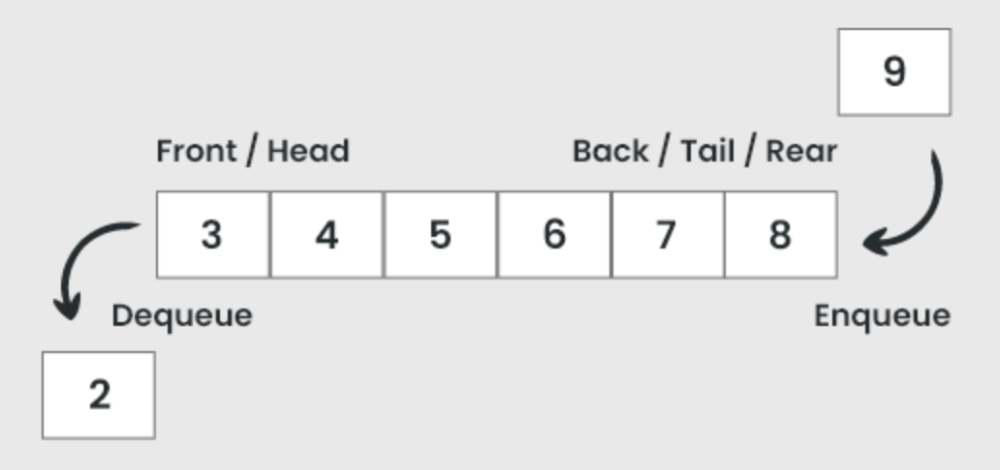

# Queue Overview:

### Overview:
* **Queue:**
  * A **queue** is a **linear data structure** that follows the **First-In-First-Out (FIFO)** principle
  * It is a collection of elements with two primary operations:
    * **Enqueue:**
      * This operation **adds** an element to the **back (or rear)** of the queue
    * **Dequeue:**
      * This operation **removes and returns** the element from the **front** of the queue
  * A queue can also have additional operations:
    * **Front:**
      * This operation **returns** the element at the **front** of the queue **without removing it**
    * **Rear (or Back)**:
      * This operation returns the element at the rear of the queue without removing it
  * 
  * Queues are often visualized as a **horizontal** structure, much like people waiting in line
    * The first person to join the line is the first to be served, and people are served in the order they joined the
      line
  * Queues are commonly used in various computing applications, including **task scheduling**, **managing resources**, 
    and implementing algorithms such as **breadth-first search (BFS)**
  * They ensure that items are **processed in the order they are received**, making them useful for scenarios where 
    maintaining a **strict order of operations** is necessary