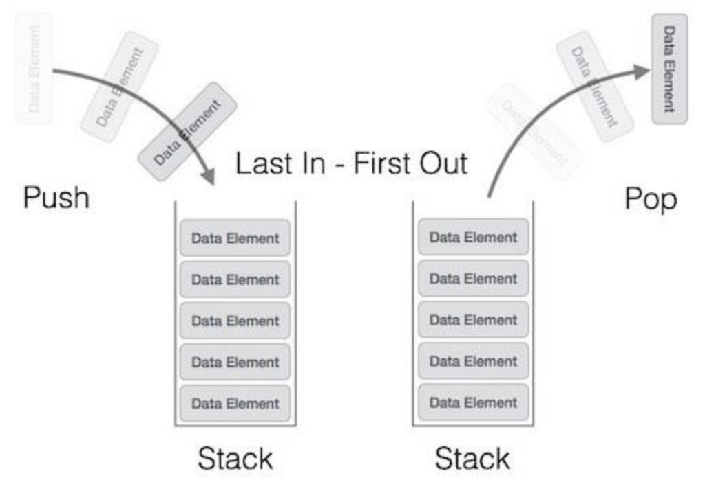

# Stack Overview:

### Overview:
* **Stack:**
  * A **stack** is a **linear data structure** that follows the **Last-In-First-Out (LIFO)** principle
  * It is a **collection of elements**, where **two primary operations** can be performed:
    * **Push:**
      * This operation **adds an element** to the **top** of the stack
    * **Pop:**
      * This operation **removes and returns** the **top element** from the stack
  * A stack can also have an additional operation:
    * **Peek** (or Top):
      * This operation **returns the element** at the **top of the stack** **without removing it**
  * The stack is often visualized as a **vertical structure** where elements are stacked on top of each other
  * The **most recently added** element is at the **top**, and the **first element added** is at the **bottom**
  * Think of it like a stack of plates or books
    * You can only add a new plate or book to the top of the stack, and you can only remove the top one
  * Stacks are used in various computing applications, including **function call management** (keeping track of function 
    calls and returns), **parsing expressions**, **managing memory allocation**, and many other situations where you
    need to maintain a last-in-first-out order for elements
  * 