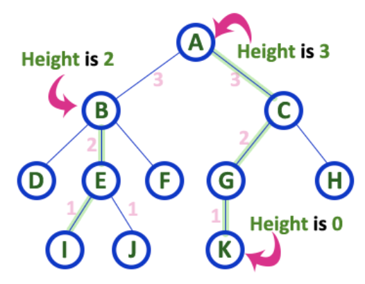
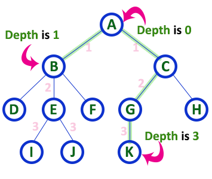

# Tree Overview:

### Overview:
* A **tree** is a **hierarchical data structure** that consists of **nodes connected by edges**
* It is a type of **graph** where **each node** in the tree can have **zero or more child nodes**, **except for the top 
  node**, called the **root**, which has **no parent**
* Each node may also have a parent, except for the root, and **all nodes except the leaves** have a **single parent**
* 
* Here are some **key elements and concepts** related to trees:
  * **Root:**
    * The **topmost node** in a tree from which **all other nodes descend**
    * It is the **starting point** for **traversing the tree**
  * **Node:**
    * **Each element** or entity in the tree is a **node**
    * Nodes may contain **data** or information and **may have zero or more child nodes**
  * **Child:**
    * A node **directly connected** to another node when **moving away from the root**
    * In a family tree analogy, **children are descendants** of their parents
  * **Parent:**
    * A node **directly connected** to another node when **moving towards the root**
    * Each node, except the root, has a parent
  * **Leaf:**
    * A **node** with **no children**, i.e., a node that is at the **end of a branch** in the tree
  * **Edge:**
    * The **connection between nodes**
    * It represents the **relationship or link** between nodes
  * **Subtree:**
    * A **subtree** is a **portion of a tree**, which is **also a tree** itself
    * It is formed by **selecting a node** and **all of its descendants**
  * **Depth:**
    * The **depth** of a node in a tree is the **length of the path from the root to that node**
    * The **root** has a **depth of 0**
  * **Height:** 
    * The **height of a tree** is the **length** of the **longest path** from the **root to a leaf** node
    * It represents the **depth of the deepest node** in the tree
    * 
  * **Binary Tree:**
    * A binary tree is a tree in which **each node has at most two children**, typically referred to as the **left child** and
      the **right child**
  * **Binary Search Tree (BST):**
    * A **specific type of binary tree** where the nodes are **ordered** in a way that makes it **efficient for searching, 
      insertion, and deletion**
    * For each node, **all values** in its **left subtree** are **less than the node's value**, and **all values** in
      its **right subtree** are **greater**
* Trees are a fundamental data structure in computer science and are used for various applications, including:
  * Hierarchical Data Representation
  * Searching and Sorting Algorithms (e.g., Binary Search Trees)
  * File Systems
  * Parsing Expressions in Compilers and Interpreters

### Depth of a Node (n):
* The **depth** of a node in a tree is the **length of the path** from the **root node** to that **particular node**
* It is **measured** by counting the **number of edges** in the **unique path** that connects the root node to the node 
  in question
* The **root node** is assigned a **depth of 0**, and **each level** or layer of nodes **below the root** **increases 
  the depth by 1**
* In a tree, the depth of a node **indicates its position** within the **hierarchy of nodes**, with **deeper nodes** 
  being **further away from the root**
* 

### Height of a Tree:
* The **height** of a tree is a **measure of its depth** or **how many levels** it has **from the root node 
  to the deepest leaf node**
* It's an **important metric** because it **affects the efficiency** of various tree operations, such as **searching, 
  insertion, and deletion**
* There are two common ways to define the height of a tree:
  * **Height of a Rooted Tree:**
    * For a **rooted tree** (a tree with a **single designated root node**), the height is typically defined as the 
      length of the **longest path from the root node to a leaf node**
    * In other words, it's the **number of edges** in the **longest path from the root to a leaf**
  * **Height of an Empty Tree:**
    * For an **empty tree** (a tree with **no nodes**), the height is usually defined as **-1** or **0**, depending on 
      the convention used
* The height of a tree is a crucial factor in **determining the time complexity** of various tree operations
  * In **balanced trees** like **binary search trees** (e.g., **AVL trees** or **Red-Black trees**), the **height is 
    kept relatively small** to **maintain efficient operations**
* In **unbalanced trees**, such as a **degenerate tree** (essentially a **linked list**), the **height can become very 
  large**, leading to **inefficient operations**
* Reducing the height of a tree is a common goal when designing and managing tree data structures to ensure that 
  operations remain efficient
* * 
  
### Red-Black Tree:
* A red-black tree is a type of **self-balancing binary search tree (BST)** data structure
* It was developed to ensure that the height of the tree remains approximately balanced, which, in turn, guarantees 
  that search, insertion, and deletion operations have a logarithmic time complexity
* Red-black trees are widely used in many programming languages and libraries to implement data structures such as sets 
  and maps
* Here are the key properties and rules that define a red-black tree:
  * Node Color:
    * Each node in the tree is assigned one of two colors: red or black
  * Root Property:
    * The root of the tree is always black
  * Red Property:
    * Red nodes cannot have red children
    * In other words, a red node must have black children
    * This property ensures that there are no adjacent red nodes along any path in the tree
  * Black Height Property:
    * The black height of a node is defined as the number of black nodes (including the node itself) from that node to 
      any leaf in the tree
    * All paths in the tree must have the same black height
    * This property guarantees that the tree remains balanced, with a maximum height of approximately 2*log2(n), 
      where n is the number of nodes
  * Balancing Operations:
    * When a node is inserted or removed from the tree, it may violate the red-black tree properties
    * To maintain these properties, the tree is restructured using rotation and recoloring operations
* Red-black trees are designed to ensure that the height of the tree remains balanced, which in turn keeps search, insertion, and deletion operations efficient. The logarithmic height of the tree ensures that these operations have a time complexity of O(log n), where n is the number of nodes in the tree.

Red-black trees are used in various programming languages and libraries as the underlying data structure for implementing data types like sets, maps, and other ordered collections. They are also used in databases and file systems to maintain balanced indexes, making them a fundamental data structure in computer science.

### Complete Binary Tree:
* A **complete binary tree** is a **special type** of **binary tree** in which **all levels** of the tree are 
  **completely filled** **except possibly for the last level**
* In the **last level**, **all nodes are as left as possible**
* This means that a complete binary tree is **filled from left to right on each level**, and **any level** with **less 
  than the maximum number of nodes** is **filled starting from the left**
* Here are some key characteristics of a complete binary tree:
  * **All Levels Filled Except the Last:**
    * **All levels** of the tree are **completely filled**, with the **possible exception** of the **last level**
    * In the **last level**, **all nodes** are **as left as possible**
  * **Balanced Structure:**
    * It has a **balanced structure**, which means that **the height of the tree** is **minimized** **for the given 
      number of nodes**
  * **Efficient for Array-Based Storage:**
    * Because of its **balanced structure**, a complete binary tree is often used for **array-based implementations** 
      like **heaps**
    * You can **efficiently store** a **complete binary tree** in an **array** **without wasting space**
  * **Easily Traversable:**
    * When **traversing the tree**, it is **easy to implement algorithms** that **move from one level to the next without 
      having to backtrack**
    * This makes it suitable for **breadth-first search (BFS) traversal**
  * **Differences in Height Are at Most 1:**
    * The **height** of the **left and right subtrees** of **any node differ by at most 1**
* Here's an example of a complete binary tree with 7 nodes:
```
     1
    / \
   2   3
  / \ /
 4  5 6
```
* In this example, **all levels are filled except the last level**, and **nodes are filled from left to right** in the 
  **last level**
* This tree is considered a **complete binary tree**
* Complete binary trees are used in various applications, such as in the implementation of **priority queues**, 
  **binary heaps**, and **efficient data storage structures**
* The **balanced** and **easily traversable** nature of complete binary trees makes them a **valuable structure** in 
  computer science and data processing