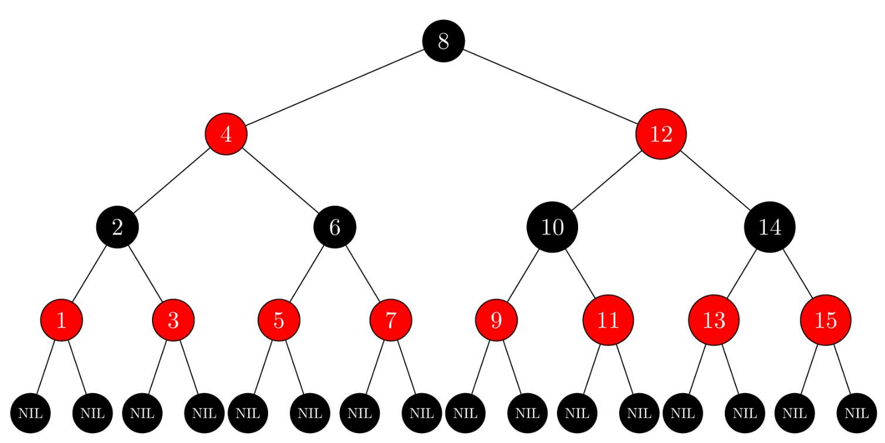

# Tree Overview:

### Overview:
* A **tree** is a **hierarchical data structure** that consists of **nodes connected by edges**
* It is a type of **graph** where **each node** in the tree can have **zero or more child nodes**, **except for the top 
  node**, called the **root**, which has **no parent**
* Each node may also have a parent, except for the root, and **all nodes except the leaves** have a **single parent**
* 
* Here are some **key elements and concepts** related to trees:
  * **Root:**
    * The **topmost node** in a tree from which **all other nodes descend**
    * It is the **starting point** for **traversing the tree**
  * **Node:**
    * **Each element** or entity in the tree is a **node**
    * Nodes may contain **data** or information and **may have zero or more child nodes**
  * **Child:**
    * A node **directly connected** to another node when **moving away from the root**
    * In a family tree analogy, **children are descendants** of their parents
  * **Parent:**
    * A node **directly connected** to another node when **moving towards the root**
    * Each node, except the root, has a parent
  * **Leaf:**
    * A **node** with **no children**, i.e., a node that is at the **end of a branch** in the tree
  * **Edge:**
    * The **connection between nodes**
    * It represents the **relationship or link** between nodes
  * **Subtree:**
    * A **subtree** is a **portion of a tree**, which is **also a tree** itself
    * It is formed by **selecting a node** and **all of its descendants**
  * **Depth:**
    * The **depth** of a node in a tree is the **length of the path from the root to that node**
    * The **root** has a **depth of 0**
  * **Height:** 
    * The **height of a tree** is the **length** of the **longest path** from the **root to a leaf** node
    * It represents the **depth of the deepest node** in the tree
    * 
  * **Binary Tree:**
    * A binary tree is a tree in which **each node has at most two children**, typically referred to as the **left child** and
      the **right child**
  * **Binary Search Tree (BST):**
    * A **specific type of binary tree** where the nodes are **ordered** in a way that makes it **efficient for searching, 
      insertion, and deletion**
    * For each node, **all values** in its **left subtree** are **less than the node's value**, and **all values** in
      its **right subtree** are **greater**
* Trees are a fundamental data structure in computer science and are used for various applications, including:
  * Hierarchical Data Representation
  * Searching and Sorting Algorithms (e.g., Binary Search Trees)
  * File Systems
  * Parsing Expressions in Compilers and Interpreters

### Depth of a Node (n):
* The **depth** of a node in a tree is the **length of the path** from the **root node** to that **particular node**
* It is **measured** by counting the **number of edges** in the **unique path** that connects the root node to the node 
  in question
* The **root node** is assigned a **depth of 0**, and **each level** or layer of nodes **below the root** **increases 
  the depth by 1**
* In a tree, the depth of a node **indicates its position** within the **hierarchy of nodes**, with **deeper nodes** 
  being **further away from the root**
* 

### Height of a Tree:
* The **height** of a tree is a **measure of its depth** or **how many levels** it has **from the root node 
  to the deepest leaf node**
* It's an **important metric** because it **affects the efficiency** of various tree operations, such as **searching, 
  insertion, and deletion**
* There are two common ways to define the height of a tree:
  * **Height of a Rooted Tree:**
    * For a **rooted tree** (a tree with a **single designated root node**), the height is typically defined as the 
      length of the **longest path from the root node to a leaf node**
    * In other words, it's the **number of edges** in the **longest path from the root to a leaf**
  * **Height of an Empty Tree:**
    * For an **empty tree** (a tree with **no nodes**), the height is usually defined as **-1** or **0**, depending on 
      the convention used
* The height of a tree is a crucial factor in **determining the time complexity** of various tree operations
  * In **balanced trees** like **binary search trees** (e.g., **AVL trees** or **Red-Black trees**), the **height is 
    kept relatively small** to **maintain efficient operations**
* In **unbalanced trees**, such as a **degenerate tree** (essentially a **linked list**), the **height can become very 
  large**, leading to **inefficient operations**
* Reducing the height of a tree is a common goal when designing and managing tree data structures to ensure that 
  operations remain efficient
* * 

### Complete Binary Tree:
* A **complete binary tree** is a **special type** of **binary tree** in which **all levels** of the tree are
  **completely filled** **except possibly for the last level**
* In the **last level**, **all nodes are as left as possible**
* This means that a complete binary tree is **filled from left to right on each level**, and **any level** with **less
  than the maximum number of nodes** is **filled starting from the left**
* Here are some key characteristics of a complete binary tree:
  * **All Levels Filled Except the Last:**
    * **All levels** of the tree are **completely filled**, with the **possible exception** of the **last level**
    * In the **last level**, **all nodes** are **as left as possible**
  * **Balanced Structure:**
    * It has a **balanced structure**, which means that **the height of the tree** is **minimized** **for the given
      number of nodes**
  * **Efficient for Array-Based Storage:**
    * Because of its **balanced structure**, a complete binary tree is often used for **array-based implementations**
      like **heaps**
    * You can **efficiently store** a **complete binary tree** in an **array** **without wasting space**
  * **Easily Traversable:**
    * When **traversing the tree**, it is **easy to implement algorithms** that **move from one level to the next without
      having to backtrack**
    * This makes it suitable for **breadth-first search (BFS) traversal**
  * **Differences in Height Are at Most 1:**
    * The **height** of the **left and right subtrees** of **any node differ by at most 1**
* Here's an example of a complete binary tree with 7 nodes:
```
     1
    / \
   2   3
  / \ /
 4  5 6
```
* In this example, **all levels are filled except the last level**, and **nodes are filled from left to right** in the
  **last level**
* This tree is considered a **complete binary tree**
* Complete binary trees are used in various applications, such as in the implementation of **priority queues**,
  **binary heaps**, and **efficient data storage structures**
* The **balanced** and **easily traversable** nature of complete binary trees makes them a **valuable structure** in
  computer science and data processing 

### Binary Tree:
* A **binary tree** is a **hierarchical data structure** consisting of **nodes** where **each node** has **at most two 
  children**, referred to as the **left child** and the **right child**
* It's a **type of tree structure** where nodes are **organized** in a **branching manner**
* **Properties of a Binary Tree:**
  * **Nodes:**
    * **Each node** in a binary tree can have **at most two children**, the **left child** and the **right child**
  * **Root:**
    * There is a **special node** called the **root** that serves as the **entry point** into the tree structure
  * **Parent and Child Nodes:**
    * **Each node** (**except the root**) has **exactly one parent node**
  * **Leaf Nodes:**
    * Nodes that have **no children** are called **leaf nodes** or **terminal nodes**
  * **Depth and Height:**
    * The **depth** of a node is the **number of edges from the root to that node**
    * The **height** of a tree is the **maximum depth** of **any node in the tree**
  * **Balanced vs. Unbalanced:**
    * A binary tree is **balanced** if the **height of the left and right subtrees** of **any node differs by at most 
      one**
* **Types of Binary Trees:**
  * **Full Binary Tree:**
    * **Every node other than the leaf nodes** has **exactly two children**
  * **Complete Binary Tree:**
    * **Every level** of the tree is **completely filled except for the last level****, and **all nodes** are **as left 
      as possible**
  * **Perfect Binary Tree:**
    * A **full binary tree** where **all leaf nodes** are **at the same level**
  * **Balanced Binary Tree:**
    * A **binary tree** in which the **height** of the **left and right subtrees** of **any node differs** by **at most 
      one**
* **Example:**
```
      5
     / \
    3   8
   / \   \
  2   4   9
```
* In this binary tree:
  * **Node 5** is the **root**
  * **Node 3** and **Node 8** are **children of Node 5**
  * **Node 2** and **Node 4** are **children of Node 3**
  * **Node 9** is the **right child** of **Node 8**
* This tree follows the properties of a binary tree, with **each node** having **at most two children**, forming a 
  **branching structure**

### Binary Search Tree:
* A **binary search tree** (**BST**) is a **hierarchical data structure** used for **organizing** and **storing data 
  efficiently**
* It is a type of **binary tree** where **each node** has **at most two children**, referred to as the **left child** 
  and the **right child**
* The key property of a BST is that it **maintains** a **specific ordering** among its nodes:
  * The **value** of **any node** in the **left subtree** is **less than the value of its parent node**
  * The **value** of **any node** in the **right subtree** is **greater than the value of its parent node**
* This ordering principle allows for **efficient search**, **insertion**, and **deletion operations** within the tree
* **Properties of a Binary Search Tree:**
  * **Binary Tree Structure:**
    * Every node in a BST has **at most two children**: **left** and **right**
  * **Ordering Property:**
    * **All nodes** in the **left subtree** have values **less than the node's value**, and **all nodes** in the 
      **right subtree** have values **greater than the node's value**
  * **No Duplicate Values:**
    * Typically, BSTs **don't allow duplicate values**
* **Operations on Binary Search Trees:**
  * **Search:**
    * **Efficiently finds a node** with a **specific value** by **traversing the tree** according to the 
      **ordering property**
  * **Insertion:**
    * **Places** a **new node** in the **correct position** while **maintaining the ordering property** of the BST
  * **Deletion:**
    * **Removes a node** while **preserving the ordering property** of the tree
  * **Traversal:**
    * **In-order**, **pre-order**, and **post-order traversal** to **visit nodes** in different sequences
* **Example:**
```
      5
     / \
    3   8
   / \ / \
  2  4 7  9
```
* **In this tree:**
  * Node **5** is the **root**
  * Node **3** is the **left child of 5**, and **Node 8** is the **right child**
  * Node **2** and **Node 4** are **children** of **Node 3**
  * Node **7** and **Node 9** are **children of Node 8**
* The BST property **holds true** for **all nodes**: **values** in the **left subtree** of **any node** are **less than 
  the node's value**, and **values** in the **right subtree are greater**

### Red-Black Tree:
* A **red-black tree** is a type of **self-balancing binary search tree (BST)** data structure
* It was developed to **ensure** that the **height of the tree remains approximately balanced**, which, in turn, 
  **guarantees** that **search**, **insertion**, and **deletion** operations have a **logarithmic time complexity**
* Red-black trees are **widely used** in many programming languages and libraries to **implement data structures** such 
  as **sets** and **maps**
* Here are the key properties and rules that define a red-black tree:
  * **Node Color:**
    * **Each node** in the tree is assigned **one of two colors**: **red** or **black**
  * **Root Property:**
    * The **root** of the tree is **always black**
  * **Red Property:**
    * **Red** nodes **cannot have red children**
    * In other words, a **red node must have black children**
    * This property ensures that there are **no adjacent red nodes along any path in the tree**
  * **Black Height Property:**
    * The **black height** of a **node** is defined as the **number of black nodes** (**including the node itself**) 
      **from that node to any leaf in the tree**
    * **All paths** in the tree must have the **same black height**
    * This property guarantees that the **tree remains balanced**, with a **maximum height** of approximately 
      `2*log2(n)`, where `n` is the **number of nodes**
  * **Balancing Operations:**
    * When a node is **inserted** or **removed** from the tree, it **may violate the red-black tree properties**
    * To maintain these properties, the **tree is restructured** using **rotation** and **recoloring operations**
* Red-black trees are designed to **ensure** that the **height** of the tree **remains balanced**, which in turn 
  keeps search, insertion, and deletion operations efficient
* The **logarithmic height** of the tree ensures that these operations have a **time complexity** of `O(log n)`, 
  where `n` is the **number of nodes** in the tree
* Red-black trees are used in **various programming languages** and **libraries** as the **underlying data structure** 
  for **implementing data types** like **sets**, **maps**, and **other ordered collections**
* They are also used in **databases** and **file systems** to **maintain balanced indexes**, making them a **fundamental 
  data structure** in computer science
* 

### The `TreeMap` Class in Java:
* In Java, a `TreeMap` is an **implementation** of the **`Map` interface** that stores **key-value pairs** in a 
  **sorted order** based on the **keys' natural ordering** or a **custom comparator** provided by the user
* **Key Features of TreeMap:**
  * **Sorted Map:**
    * Elements in a `TreeMap` are **sorted based on their keys' natural ordering** (if keys implement `Comparable`) or a
      **custom comparator** provided during `TreeMap` creation
  * **No Duplicate Keys:**
    * **Keys** in a `TreeMap` **must be unique**
    * If an attempt is made to insert a **key that already exists**, the **existing value** associated with that key 
      will be **replaced**
  * **Backed by Red-Black Tree:**
    * Internally, a `TreeMap` uses a **red-black tree data structure** to **maintain the sorted order of keys**
    * This structure allows **efficient retrieval, insertion, and deletion operations**, typically with **`O(log n)`
      time complexity**
  * **Iterating in Sorted Order:**
    * **Iterating through the keys or entries** of a `TreeMap` results in traversal in **sorted order based on the 
      keys**
```java
public class TreeMapExample {
    public static void main(String[] args) {
        // Creating a TreeMap of Integer keys and String values
        TreeMap<Integer, String> treeMap = new TreeMap<>();

        // Adding key-value pairs to the TreeMap
        treeMap.put(3, "Apple");
        treeMap.put(1, "Orange");
        treeMap.put(4, "Banana");
        treeMap.put(2, "Grapes");

        // Printing the TreeMap (sorted order of keys)
        System.out.println("TreeMap elements: " + treeMap);
    }
}
```
* **In this example:**
  * We create a `TreeMap` with **Integer keys** and **String values**, and then **add key-value pairs**
  * The output will **display the elements** of the `TreeMap` **sorted based on the keys** in **ascending order**
  * `TreeMap` is a **useful data structure** when elements need to be **stored in sorted order based on their keys**
  * It provides **efficient operations for retrieval, insertion, and removal** of elements while **maintaining the 
    sorted order of keys**

### The `TreeSet` Class in Java:
* In Java, a `TreeSet` is an **implementation of the `Set` interface** that uses a `TreeMap` internally to 
  **store elements**
* It represents a **sorted set** where elements are **ordered** using their **natural ordering** or a **custom 
  comparator** provided by the user
* **Key Features of TreeSet:**
  * **Ordered Set:**
    * Elements in a `TreeSet` are ordered based on their **natural ordering** (if they implement `Comparable`) or a 
      **custom comparator provided during `TreeSet` creation**
  * **No Duplicates:**
    * A `TreeSet` **does not allow duplicate elements**
    * If an **attempt** is made to **insert** an element that **already exists** in the set, it will **not be added 
      again**
  * **Backed by `TreeMap`:**
    * Internally, a `TreeSet` uses a **`TreeMap` to store elements**
    * The **elements** act as **keys**, and the `TreeMap's` structure **maintains the sorted order of elements**
  * **Performance:**
    * Most operations such as **add**, **remove**, and **contains** take `O(log n)` **time complexity** due to the 
      **underlying tree structure**
```java
public class TreeSetExample {
    public static void main(String[] args) {
        // Creating a TreeSet of strings
        TreeSet<String> treeSet = new TreeSet<>();

        // Adding elements to the TreeSet
        treeSet.add("Apple");
        treeSet.add("Orange");
        treeSet.add("Banana");
        treeSet.add("Grapes");

        // Printing the TreeSet (sorted order)
        System.out.println("TreeSet elements: " + treeSet);
    }
}
```
* **In this example:**
  * We **create** a `TreeSet` of **strings** and **add some fruit names**
  * The output will **display the elements** of the `TreeSet` in **sorted order** based on their **natural ordering**
    (**lexicographical order** for strings)
  * `TreeSet` provides a convenient way to **maintain a sorted collection** of **unique elements**
  * It's **especially useful** when elements need to be stored in **sorted order** and **duplicates need to be avoided**