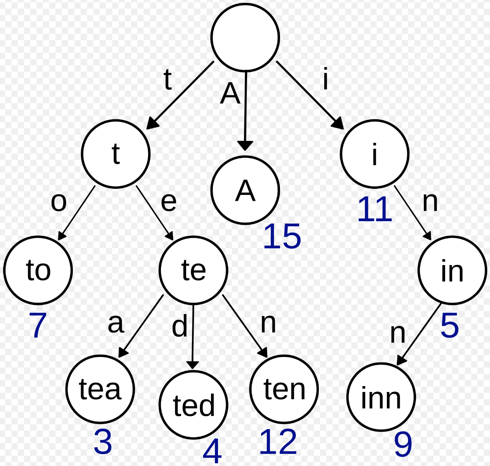

# Trie Overview:

### Overview:
* A **trie** (pronounced "**try**") is a **tree-like data structure** used for **efficient retrieval** of a **set of 
  strings or keys** typically **strings of characters**
* It is primarily used in computer science and information retrieval to **store and search for words, prefixes, or 
  sequences**
* The name "trie" comes from the word "**retrieval**," and it's often called a "**prefix tree**" because it **stores 
  keys by organizing them based on their common prefixes**
* 
* Key characteristics of a trie data structure include:
  * **Tree Structure:**
    * A trie is a **tree** where **each node** represents a **single character** (or a **group of characters**) in a key 
      or string
    * The **root of the tree** represents an **empty string**, and **each path** from the **root** to a **leaf node** 
      forms a **key**
  * **Nodes:**
    * **Each node** in the trie contains **the character it represents** and a **set of child nodes**, typically in the 
      form of an **array** or a **hash table**
    * The **child nodes** represent the **next characters in the keys**
  * **Leaf Nodes:**
    * **Leaf nodes** in the trie often **signify the end of a valid key**, and they may contain **additional data 
      associated with that key**
  * **Path Compression:**
    * Tries often employ **path compression**, where **nodes with only one child** are **merged into a single node**, 
      **reducing the memory footprint** and making operations **more efficient**
* Tries are particularly useful for tasks like:
  * **Prefix Matching:**
    * Tries are efficient for finding all keys with a common prefix, making them suitable for **autocomplete** 
      features and **searching in dictionaries**
  * **Dictionary or Spell Checker:**
    * Tries can be used to **implement dictionaries** or **spell checkers** as they **efficiently store and search for 
      words**
  * **IP Routing:**
    * In **networking**, tries can be used to **optimize IP address routing tables**, improving the efficiency of routing
  * **Text Indexing:**
    * Tries are also used in **text indexing** and **search engines** to **quickly locate words or phrases** within 
      a large body of text
* Trie operations, such as **insertion, deletion, and searching**, often have **time complexities** that **depend on 
  the length of the keys or strings being stored**, which makes tries efficient for tasks where **string matching** or 
  **prefix matching** is a common operation