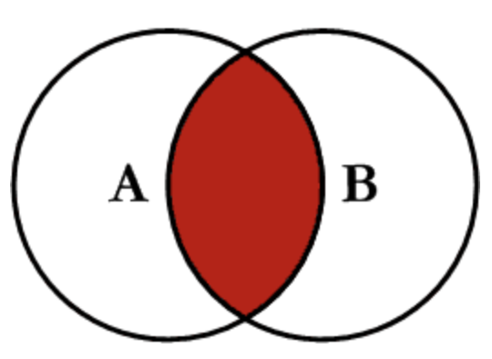
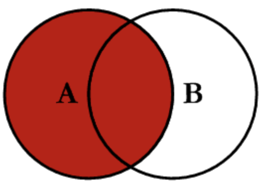
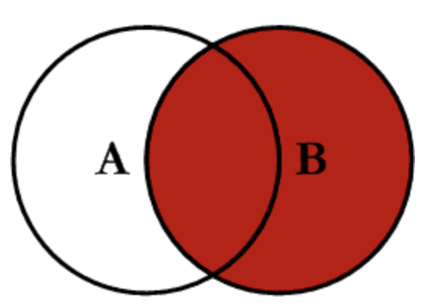
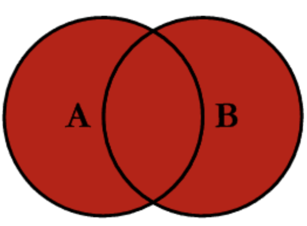

# SQL Overview:

### Overview:
* **SQL** (**Structured Query Language**) is a **standardized programming language** used for **managing**, 
  **manipulating**, and **retrieving data** stored in **relational database management systems** (**RDBMS**)
* It provides a **common interface** to **interact with databases**, enabling users to **perform various operations on 
  the data**

### Key Aspects and Functionalities of SQL:
* **Data Querying:**
  * SQL allows users to **retrieve specific data** from a database using the **`SELECT` statement**
  * Queries can include **filtering**, **sorting**, **aggregating**, and **joining data** from **one or multiple 
    tables**
  * **Example:**
    * `SELECT column1, column2 FROM table_name WHERE condition;`
* **Data Manipulation:**
  * SQL supports operations to **modify data in a database**
  * These operations include **inserting new records** (**`INSERT`**), **updating existing records** (**`UPDATE`**), 
    and **deleting records** (**`DELETE`**)
  * **Examples:**
```
INSERT INTO table_name (column1, column2) VALUES (value1, value2);
UPDATE table_name SET column1 = value1 WHERE condition;
DELETE FROM table_name WHERE condition;
```
* **Data Definition:**
  * SQL allows the **creation**, **modification**, and **deletion** of **database objects** such as **tables** 
    (**`CREATE TABLE`**), **indexes** (**`CREATE INDEX`**), **views** (**`CREATE VIEW`**), and **constraints** 
    (**`ALTER TABLE`**, **`ADD CONSTRAINT`**)
  * **Example:**
```
CREATE TABLE table_name (
column1 datatype,
column2 datatype,
...
);
```
* **Data Control:**
  * SQL includes **statements** for **managing user access privileges** and **security settings** within a database, 
    such as **granting** or **revoking permissions** (**`GRANT`**, **`REVOKE`**)
  * **Example:**
    * `GRANT SELECT, INSERT ON table_name TO user_name;`
* **Transaction Control:**
  * SQL supports **managing transactions**, ensuring the **consistency** and **integrity of data**
  * Transaction-related statements include **`COMMIT`** to **save changes permanently** and **`ROLLBACK`** to **undo 
    changes made during a transaction**
  * **Example:**
```
BEGIN TRANSACTION;
-- SQL statements --
COMMIT;
```
* SQL is a **declarative language**, meaning that **users specify what data they want to retrieve or modify without 
  specifying how the database should perform the operation**
* It provides a **powerful** and **flexible** means of **interacting with relational databases**, allowing users to 
  **manage and manipulate data efficiently**

### Joining Tables in SQL:
* In SQL, a **`JOIN`** is used to **combine rows** from **two or more tables based on a related column between them**
* It allows you to **retrieve data** from **multiple tables simultaneously** by **specifying the relationships between 
  these tables**
* There are different types of `JOIN`s in SQL:
* **`INNER JOIN`:**
  * Retrieves records that have **matching values in both tables being joined**
  * It **returns rows** when there is a **match between the columns** in **both tables**
```
SELECT * 
FROM table1 
INNER JOIN table2 ON table1.column_name = table2.column_name;
```
* 
* **Inner Join Example:**
* **Table: `employees`:**
```
| emp_id | emp_name  | department_id |
|--------|-----------|---------------|
| 1      | Alice     | 101           |
| 2      | Bob       | 102           |
| 3      | Charlie   | 101           |
| 4      | David     | 103           |
```
* **Table: `departments`**
```
| department_id | department_name |
|---------------|-----------------|
| 101           | Sales           |
| 102           | Marketing       |
| 103           | Finance         |
```
* We want to **retrieve** the **names of employees along with the names of their respective departments** based on the 
  **`department_id`**
* **Using an `INNER JOIN` in SQL:**
```
SELECT employees.emp_name, departments.department_name
FROM employees
INNER JOIN departments ON employees.department_id = departments.department_id;
```
* This SQL query performs an **`INNER JOIN` between the `employees` and `departments` tables**, **matching rows** where 
  the **`department_id` in the `employees` table matches the `department_id` in the `departments` table**
* The result set will look like this:
```
| emp_name  | department_name |
|-----------|-----------------|
| Alice     | Sales           |
| Bob       | Marketing       |
| Charlie   | Sales           |
| David     | Finance         |
```
* **`LEFT JOIN` (or `LEFT OUTER JOIN`)**:
  * Retrieves **all records** from the **left table** and the **matching records** from the **right table**
  * If there is **no match**, it **returns `NULL` values** for **columns from the right table**
```
SELECT * 
FROM table1 
LEFT JOIN table2 ON table1.column_name = table2.column_name;
```
* 
* **Left Join Example:**
* Consider two tables, `students` and `grades`, and use a `LEFT JOIN` to **retrieve data** from **both tables**, showing 
  **all students** and **their corresponding grades** (**if available**)
* **Table: `students`**
```
| student_id | student_name |
|------------|--------------|
| 1          | Alice        |
| 2          | Bob          |
| 3          | Charlie      |
| 4          | David        |
```
* **Table: `grades`**
```
| student_id | grade |
|------------|-------|
| 1          | A     |
| 2          | B     |
| 4          | C     |
```
* We want to **retrieve** the **names** of **students** along with **their grades**, **if available**, **based on the 
  `student_id`**
* Using a `LEFT JOIN` in SQL:
```
SELECT students.student_name, COALESCE(grades.grade, 'No Grade') AS grade
FROM students
LEFT JOIN grades ON students.student_id = grades.student_id;
```
* This SQL query performs a **`LEFT JOIN`** between the **students** and **grades tables**, **matching rows based on the 
  student_id**
* The result set will look like this:
```
| student_name | grade    |
|--------------|----------|
| Alice        | A        |
| Bob          | B        |
| Charlie      | No Grade |
| David        | C        |
```
* In this result set:
  * **Alice**, **Bob**, and **David** have **corresponding grades** in the **grades table**, so their **grades are displayed**
  * **Charlie doesn't have a corresponding entry** in the **grades table**, so the **`COALESCE` function shows 'No 
    Grade'** as the **default value**
* **`RIGHT JOIN` (or `RIGHT OUTER JOIN`)**:
  * Retrieves **all records** from the **right table** and the **matching records from the left table**
  * If there is **no match**, it **returns `NULL` values** for **columns from the left table**
```
SELECT * 
FROM table1 
RIGHT JOIN table2 ON table1.column_name = table2.column_name;
```
* 
* **Right Join Example:**
  * If we want to **retrieve all grades** along with the **corresponding student names** (**if available**) based on 
    the `student_id`
```
SELECT students.student_name, COALESCE(grades.grade, 'No Grade') AS grade
FROM students
RIGHT JOIN grades ON students.student_id = grades.student_id;
```
* This SQL query performs a **`RIGHT JOIN` between the `students` and `grades` tables**, **matching rows** based on the 
  **`student_id`**
* The result set will look like this:
```
| student_name | grade    |
|--------------|----------|
| Alice        | A        |
| Bob          | B        |
| David        | C        |
| Charlie      | No Grade |
```
* **Charlie doesn't have a corresponding entry** in the students table, so the `COALESCE` function shows **'No Grade'** 
  as the **default value**
* This is because the **`RIGHT JOIN` retrieves all records from the grades table** and **includes matching records** 
  from the **students table**
* As there's **no corresponding `student_name`** for **Charlie** in the **students table**, it appears as **'No Grade'**
* **`FULL JOIN` (or `FULL OUTER JOIN`)**:
  * Retrieves **all records** when there is a **match in either the left or right table**
  * It returns **`NULL` values** for **columns where no match is found**
```
SELECT * 
FROM table1 
FULL JOIN table2 ON table1.column_name = table2.column_name;
```
* **Full Outer Join Example:**
* **Table: `employees`**
```
| emp_id | emp_name  | department_id |
|--------|-----------|---------------|
| 1      | Alice     | 101           |
| 2      | Bob       | 102           |
| 3      | Charlie   | 101           |
| 4      | David     | 103           |
```
* **Table: `departments`**
```
| department_id | department_name |
|---------------|-----------------|
| 101           | Sales           |
| 102           | Marketing       |
| 104           | HR              |
```
* **Using a `FULL OUTER JOIN` in SQL:**
```
SELECT employees.emp_name, departments.department_name
FROM employees
FULL OUTER JOIN departments ON employees.department_id = departments.department_id;
```
* This SQL query performs a **`FULL OUTER JOIN`** between the **employees** and **departments tables** based on the
  **`department_id` column**
* The result set will look like this:
```
| emp_name  | department_name |
|-----------|-----------------|
| Alice     | Sales           |
| Bob       | Marketing       |
| Charlie   | Sales           |
| David     | NULL            |
| NULL      | HR              |
```
* In this result set:
  * **Alice**, **Bob**, and **Charlie** have **corresponding departments**, so their **names are displayed with their 
    respective department names**
  * **David** is in **department 103**, which **doesn't exist in the departments table**, so the **department name 
    appears as `NULL`**
  * There is a **department "HR"** in the **departments table** with **no corresponding employees** in the **employees 
    table**
  * Hence, the **employee name appears as `NULL` for that department**
* This `FULL OUTER JOIN` **retrieves all records from both tables**, **displaying matches where available** or **`NULL` 
  values where there is no match**, providing a **comprehensive view** of **all employees and departments or vice 
  versa**
* * 
* **`CROSS JOIN`:**
  * Produces a **Cartesian product** of **two tables**, meaning it **returns all possible combinations of rows between 
    the tables**
  * It **does not require an "`ON`" clause**
```
SELECT * 
FROM table1 
CROSS JOIN table2;
```
* **Cross Join Example:**
* **Table: `colors`**
```
| color |
|-------|
| Red   |
| Blue  |
```
* **Table: `sizes`**
```
| size  |
|-------|
| Small |
| Large |
```
* **Using a `CROSS JOIN` in SQL:**
```
SELECT colors.color, sizes.size
FROM colors
CROSS JOIN sizes;
```
* This SQL query performs a `CROSS JOIN` between the **colors** and **sizes tables**, generating **all possible 
  combinations of rows** from **both tables**
* The result set will look like this:
```
| color | size  |
|-------|-------|
| Red   | Small |
| Red   | Large |
| Blue  | Small |
| Blue  | Large |
```
* In this result set, **each row** from the **colors table** is **combined with every row** from the **sizes table**, 
  resulting in **four combinations** (**2 colors** * **2 sizes**)
* This operation **generates all possible pairs** of **colors** and **sizes**, showcasing the **Cartesian product of the 
  two tables** involved in the `CROSS JOIN`
* Joins are **powerful SQL operations** used to **combine data from multiple tables** based on **common columns**,
  allowing users to **retrieve related data in a single result set**
* The **type of join used** depends on the **specific data retrieval requirements** and **relationships between the
  tables**

### Comparing Left Join and Right Join:
* **Example:**
* **Employees Table:**
```
| ID | Name    | DepartmentID |
|----|---------|--------------|
| 1  | Alice   | 1            |
| 2  | Bob     | 2            |
| 3  | Charlie | NULL         |
```
* **Departments Table:**
```
| ID | DepartmentName |
|----|----------------|
| 1  | HR             |
| 2  | Marketing      |
| 3  | Finance        |
```
* A **left join** on these tables would look like this:
```
SELECT Employees.Name, Departments.DepartmentName
FROM Employees
LEFT JOIN Departments ON Employees.DepartmentID = Departments.ID;
```
* The **result** would be:
```
| Name    | DepartmentName |
|---------|----------------|
| Alice   | HR             |
| Bob     | Marketing      |
| Charlie | NULL           |
```
* On the other hand, a **right join** on these tables would look like this:
```
SELECT Employees.Name, Departments.DepartmentName
FROM Employees
RIGHT JOIN Departments ON Employees.DepartmentID = Departments.ID;
```
* The **result** would be:
```
| Name    | DepartmentName |
|---------|----------------|
| Alice   | HR             |
| Bob     | Marketing      |
| NULL    | Finance        |
```
* In this example, a **left join includes all employees** (**even Charlie**, who **doesn't have a department**), and a
  **right join includes all departments** (**even Finance**, which **doesn't have any employees**)
* **Is Right Join Even Necessary?**
  * In SQL, a **`LEFT JOIN`** is **functionally equivalent** to a **`RIGHT JOIN`** when you **switch the order of the
      tables**
  * Because of this **symmetry**, **some database systems only support the `LEFT JOIN` operation** and not the
    `RIGHT JOIN`
  * Developers can **achieve the same results** by **reordering** the **tables in the query**
  * The choice between `LEFT` and `RIGHT JOIN`s often comes down to **personal preference** or **readability** in the code
  * Some developers prefer using only `LEFT JOIN`s to **maintain consistency** in their queries, while others might opt for
    `RIGHT JOIN`s for **clarity** when **expressing their intentions** regarding the **tables' order**
  * Ultimately, it's about **choosing a style** that's **most comprehensible for anyone reading or maintaining the code**