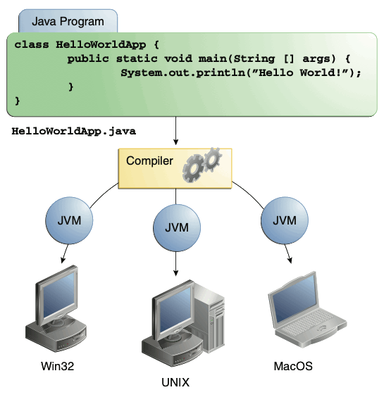

# Java Overview:

### Overview:
* Java is a **high-level**, **object-oriented** **programming language** that was developed by **James Gosling** and 
  his team at **Sun Microsystems** (now owned by **Oracle Corporation**) in the **mid-1990s**
* It has since become one of the **most popular** and **widely used** programming languages for a **wide range** of 
  applications, from **web and mobile development** to **embedded systems** and **enterprise software**
* Java's main features include:
  * **Platform Independence (Write Once, Run Anywhere):**
    * Java **programs** are **compiled** into an **intermediate form** known as **bytecode**
    * This **bytecode** can run on **any platform** with a **Java Virtual Machine (JVM)**, which **interprets and 
      executes** the **bytecode**
    * This "**write once, run anywhere**" principle makes Java **platform-independent**
  * **Object-Oriented:**
    * Java is a **purely object-oriented** programming language, which means that **everything in Java is an object**
    * It **encourages** the use of **classes** and **objects** for building **modular** and **maintainable** software
  * **Robust and Secure:**
    * Java's **strong type-checking**, **runtime checking**, and **exception handling** contribute to its **robustness**
    * Java also has **built-in security features** to protect against **unauthorized access**, **viruses**, and 
      **other security threats**
  * **Automatic Memory Management (Garbage Collection):**
    * Java **manages memory automatically** through a process called **garbage collection**
    * This helps **prevent memory leaks** and **simplifies memory management for developers**
  * **High Performance:**
    * Java's **Just-In-Time (JIT) compilation** allows it to achieve good performance by **converting bytecode** into 
      **native machine code at runtime**
  * **Multi-Threaded and Concurrency Support:**
    * Java provides **built-in support** for **multi-threading** and **concurrency**, allowing developers to create 
      applications that can **efficiently handle multiple tasks simultaneously**
  * **Rich Standard Library (Java API):**
    * Java comes with a **comprehensive set** of **libraries and APIs** (Application Programming Interfaces) that 
      cover various aspects of development, including **I/O**, **networking**, **data structures**, and **graphical 
      user interfaces**
  * **Community and Ecosystem:**
    * Java has a **vast and active developer community**
    * It also has a **rich ecosystem** of **third-party libraries**, **frameworks**, and **tools** that make it easier 
      to build a **wide range of applications**
  * **Portability and Scalability:**
    * Java's **platform independence** and **support for networking and distributed computing** make it suitable for 
      developing **portable and scalable applications**, including **web and enterprise systems**
  * **Open Source:**
    * **Java itself**, as well as **many of its libraries and tools**, are **open source**, which **fosters innovation** 
      and **collaboration** in the **development community**
  * **Modern Language Features:**
    * Over the years, Java has introduced **modern language features and improvements**, such as **lambdas** (in Java 8), 
      **modules** (in Java 9), and **pattern matching** (in Java 16), to make the language **more expressive** and 
      **developer-friendly**
  * **Dynamic and Extensible:**
    * Java allows for **dynamic loading of classes and extensions**, enabling applications to **adapt** to **changing 
      requirements** and **incorporate new functionality**
* Java's versatility, portability, and wide range of applications have contributed to its enduring popularity in the 
  software development industry
* It is used for developing web and mobile applications, desktop software, backend services, embedded systems, and 
  much more
* 

### The String.split() Method:
* The `String.split()` method in Java is used to **split a string into an array of strings** based on a **specified 
  delimiter**
* The delimiter can be a **single character** or a **regular expression**
* The `String.split()` method can take one or two parameters:
* `delimiter`:
  * The **delimiter** that you want to use **to split the string**
* `limit`:
  * The **maximum number of strings** to **include in the array**
  * If you specify a **negative limit**, the method will split the string into **as many strings as possible**
  * If you specify a **limit of 0** (**default**), the method will split the string into **an array containing the entire string**
* The `String.split()` method returns an array of strings, where each string is a part of the original string that is 
  separated by the delimiter
* If the **delimiter does not appear** in the original string, the method will return an array containing a **single 
  string**, which is the **original string**
* Here are some examples of how to use the String.split() method:
```
// Split a string on whitespace.
String[] stringArray = "This is a string.".split(" ");

// Split a string on a comma.
stringArray = "This,is,a,string.".split(",");

// Split a string on a regular expression.
stringArray = "This is a string.".split("\\s+");
```
* In the first example, the `String.split()` method will split the string `"This is a string."` on **whitespace** and 
  return an array containing the following strings: `["This", "is", "a", "string."]`
* In the second example, the `String.split()` method will split the string `"This,is,a,string."` on a **comma** and 
  return an array containing the following strings: `["This", "is", "a", "string"]`
* In the third example, the `String.split()` method will split the string `"This is a string."` on the **regular 
  expression** `\\s+`
  * The regular expression `\\s+` matches **one or more whitespace characters**
  * The `String.split()` method will return an array containing the following strings: `["This", "is", "a", "string"]`
* The `String.split()` method is a powerful tool for **splitting strings into arrays**
* It can be used to split strings on a variety of **delimiters**, including **whitespace**, **commas**, and **regular 
  expressions**

### The String Substring Method:
* The **`substring()` method** in **Java** is used to **extract a substring from a given string**
* It can be used to **extract any substring**, **regardless** of its **length or position** within the **original 
  string**
* The substring() method has **two overloaded variants**:
* `substring(int beginIndex)`:
  * This method returns a new string that is a substring of the original string, **starting at the specified index** and 
    **extending to the end of the string**
* `substring(int beginIndex, int endIndex)`:
  * This method returns a new string that is a substring of the original string, **starting at the specified index** and 
    **extending to the character at the specified end index - 1**
* The `beginIndex` parameter is the **index of the first character in the substring**
* The `endIndex` parameter is the **index of the last character in the substring, plus 1**
* Both variants of the `substring()` method can throw an `IndexOutOfBoundsException` if any of the following conditions 
  are met:
  * The `beginIndex` is **negative**
  * The `endIndex` is **larger than the length** of the **original string**
  * The `beginIndex` is **larger than the endIndex**
* Here is an example of how to use the substring() method:
```
String originalString = "Hello, world!";

// Extract the substring "llo, world!" from the original string.
String substring = originalString.substring(2);

// Extract the substring "Hello" from the original string.
String substring = originalString.substring(0, 5);
```
* The `substring()` method can be used to perform a variety of tasks, such as:
  * **Extracting substrings** from larger strings
  * **Removing prefixes or suffixes** from strings
  * Checking if a string **contains** a **particular substring**
  * **Splitting a string** into **multiple substrings**

### Format Strings in Java:
* In Java, a **format string** is a string that contains placeholders for values that will be **substituted during 
  runtime**
* The `String.format()` method and `System.out.printf()` method are commonly used to create formatted strings in Java
* Here's a basic overview of how format strings work in Java:
  * **Format Specifiers:**
    * **Format specifiers** are **placeholders in the format string** that **indicate where and how values should be 
      inserted**
    * They start with a **percent sign** `%` followed by a **character** that **specifies** the **type of data** (e.g., 
      `%d` for **integers**, `%f` for **floating-point numbers**, `%s` for **strings**)
  * **Argument List:**
    * After the format string, you provide a **list of arguments** that **correspond to the placeholders** in the format 
      string
    * The **order of the arguments** should **match** the **order of the placeholders** in the format string
```java
public class FormatExample {
    public static void main(String[] args) {
        String name = "John";
        int age = 25;
        double height = 5.9;

        // Using String.format()
        String formattedString = String.format("Name: %s, Age: %d, Height: %.2f", name, age, height);
        System.out.println(formattedString);

        // Using System.out.printf()
        System.out.printf("Name: %s, Age: %d, Height: %.2f%n", name, age, height);
    }
}
```
* In this example:
  * `%s` is a placeholder for a **string** (`name`)
  * `%d` is a placeholder for an **integer** (`age`)
  * `%.2f` is a placeholder for a **floating-point number** (`height`) with **two decimal places**
* The output will be something like:
```
Name: John, Age: 25, Height: 5.90
Name: John, Age: 25, Height: 5.90
```
* This allows you to create **well-formatted strings** with **dynamic content**
* The format specifiers **provide control** over the appearance of the output
* **The Integer Format Specifier (`%d`):**
  * **Width:**
    * The **width specifier** in the **integer format** controls the **minimum number of characters used** to **represent 
      the integer**
    * It allows you to **ensure a consistent width** for your output
    * The **syntax** is `%[flags][width]d`, where **width** is the **minimum width**, and `[flags]` can include options 
      like **left justification** (`-`) or **zero padding** (`0`)
    * In the example below, the **width** is set to **5 characters**, so the integer is **right-aligned**, and **any 
      extra spaces** are **added to the left**
  * **Leading Zeros:**
    * The **leading zero flag** (`0`) is used to **pad the integer with leading zeros instead of spaces**
    * This is often useful for **aligning numbers in columns**
    * In the example below, the **width** is set to **5 characters**, and the **leading zero flag** ensures that **if 
      the integer has fewer than 5 digits**, it is **padded with leading zeros**
  * **Combining Width and Leading Zeros:**
    * You can **combine width and leading zeros** for a **specific formatting effect**
    * In the example below, the **width is set to 5 characters**, and the **leading zero ensures** that if the integer 
      **has fewer than 5 digits**, it is **padded with leading zeros**
  * **Negative Numbers:**
    * When dealing with **negative numbers**, the **width specifier includes the negative sign as one of the 
      characters**
    * In the example below, the width specifier **accounts for the negative sign** in the **total width**
```
//Width Example:
int num = 123;
String formatted = String.format("%5d", num);
// Output: "  123"

//Leading Zeroes Example:
int num = 7;
String formatted = String.format("%05d", num);
// Output: "00007"

//Combining Width and Leading Zeros Example:
int num = 123;
String formatted = String.format("%05d", num);
// Output: "00123"

//Negative Numbers Example:
int negativeNum = -42;
String formatted = String.format("%5d", negativeNum);
// Output: "  -42"
```
* **The Floating Point Format Specifier (`%f`):**
  * **Width and Precision:**
    * The **width and precision specifiers** in the **floating-point format** control the **minimum width** and the 
      **number of digits after the decimal point, respectively**
    * The **syntax** is `%[flags][width][.precision]f`
    * In the example below:
      * The **minimum width** is set to **10 characters**, and **any extra spaces** are **added to the left** to meet 
        this **width**
      * The **precision** is set to **2 decimal places after the decimal point**
  * **Leading Zeros:**
    * The **leading zero flag (`0`)** can be used to **pad the floating-point number with leading zeros instead of 
      spaces**
    * **In the example below:**
      * The **minimum width** is set to **8 characters**
      * The **precision** is set to **2 decimal places after the decimal point**
      * **Leading zeros** are **added** to **fill the width**
  * **Combining Width, Precision, and Leading Zeros:**
    * You can **combine width, precision, and leading zeros** for specific formatting effects
    * In the example below:
      * The **minimum width** is set to **10 characters**
      * The **precision** is set to **3 decimal places after the decimal point**
      * **Leading zeros** are **added** to **fill the width**
  * **Scientific Notation:**
    * **Scientific notation** can be represented using the **`%e` or `%E` format specifier**
    * It is useful for **very large** or **very small numbers**
    * In the example below:
      * `%e` represents the number in **lowercase scientific notation**
      * `%E` represents the number in **uppercase scientific notation**
  * **Negative Numbers:**
    * Similar to integers, when dealing with **negative floating-point numbers**, the **width specifier includes the negative
      sign** as **one of the characters**
    * In the example below, the **width specifier accounts for the negative sign** in the **total width**
```
//Width and Precision Example:
double num = 3.14159;
String formatted = String.format("%10.2f", num);
// Output: "      3.14"

//Leading Zeros Example:
double num = 7.5;
String formatted = String.format("%08.2f", num);
// Output: "00007.50"

//Combining Width, Precision and Leading Zeros:
double num = 123.456789;
String formatted = String.format("%010.3f", num);
// Output: "00123.457"

//Scientific Notation Example:
double num = 1.23e6;
String formatted = String.format("%e", num);
// Output: "1.230000e+06"

//Negative Numbers Example:
double negativeNum = -42.75;
String formatted = String.format("%10.2f", negativeNum);
// Output: "    -42.75"
```

### Primitive Types in Java:
* In Java, primitive types are **basic data types** that represent **simple values**
* They are **not objects** and **don't have methods**
* Java has **eight primitive data types**, which can be categorized into two groups: **numeric types** and **non-numeric 
  types**
* Here's an overview of each:
* **Numeric Types:**
  * **`byte` (8 bits):**
    * **Range:**
      * `-128` to `127`
    * Used for **small integers**
  * **`short` (16 bits):**
    * **Range:**
      * `-32,768` to `32,767`
    * Used for **larger integers**
  * **`int` (32 bits):**
    * **Range:**
      * `-2^31` to `2^31 - 1`
      * `2^31` = `2,147,483,648` (**~two billion**)
    * Used for integers
  * **`long` (64 bits):**
    * **Range:**
      * `-2^63` to `2^63 - 1`
      * `2^63` = `9,223,372,036,854,776,000` (**~nine quintillion**)
      * Used for **large integers**
  * **`float` (32 bits):**
    * Used for **floating-point numbers**
    * **Example:**
      * `float myFloat = 3.14f`;
  * **`double` (64 bits):**
    * Used for **double-precision floating-point** numbers
    * **Example:**
      * `double myDouble = 3.14;`
* **Non-Numeric Types:**
  * `char` (16 bits):
    * Represents a single character
    * **Example:**
      * `char myChar = 'A';`
  * `boolean` (8 bits):
    * Represents a boolean value (`true` or `false`)
    * **Example:**
      * `boolean myBoolean = true;`
* These primitive types are **essential** for **storing and manipulating simple values efficiently**
* They are **directly supported** by the **Java programming language** and are **not objects**
* However, Java also has corresponding **wrapper classes** (e.g., `Integer`, `Double`, `Boolean`) that allow these 
  primitives to be used in a **more object-oriented context**, as they are **objects** and can be **used with collections 
  that require objects**
* The use of wrapper classes is especially common when working with **Java generics** and **certain Java APIs**

### Absolute Value in Java:
* The **`Math.abs` function** in Java is a **built-in method** provided by the `java.lang.Math` class
* It is used to **calculate** the **absolute value** of a **given numeric expression**
* The **absolute value** is the **magnitude** of a **real number** **without regard to its sign**
* In other words, it **returns the distance of the number from zero on the number line**
* Here's the signature of the `Math.abs` method:
```
public static int abs(int a)
public static long abs(long a)
public static float abs(float a)
public static double abs(double a)
```
* For **integer types** (`int` and `long`), it returns the **absolute value** as an **integer or long**
* For **floating-point types** (`float` and `double`), it returns the absolute value as a **floating-point number**
```
int intValue = -5;
int absIntValue = Math.abs(intValue);
System.out.println("Absolute value of " + intValue + ": " + absIntValue);
// Output: 5

double doubleValue = -7.5;
double absDoubleValue = Math.abs(doubleValue);
System.out.println("Absolute value of " + doubleValue + ": " + absDoubleValue);
// Output: 7.5
```
* **Use Case:**
  * The `Math.abs` function is **commonly used** when you need to **ensure** that a **value** is **non-negative**
  * It's useful in situations where you want to **ignore the sign** of a **number** and **work with its magnitude**
  * Keep in mind that if the result of `Math.abs` is **assigned to a variable** or **used directly in an expression**, 
    the **type of the result matches the type of the input**
  * If the **input** is an **integer**, the **result** is an **integer**; if the **input** is a **floating-point number**, 
    the **result** is a **floating-point number**
