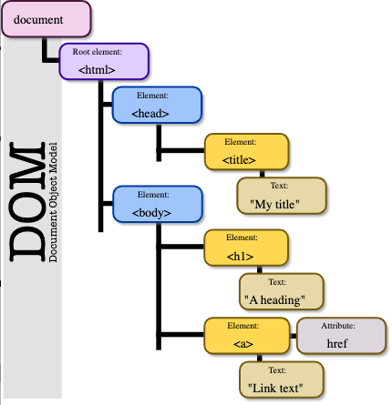

# HTML Overview:

### Overview:
* **HTML** stands for **HyperText Markup Language**
* It's the **standard markup language** used to **create** the **structure** and **content** of **web pages**
* HTML provides a **set of elements or tags** that **define the structure** of a **web document** and **describe how 
  the content should be displayed**** in a **web browser**
* **Key Points about HTML:**
  * **Markup Language:**
    * HTML is **not a programming language**; it's a **markup language** used to **structure content on the web**
    * It consists of a **series of elements or tags** that **define the structure** of a **web page**
  * **Element Structure:**
    * HTML documents are made up of **elements enclosed** in **angle brackets** (`< >`)
    * Elements consist of a **start tag**, **content**, and an **end tag** (e.g., `<p>` for **paragraph**)
  * **Content Structure:**
    * HTML **organizes content hierarchically**
    * **Elements** can be **nested inside other elements** to create a **structured layout**
  * **Semantic Markup:**
    * HTML offers a set of **semantic elements** (like `<header>`, `<footer>`, `<nav>`, `<article>`, etc.) that **convey 
      the meaning of the content rather than just its appearance**
  * **Basic Elements:**
    * HTML includes a range of elements for **text formatting** (`<p>`, `<h1>`, `<strong>`, `<em>`), **creating lists** 
      (`<ul>`, `<ol>`, `<li>`), **adding images** (``), **creating links** (`<a>`), and much more
* **Example:**
```html
<!DOCTYPE html>
<html>
<head>
    <title>Sample Page</title>
</head>
<body>
    <header>
        <h1>Welcome to My Website</h1>
        <nav>
            <ul>
                <li><a href="#home">Home</a></li>
                <li><a href="#about">About</a></li>
                <li><a href="#contact">Contact</a></li>
            </ul>
        </nav>
    </header>
    <main>
        <article>
            <h2>About Us</h2>
            <p>This is a brief description of our website...</p>
        </article>
        <section>
            <h2>Contact Information</h2>
            <p>Email: contact@example.com</p>
            <p>Phone: 123-456-7890</p>
        </section>
    </main>
    <footer>
        <p>&copy; 2023 MyWebsite. All rights reserved.</p>
    </footer>
</body>
</html>
```
* **In this example:**
  * `<html>`, `<head>`, `<title>`, `<body>` are the **basic structural elements** of an HTML document
  * **Semantic elements** like `<header>`, `<nav>`, `<main>`, `<article>`, `<section>`, and `<footer>` are used to 
    **define different parts of the page**
  * **Tags** like `<h1>`, `<h2>`, `<p>`, `<ul>`, `<li>`, `<a>`, etc., **structure and present the content**
* HTML provides the **foundation** for **creating web pages** and **works alongside CSS** (**Cascading Style Sheets**) 
  for **styling** and **JavaScript** for **interactivity** to create **rich and interactive web experiences**

### The Domain Object Model (DOM):
* The **Domain Object Model** (**DOM**) is a **programming interface** for **web documents** and represents the 
  **structure** of **HTML** and **XML documents** as a **tree-like structure** where **each node** represents an 
  **object in the document**
* **Key Points about the DOM:**
  * **Tree Structure:**
    * The DOM **represents the document** as a **tree structure** where **each node in the tree** corresponds to an 
      **object in the document**
    * **Nodes** can represent **elements**, **attributes**, **text**, etc.
  * **Standard Interface:**
    * It provides a **standard set of objects** for **representing HTML and XML documents** and a **standard way** of 
      **accessing and manipulating them**
  * **Programming Interface:**
    * The DOM is **not specific** to **any programming language** but provides a **set of interfaces** that can be 
      **accessed** and **manipulated** using **programming languages like JavaScript**
  * **Dynamic Nature:**
    * The DOM is **dynamic** and can be **modified** using **scripting languages** like **JavaScript**
    * This means **elements** can be **added**, **removed**, or **modified**, and the **changes will be reflected** in 
      the **displayed document**
  * **Document Representation:**
    * The DOM represents the **entire document** as a **collection of nodes** organized in a **tree structure**, 
      starting from the **root node** (usually the **`<html>` tag**) and **branching out** to **all the elements 
      within the document**
* **API for Interactivity:**
  * It **provides an API** that **allows scripts** to **dynamically access** and **update the content**, **structure**, 
    and **style** of a document, **enabling interactive web applications**
* **Consider the following HTML snippet:**
```html
<!DOCTYPE html>
<html>
<head>
    <title>DOM Example</title>
</head>
<body>
    <h1>Hello, World!</h1>
    <p>This is an example of the DOM.</p>
</body>
</html>
```
* The **DOM representation** of this HTML would be a **tree-like structure** with **nodes** for `<html>`, `<head>`, 
  `<title>`, `<body>`, `<h1>`, `<p>`, and **text nodes** representing the **text content**
* **JavaScript** can **manipulate** this **tree-like structure** by **adding elements**, **modifying content**, 
  **changing styles**, etc., **dynamically affecting what's displayed** in the **web browser**
* **Manipulating the DOM with JavaScript:**
```
// Changing text content
document.querySelector('h1').textContent = 'Hello, Updated!';

// Creating a new element
const newParagraph = document.createElement('p');
newParagraph.textContent = 'This is a new paragraph.';
document.body.appendChild(newParagraph);

// Modifying styles
document.querySelector('h1').style.color = 'blue';
```
* This **JavaScript** code demonstrates how to **select elements in the DOM**, **change their text content**, **create 
  new elements**, and **modify styles**
* These changes would **reflect immediately** in the **rendered web page**
* 