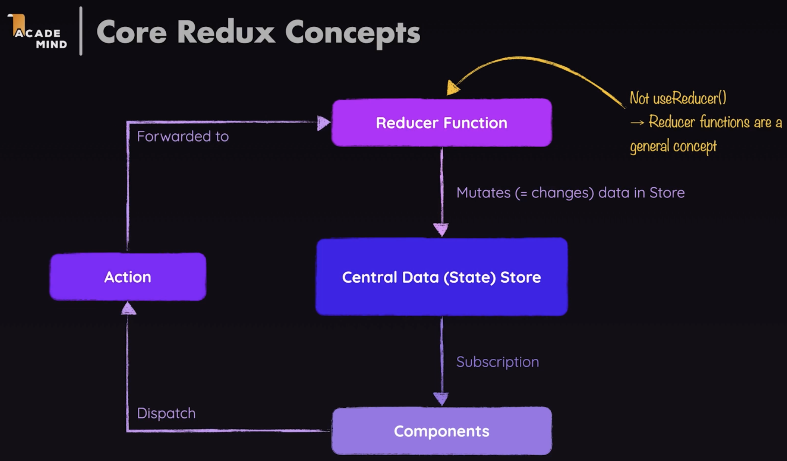

### Redux Overview:
* Redux is a **state management system** for **cross-component** or **app-wide state**
* **State:**
  * Data which, when changed should affect the UI
  * **What is Cross-Component & App-Wide State:**
      * **Local State:**
          * State belongs to a single component
          * E.g. listening to user input on an input field or toggling a "show more details field"
          * Should be managed inside the component via `useState()` or `useReducer()`
      * **Cross-Component State:**
          * State affecting multiple components
          * E.g. open / closed state of a modal overlay
          * Requires "prop drilling"
      * **App-Wide State:**
          * State affecting the entire app
          * E.g. user authentication status or chosen theme
          * Requires "prop-drilling"
* **React Context Has Some Potential Disadvantages:**
    * **Complex Setup & Management:**
        * In more complex apps, using React Context can lead to deeply nested or “fat” “Context Provider” components
    * **Performance:**
        * React Context is not optimized for high-frequency state changes
* **How Does Redux Work?**
    * **The Central Data Store:**
        * Redux is all about having **one Central Data Store**, or state in your application
        * In this store, you would store authentication state theming, or maybe some user input state you would like to save
        * Whichever cross component or app wide state you have, it goes into this one store
        * If some data within the store changes, i.e. if the authentication status of a user changes, we wanna know about
          that in a component, so that we can react accordingly, and update the UI
        * For this, components set up subscriptions to the Central Store, so the data only flows from the store to components
        * It's important to note that components never directly manipulate the store data
    * **The Reducer:**
        * The reducer function is responsible for mutating the data store
        * Reducer functions in general, are function which take some input and transform that input
        * Ultimateely it sshould be a component, for examplee a click on a button, that triggerss a data change
    * **Actions:**
        * Components dispatch or trigger actions
        * An action is really just a simple JavaScript object which describes the kind of operation the reducers should
          perform
        * Redux forwards actions to the reducer, reads that description of the desired operation, and then the reducer
          performs the operation
    * **Summary:**
        * So components dispatch actions, which describe what should be done, but don't do it directly
        * Then these actions are forwarded to the reducer
        * The reducer then does what the action wants the reducer to do
        * Then the reducer, spits out a new state, which effectively will replace the existing state in that Central Data
          Store
    * 

### Simple Redux Demo:
* Start with an empty directory in VS Code
* Make a Javascript file named `redux-demo.js`
* Initialize a project with default answers:
```
npm init -y
```
* **Install Redux:**
```
npm install redux
```
* **Simple Redux Example:**
```
//redux-demo.js:
const redux = require('redux');

//Reducer:
const counterReducer = (state = { counter: 0 }, action) => {
    if(action.type === 'increment'){
        return {
            counter: state.counter + 1
        };
    }

    if(action.type === 'decrement'){
        return {
            counter: state.counter - 1
        };
    }

    return state;
};

//Store:
const store = redux.createStore(counterReducer);

//Subscription:
const counterSubscriber = () => {
    const latestState = store.getState();
    console.log(latestState);
};

store.subscribe(counterSubscriber);

//Action:
store.dispatch({type: 'increment'});
store.dispatch({type: 'decrement'});
```

### Using Redux Within React:
* Sample Project Located in `~/Desktop/Repositories/React/react-tutorial-projects/redux/01-starting-project`
* **Install Redux and React Redux:**
```
npm install redux react-redux
```
* **Create a New Store Directory `/src/store`**
* **Create a New Store File: `/src/store/index.js`:**
```
import {createStore} from 'redux';

//Reducer:
const counterReducer = (state = { counter: 0 }, action) => {
    if(action.type === 'increment'){
        return {
            counter: state.counter + 1
        };
    }

    if(action.type === 'increase'){
        return {
            counter: state.counter + action.amount
        };
    }

    if(action.type === 'decrement'){
        return {
            counter: state.counter - 1
        };
    }

    return state;
};

//Store:
const store = createStore(counterReducer);

export default store;
```
* **In the `/src/index.js` File:**
```
import React from 'react';
import ReactDOM from 'react-dom/client';
import { Provider } from 'react-redux';

import './index.css';
import App from './App';
import store from './store/index'

const root = ReactDOM.createRoot(document.getElementById('root'));
root.render(<Provider store = {store}><App /></Provider>);
```
* **Using Redux Data in React Components:**
* In the `src/components/Counter.js`
```
import classes from './Counter.module.css';
import { useSelector, useDispatch } from 'react-redux';

const Counter = () => {
  const dispatch = useDispatch();
  const counter = useSelector(state => state.counter);
  
  const incrementHandler = () => {
    dispatch({type: 'increment'});
  };

  const increaseHandler = () => {
    dispatch({type: 'increase', amount: 5 });
  };

  const decrementHandler = () => {
    dispatch({type: 'decrement'});
  };

  const toggleCounterHandler = () => {};

  return (
    <main className={classes.counter}>
      <h1>Redux Counter</h1>
      <div className={classes.value}>{counter}</div>
      <div>
        <button onClick={incrementHandler}>Increment</button>
        <button onClick={increaseHandler}>Increase By 5</button>
        <button onClick={decrementHandler}>Decrement</button>
        </div>
      <button onClick={toggleCounterHandler}>Toggle Counter</button>
    </main>
  );
};

export default Counter;
```

### Redux Toolkit:
* Install Redux Toolkit:
```
npm install @reduxjs/toolkit
```
* Note that you can now remove `"redux": "^x.x.x"` from your `package.json` dependencies because it is included in Redux 
  Toolkit
* `/src/App.js`:
```
import { Fragment } from 'react';
import {useSelector} from 'react-redux';

import Counter from './components/Counter';
import Header from './components/Header';
import Auth from './components/Auth'
import UserProfile from './components/UserProfile'

function App() {
  const isAuth = useSelector(state => state.auth.isAuthenticated);
  
  return (
    <Fragment>
      <Header />
      {!isAuth && <Auth />}
      {isAuth && <UserProfile />}
      <Counter />
    </Fragment>
    
  );
}

export default App;
```
* `src/index.js`:
```
import React from 'react';
import ReactDOM from 'react-dom/client';
import { Provider } from 'react-redux';

import './index.css';
import App from './App';
import store from './store/index'

const root = ReactDOM.createRoot(document.getElementById('root'));
root.render(<Provider store = {store}><App /></Provider>);
```
* `src/components/Auth.js`:
```
import {useDispatch} from 'react-redux';
import classes from './Auth.module.css';

import {authActions} from '../store/auth';

const Auth = () => {
  const dispatch = useDispatch();
  
  const loginHandler = (event) => {
    event.preventDefault();

    dispatch(authActions.login())
  }
  
  return (
    <main className={classes.auth}>
      <section>
        <form onSubmit={loginHandler}>
          <div className={classes.control}>
            <label htmlFor='email'>Email</label>
            <input type='email' id='email' />
          </div>
          <div className={classes.control}>
            <label htmlFor='password'>Password</label>
            <input type='password' id='password' />
          </div>
          <button>Login</button>
        </form>
      </section>
    </main>
  );
};

export default Auth;
```
* `src/components/Counter.js`:
```
import classes from './Counter.module.css';
import { useSelector, useDispatch } from 'react-redux';
import { counterActions } from '../store/counter'

const Counter = () => {
  const dispatch = useDispatch();
  const counter = useSelector((state) => state.counter.counter);
  const showCounter = useSelector((state) => state.counter.showCounter);
  
  const incrementHandler = () => {
    dispatch(counterActions.increment());
  };

  const increaseHandler = () => {
    dispatch(counterActions.increase(5)); // {type: SOME_UNIQUE_ID, payload: 5}
  };

  const decrementHandler = () => {
    dispatch(counterActions.decrement());
  };

  const toggleCounterHandler = () => {
    dispatch(counterActions.toggleCounter());
  };

  return (
    <main className={classes.counter}>
      <h1>Redux Counter</h1>
      {showCounter && <div className={classes.value}>{counter}</div>}
      <div>
        <button onClick={incrementHandler}>Increment</button>
        <button onClick={increaseHandler}>Increase By 5</button>
        <button onClick={decrementHandler}>Decrement</button>
        </div>
      <button onClick={toggleCounterHandler}>Toggle Counter</button>
    </main>
  );
};

export default Counter;
```
* `src/store/index.js`:
```
import { configureStore } from '@reduxjs/toolkit'
import counterReducer from './counter'
import authReducer from './counter'

//Store:
const store = configureStore({
  reducer: {counter: counterReducer, auth: authReducer}
});

export default store;
```
* `src/store/auth.js`:
```
import { createSlice } from '@reduxjs/toolkit'

const initialAuthState = {
    isAuthenticated: false
}

const authSlice = createSlice({
    name: 'authentication',
    initialState: initialAuthState,
    reducers: {
        login(state) {
            state.isAuthenticated = true;
        },
        logout(state) {
            state.isAuthenticated = false;
        }
    } 
});

export const authActions = authSlice.actions;

export default authSlice.reducer;
```
* `src/store/counter.js`:
```
import { createSlice } from '@reduxjs/toolkit'

const initialCounterState = { counter: 0, showCounter: true }

const counterSlice = createSlice({
    name: 'counter',
    initialState: initialCounterState,
    reducers: {
        increment(state) {
            state.counter++;
        },
        decrement(state) {
            state.counter--;
        },
        increase(state, action) {
            state.counter = state.counter + action.payload;
        },
        toggleCounter(state) {
            state.showCounter = !state.showCounter;
        }
    } 
});

export const counterActions = counterSlice.actions;

export default counterSlice.reducer;
```