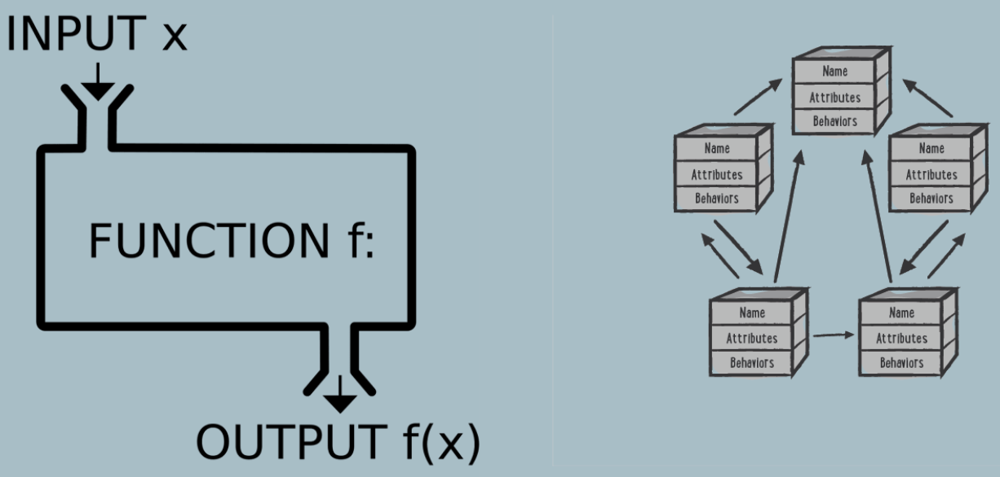

# Programming Language Overview:

### Object-Oriented Programming:
* **Object-oriented programming** (**OOP**) is a **programming paradigm** that uses **objects**, which are **instances 
  of classes**, to **design and organize code**
* It is based on the concept of "**objects**," which can **contain data** in the form of **fields** (**attributes** or 
  **properties**), and **code** in the form of **procedures** (**methods** or **functions**)
* **The 4 Pillars of Object-Oriented Programming Include:**
  * **Encapsulation:**
    * **Objects encapsulate data and the methods that operate on that data** within a **single unit**
    * This helps in **hiding the internal details** of an object and **exposing only what is necessary**
  * **Inheritance:**
    * **Inheritance** allows a **class** (**subclass** or **derived class**) to **inherit the properties and behaviors of 
      another class** (**superclass** or **base class**)
    * This promotes **code reuse** and helps in creating a **hierarchy of classes**
  * **Polymorphism:**
    * **Polymorphism** allows objects to be treated as **instances of their parent class**, even if they are **actually 
      instances of a subclass**
    * This enables flexibility and extensibility in code
  * **Abstraction:**
    * **Abstraction** involves **simplifying complex systems** by **modeling classes** based on the **essential features 
      they share**
    * It focuses on **what an object does** rather than **how it achieves its functionality**
* These principles contribute to the **modularity**, **maintainability**, and **reusability** of code
* Object-oriented programming is **widely used in software development**, and many programming languages, such as 
  **Java**, **C++**, and **Python**, support OOP concepts

### Functional Programming:
* **Functional programming** is a **programming paradigm** that **treats computation** as the **evaluation of 
  mathematical functions** and **avoids changing-state and mutable data**
* It's **based on the principles** of **mathematical functions**, emphasizing the use of **immutable data** and **pure 
  functions without side effects**
* Key concepts in functional programming include:
  * **First-Class and Higher-Order Functions:**
    * **Functions** are treated as **first-class citizens**, meaning they can be **passed as arguments to other 
      functions**, **returned as values from other functions**, and **assigned to variables**
    * **Higher-order** functions are **functions** that **can take other functions as arguments** or **return functions 
      as results**
  * **Pure Functions:**
    * These functions have **no side effects** and **always produce** the **same output** for the **same input**,
      **without modifying any external state or data**
    * They rely **only on their input arguments** to **produce an output**
  * **Immutability:**
    * Data is treated as **immutable**, meaning **once created**, it **cannot be changed**
    * **Instead of modifying existing data**, functional programming favors **creating new data structures** with the 
      **required modifications**
  * **Avoidance of State and Mutability:**
    * Programs **avoid mutable state** and strive for **stateless programming**
    * **Changes to data** are achieved through **transformations** and **operations** that **generate new values**
  * **Recursion:**
    * **Recursion** is **often used** in functional programming **instead of loops** for **repetitive tasks**
* Functional programming languages like **Haskell**, **Lisp**, **Clojure**, and **functional paradigms** in languages 
  like **JavaScript**, **Python**, and **Java** encourage these principles
* They promote writing code that is **concise**, **maintainable**, and **less error-prone** by focusing on the 
  **application of functions to data**, promoting a **declarative style of programming**, and **minimizing side 
  effects**
* Functional programming is **especially useful** in **concurrent** or **parallel programming** because of its emphasis 
  on **immutability** and **statelessness**, which can **reduce bugs** related to **shared mutable state** in 
  concurrent systems
* 

### Object Oriented Programming vs. Functional Programming:
* **Differences:**
  * **Data Handling:**
    * **FP:**
      * **Emphasizes immutable data** and **avoids shared state**
      * **Functions operate on data without modifying it**
    * **OOP:**
      * **Encapsulates data within objects**, allowing for **both data and behavior** to be **manipulated together**
  * **State:**
    * **FP:**
      * Favors **statelessness** and **immutability**
      * **Functions are pure**, with **no side effects**
    * **OOP:**
      * Involves **stateful objects** where **data can change over time**
  * **Functions:**
    * **FP:**
      * **Functions** are **first-class citizens**, meaning they **can be passed around and composed**
    * **OOP:**
      * **Methods** are **tied to objects** and **invoked on instances of classes**
  * **Modularity:**
    * **FP:**
      * Achieves **modularity** through **small**, **composable functions**
    * **OOP:**
      * **Organizes code** into **classes** and **objects**, **promoting encapsulation for modularity**
  * **Inheritance:**
    * **FP:**
      * Typically **relies on composition** and **higher-order functions rather than classical inheritance**
    * **OOP:**
      * **Supports inheritance**, **allowing one class to inherit properties and behaviors from another**
  * **Typing:**
    * **FP:**
      * Often has a **strong emphasis** on **static typing**
    * **OOP:**
      * Supports **both static** and **dynamic typing** depending on the language
* **Choosing a Paradigm:**
  * **Problem Domain:**
    * **FP:**
      * Well-suited for problems where **immutability** and **mathematical functions** are **crucial**
      * Ideal for **data transformations**, **parallel processing**, and **mathematical computations**
    * **OOP:**
      * Fits well when **modeling real-world entities** with **behaviors** and **interactions**
      * Good for **systems with changing states**
  * **Concurrency:**
    * **FP:**
      * Generally **easier to reason about in concurrent and parallel programming** due to **immutability**
    * **OOP:**
      * **May face challenges** with **shared mutable state** in **concurrent scenarios**
  * **Team Expertise:**
    * **FP:**
      * If the **team** is **more comfortable** with **mathematical reasoning** and **functional concepts**
    * **OOP:**
      * When the team is more familiar with **object modeling** and **encapsulation**
  * **Language Support:**
    * **FP:**
      * Choose a language with **strong support** for **functional constructs** (e.g., **Haskell**, **Scala**, or 
        **Clojure**)
    * **OOP:**
      * Select a language with **strong OOP features** (e.g., **Java**, **C++**, or **Python**)
  * **Project Size and Complexity:**
    * **FP:**
      * May be preferable for **smaller**, **highly modular projects** where **immutability aids in code understanding**
    * **OOP:**
      * Often chosen for **larger projects** where **encapsulation** and **object-oriented design principles** can 
        **help manage complexity**
  * **Interoperability:**
    * **FP:**
      * Some projects may require **integration with existing OOP code**, and **certain functional languages provide 
        good interoperability**
    * **OOP:**
      * When the project involves working with **existing OOP systems or libraries**
* Ultimately, the **decision** may involve a **combination of these factors**, and **many modern languages offer a mix 
  of functional and object-oriented features**, allowing developers to **choose the paradigm** that **best fits their 
  specific needs**

### Declarative Programming:
* **Declarative programming** is a **programming paradigm** that **emphasizes expressing the logic of a computation 
  without explicitly describing the control flow or step-by-step instructions**
* Instead of focusing on **how to achieve a task**, declarative programming focuses on **what the program should 
  accomplish**
* Key characteristics of declarative programming include:
  * **Describing What Should Be Done:**
    * Declarative programming emphasizes **stating** the **desired outcome** or the **end result**, **rather** than 
      **specifying** the **sequence of steps** or **procedures needed** to **achieve that outcome**
  * **Abstraction:**
    * It often involves the use of **high-level abstractions** and **domain-specific languages** to express the **logic 
      of a program** concisely and clearly
  * **Minimization of Side Effects:**
    * Declarative programming tends to **minimize or eliminate side effects**, such as **modifying state** or 
      **variables**, and favors **immutable data structures** and **pure functions**
  * **Focus on Data Transformations:**
    * It revolves around **transforming data** from **one form to another**, typically using **functions** or 
      **operations** that **describe these transformations**
  * **Separation of Concerns:**
    * It encourages **separating** the **description of the problem** from the **implementation details**, promoting 
      **modularity** and **easier maintenance**
* Declarative programming **contrasts** with **imperative programming**, where the focus is on describing **how a 
  task should be accomplished** through a **series of explicit steps and commands**
* **Declarative paradigms** are **often found** in **functional programming languages** and in **certain aspects of 
  languages** like **SQL**, **HTML**, and **CSS**, where the **programmer specifies what should be done rather than how 
  to do it**
* This approach often leads to **more concise**, **readable**, and **maintainable code**

### Side Effects in Imperative Programming:
* In **imperative programming**, a **side effect** refers to **any change** or **interaction** that **occurs beyond the 
  scope** of a **function's return value**
* Here's an example in Java that demonstrates a side effect by **modifying a variable external to the function**:
```java
public class SideEffectExample {
  // This is external to any function
  static int globalValue = 10;
  
  // Modifying the global variable
  public static void modifyGlobalValue(int newValue) {
      globalValue = newValue; 
  }
  
  public static void main(String[] args) {
      // Initial value
      System.out.println("Initial globalValue: " + globalValue);
      // Function call that modifies the global variable
      modifyGlobalValue(20);
      // Output after modification
      System.out.println("Modified globalValue: " + globalValue); 
  }
}
```
* In this example, `modifyGlobalValue` is a **function** that **modifies** the `globalValue` **variable**, which 
  **exists outside the scope of the function**
* When `modifyGlobalValue` is called with an argument of 20, it **changes the value** of `globalValue` from 10 to 20
* This **demonstrates a side effect** because the **function not only returns a value or performs a computation but also 
  alters a variable external to its scope**
* Side effects like this can make code **harder to reason about** and can **introduce unexpected behavior** in **larger 
  systems**

### Imperative Programming:
* **Imperative programming** is a **programming paradigm** that focuses on describing a **sequence of statements or 
  instructions** to be **executed by the computer** in order to **perform a task**
* In imperative programming, the **emphasis** is on **how to achieve the desired outcome**, detailing **step-by-step 
  commands** and **altering the program state as needed**
* Key characteristics of imperative programming include:
  * **Sequence of Commands:**
    * Programs are structured as a **series of instructions** that **explicitly state how to accomplish a task**, often 
      involving **loops**, **conditionals**, and **explicit variable manipulation**
  * **Mutable State:**
    * Imperative programming involves the use of **mutable data structures**, where the **values of variables can be
      changed throughout the program execution**
  * **Control Flow Structures:**
    * It relies heavily on **control flow structures** like **loops** (**for**, **while**), **conditionals** (**if**, 
      **else**), and **function calls** to **execute actions** and **modify the program state**
  * **Focus on Procedures and Actions:**
    * Imperative programming focuses on **describing procedures**, **actions**, and **steps to be executed**, which 
      **directly manipulate** the program's **state**
* Languages like **C**, **C++**, **Python**, and **Java** support **imperative programming paradigms**
* While imperative programming provides **explicit control** over **how tasks are executed** and allows for **precise
  manipulation of the program state**, it can sometimes lead to code that is **more complex**, **harder to reason 
  about**, and potentially **prone to errors** related to **mutable state** and **side effects**

### Statically Typed Language:
* A **statically typed language** (**Strongly Typed**) is a **programming language** in which the **type of a variable** is **known at 
  compile time**
* This means that **you**, **as a programmer**, **must specify the data type** of **each variable when you declare it**, 
  and **the compiler checks** that the **usage of variables** is **consistent with their declared types**
* In a statically typed language, the **type of a variable** is **typically determined at the time the code is 
  written**, and **any type-related errors are caught during the compilation phase rather than at runtime**
* This can help in **detecting and preventing certain classes of errors early in the development process**
* Examples of statically typed languages include **Java**, **C++**, and **Swift**
* In **contrast**, **dynamically typed languages**, like **Python** and **JavaScript**, **determine the variable type at 
  runtime**, which **provides more flexibility** but can lead to **type-related errors during execution**

### Dynamically Typed Language:
* A **dynamically typed language** (**Weakly Typed**) is a **programming language** in which **the type of a variable** is **interpreted at 
  runtime**, **rather than being explicitly declared by the programmer at compile time**
* In dynamically typed languages, the **data type of a variable** is **associated with the variable value**, and **this 
  association can change during the execution of the program**
* In other words, in a dynamically typed language, you **don't have to explicitly specify the data type of a variable 
  when you declare it**
* The **type of a variable** is **determined at runtime based on the value it is currently holding**
* This **flexibility** allows for **more concise** and **expressive code**, but it also means that **type-related 
  errors** may **not be discovered until the program is executed**
* Examples of dynamically typed languages include **Python**, **JavaScript**, **Ruby**, and **PHP**
* These languages provide **more flexibility** and are often associated with **rapid development** and **easier code 
  maintenance** due to **reduced verbosity in type declarations**

### Callback:
* In software development, a **callback** refers to a **function** that is **passed as an argument to another 
  function**, with the **intention that it will be executed or "called back"** at a **later point in time** or **in 
  response to an event**
* Here are the key points about callbacks:
  * **Passing Functions as Arguments:**
    * In **languages** that support **higher-order functions** (**functions** that **can accept other functions as 
      arguments**), callbacks are commonly used
    * They allow you to **pass a function reference as an argument** to **another function**
  * **Asynchronous Operations:**
    * Callbacks are **often used in asynchronous operations**
    * For example, when making an **HTTP request**, you might **provide a callback functio**n that **gets executed** 
      once the **request is complete** or **returns a response**
  * **Event Handling:**
    * In **event-driven programming**, callbacks are used to **handle events**
    * You can **register a callback function** to be called when a **particular event occurs** (such as a **button 
      click**, **mouse movement**, or **data arrival**)
  * **Error Handling:**
    * Callbacks can be used for **error handling** in **asynchronous code**
    * They often follow a convention where the **first argument** of the **callback function represents an error**, 
      allowing developers to **handle errors gracefully**
  * **Anonymous Functions or Named Functions:**
    * Callbacks can be **defined** as **anonymous functions inline** or as **named functions defined elsewhere in the 
      code**
* Here's a JavaScript example demonstrating the use of a callback:
```
function fetchDataFromServer(callback) {
    // Simulating an asynchronous operation (e.g., fetching data from a server)
    setTimeout(() => {
        const data = { name: 'John', age: 30 };
        callback(data); // Callback function is invoked with the fetched data
    }, 1000);
}

function processData(data) {
    console.log('Received data:', data);
}

// Usage: Passing processData as a callback to fetchDataFromServer
fetchDataFromServer(processData);
```
* In this example:
  * **`fetchDataFromServer`** is a **function** that **simulates** an **asynchronous operation**
  * It takes a **callback function** as an **argument** and, **after a timeout**, **invokes the callback with the 
    fetched data**
  * **`processData`** is **another function** that **processes the received data**
  * **`processData`** is **passed as a callback** to `fetchDataFromServer`, and it **gets called with the fetched data** 
    once the **operation is completed**
* Callbacks are **fundamental** in **many programming paradigms**, especially in **asynchronous programming**, **event 
  handling**, and **functional programming concepts** like **higher-order functions**
* However, they can sometimes lead to **callback hell** or **complex nesting** when dealing with **multiple asynchronous 
  operations**
* This issue has led to the evolution of other patterns and techniques like **Promises**, **`async`/`await`**, and 
  **functional composition** in **modern JavaScript**

### ASCII:
* **ASCII** stands for **American Standard Code for Information Interchange**
* It's a **character encoding standard** used in **computers and communication equipment** to **represent text and
  control characters**
* ASCII uses a **7-bit binary code to represent each character**, allowing for **128 possible characters**, including
  **letters**, **numbers**, **punctuation marks**, **control characters** like **line feed** and **carriage return**,
  and **non-printable characters**
* Originally developed for **telegraph communication**, ASCII has become a **fundamental encoding scheme** in
  **computing**, serving as a **basis for encoding characters** in **various languages**
* **Notable ASCII Decimal Values:**
  * **Lowercase 'a':** 97
  * **Uppercase 'A':** 65
  * **Digits '0' to '9':** 48 to 57
* To Acquire the ASCII Value of a Character in Java:
  * `int decimalValue = (int) 'a';`

### Unicode:
* **Unicode** is a **universal character encoding standard** used in computing to **represent text** from **virtually 
  all writing systems in the world**
* It provides a **unique number** for **every character regardless of platform, program, or language**
* This standard aims to **facilitate** the **consistent representation** and **handling of text** for **all writing 
  systems** and **languages worldwide**
* Key points about Unicode:
  * **Multilingual Support:**
    * Unicode **includes characters** for **almost every writing system**, covering a **vast range of languages**, 
      **scripts**, **symbols**, and **emojis**
    * It allows representation of characters used in languages like **English**, **Chinese**, **Arabic**, **Cyrillic**, 
      etc.
  * **Character Encoding:**
    * Unicode **assigns each character** a **unique code point**, which is a **numerical value** that can be represented 
      in different formats such as **UTF-8**, **UTF-16**, and **UTF-32**
    * These **encoding formats** define **how the code points are stored in memory** or **transmitted over networks**
  * **Backward Compatibility:**
    * Unicode aims to **ensure compatibility** with **older character encoding standards**, allowing **conversion** 
      between **Unicode** and various **legacy encodings**
  * **Standardization:**
    * Governed by the **Unicode Consortium**, which **periodically releases new versions**, **adding new characters** to 
      accommodate additional **symbols**, **languages**, and **emoji**
  * **Software and Development:**
    * Unicode is **widely adopted** in software development for **processing**, **displaying**, and **storing text**
    * **Most modern operating systems**, **programming languages**, and **applications support Unicode**, enabling 
      **multilingual support** and **internationalization** in software
  * **Emoji:**
    * Unicode includes a large set of **emoji characters**, which have become widely used for **expressing emotions**, 
      **objects**, **animals**, and more in **digital communication**
* **Basic Latin Characters (ASCII Extension):**
  * **Lowercase 'a':** 97
  * **Uppercase 'A':** 65
  * **Digits '0' to '9':** 48 to 57
* Unicode's primary goal is to **eliminate the limitations** of **older character encodings** that supported only a 
  **limited subset of characters** or **specific languages**
* It provides a **comprehensive framework** for **representing text** in **any language** and **continues to evolve** to 
  **accommodate new characters and symbols**

### ASCII vs. Unicode:
* **ASCII** (**American Standard Code for Information Interchange**) and **Unicode** are **both character encoding 
  standards** used to **represent text** in **computers**, but they differ in several key aspects:
  * **Character Set Size:**
    * **ASCII:**
      * Originally used **7 bits** to represent characters, allowing for **128 possible characters**, including 
        **letters** (**both cases**), **digits**, **punctuation**, and **control characters**
    * **Unicode:**
      * Uses a variable-width encoding (commonly **UTF-8**, **UTF-16**, or **UTF-32**) and can represent a much 
        **larger number of characters**
      * Unicode can accommodate **over a million unique characters**, encompassing **scripts**, **symbols**, **emojis**, 
        and **characters** from various languages
  * **Range of Characters:**
    * **ASCII:**
      * Primarily focused on **English character**s and **control characters**, lacking support for characters from 
        **other languages or scripts**
    * **Unicode:**
      * Comprehensive and includes characters from almost **all writing systems in the world**, covering a **vast array** of 
        **languages**, **symbols**, **emojis**, **mathematical symbols**, and more
  * **Encoding Scheme:**
    * **ASCII:**
      * Used **fixed-width encoding** with **7 bits per character** in its **original form**
      * Later, extended versions like **ANSI** and **UTF-8** provided **some backward compatibility**
    * **Unicode:**
      * Employs **variable-width encoding** (**UTF-8**, **UTF-16**, **UTF-32**), where **different characters** can 
        **occupy different numbers of bytes**
      * **UTF-8** is **backward compatible with ASCII** (because the **first 128 characters of Unicode match ASCII**), 
        making it **widely used** in **systems handling ASCII** and **international characters simultaneously**
  * **Backward Compatibility:**
    * **ASCII:**
      * **Limited backward compatibility** with **other character encoding schemes** due to its **smaller character 
        set**
    * **Unicode:**
      * Offers **extensive backward compatibility** and can **represent characters** from **most older character 
        encoding systems** like **ASCII**, **ISO-8859**, and others
  * **Scope and Internationalization:**
    * **ASCII:**
      * **Initially designed** for **English-based communication** and **lacked support for characters** from **other 
        languages** or **scripts**
    * **Unicode:**
      * Designed for **internationalization** and aims to cover **all writing systems worldwide**, allowing support for 
        **diverse languages** and **symbols** within a **single encoding scheme**
* In summary, while **ASCII** was an **early** and **limited character encoding standard** suitable for **basic 
  English-based text**, **Unicode** is a **comprehensive standard** that provides a **much broader** and **inclusive 
  framework** for **representing text** from 
  **multiple languages**, **scripts**, and **symbol systems**
* **Unicode's flexibility** and **extensive character set** make it the **prevalent standard** for **modern software 
  and communication**

### UTF-8:
* **UTF-8** (**Unicode Transformation Format 8-bit**) is a **variable-width character encoding standard** used to 
  **represent Unicode characters**
* It's one of the **most commonly used encoding schemes in computing** and is designed to be **efficient**, 
  **backward-compatible with ASCII**, and **capable of representing the entire Unicode character set**
* **Key features of UTF-8:**
  * **Variable-width Encoding:**
    * **UTF-8** uses **one to four bytes** to **represent a Unicode character**
    * **Basic ASCII characters** (**code points 0 to 127**) are represented in a **single byte** (which is **compatible 
      with ASCII**)
    * Characters with **higher Unicode code points** use **multiple bytes**, allowing the encoding to handle a **vast 
      range of characters** while **using space efficiently**
  * **Compatibility with ASCII:**
    * **UTF-8 maintains full compatibility** with the **ASCII character set**
    * **ASCII characters** are **represented** using the **same byte values as in ASCII**, ensuring **backward 
      compatibility** with **systems using ASCII** while also allowing representation of a **much larger set of 
      characters**
  * **Unicode Support:**
    * **UTF-8** can represent the **entire Unicode character set**, covering **characters** from **various languages**, 
      **symbols**, **emojis**, **mathematical symbols**, and more
    * The **multi-byte structure** allows it to **encode characters beyond the ASCII range**
  * **Efficiency:**
    * For **text primarily in the ASCII character set**, **UTF-8 requires** the **same amount of memory as ASCII 
      encoding** since it **uses single bytes for ASCII characters**
  * **Wide Adoption:**
    * UTF-8 is **widely adopted** in **software** and on the **web** due to its **efficiency**, **compatibility with 
      ASCII**, and support for **multilingual text**
* **In UTF-8:**
  * **Basic ASCII characters** (**0-127**) are represented in a **single byte**
  * Characters in the range of **128** to **2047** are represented using **two bytes**
  * Characters in the range of **2048** to **65535** are represented using **three bytes**
  * Characters in the range of **65536** to **1114111** are represented using **four bytes**
* This **variable-width encoding** allows UTF-8 to **efficiently represent** a **diverse range of characters** while 
  **ensuring compatibility** with **systems that use ASCII**
* It's a **fundamental encoding** in **modern computing**, widely used for **text encoding**, **data interchange**, and 
  **internationalization support** in software

### Alphanumeric Definition:
* In software, "**alphanumeric**" refers to data that consists of a **combination** of **alphabetical characters** 
  (**A-Z**, **both uppercase and lowercase**) and **numeric digits** (**0-9**)
* Alphanumeric data is a mix of these characters and **may also include other permissible characters** such as 
  **punctuation marks** or **special symbols**, **depending on the context**
* Alphanumeric data is commonly used for **various purposes** in software development:
  * **User Input Validation:**
    * When **validating user input**, systems often **accept alphanumeric characters** for **usernames**, **passwords**, 
      or other text fields
    * This validation ensures that the input contains a **mix of letters and numbers**, making it **more complex** and 
      **secure**
  * **Data Storage:**
    * Alphanumeric data is **frequently used in databases** and **files** to **represent identifiers**, **codes**, or 
      **keys**
    * For example, **product codes**, **customer IDs**, or **unique alphanumeric strings** generated by systems
  * **Text Processing:**
    * **Algorithms** that **handle text** often work with **alphanumeric characters**
    * For instance, **searching**, **parsing**, or **manipulating text data** might involve **recognizing and processing 
      alphanumeric sequences** within **larger blocks of text**
  * **Encryption and Hashing:**
    * Alphanumeric characters are an **integral part** of **encryption keys**, **passwords**, and **hashed 
      representations** used for security purposes
* When **software specifications** mention "**alphanumeric**," they typically imply that the **data expected** or 
  **processed** should contain a **mix of letters and numbers**, allowing a **wider range of possibilities** while 
  **maintaining** a **structured format**

### Script / Scripting Language:
* In the context of computer programming and web development, a **script** refers to a **set of instructions or
  commands** that are written in a **scripting language** and **executed by a computer**
* A **scripting language** is a **type of programming language** that is **often interpreted rather than compiled**,
  meaning that the **instructions** are **executed directly by an interpreter without the need for a separate
  compilation step**
* Scripts are **typically used** for **automating tasks**, **interacting with software or systems**, and **performing
  various operations**
* They are **commonly employed in web development** to **enhance the functionality of websites**, **handle user
  interactions**, and **manipulate content dynamically**
* For example, in the context of web development, **client-side scripting languages** like **JavaScript** are used to
  create **interactive and dynamic features on web pages**
* **JavaScript**, along with **HTML** and **CSS**, is a **fundamental component** in building **modern, interactive
  websites**
* On the **server side**, **scripting languages** like **Python**, **Ruby**, **PHP**, and others are used to **develop
  server-side scripts** that handle tasks such as **processing form submissions**, **interacting with databases**, and
  **generating dynamic content** to be **sent to the user's browser**
* Overall, a script is a **sequence of instructions** written in a **scripting language** to **perform specific tasks**
  or **automate processes**, making it a **versatile tool** in the realm of **programming and software development**