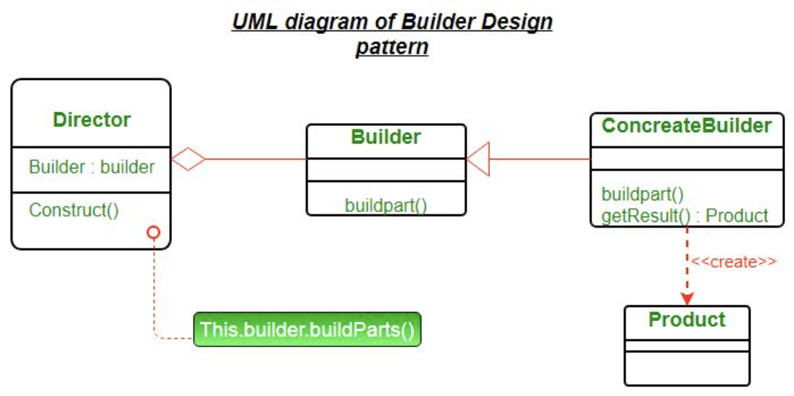

# Builder Design Pattern Overview:

### Overview:
* The **Builder Pattern** is a **creational design pattern** used to **construct complex objects step by step**
* It **separates the construction of a complex object from its representation**, allowing the **same construction 
  process to create different representations**
* **Key Components:**
  * **Builder:**
    * This is an **interface or an abstract class defining** the **steps required** to **create a complex object**
    * It typically includes **methods** for **constructing various parts of the object**
  * **Concrete Builders:**
    * These are **classes that implement** the **Builder interface**, providing **specific implementations** for 
      **constructing different parts** of the **complex object**
  * **Director (Optional):**
    * This is an optional component that **orchestrates the construction process** using a **builder**
    * It **guides the order** in which the **construction steps should be executed**
  * **Product:**
    * The **complex object being constructed**
    * It represents the **final object** that the **builder constructs**
* **How it Works:**
  * **Initialization:**
    * The process begins by **creating a builder object**, which may have **methods** for **setting various 
      attributes** or **components of the complex object**
  * **Step-by-Step Construction:**
    * The **client** uses the **builder's methods** to **set or construct individual parts of the object**
    * Each **method call contributes** to the **construction of the object**
  * **Retrieval of the Product:**
    * Once **all necessary components** are **set or constructed**, the **client** can **request the builder** to 
      **return** the **final constructed object** (the **product**)

```java
// Product
class Computer {
    private String CPU;
    private String RAM;
    private String storage;
    // Other attributes...

    public Computer(String CPU, String RAM, String storage) {
        this.CPU = CPU;
        this.RAM = RAM;
        this.storage = storage;
    }
    // Getters for attributes...
}

// Builder interface
interface ComputerBuilder {
    ComputerBuilder setCPU(String CPU);
    ComputerBuilder setRAM(String RAM);
    ComputerBuilder setStorage(String storage);
    Computer build();
}

// Concrete Builder
class ConcreteComputerBuilder implements ComputerBuilder {
    private String CPU;
    private String RAM;
    private String storage;

    @Override
    public ConcreteComputerBuilder setCPU(String CPU) {
        this.CPU = CPU;
        return this;
    }

    @Override
    public ConcreteComputerBuilder setRAM(String RAM) {
        this.RAM = RAM;
        return this;
    }

    @Override
    public ConcreteComputerBuilder setStorage(String storage) {
        this.storage = storage;
        return this;
    }

    @Override
    public Computer build() {
        return new Computer(CPU, RAM, storage);
    }
}

// Client code
public class Client {
    public static void main(String[] args) {
        ComputerBuilder builder = new ConcreteComputerBuilder();

        Computer computer = builder
                .setCPU("Intel i7")
                .setRAM("16GB")
                .setStorage("512GB SSD")
                .build();
    }
}
```
* In this example, `Computer` represents the **complex object being constructed**
* The **`ComputerBuilder` interface** defines the **steps needed to build a computer**, and `ConcreteComputerBuilder` 
  provides the **implementation** for **constructing** a **`Computer` object** by **setting its `CPU`, `RAM`, and 
  `storage` attributes**
* The **client uses the builder** to **set the attributes** of the `Computer` object **step by step**, and **finally 
  calls the `build()` method** to **retrieve the constructed `Computer` object**
* The Builder Pattern is useful when dealing with **complex objects** that **require step-by-step construction** or have 
  **multiple configuration options**
* It promotes **flexibility**, **readability**, and **separation of concerns** by **isolating the construction logic 
  from the final object representation**
* 

### The Optional Director Class in a Builder Pattern:
* A **Director** in the Builder Pattern **orchestrates** the **construction process** using a **builder**
* It provides a **higher-level interface** to **control the construction steps**, allowing **clients** to **construct 
  objects without specifying** the **exact steps** or **details of construction**
```java
// Director
class ComputerManufacturer {
    private ComputerBuilder builder;

    public ComputerManufacturer(ComputerBuilder builder) {
        this.builder = builder;
    }

    public void constructHighPerformanceComputer() {
        builder.setCPU("Intel i9")
                .setRAM("32GB")
                .setStorage("1TB NVMe SSD");
    }

    public void constructStandardComputer() {
        builder.setCPU("Intel i5")
                .setRAM("8GB")
                .setStorage("256GB SSD");
    }
}

// Client code using Director
public class Client {
    public static void main(String[] args) {
        ComputerBuilder builder = new ConcreteComputerBuilder();
        ComputerManufacturer manufacturer = new ComputerManufacturer(builder);

        // Constructing a high-performance computer
        manufacturer.constructHighPerformanceComputer();
        Computer highPerformanceComputer = builder.build();
        
        // Constructing a standard computer
        manufacturer.constructStandardComputer();
        Computer standardComputer = builder.build();
    }
}
```
* In this updated example, the `ComputerManufacturer` acts as the **Director**
* It **takes** a **`ComputerBuilder` instance as a parameter** and **provides methods** 
  (`constructHighPerformanceComputer()` and `constructStandardComputer())` to **guide the construction process**
* The **client** uses the `ComputerManufacturer` to **construct different types of computers** by **calling specific 
  methods** that **internally use the builder** to **set attributes**
* The Director **abstracts** the **steps needed for construction**, allowing the **client** to **request** the 
  **construction of specific types of objects** **without worrying** about the **specific building process**
* This Director pattern **enhances** the **flexibility** of the Builder Pattern by **encapsulating complex construction 
  steps**, providing **different construction scenarios** through **high-level interfaces**, and **facilitating** the 
  **creation** of **complex objects** with **predefined configurations**
